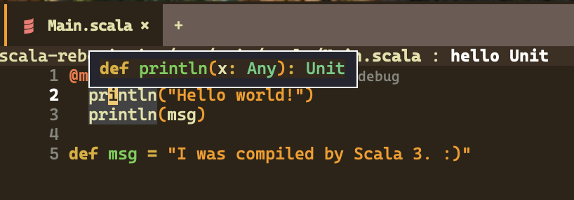

## Introduction

I haven't learned anything new lately, so I decided to study [Scala 3](https://docs.scala-lang.org/ja/scala3/new-in-scala3.html).
Scala used to be somewhat popular, but recently I rarely hear about it.
It may simply be because I no longer use Scala, but it feels like it has lost its momentum.

I played with Scala 2 a bit before Scala 3 came out, so I understand why Scala didn't catch on.
Most of what I think is written in the following article, but for those trying Scala, some obvious perspectives seem missing.

[Collecting the reasons Scala is difficult from the internet - Lambda Cocktail](https://blog.3qe.us/entry/2023/09/18/220005)

I like Scala itself. C is annoying because of memory management, Java has a lot of non-essential boilerplate,
and Kotlin is now used on the server side, but in the early days it felt like an Android-only language and not suitable for general use.
Back then, functional programming was a new paradigm to me and very attractive.
For some reason I accepted that paradigm easily at the time, but its difficulty still remains today.

If I add one more reason it didn't catch on, it would be **immutability** at the core of coding style.

What? Writing **immutable** code to improve maintainability is common sense, right?
If you think that, modern languages and functional programming may have influenced you.
Even today, beginners learn languages that assume **mutable** data.
Python, Java, JavaScript, C, Go, PHP, Ruby, etc., are often written with mutable values in mind.
Of course, these languages can be written without reassignment, but they generally accept mutable variables,
so tutorials, books, and code in the wild often assume variables can change.

But what about Scala?

What happens when people used to such code start using Scala?
You can use `var` in Scala, but `val` is used in many places.
In other words, the default is to write code without reassignment.
If you aren't used to reading or writing such code, this becomes the first barrier.

In modern times, ES6 has spread and people tend to avoid reassignment by using `const`,
so perhaps immutability isn't as big a barrier as I think for beginners.

Anyway.

Let's set up the environment to start learning Scala 3.

## Environment setup

In the past, installing just `sbt` was enough, but now it seems common to use a tool called [Coursier](https://get-coursier.io/).
After installation, `cs list` shows the commands it manages.

```text
$ cs list
amm
coursier
cs
metals
sbt
sbtn
scala
scala-cli
scalac
scalafmt
```

I manage Coursier with Home Manager.
If you do not use Home Manager, follow the [official installation instructions](https://get-coursier.io/docs/cli-installation).

```nix
{ pkgs, ...}:

{
  home.packages = with pkgs; [
    coursier
  ];
}
```

You can also manage sbt, the Scala compiler, and Metals with Home Manager, but I will manage those with Coursier.

Coursier is installed as the `cs` command.
First, run the following to install basic commands like `sbt`, `scala`, and `scalac`.

```shell
$ cs setup
```

This installs `sbt`, but there is a problem.

The PATH is not set.
Depending on your environment, `zsh` may not read `.profile` or `.zprofile` (as in my case), so I added this to `.zshrc`.

```zsh
case ${OSTYPE} in
    darwin*)
        export PATH="$PATH:/Users/${USER}/Library/Application Support/Coursier/bin"
        ;;
    *)
        # setting for linux
        ;;
esac
```

This configuration only works on macOS.
If you use Windows or Linux, adjust it as needed.

Now that `sbt` works, generate a basic project.
For a minimal setup, run `sbt new scala/scala3.g8`.

```shell
$ sbt new scala/scala3.g8
SLF4J: Failed to load class "org.slf4j.impl.StaticLoggerBinder".
SLF4J: Defaulting to no-operation (NOP) logger implementation
SLF4J: See http://www.slf4j.org/codes.html#StaticLoggerBinder for further details.
A template to demonstrate a minimal Scala 3 application

name [Scala 3 Project Template]: sample

Template applied in /private/tmp/./sample
```

This creates a folder containing code that only prints "Hello, World".

The directory structure looks like this.

```text
tree sample
sample
├── README.md
├── build.sbt
├── project
│   └── build.properties
└── src
    ├── main
    │   └── scala
    │       └── Main.scala
    └── test
        └── scala
            └── MySuite.scala

7 directories, 5 files
```

The contents of `Main.scala` are very simple.

```shell
$ cat sample/src/main/scala/Main.scala
───────┬────────────────────────────────────────────
       │ File: sample/src/main/scala/Main.scala
───────┼────────────────────────────────────────────
   1   │ @main def hello(): Unit =
   2   │   println("Hello world!")
   3   │   println(msg)
   4   │
   5   │ def msg = "I was compiled by Scala 3. :)"
───────┴────────────────────────────────────────────
```

Let's run it.
Move into the `sample` directory and run `sbt run`.

```text
$ cd sample
$ sbt run
[info] welcome to sbt 1.10.5 (Azul Systems, Inc. Java 17.0.13)
[info] loading project definition from /private/tmp/sample/project
[info] loading settings for project root from build.sbt ...
[info] set current project to sample (in build file:/private/tmp/sample/)
[info] compiling 1 Scala source to /private/tmp/sample/target/scala-3.5.2/classes ...
[info] running hello
Hello world!
I was compiled by Scala 3. :)
[success] Total time: 1 s, completed 2024/11/17 19:24:17
```

We ran Hello, World, so I fully understand Scala now.

## Emacs

I want to develop in Emacs.
I pay for JetBrains, so I could use IntelliJ, but Emacs is blazing fast on the new Mac mini, so I'll see how far I can go with Emacs.

In modern development, a Language Server is essential, so install [Metals](https://scalameta.org/metals/).
Follow the [official instructions](https://scalameta.org/metals/docs/editors/emacs/) to install Metals.

```elisp
(setup scala-mode
  (:elpaca t))

(setup sbt-mode
  (:elpaca t)
  (:opt sbt:program-options '("-Dsbt.supershell=false"))
  ;; WORKAROUND: https://github.com/ensime/emacs-sbt-mode/issues/31
  ;; allows using SPACE when in the minibuffer
  (substitute-key-definition
   'minibuffer-complete-word
   'self-insert-command
   minibuffer-local-completion-map))

(setup lsp-metals
  (:elpaca t))

(setup dap-mode
  (:elpaca t)
  (:with-mode scala-mode
    (:hook dap-mode
           dap-ui-mode))
  (dap-auto-configure-mode))
```

I omitted the installation of `lsp-mode`.

When you open a `.scala` file, Metals installation is prompted, but following the prompt freezes Emacs.
I couldn't tell if it was an environment issue, but installing Metals via Coursier avoided it.

```shell
$ cs install metals
```

After that, opening Scala source files makes Metals available, avoiding the freeze during installation.



Now you can view types.

## Conclusion

Environment setup for Scala 3 is done. I'll keep learning while writing blog posts.
