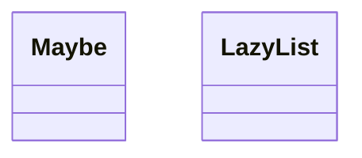
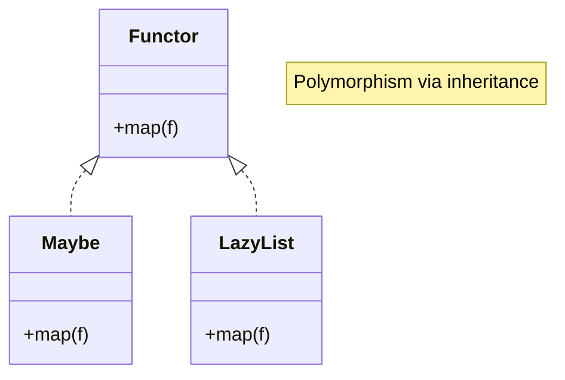
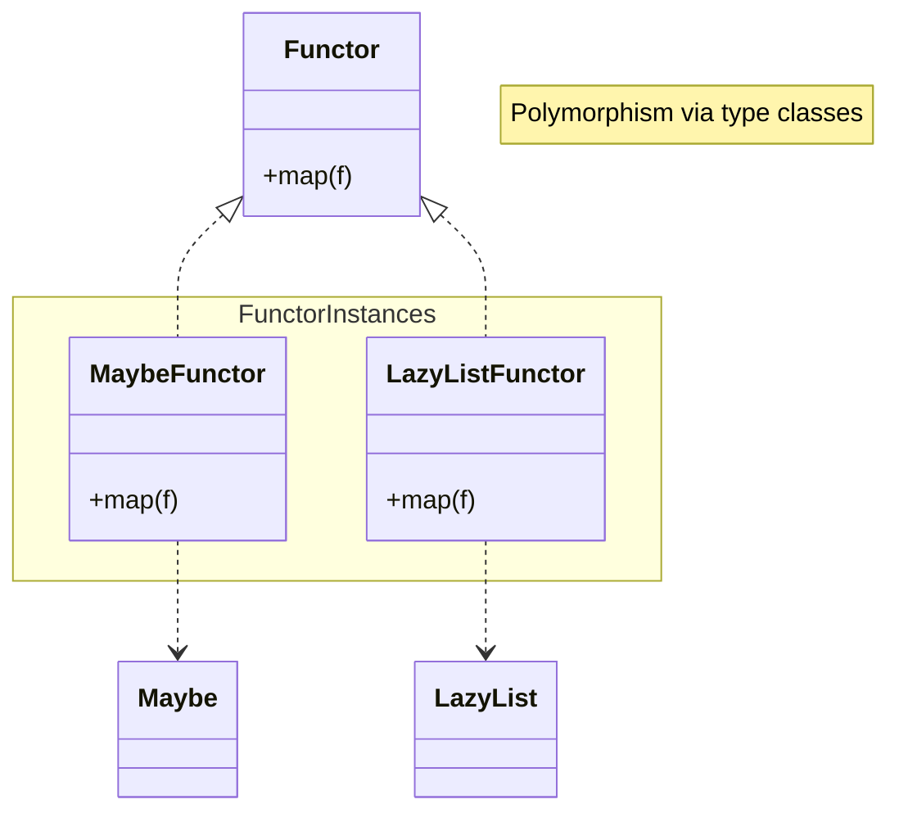

## Introduction

You may be writing code with Java's `Optional` or `Stream`, yet still wonder what `map` and `flatMap` really are. You can do the same thing with a `for` loop, right? This article tries to guide you to Functor by implementing code that provides the same functionality as `Optional` and `Stream`.

There are many articles like this out there.
I think there are so many because the first step is hard, and many people get stuck.
Also, writing technical articles as output is a good way to deepen your own understanding, so many people do it.

Even so, I decided to write this because I felt that people who read explanations of functional‑programming concepts and still felt lost need a gentler introduction.
So I do not aim for strictness in terminology or mathematical concepts.
Also, instead of explaining Functor directly, we will take some detours before reaching it, so those who already know a lot may feel it is roundabout.

## Intended audience

- People who can understand basic Java 21 syntax (if you know 17, you can probably read it)[^Java21]
- People who write code with `Optional` but don't know the background
- People who are okay with seeing code in a language they have never used (Scala) (syntax will be explained)

I will use Java and Scala as concrete languages for explanation, but I hope to make this understandable for anyone who has learned at least one programming language to a usable level (wishful thinking).

[^Java21]: I originally tried to explain within Java 17, but gave up due to the poor pattern matching in `switch` expressions.

## The road to understanding `map`

This article proceeds in the following order:

- Implement a `Maybe` class similar to `Optional` in Java
- Add a `map` method to `Maybe`
- Implement a `LazyList` class similar to `Stream` in Java
- Add a `map` method to `LazyList`
- What we want from `map`
- Introducing `Functor`
- Implement `Maybe` and `LazyList` in Scala
- Introducing type classes
- Review
- And then to `Monad` (next article<sup>[planned]</sup>)

## Implementing `Maybe` in Java

First, we will implement the data structure commonly known as `Maybe` in Java.
Besides the name `Maybe`, it is often called `Option` or `Optional` [^OptionType].
If you have never heard of `Maybe`, you can think of it as similar to Java's `Optional`.
However, unlike `Optional`, when a value becomes `null` it is not converted into a special "no value" value like `Optional#empty()`.

`Maybe`, like `Optional`, represents two patterns: a value exists or a value does not exist.
In `Optional`, the instances representing presence and absence are hidden inside inner classes, so you may not have thought about them.
But in fact there are two representations: an `Optional` instance that holds a value in a field named `value`, and a singleton `Optional` instance whose `value` is `null` [^OptionalImpl].

[^OptionType]: [Option type - Wikipedia](https://en.wikipedia.org/wiki/Option_type)

[^OptionalImpl]: https://github.com/openjdk/jdk21/blob/master/src/java.base/share/classes/java/util/Optional.java

In `Maybe`, `Just` represents the presence of a value, and `Nothing` represents the absence of a value.
The initial implementation looks like this.

```java Maybe.java
public sealed interface Maybe<T> {

  public class Just<T>(T value) implements Maybe<T> {
  }

  public record Nothing<T>() implements Maybe<T> {
  }
}
```

If you are not used to Java 17, you may be seeing the keyword `sealed` for the first time.
Simply put, sealed interfaces can enforce that they are extended or implemented only within the same file.
In this case, only `Just` and `Nothing` defined in the same file can implement `Maybe`. No other interface, class, or record can implement it.
Sealed interfaces also introduced the `permits` keyword, but we are not using it, so I will skip the explanation.
If you are interested, see Oracle's [explanation](https://docs.oracle.com/javase/jp/15/language/sealed-classes-and-interfaces.html).

Back to the point. The definitions of `Maybe`, `Just`, and `Nothing` are simple. You can already use them.
Start `jshell`, load the `Maybe` class, and run the following code.

```java jshell
Maybe<String> hello = new Maybe.Just<>("Hello");

switch (hello) {
  case Maybe.Just(var value) -> System.out.println(value);
  case Maybe.Nothing nothing -> System.out.println("Goodbye");
}

Maybe<String> silent = new Maybe.Nothing<>();

switch (silent) {
  case Maybe.Just(var value) -> System.out.println(value);
  case Maybe.Nothing nothing -> System.out.println("Goodbye");
}
```

<details>
<summary>Output</summary>

```java jshell
$ jshell --enable-preview
|  JShellへようこそ -- バージョン21.0.5
|  概要については、次を入力してください: /help intro

jshell> public sealed interface Maybe<T> {
   ...>
   ...>     public record Just<T>(T value) implements Maybe<T> {
   ...>     }
   ...>
   ...>     public record Nothing<T>() implements Maybe<T> {
   ...>     }
   ...> }
|  次を作成しました: インタフェース Maybe

jshell> Maybe<String> greeting = new Maybe.Just<>("Hello");
   ...>
   ...> switch (greeting) {
   ...>   case Maybe.Just(var value) -> System.out.println(value);
   ...>   case Maybe.Nothing nothing -> System.out.println("Goodbye");
   ...> }
   ...>
   ...> Maybe<String> silent = new Maybe.Nothing<>();
   ...>
   ...> switch (silent) {
   ...>   case Maybe.Just(var value) -> System.out.println(value);
   ...>   case Maybe.Nothing nothing -> System.out.println("Goodbye");
   ...> }
hello ==> Just[value=Hello]
Hello
silent ==> Nothing[]
Goodbye
```

</details>

`Maybe` has no methods, but you can see it expresses both "value exists" and "value does not exist".
This is not special: if a value exists, it is passed to the record constructor `Just` and stored in a field; if it doesn't, we just create an instance of a class with no fields (`Nothing`).
Nothing more, nothing less. Case closed!

Not quite. Before moving on, this implementation is a bit inconvenient, so let's add methods to the `Maybe` interface.

```java Maybe.java
public sealed interface Maybe<T> {

  public static <T> Maybe<T> just(T value) {
    return new Just<>(value);
  }

  public static <T> Maybe<T> nothing() {
    return new Nothing<>();
  }

  // !collapse(1:6) collapsed
  // ...
  public record Just<T>(T value) implements Maybe<T> {
  }

  public record Nothing<T>() implements Maybe<T> {
  }
}
```

Now, imagine the following situation. There is a cat that meows with probability 2/3 :thinking:.

```java jshell
Maybe<String> meow() {
  var rand = new Random();
  var num = rand.nextInt(3);

  if (num == 0) {
    return Maybe.nothing();
  } else if (num == 1) {
    return Maybe.just("Meow");
  } else if (num == 2) {
    return Maybe.just("Mew");
  }

  return Maybe.nothing();
}
```

When the cat meows, I want to build the string `Meow World` or `Mew World` depending on the sound.
What code should I write? If we do it directly, it might look like this.

```java jshell
var maybeMeow = meow();

Maybe<String> meowHello = switch (maybeMeow) {
  case Maybe.Just just -> Maybe.just(just.value() + " World");
  case Maybe.Nothing nothing -> Maybe.nothing();
};
```

All I want is to append ` World` only when it meows... and yet it gets big.

Do we have to do this every time?

### Implementing `map` on `Maybe`

That day, humanity remembered.
The fear ruled by `Maybe`...
The humiliation trapped within `Maybe`...

Writing a `switch` expression every time you want to touch the inside of `Maybe` is not practical.
We already knew the solution: we just need a `map` method like `Optional` has.
Let's add `map` to `Maybe` right away.

Now, right here, right now!

```java Maybe.java
public sealed interface Maybe<T> {

  // !mark(1:1)
  <U> Maybe<U> map(Function<? super T, ? extends U> mapper);

  // !collapse(1:8) collapsed
  // ...
  public static <T> Maybe<T> just(T value) {
    return new Just<>(value);
  }

  public static <T> Maybe<T> nothing() {
    return new Nothing<>();
  }

  public record Just<T>(T value) implements Maybe<T> {

    // !mark(1:4)
    @Override
    public <U> Maybe<U> map(Function<? super T, ? extends U> mapper) {
      return new Just<>(mapper.apply(value));
    }
  }

  public record Nothing<T>() implements Maybe<T> {

    // !mark(1:4)
    @Override
    public <U> Maybe<U> map(Function<? super T, ? extends U> mapper) {
      return new Nothing<>();
    }
  }
}
```

Since `Maybe` is an interface, we declared only the signature of `map` and left the implementation to `Just` and `Nothing`.
There is nothing difficult in the implementation. In `Just`, we apply the `mapper` to the field `value` and create a new `Just` holding the result.
In `Nothing`, we need the return type parameter to be `U`, so we create a new `Nothing`.
Here we used the approach of declaring the method in the interface and implementing it in `Just` and `Nothing`, but the following implementation is also fine.

```java Maybe.java
public sealed interface Maybe<T> {

  // !mark(1:6)
  default <U> Maybe<U> map(Function<? super T, ? extends U> mapper) {
    return switch (this) {
      case Maybe.Just(var value) -> Maybe.just(mapper.apply(value));
      case Maybe.Nothing nothing -> nothing();
    };
  }

  // !collapse(1:14) collapsed
  // ...
  public static <T> Maybe<T> just(T value) {
    return new Just<>(value);
  }

  public static <T> Maybe<T> nothing() {
    return new Nothing<>();
  }

  public record Just<T>(T value) implements Maybe<T> {
  }

  public record Nothing<T>() implements Maybe<T> {
  }
}
```

However, if we follow object‑oriented thinking, the former is the more natural implementation<sup>[citation needed]</sup>.

Let's rewrite the 2/3‑probability cat using `map`.

```java jshell
var maybeMeow = meow();

var meowHello = maybeMeow.map(v -> v + " Hello");
```

Compared to the earlier code, the difference is obvious. The intent is expressed clearly.
Also, as you know, `map` is a general method, so you can focus on applying a function to the value only when it exists, regardless of the type inside `Maybe`.

We have achieved the first goal: implementing `map` for `Maybe`. Next, let's move to `LazyList`.

## Implementing `LazyList` in Java

The `LazyList` we implement here is a data structure similar to Java's `Stream`.
However, unlike `Stream`, the `LazyList` we implement here delays computation even more.

I chose `LazyList` as an example to explain `map`, but in hindsight maybe a binary tree would have been better.
Compared to `Optional`, it gets more complex and includes many non‑essential parts.
If you're not used to this kind of code, it may not read smoothly, but it's not doing anything difficult, so please understand it step by step.

Let's start the implementation. The basic structure of `LazyList` is the same as a linked list.
The difference is that instead of storing the value and link directly in a cons cell, we store them as `CallByNeed`, which provides a mechanism to compute them only when needed.
We'll look at `CallByNeed` after the `LazyList` implementation. First, check the `LazyList` implementation.

```java LazyList.java
public sealed interface LazyList<T> {

  public record Cons<T>(CallByNeed<T> t, CallByNeed<LazyList<T>> tail) implements LazyList<T> {
  }

  public record Nil<T>() implements LazyList<T> {
  }

  public static <T> LazyList<T> cons(CallByNeed<T> t, CallByNeed<LazyList<T>> tail) {
    return new Cons<>(t, tail);
  }

  public static <T> LazyList<T> nil() {
    return new Nil<>();
  }
}
```

As in `Maybe`, we also implemented two static methods `cons` and `nil` to help create instances.
While `CallByNeed` may be unfamiliar, for anyone who has implemented a linked list this should feel familiar.

### `CallByNeed`

Next, let's look at the implementation of `CallByNeed`.
Just like `LazyList`, it also has static helper methods `of` and `lazy`, so you don't need to worry about them.

```java CallByNeed.java
public class CallByNeed<T> {

  private final Supplier<T> t;

  private boolean evaluated;

  private T get;

  public CallByNeed(Supplier<T> t) {
    this.t = t;
  }

  public synchronized T get() {
    if (evaluated) {
      return this.get;
    }

    this.get = t.get();
    this.evaluated = true;

    return this.get;
  }

  public static <T> CallByNeed<T> of(T value) {
    return new CallByNeed<>(() -> value);
  }

  public static <T> CallByNeed<T> lazy(Supplier<T> t) {
    return new CallByNeed<>(t);
  }
}
```

`CallByNeed` takes a `Supplier` in the constructor and stores it as a field.
`Supplier` is a functional interface with a `get` method that returns a value.
Thus, when you pass the supplier to the constructor, no computation happens yet. The computation happens only when `CallByNeed#get` calls `Supplier#get`.
The difference between `Supplier` and `CallByNeed` is that `Supplier` executes the logic in `get` every time it is called, while `CallByNeed` caches the first result and returns it thereafter.

You can see the difference clearly with the following code.

```java
Supplier<String> supplier = () -> {
  System.out.println("supplier called");
  return "supplier";
};

supplier.get();
supplier.get();

CallByNeed<String> callByNeed = new CallByNeed<>(() -> {
  System.out.println("callByNeed called");
  return "callByNeed";
});

callByNeed.get();
callByNeed.get();
```

We pass logic that prints a string to standard output to both `Supplier` and `CallByNeed`, and then call `get` twice.
The result looks like this.

```java jshell
jshell> Supplier<String> supplier = () -> {
   ...>   System.out.println("supplier called");
   ...>   return "supplier";
   ...> };
   ...>
   ...> supplier.get();
   ...> supplier.get();
   ...>
   ...> CallByNeed<String> callByNeed = new CallByNeed<>(() -> {
   ...>   System.out.println("callByNeed called");
   ...>   return "callByNeed";
   ...> });
   ...>
   ...> callByNeed.get();
   ...> callByNeed.get();
supplier ==> $Lambda$21/0x000000030100a000@312b1dae
supplier called
$2 ==> "supplier"
supplier called
$3 ==> "supplier"
callByNeed ==> CallByNeed@cc34f4d
callByNeed called
$4 ==> "callByNeed"
$5 ==> "callByNeed"
```

`Supplier` prints `supplier called` twice, whereas `CallByNeed` prints `callByNeed called` only once.
So `CallByNeed` calls the `Supplier#get` method only once and returns the cached value afterward.
You can think of it as a slightly smarter `Supplier`.

Now that we understand `CallByNeed`, let's create a `LazyList` instance.

```java jshell
jshell> LazyList.cons(CallByNeed.of(2), CallByNeed.of(LazyList.cons(CallByNeed.of(1), CallByNeed.of(LazyList.nil()))))
$3 ==> Cons[t=CallByNeed@31cefde0, tail=CallByNeed@439f5b3d]
```

Great, it was created. But the content is invisible :stuck_out_tongue_closed_eyes:

Since we want to see the content, let's add a method `toList` that converts `LazyList` to a Java standard `List`.

```java LazyList.java
public sealed interface LazyList<T> {

  default List<T> toList() {
    var xs = new ArrayList<T>();

    var h = this;
    while (h instanceof Cons<T> cons) {
      xs.add(cons.t().get());
      h = cons.tail().get();
    }

    return Collections.unmodifiableList(xs);
  }

  // !collapse(1:15) collapsed
  // ...

  public record Cons<T>(CallByNeed<T> t, CallByNeed<LazyList<T>> tail) implements LazyList<T> {
  }

  public record Nil<T>() implements LazyList<T> {
  }

  public static <T> LazyList<T> cons(CallByNeed<T> t, CallByNeed<LazyList<T>> tail) {
    return new Cons<>(t, tail);
  }

  public static <T> LazyList<T> nil() {
    return new Nil<>();
  }
}
```

Here we traverse the `LazyList` from the head, add elements to an `ArrayList`, and finally return an unmodifiable list.
Let's use `toList` to make the `LazyList` visible.

```java jshell
jshell> LazyList.cons(CallByNeed.of(2), CallByNeed.of(LazyList.cons(CallByNeed.of(1), CallByNeed.of(LazyList.nil())))).toList()
$5 ==> [2, 1]
```

It looks like it converts correctly.

### Implementing `map` on `LazyList`

Now that we are ready, let's implement `map` for `LazyList`.

```java
public sealed interface LazyList<T> {

  // !mark(1:1)
  <U> LazyList<U> map(Function<? super T, ? extends U> mapper);

  // !collapse(1:12) collapsed
  // ...
  default List<T> toList() {
    var xs = new ArrayList<T>();

    var h = this;
    while (h instanceof Cons<T> cons) {
      xs.add(cons.t().get());
      h = cons.tail().get();
    }

    return Collections.unmodifiableList(xs);
  }

  public record Cons<T>(CallByNeed<T> t, CallByNeed<LazyList<T>> tail) implements LazyList<T> {

    // !mark(1:6)
    @Override
    public <U> LazyList<U> map(Function<? super T, ? extends U> mapper) {
      return LazyList.cons(
        CallByNeed.lazy(() -> mapper.apply(t.get())),
        CallByNeed.lazy(() -> tail.get().map(mapper)));
    }
  }

  public record Nil<T>() implements LazyList<T> {

    // !mark(1:4)
    @Override
    public <U> LazyList<U> map(Function<? super T, ? extends U> mapper) {
      return new Nil<>();
    }
  }

  // !collapse(1:8) collapsed
  // ...
  public static <T> LazyList<T> cons(CallByNeed<T> t, CallByNeed<LazyList<T>> tail) {
    return new Cons<>(t, tail);
  }

  public static <T> LazyList<T> nil() {
    return new Nil<>();
  }
}
```

Because we use `CallByNeed`, we have to call `get` when extracting values or links.
We apply the given function (`mapper`) to the value of the cons cell and recursively call `map` on the tail, then construct a new `Cons` with those values.
Both the value and the link are still deferred by `CallByNeed`, so nothing is computed when `map` is called.
At the end, the `map` on `Nil` does nothing and just returns a new `Nil`.

Let's use `LazyList`'s `map` to double each element.

```java jshell
jshell> LazyList.cons(CallByNeed.of(2), CallByNeed.of(LazyList.cons(CallByNeed.of(1), CallByNeed.of(LazyList.nil())))).map(v -> v * 2).toList();
$6 ==> [4, 2]
```

Since `LazyList` itself is not easy to inspect, we call `toList` at the end.

To confirm that computation is deferred, consider the following code.

```java
LazyList.cons(CallByNeed.of(2), CallByNeed.of(LazyList.cons(CallByNeed.of(1), CallByNeed.of(LazyList.nil()))))
  .map(v -> {
    System.out.println(v + " * 2");
    return v * 2;
  })
  .map(v -> {
    System.out.println(v + " + 1");

    return v + 1;
  });
```

We multiply each element by 2, then add 1, and print the computation along the way.
Let's feed this to jshell.

```java jshell
jshell> LazyList.cons(CallByNeed.of(2), CallByNeed.of(LazyList.cons(CallByNeed.of(1), CallByNeed.of(LazyList.nil()))))
   ...>   .map(v -> {
   ...>     System.out.println(v + " * 2");
   ...>     return v * 2;
   ...>   })
   ...>   .map(v -> {
   ...>     System.out.println(v + " + 1");
   ...>
   ...>     return v + 1;
   ...>   });
$7 ==> Cons[t=CallByNeed@446cdf90, tail=CallByNeed@799f7e29]
```

Like `Stream`, at this stage the print statements inside `map` are not executed.
They run only when we call `toList` on `$7` and convert the `LazyList` to a `List`.

```java jshell
jshell> $7.toList()
2 * 2
4 + 1
1 * 2
2 + 1
$8 ==> [5, 3]
```

From the output, you can see that each element is computed from the head in the order `* 2`, then `+ 1`.
In other words, like `Stream`, the list is traversed only once.

Now, the difference from `Stream` is that `Stream` throws an exception if you call `toList` a second time.
That is memory efficient, but it is inconvenient when you want to use it without worrying about whether it has already been consumed.
By contrast, `LazyList` allows `toList` to be called multiple times.
As is clear from the implementation, it creates a new list each time, so it is not efficient.

```java jshell
jshell> $7.toList()
$9 ==> [5, 3]
```

From the output, you can see that each cell's value was computed once on the first `toList`, so the mapping functions are not executed again after that :muscle:.

We have drifted away from `map`, so let's stop playing with `LazyList` and move on.

## What we want from `map`

Now that we implemented the `map` methods for `Maybe` and `LazyList`, what is `map` really?
Let's recall the `map` signatures.

```java
<U> Maybe<U> map(Function<? super T, ? extends U> mapper);
```

```java
<U> LazyList<U> map(Function<? super T, ? extends U> mapper);
```

Both have similar signatures. `Maybe` and `LazyList` take one type parameter, and `map` converts values of type `T` to values of type `U` by applying the `mapper` to the element inside.
If we can define this more generally, then in object‑oriented terms, `Maybe` and `LazyList` both have the property of being able to perform an operation called `map`.
In such cases, object‑oriented languages typically use an interface (abstract type).
So, can we define a `Mappable` interface that has a `map` method in Java?

If we force a `Mappable` definition and implement it for `Maybe`, it might look like this.

```java
public interface F<T> {
}

public interface Mappable<F, T> {

  <U> F map(Function<? super T, ? extends U> mapper);
}

public sealed interface Maybe<T> extends Mappable<Maybe, T> {

  public record Just<T>(T value) implements Maybe<T> {

    @Override
    public <U> Maybe<U> map(Function<? super T, ? extends U> mapper) {
      return new Just<>(mapper.apply(value));
    }
  }

  public record Nothing<T>() implements Maybe<T> {

    @Override
    public <U> Maybe<U> map(Function<? super T, ? extends U> mapper) {
      return new Nothing<>();
    }
  }
}
```

Because Java cannot use higher‑kinded types, we define a type `F` that itself takes one type parameter and use it to define `Mappable`.
There may be a better way, but for now let's accept it.
If you're interested, read [Higher kinded polymorphism in Java #Java - Qiita](https://qiita.com/lyrical_logical/items/2d68d378a97ea0da88c0).
Now we can express the property of "having a `map` method" using the `Mappable` interface.

Now that we've fit it into an interface, let's think again about the definition of `map`.
An interface only specifies a signature and cannot constrain the implementation.
So the following `map` implementation in `Maybe` would still compile.

```java
public sealed interface Maybe<T> extends Mappable<Maybe, T> {

  public record Just<T>(T value) implements Maybe<T> {

    @Override
    public <U> Maybe<U> map(Function<? super T, ? extends U> mapper) {
      return new Nothing<>();
    }
  }

  public record Nothing<T>() implements Maybe<T> {

    @Override
    public <U> Maybe<U> map(Function<? super T, ? extends U> mapper) {
      return new Nothing<>();
    }
  }
}
```

Here `map` always returns `Nothing` no matter whether it is `Just` or `Nothing`.
It compiles, but it is useless in real programming.
So `map` must mean something more than just matching a signature.
This is not unique to `map`: when implementing an interface, we generally want the implementation to realize **some kind of functionality** expected by the interface.
So what **functionality** do we expect from `map`?

From the examples of `Maybe` and `LazyList`, the intuition is that it applies a given function to all elements in a container‑like thing.
If that is correct, can we define the property more strictly?

## Introducing Functor

This is where **Functor** comes in. Functor is a concept from [category theory](https://en.wikipedia.org/wiki/Category_theory), but for programmers it is essentially `Mappable` with additional constraints.
Those constraints are called the Functor laws, which are the following two laws.
The explanation here is intentionally loose; if you want a strict definition, consult other sites or books.
Also, I use Java code for convenience, so the explanation is not mathematically strict.

1. Preservation of identity

   ```java
   fa.map(Function.identity()) === Function.identity().apply(fa)
   ```

   This says that for any `fa`, the result of "passing the identity function to `fa.map`" (left side) must be equal to "applying the identity function to `fa`" (right side).
   In other words, `map` must be defined so that passing the identity function does not change the value inside `fa`.

2. Preservation of composition

   ```java
   fa.map(f.compose(g)) === fa.map(f).map(g)
   ```

   This says that for any `fa`, `f`, and `g`, the result of "passing the composed function `f.compose(g)` to `fa.map`" (left side) must be equal to "calling `map` with `f` and then `map` with `g`" (right side).
   In other words, applying a composed function inside `map` must be the same as applying each function separately via `map`.

Here, `fa` represents any instance of a class like `Maybe` or `LazyList` that implements `map`.
`Maybe` or `LazyList` with `map` implementations that satisfy these two laws are Functors [^Functor].

[^Functor]: In category theory, a functor maps objects and morphisms between categories while preserving the properties described here. In programming, objects correspond to types and morphisms correspond to functions. For details, search for the Haskell category. (Search, search!)

Now, recall the useless `map` implementation that always returns `Nothing`.
With that implementation, the identity law is violated.
For example, consider `Maybe.just(1)`. The left side is:

```java
Maybe.just(1).map(Function.identity())
// ==> Nothing[]
```

The right side is:

```java
Function.identity().apply(Maybe.just(1))
// ==> Just[value=1]
```

These are not equal, so the identity law is not satisfied.

```java
Maybe.just(1).map(Function.identity()) != Function.identity().apply(Maybe.just(1))
```

So an implementation that always returns `Nothing` is not suitable as a Functor.

Then do the `map` implementations we wrote for `Maybe` and `LazyList` satisfy these laws?
Please check for yourselves.

We have explained Functor using Java.
In this article we used `Maybe` and `LazyList`, but there are many data structures that can implement a `map`‑like method while satisfying the Functor laws.
Think about the types you use in everyday programming, and consider whether they are also Functors.
You may notice Functors hidden everywhere.

It's clear from the `LazyList` example that we can define a `map` method for Java's `ArrayList` that satisfies the Functor laws.
However, there is a problem: the approach of implementing an interface like `Mappable` does not let us add a `map` method to existing classes.
So we would have to implement it as a `static` method like this,

```java
public class ArrayListOps {

  public <T, U> ArrayList<U> map(ArrayList<T> xs, Function<? super T, ? extends U> mapper) {
    // ...
  }
}
```

or convert it to a class that has `map` (like Java's `Stream`).
Adding that to every existing class is hard, so in Java, if you want operations like `map`, you end up using `Stream`.
Even if you have values in `ArrayList`, if you want `map` you need to call `stream`, then `toList` or `collect` to get back to a `List`, **even if delaying computation is not your goal**.
This issue is not limited to standard library classes. It happens any time you realize you could define a Functor‑law‑abiding `map` on a class written by someone else, or even on your own old classes.

As we have seen, `map` is a convenient operation that applies a function to elements inside a structure like `Maybe` or `LazyList` without taking them out.
But in Java, doing the same thing has many obstacles.
In languages that embrace Functor, such as Haskell and Scala, operations like `map` are implemented using a different approach than object‑oriented abstract data types.

Now let's step from the Java world into the Scala world.

### One more thing...

Now that we know about Functor, let's remember Java's `Optional`. Question:

> Q. Is `Optional` a Functor?

<details>
<summary>Answer</summary>

> A. **No, it is not a Functor :-1:**

Think about why. As a hint, consider composition when `null` is involved; you can find an example where preservation of composition does not hold.

</details>

## Implementing `Maybe` and `LazyList` in Scala

From here on, we'll use Scala 3.
Java does not provide the language feature called [type classes](https://en.wikipedia.org/wiki/Type_class).
For the basic mechanism of type classes, the [Kagawa University lecture notes (?)](https://guppy.eng.kagawa-u.ac.jp/2006/Declarative/Text/Chapter2.pdf) are helpful.
The materials describe Haskell's type classes (I don't know whether Scala does it in the same way).
You don't need to know this to read this article, so if you're curious, look it up later.

We used jshell to run code interactively in Java, but from here on we will use Scala CLI.
If you don't want to set up Scala locally, you can paste the code into [Scastie](https://scastie.scala-lang.org/) and check the behavior.
For Scala CLI, a Japanese article like [Beginner's guide: start Scala with Scala CLI - Lambda Cocktail](https://blog.3qe.us/entry/2023/12/20/011354) is helpful.

Let's implement the `Maybe` and `LazyList` defined in Java in Scala.

### `Maybe`

The Scala implementation of `Maybe` is as follows [^enum].

[^enum]: I realized later that an `enum`‑based implementation might be better for Scala 3. Maybe my brain is still on Scala 2...

```scala Maybe.scala
sealed trait Maybe[T]

case class Just[T](val value: T) extends Maybe[T]

case class Nothing[T]() extends Maybe[T]
```

Since Java now has `sealed` and `record`, Scala and Java code around here have become more similar than before.
We'll implement `map` for `Maybe` later, so first let's look at `LazyList` in Scala.

### `LazyList`

The Scala implementation of `LazyList` is as follows.
Scala already has `LazyList` in the standard library, so here we call it `MyLazyList`.

```scala MyLazyList.scala
sealed trait MyLazyList[T] {

  def toList(): List[T] =
    this match {
      case cons @ Cons(_, _) => cons.value :: cons.tail.toList()
      case Nil() => List()
    }
}

case class Cons[T](val t: () => T, val xs: () => MyLazyList[T]) extends MyLazyList[T] {
  lazy val value = t()

  lazy val tail = xs();
}

case class Nil[T]() extends MyLazyList[T]
```

The differences from Java include pattern matching in `toList` and the `lazy val` keyword.
In Scala, the `switch`‑equivalent is written as `... match { case ... => ... }`.
The structure is the same as Java's `switch`, so if you know the keywords you can read it.
The notable difference here is the `cons @ Cons(_, _)` syntax.
On the left of `@` you write a variable to bind the whole matched pattern, and on the right you write the pattern.
`_` means an ignored variable.
So if `this` matches the pattern `Cons(_, _)`, that whole value is bound to `cons` and the code on the right of `=>` runs.

In Java, `toList` built an `ArrayList`, but here we build the list by concatenation.
This is simpler, but for long lists it will cause a stack overflow, so don't use it beyond toy code.

## Introducing type classes

Now to the main topic. We will implement `map` for `Maybe` and `MyLazyList` in Scala using type classes, unlike Java.
You might wonder what a type class is, but for now just think of it as a language feature that Java does not have.

### The `Functor` type class

The `Functor` type class in Scala looks like this.

```scala
trait Functor[F[_]]:
  extension [A](fa: F[A]) {
    def map[B](f: A => B): F[B]
  }
```

This needs some explanation. We saw `trait` when defining `Maybe` and `MyLazyList`; it's like Java's `interface`.
`trait Functor[F[_]]` would be like `interface Functor<F<?>>` in Java.
Java cannot define types that take types, but Scala can.
A type that takes another type is called a **higher‑kinded type**.
If you want to know more, [Higher‑Kinded Types in functional languages - Lambda Cocktail](https://blog.3qe.us/entry/2023/10/09/211915) is helpful.

Here, `F[_]` declares that `F` is a type constructor like `Maybe` or `MyLazyList` that takes any type `T`.
So `Functor` is defined for type constructors that take one type parameter.

The keyword `extension` is used to extend existing types.
Here, it declares that values of type `F[A]` have a `map` method.
`A` is any type, and the signature of `map` is the same as we have seen.
At this point, `fa` is not used, so it is unclear how it works, but we are only declaring the signature. The actual usage will be explained later.
TypeScript function types include parameter names in their declarations, and this is similar [^TypeScript].
If you want more about `extension`, see the [official docs](https://docs.scala-lang.org/scala3/reference/contextual/extension-methods.html).

[^TypeScript]: [Function type declarations | TypeScript (Survival TypeScript)](https://typescriptbook.jp/reference/functions/function-type-declaration)

At first glance this might look like a Java `interface`, but the way we add `map` to `Maybe` or `MyLazyList` is different.
In Java you must `implements` the interface; in Scala you can add methods to existing types in a different way.
Let's start with `Maybe`.

### `Maybe` Functor

The `Maybe` Functor instance looks like this.

```scala
given Functor[Maybe] with
  extension [A](fa: Maybe[A]) {
    override def map[B](f: A => B): Maybe[B] =
      fa match {
        case Just(v) => Just(f(v))
        case Nothing() => Nothing()
      }
  }
```

Here we are defining a type‑class instance [^Instance].
We showed two ways to implement `map` in Java, and this is similar to the default implementation on the `Maybe` interface, so no further explanation is needed.
Looking at the structure, you can see that we fill in the `F` in `Functor` with `Maybe` and implement the body of `map`.
`trait` becomes `given`, and `:` becomes `with`.
It is similar to implementing an interface with a class.

[^Instance]: In this context, an instance is not an object‑oriented class instance. It refers to a data type (like `Maybe` or `MyLazyList`) that belongs to a type class (here, `Functor`).

The key question is: what do we get by defining this?
Let's load the code into a REPL.

```scala REPL
scala
Welcome to Scala 3.5.2 (17.0.13, Java OpenJDK 64-Bit Server VM).
Type in expressions for evaluation. Or try :help.

scala> sealed trait Maybe[T]
     |
     | case class Just[T](val value: T) extends Maybe[T]
     |
     | case class Nothing[T]() extends Maybe[T]
// defined trait Maybe
// defined case class Just
// defined case class Nothing

scala> trait Functor[F[_]]:
     |   extension [A](fa: F[A]) {
     |     def map[B](f: A => B): F[B]
     |   }
     |
// defined trait Functor

scala> given Functor[Maybe] with
     |   extension [A](fa: Maybe[A]) {
     |     override def map[B](f: A => B): Maybe[B] =
     |       fa match {
     |         case Just(v) => Just(f(v))
     |         case Nothing() => Nothing()
     |       }
     |   }
     |
// defined object given_Functor_Maybe
```

Now run the following code.

```scala REPL
scala> Just(1).map(_ * 2)
val res0: Maybe[Int] = Just(2)
```

Even though `Just` (`Maybe`) does not define `map`, we can call `map`.
This is polymorphism via type classes.
In object‑oriented languages, polymorphism is implemented via inheritance. In Scala, `extension` plus `given` enables type‑class‑like features, so we can do this.

In Scala, when you want to give a common operation to classes with different types, you can add it **without modifying existing classes**.
This is an advantage that inheritance does not have. With inheritance, you can only classify types in ways you anticipated when defining the classes, and you cannot add methods to existing classes later.
So even if you realize a class could have a `map` that satisfies the Functor laws, if you didn't provide it in the original definition, you must either create a subclass or implement it as a standalone `static` method as mentioned earlier.

Let me force an explanation with class diagrams.
We had two classes like this.



We then noticed that both could have a similar `map` method.
In object‑oriented terms, we expressed this by inheritance: they have `map` and satisfy the Functor laws.



In Java, to express this relationship, `Maybe` and `LazyList` must implement the `Functor` interface, as shown in the diagram.
In a language that supports type classes, on the other hand, you can classify types elsewhere and say they provide a `map` operation that satisfies the Functor laws.



If there is a classification called `Functor`, you can define instances (FunctorInstances in the diagram) that add new operations to existing types.

I've said enough, but before moving on, let's also look at the `Functor` instance for `MyLazyList`.

### `MyLazyList` Functor

The `Functor` instance for `MyLazyList` is as follows.

```scala
given Functor[MyLazyList] with
  extension [A](fa: MyLazyList[A]) {
    override def map[B](f: A => B): MyLazyList[B] =
      fa match {
        case cons @ Cons(_, _) => Cons(() => f(cons.value), () => cons.tail.map(f))
        case Nil() => Nil()
      }
  }
```

If you understood the explanation so far, you can read this code.
Let's also look at the REPL output.

```scala REPL
scala> val xs: MyLazyList[Int] = Cons(() => 1, () => Cons(() => 2, () => Nil[Int]()))
val xs: MyLazyList[Int] = Cons(rs$line$6$$$Lambda$2039/0x0000008801608640@6f926d01,rs$line$6$$$Lambda$2040/0x0000008801608908@c67a89)

scala> xs.map(_ * 2)
val res0: MyLazyList[Int] = Cons(rs$line$5$given_Functor_MyLazyList$$$Lambda$2085/0x0000008801668c48@7f09ff10,rs$line$5$given_Functor_MyLazyList$$$Lambda$2086/0x0000008801668f10@531b1778)

scala> res0.toList()
val res1: List[Int] = List(2, 4)
```

As with `Maybe`, you can see that `map` now exists on `MyLazyList`.

## Review

The long journey ends here. Let's review what we saw.
We first implemented `Maybe` and `LazyList` in Java and added a method named `map` to each.
Then we noticed the similar signatures and expressed "has a `map` operation" as an interface named `Mappable`.
We paused to think about the desirable properties that `map` should satisfy, and learned the Functor laws.
Functor is a useful concept, but it is limited in Java, so we reimplemented it in Scala and looked at polymorphism via type classes.

Now let's go back to the beginning of the article.

> You may be writing code with Java's `Optional` or `Stream`, yet still wonder what `map` and `flatMap` really are. You can do the same thing with a `for` loop, right? This article tries to guide you to Functor by implementing code that provides the same functionality as `Optional` and `Stream`.

After all this, is `map` just a replacement for `for`?
`map` on Java's `Stream` or on the `LazyList` in this article does look similar to `for`, but if you consider the Functor laws, you can see that for `Stream` and `LazyList`, `map` is only an operation that happens to be like `for`.
This is often explained in terms of **context**, but I will cover that in another article.

## And then to `Monad`

Once you understand Functor, move on to `Monad`.
With Functor, we could apply a function to the contents of `Maybe` or `LazyList`.
But that's not enough; problems arise.
For example, what happens if we apply a function `f: Int => Maybe[Int]` to `Maybe[Int]`?
The result is a value of type `Maybe[Maybe[Int]]`.
Then, if we want to `map` over it, we need a function with signature `g: Maybe[Int] => ...`.
`Maybe` keeps stacking, the code gets longer, and the essential part gets buried.

This is where `Monad` comes in. `Monad` solves this problem.
I plan to write about `Monad` in a separate article.

## Closing

The article got long and I got bored in the middle, so some explanations became sloppy.
There are also parts that target people who already know this, so I plan to improve those sections later.

It was a roundabout and grandiose way to explain Functor, but I hope I was able to explain it from scratch using concrete code rather than abstract explanations.
If people who are used only to object‑oriented programming can get a feel for a different programming paradigm, then the goal is achieved, so I'll stop here for today.

I said I wouldn't be strict, but if you find any points that are questionable, I'd appreciate comments.
