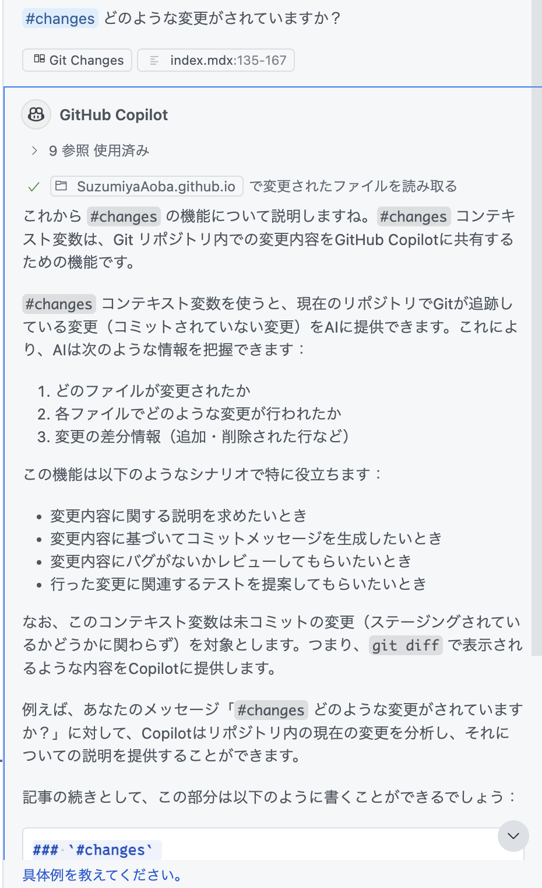

## Preface

<details>
<summary>Read this if you're interested</summary>

### Vibe Coding

Apparently "Vibe Coding" has been trending lately.

- [MIT Tech Review: What is vibe coding? A new programming method that "hands off" to AI](https://www.technologyreview.jp/s/359884/what-is-vibe-coding-exactly/)
- [My personal way of Vibe Coding](https://zenn.dev/yoshiko/articles/my-vibe-coding)
- [The limits of Vibe Coding | shi3z](https://note.com/shi3zblog/n/ne74dbf706d40)
- [Let's play with Vibe Coding](https://zenn.dev/schroneko/articles/lets-play-with-vibe-coding)

<Message title="Notebook LM">
I fed this into Notebook LM and generated an audio summary. If you haven't used Notebook LM, give it a listen.

https://notebooklm.google.com/notebook/5fa8cc12-6b29-4a0c-8f67-c74b0cfa4bea/audio

It explains the article summary in fluent Japanese.
Since it's a summary, the content is light, but it might be good for getting information by audio.
Even if the original article is in English, it explains in Japanese.
You can also use it to summarize multiple overseas news articles.

</Message>

As the articles above say, Vibe Coding refers to building software by trusting LLM-generated code without review.

> "There's a new kind of coding I call vibe coding. Where you fully give in to the vibes, embrace exponential progress, and forget that the code even exists," said Karpathy.

All humans have to do is describe the spec. If that were possible, it would be a dream world.
But that's only true for people who aren't professional engineers...
As someone who programs for a living, I don't worry about losing my job; I just think the required skills will change.
Literal "coders" might decrease, but are there really people who only code?
In daily work, the time spent writing code is tiny; most time is spent on tasks you must do before coding.

Depending on the software, the hard part is often not coding but design, or ambiguity in requirements/specs.
LLMs can help with design and spec definition, and reduce issues from missing considerations.
But in the end, humans imagine what they want to build.
LLMs can generate ideas or even draft specs, and they can implement.
That world may be emerging, but humans still need to approve the output.
And we expect **the desired output**—yet humans often fail to document **what they truly want**.
LLMs can't solve that root problem.

[What the customer really needed](https://dic.nicovideo.jp/a/%E9%A1%A7%E5%AE%A2%E3%81%8C%E6%9C%AC%E5%BD%93%E3%81%AB%E5%BF%85%E8%A6%81%E3%81%A0%E3%81%A3%E3%81%9F%E3%82%82%E3%81%AE) can't even be written correctly by the customer...

If AI replaces everything from the first diagram to the last, then the skill of the future will be the ability to document requirements and specs accurately.
If that's the case, maybe it's finally time for formal verification (just kidding).
Programmers' jobs will shift from writing procedures to writing formal specs, and **implementation** will be handled by **AI**.
So programmers change form, just like people who used to rewire physical circuits became writers of code that rewires circuits,
and now they might become writers of conditions that circuits must satisfy...?
Writing formal specs feels harder than writing code, so things may become even more advanced.

Still, LLMs will likely lower the barrier to programming.
Most questions are answered faster by feeding docs to an LLM than by asking a person.
Code generation can produce prototype-level code at tremendous speed.
Claude 3.7 Sonnet, in particular, performs well.

So, to avoid missing this big wave, I'm exploring GitHub Copilot's Agent mode.
In this article, I'll introduce the features available in VS Code's GitHub Copilot.

Enough poetry—let's get to it.

### Tools

This article focuses on GitHub Copilot Agent mode, but other Vibe Coding tools include:

- [Cursor](https://www.cursor.com/ja)
- [Windsurf](https://windsurf.com/editor)
- [Claude Code](https://docs.anthropic.com/ja/docs/agents-and-tools/claude-code/overview)
- [Codex CLI](https://github.com/openai/codex)
- [Cline](https://github.com/cline/cline)
- [Roo Code](https://github.com/RooVetGit/Roo-Code)
- [Devin](https://devin.ai/)
- [OpenHands](https://github.com/All-Hands-AI/OpenHands)

Roughly categorized:

| Type        | Tools                                                                                                                                 |
| :---------- | :------------------------------------------------------------------------------------------------------------------------------------ |
| Editor      | [Cursor](https://www.cursor.com/ja), [Windsurf](https://windsurf.com/editor)                                                          |
| VS Code Ext | [Cline](https://github.com/cline/cline), [Roo Code](https://github.com/RooVetGit/Roo-Code)                                            |
| CLI         | [Claude Code](https://docs.anthropic.com/ja/docs/agents-and-tools/claude-code/overview), [Codex CLI](https://github.com/openai/codex) |
| Autonomous  | [Devin](https://devin.ai/), [OpenHands](https://github.com/All-Hands-AI/OpenHands)                                                    |

GitHub Copilot (this article) is a VS Code extension.
I use GitHub Copilot and Cursor.
I use GitHub Copilot at work, so my plan is Copilot Business (not Pro).
Since o3 isn't available in Chat, it's probably not Enterprise.
(Ref: [GitHub Copilot plans - GitHub Docs](https://docs.github.com/ja/copilot/about-github-copilot/plans-for-github-copilot))

OpenHands gives a free $50 credit, so I tried it, but mostly just watched money burn.
I tried giving it feature changes that would break base code in Cursor/Copilot, but the underlying models are similar, so it just burned money.

</details>

## GitHub Copilot

GitHub Copilot has existed for a while, but it mainly offered smart completion, questions (Ask), and edit suggestions (Edits).
It couldn't edit code, run commands, check tests, and fix bugs autonomously.
However, in February, GitHub released a [preview of Agent mode](https://github.blog/jp/2025-02-07-github-copilot-the-agent-awakens/),
and last month [Agent mode and MCP support](https://github.blog/jp/2025-04-07-github-copilot-agent-mode-activated/) were officially released.

Now it can implement through chat, and fix errors on its own (not perfectly, but good for prototypes).

GitHub Copilot lets you choose these models:

- GPT4o
- Claude 3.5 Sonnet
- **Claude 3.7 Sonnet**

Fewer models than Cursor, but you can use Claude 3.7 Sonnet quite a lot.
If you use it too much, you get rate-limited, but after waiting it seems to recover for a few fast responses.
Then it becomes slow, but you can still use a high-performance model almost without limit (?).
For cost-performance, see:

- [Make Cursor Pro cost-effective #GPT-4 - Qiita](https://qiita.com/setowatson/items/6d7f96c0e64c9cb8a8f4)

Cursor gives about 500 Claude 3.7 Sonnet requests per month, but GitHub Copilot Business seems to allow a decent number too.

So if you wanted Claude 3.7 Sonnet without Cursor's unstable dollar pricing, try GitHub Copilot.
However, GitHub Copilot asks for confirmation whenever it needs to act, whereas Cursor can auto-approve,
so Cursor feels more autonomous.
The downside is that if it gets lost, it can burn fast requests in a loop.

Now let's look at GitHub Copilot Agent mode features.
Some of these are also available in Chat and Edits.

## Custom instructions

With GitHub Copilot, you can add instructions in `.github/copilot-instructions.md` and they are automatically included in context.
The [official docs](https://docs.github.com/ja/copilot/customizing-copilot/adding-repository-custom-instructions-for-github-copilot) recommend listing frameworks, languages, coding rules, and doc paths.

This reduces the need to repeat context in every prompt.
Without it, Copilot may try to install unused libraries or freely edit code.
So you should document languages, libraries, frameworks, architecture, and coding rules.

## Context variables

Context variables start with `#`.
When you type `#` in the prompt box, you can select a variable and then choose files/folders in the GUI.
This provides context.


As of 2025/05/01, these were available:

- `#changes`
- `#codebase`
- `#fetch`
- `#file`
- `#findTestFiles`
- `#folder`
- `#searchResults`
- `#sym`
- `#terminalLastCommand`
- `#terminalSelection`
- `#testFailure`
- `#usages`
- `#vscodeAPI`

I couldn't find a full list in the docs.

### `#changes`

Includes git diffs in context, regardless of staging.



I asked it to explain `#changes`, so it outputted its own explanation.
If I had used Agent mode, it might have rewritten the content like this.

```text
### `#changes`

Provides your git changes as context. It shares all uncommitted changes (staged or not).

Useful for:
- Summaries of changes
- Commit messages
- Automated code review
- Test suggestions based on changes

It behaves like `git diff`.
```

### `#codebase`

Searches the entire codebase for relevant code and includes it in context.
It uses semantic search to find related files and snippets.

Useful for:

- Understanding project-specific patterns
- Seeing how a feature is implemented
- Finding related code
- Understanding architecture

### `#fetch`

Fetches the content of a specified URL into context.
Useful for referencing external docs or APIs.

```text
#fetch https://example.com/api-docs
Write code to fetch weather data with this API.
```

### `#file`

Includes a specified file in context.
Useful for questions about that file or edits referencing it.

```text
#file src/components/UserProfile.tsx
Modify this component to show the user's organization.
```

You can select the file in the VS Code GUI.

### `#findTestFiles`

Finds related test files for a source file and includes them in context.
Useful when you want to fix code and update tests.

```text
#findTestFiles src/utils/formatter.ts
There's a bug. Check the tests and propose a fix.
```

### `#folder`

Includes a folder's file list and structure in context.
Useful for understanding a part of the project or planning changes.

```text
#folder src/components
Summarize component naming conventions from this directory.
```

### `#searchResults`

Includes VS Code search results in context.
Useful for analyzing patterns or proposing bulk changes.

Use cases:

- Analyze code using a pattern
- Identify common issues
- Propose bulk fixes
- Analyze usage of an API

After searching in VS Code, include `#searchResults`.


Copilot likely can search the codebase itself, so this may be less useful.

### `#sym`

Includes a symbol in context.
Like `#file` or `#folder`, you select a symbol in the GUI.
Useful to clarify that you mean a specific symbol, not a general noun.

### `#terminalLastCommand`

Includes the last terminal command and its output in context.
This lets you ask Copilot about terminal results.

Use cases:

- Analyze errors
- Decide next steps based on output
- Debug based on test/build results

Example:

```text
#terminalLastCommand
How do I fix this build error?
```

This is very useful for setup and debugging, and avoids manual copy/paste.

### `#terminalSelection`

Includes the selected terminal text in context.
Useful when you only want to share a specific part of terminal output.

Use cases:

- Analyze a specific part of long logs
- Explain part of an error message
- Get advice on part of command output

Steps:

1. Select the relevant text in the terminal
2. Enter `#terminalSelection` in the prompt
3. Ask your question

```text
#terminalSelection
What does this selected error mean? How do I fix it?
```

Compared to `#terminalLastCommand`, it lets you focus on what matters.

### `#testFailure`

Includes failed test info in context.
Useful to ask for fixes after tests fail.

```text
#testFailure
How do I fix this test failure?
```

Copilot will include details like failed test names, expected vs actual, and stack traces.
You don't need to copy/paste failure output.

### `#usages`

Includes usage sites of a symbol (function, class, variable) in context.
Useful to understand usage or assess impact of changes.

Example:

```text
#usages formatUserData
Review all usages and suggest improvements.
```

This includes how `formatUserData` is used across the project, helpful for refactors or API changes.

You can also use it to find implementations of interfaces or abstract classes:

```text
#usages UserRepository
Show implementations of this interface.
```

### `#vscodeAPI`

Includes VS Code API info in context.
Useful for extension development or learning VS Code API usage.

Use cases:

- Learn a specific VS Code API
- Implement extension features
- Understand VS Code internals/events

```text
#vscodeAPI
Which API should I use to create a new editor view in VS Code?
```

This is especially convenient for extension developers.

## Slash commands

### `/clear`

Clears the conversation.

## MCP

You can find MCP servers in the VS Code Marketplace by searching `@tag:language-model-tools`.
However, **MCP servers may have security risks, so you should only install trusted ones**.

## Conclusion

I reviewed GitHub Copilot context variables.
I haven't been using them well, so I plan to use them more actively.
At the same time, it feels like Copilot can handle a lot even without explicit instructions,
so I'll use it for a while and then write my impressions.
