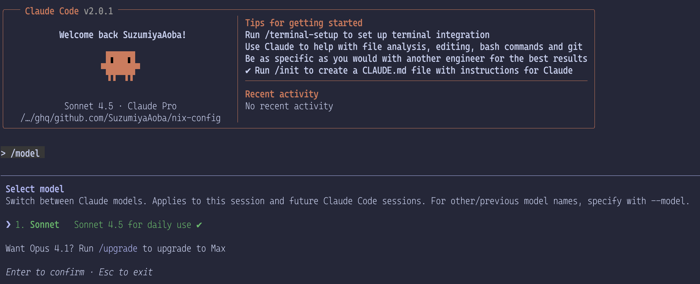
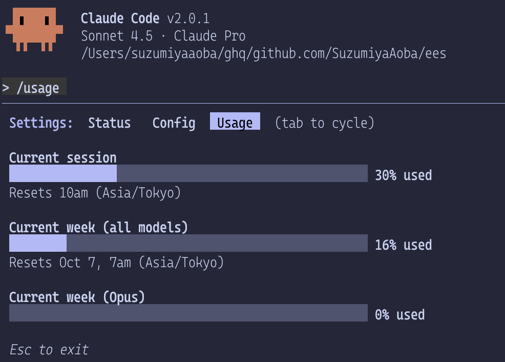
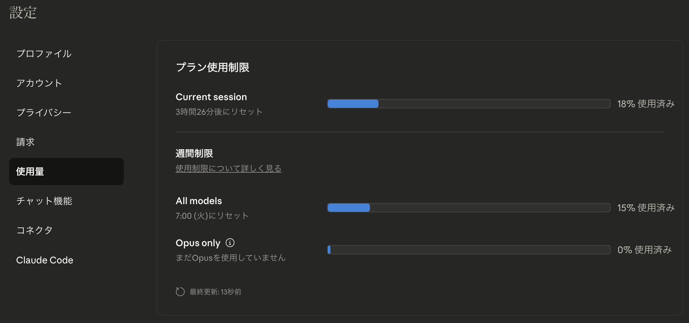
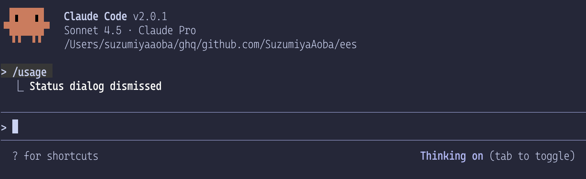
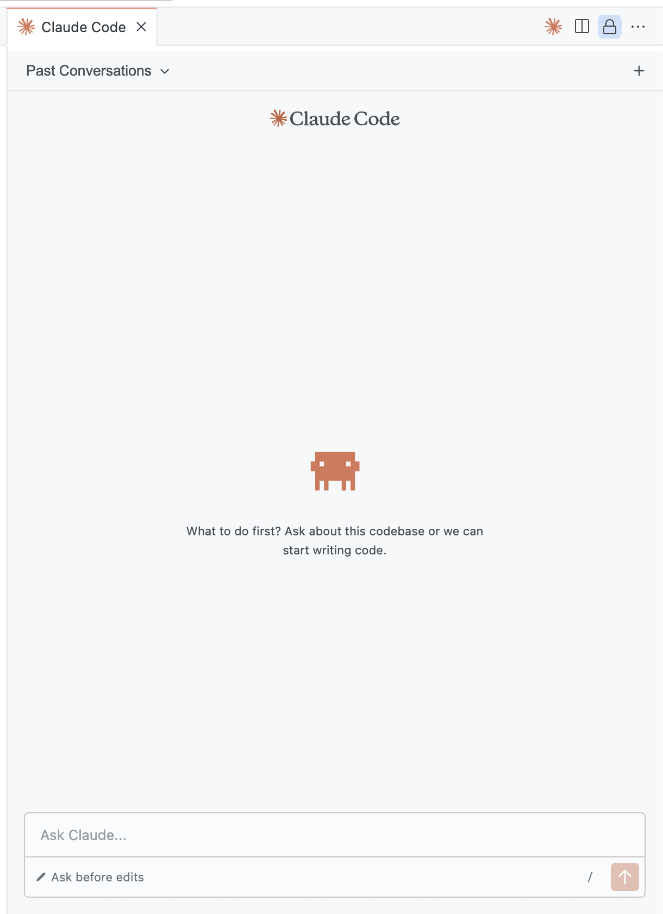
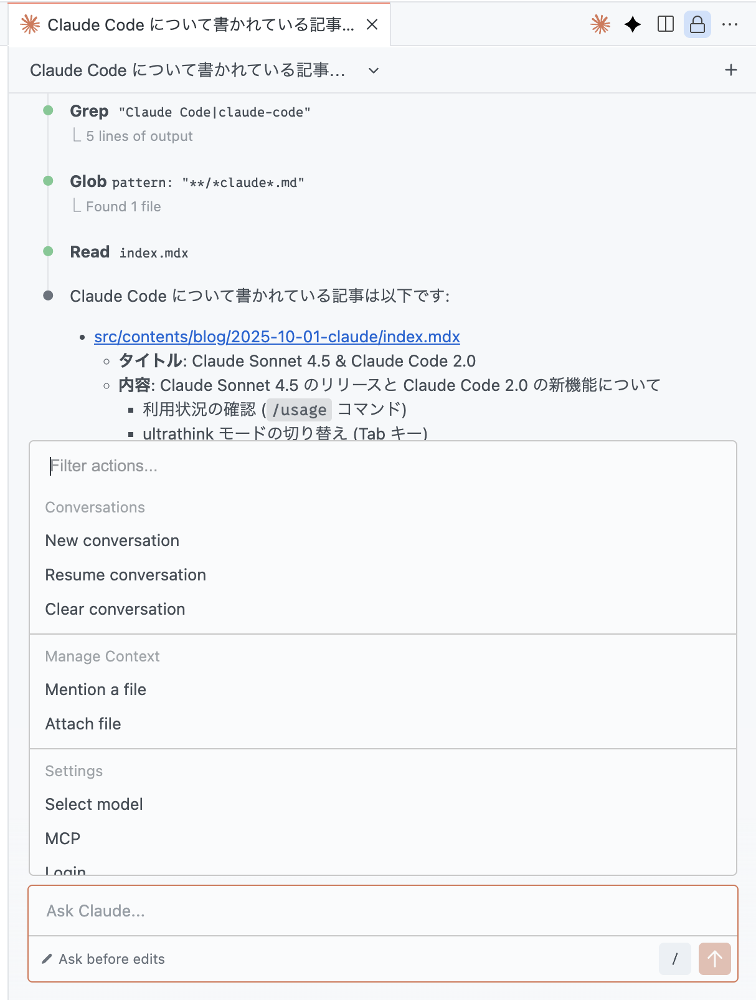

> 会議をしてはならない  
> 〜結論は話し合う前からすで決まっている〜  
> -- 『人類は衰退しました』

## Claude Sonnet 4.5

Claude Sonnet 4.5 がリリースされた。

[Introducing Claude Sonnet 4.5 \ Anthropic](https://www.anthropic.com/news/claude-sonnet-4-5)

巷では Claude Code (Anthropic) よりも Codex (OpenAPI) の方がいいと言われ始めていたので、
Claude Sonnet 4.5 のリリースで Anthropic が巻き返せるかが見所の一つだろう。

1 週間もすれば Zenn や Qiita にそれぞれの最新モデルの評価に関する記事が上がり始めると思う。

Claude Sonnet 4.5 を使う方法だが、Claude Code を使っているのであれば自然に Claude Sonnet 4 から 4.5 に切り替わっていると思う。
モデルが切り替わっているかどうかは `/model` コマンドで確認できる。

もしかしたら Claude Code のバージョンを 2.0 以上にする必要があるかもしれない。

## 変更点

Claude Sonnet 4.5 のリリースに合わせて網羅的に変更点をまとめている方は他にいるので Claude Code をサブスクリプションで使っているだけのユーザ視点で影響がありそうな点だけかいつまんで見ていく。

モデルの性能が向上しているといった当たり前なことには触れない。

### 利用状況の確認

Claude Code の `/usage` コマンドで現在のセッションの利用状況、現在の週の利用状況、それぞれで利用制限が解除されるまでの時間を確認できるようになった。

ただし、[calude-code-monoitor](https://github.com/Maciek-roboblog/Claude-Code-Usage-Monitor) のようにリアルタイムで使用状況を表示してくれるわけではない。
そのため、確認したいタイミングで `/usage` コマンドを打たないとけない。

また、Claude Code 上からだけでなく、Web UI 上からも利用状況が確認できるようになっている。

公式でこの機能を提供してくれるのは助かる。
claude-code-monitor のようなアプリケーションと比較すると情報が正確である点、端末を跨いでも利用可能な残量を把握できる点が優れている。

欲を言えばパーセンテージのような曖昧な指標だけでなく入力・出力トークン数も見えるようにして欲しかったがそのうち実装されるだろう。

### ultrathink の切り替え

Claude Code でプロンプトに _think (考えて)_、_hardthink (もっと考えて)_、_ultrathink (しっかり考えて)_ を含めると[拡張思考モード](https://support.claude.com/ja/articles/10574485-%E6%8B%A1%E5%BC%B5%E6%80%9D%E8%80%83%E3%81%AE%E4%BD%BF%E7%94%A8) が有効になっていた[^ultrathink]。

[ultrathink]: [Claude Code 逆引きコマンド事典](https://zenn.dev/ml_bear/articles/84e92429698177)

拡張思考モードが有効になるとより複雑な推論タスクに対するパフォーマンスが向上する。

これまでは先述のキーワードをプロンプトに含める必要があったが Claude Code 2.0 から <kbd>Tab</kbd> で ultrathink の有効・無効の切り替えができるようになった。

ultrathink を有効にすると「Thinking on」という表示になる。
もう一度 <kbd>Tab</kbd> を押すと無効になる。

### [Checkpointing](https://docs.claude.com/en/docs/claude-code/checkpointing)

<kbd>Esc</kbd> を 2 回押すか `/rewind` コマンドを実行すると巻き戻しメニューが表示される。

巻き戻すときは次の 3 つのパターンから選択できる。

- 会話
- コード
- 会話、コードの両方

チェックポイントはプロンプトを与える度に自動で作成されるが、Claude Code を通していない変更（Finder やターミナル、エディタによる変更等）は巻き戻すことができない点に注意しなければならない。
もし、戻したいのであればすべての操作を Claude Code を通して行うことを心がける必要がある。
そもそも Claude Code を使っているときに外部から変更を加えると、その操作がコンテキストに載らず、エージェントが混乱する原因となるので推奨されていないだろう。

チェックポイントはセッション内の巻き戻しなので VCS (Version Control System) を置き換えるものではなく、素早く巻き戻すための機能になっている。

### VS Code 拡張

これまで VS Code の Claude Code 拡張はターミナルから claude コマンドで Claude Code を起動しただけのような機能となっていたが、
VSCode ネイティブな (?) UI で動作するようになった。

プロンプトを入れると次のように表示になる。
見た目としてはターミナル上で実行しているのとほとんど変わらないが、ファイルをクリックするとちゃんと開かれるので便利になっていると思う。
しかし、コードジャンプが上手くいかないこともあるのでまだ不安定なのかもしれない。

スラッシュコマンドの一覧もリッチな表示になっている。

## おわりに

他にも Chrome 拡張がウェイトリストに載っている人に開放された、といった話や Claude Agent SDK の話があるが、
Claude Code を CLI で使っているだけの人にとっては関係ないので割愛。

詳しくは、[公式のアナウンス](https://www.anthropic.com/news/claude-sonnet-4-5) や
[Zenn で記事](https://zenn.dev/schroneko/articles/claude-sonnet-4-5)にしてくれている方がいるので
そちらを見てもらった方がいいと思う。
