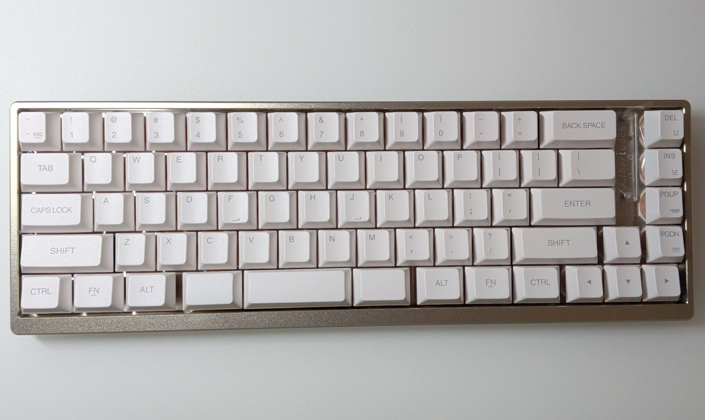

The [[GB] Libertouch Engineering Sample (ES)](https://shop.yushakobo.jp/products/gb-libertouch-engineering-sample), sold by lottery at Yushakobo, arrived.
Of course I bought the US layout.
Only 25 units were available, so I didn't expect to win, but I did, and I waited for months.

The key feature of Libertouch is that it is a membrane keyboard.
I haven't used a membrane keyboard since the PC lab keyboards in university classes.
Ever since I tried an HHKB in the university training room, I have only used electrostatic capacitive or mechanical keyboards.
That said, there was an HHKB Lite in the lab and I touched it briefly then.
Still, given the choice between HHKB Professional and HHKB Lite, choosing Professional was inevitable.

I haven't used membrane keyboards for a long time, but the high-end membrane keyboard category
almost disappeared after Libertouch stopped being sold, didn't it?
Most people wouldn't spend tens of thousands of yen on a keyboard in the first place.

For a detailed explanation of Libertouch, see the following article. Here I will write what I noticed while using it.

- [The most expensive high-end Japanese membrane keyboard: Libertouch (lottery open) | noda](https://note.com/hami3/n/n5a3159b97f14)

I wrote this right after it arrived and did not plan the structure afterwards,
so I just wrote thoughts and findings in order.
As a result, the flow may jump around. Please forgive me.

## Some key presses are not recognized

I am not sure whether it is an initial defect or my typing, but some key presses are not recognized.
If it is within a week of arrival, Yushakobo will support it, so I will watch it a bit longer,
but some keys (including Enter, which is critical) seem unresponsive.

I don't know the cause yet, but as I will mention later, I'm worried that the test environment only included Windows.
It feels like macOS was not included.
I'm writing this article using the Libertouch ES, and sometimes input fails.
When I type "u" in Japanese input, it is interpreted as holding <kbd>Ctrl</kbd>, so it inputs <kbd>C-u</kbd>.
Normally this is fine, but since I use Emacs, <kbd>C-u</kbd> interrupts typing and is a bit annoying.

There is also a delay before <kbd>Alt</kbd> is recognized.
I use Emacs, so I press <kbd>Alt</kbd> often, but I have to wait a beat before pressing <kbd>x</kbd>, <kbd>f</kbd>, or <kbd>b</kbd>.

## It is likely a software issue

Since the unrecognized key presses don't feel like a physical issue, I connected it to Windows to check.

On macOS, the biggest issue is that <kbd>Enter</kbd> is sometimes not recognized, so line breaks fail.
<kbd>Tab</kbd> is also occasionally missed.
However, I rarely press <kbd>Tab</kbd> while typing, so it doesn't bother me much on macOS.

Back to Windows: on Windows, the <kbd>Enter</kbd> issue did not occur.
So the current key input problems seem to be software-related rather than hardware.

## Keymap editor

Since it seems software-related, I tried to reflash the firmware, but the keymap editor only supports Windows, which made me sad.

https://www.fcl-components.com/support/keyboards/keycodeedit-202509.html

Since this is an ES unit, it doesn't need multi-OS support, but I use macOS daily, so it's a bit disappointing.
I reflashed the firmware on Windows, but it did not fix the input issues.

## Typing feel

I started with complaints because input is not smooth, but let me talk about the hardware: build quality, feel, sound, and keycaps.

The keycaps feel like typical PBT, but the surface is a bit rough.
My daily Rainy 75 has smooth keycaps, so this feels clearly different.

As for the key feel and sound, I might not realize it's membrane if I weren't told.
You can tell it's not mechanical, but it also feels different from electrostatic capacitive keyboards,
and different from ordinary membrane feel and sound.
I have never tried previous Libertouch models, so I cannot compare.

So I don't know whether this is a Libertouch trait or specific to this ES unit,
but I was surprised that a membrane keyboard can feel this good.
I used to think membrane meant mushy and not pleasant, but this changed that impression.

Overall build quality is also good.
The fact that the row with <kbd>DEL</kbd> and <kbd>INS</kbd> is separated from <kbd>BACK&nbsp;SPACE</kbd>
reduces accidental presses, so it feels like a good decision (even if that wasn't the intent).
When I see keyboards without that gap, I feel like I'd mistype, but in practice I don't mispress <kbd>BACK&nbsp;SPACE</kbd> or <kbd>&bsol;</kbd> on this one.

## Conclusion

Overall I am satisfied, but I am unsure whether the keys not working properly are a hardware or software issue.
I'm unsure whether to contact Yushakobo support.

It's not fatal, so I could keep using it as-is, but since this is an ES unit, maybe I should negotiate return/exchange to provide feedback.
