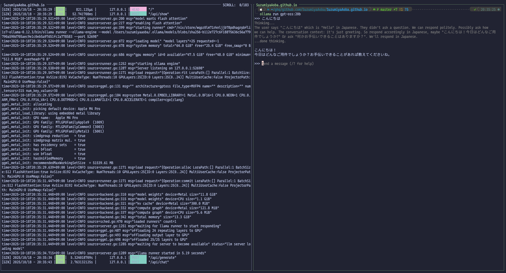
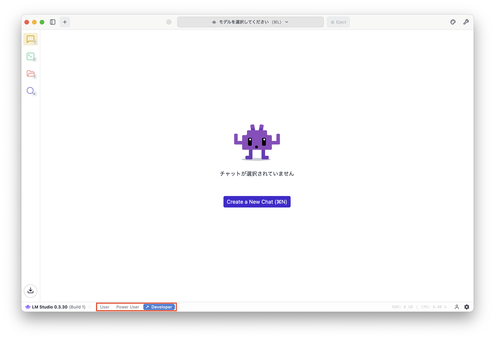
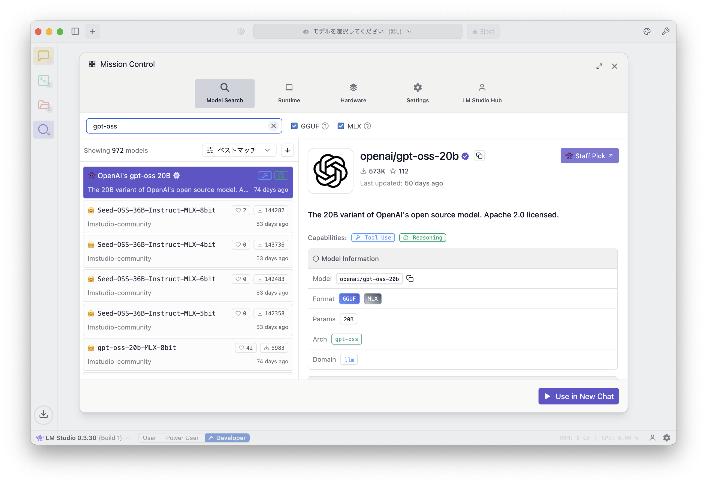
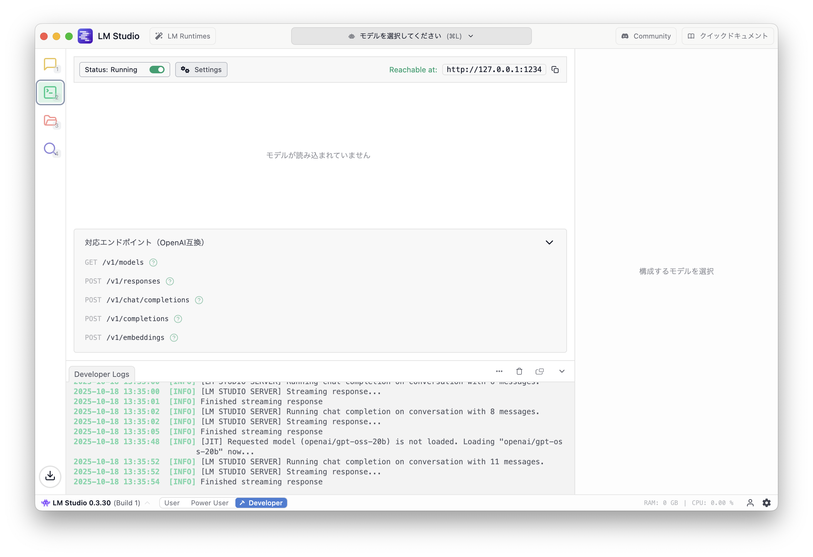
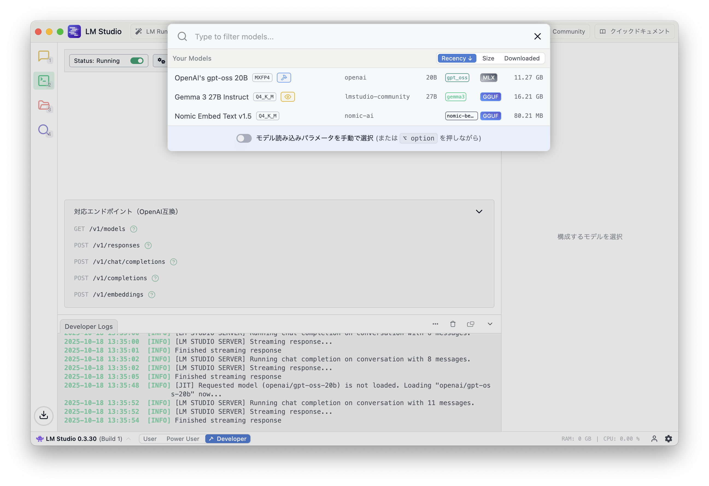
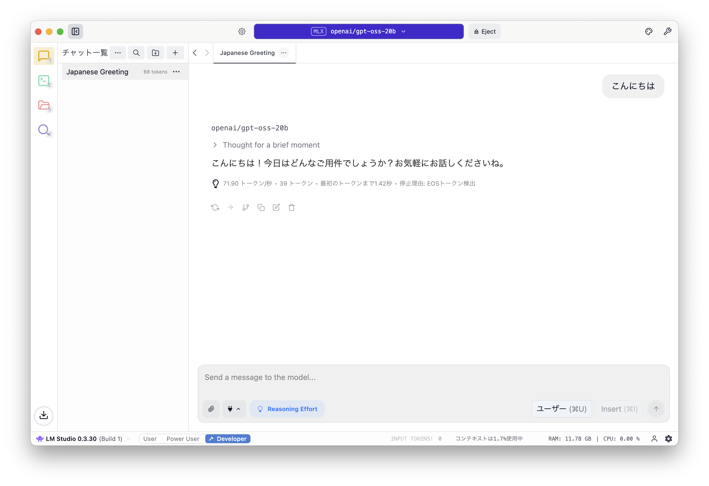
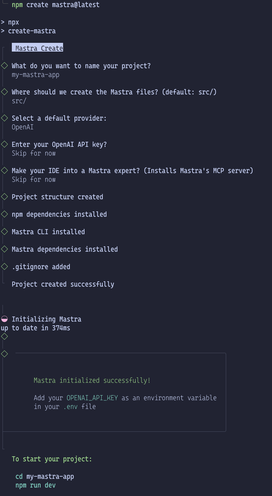
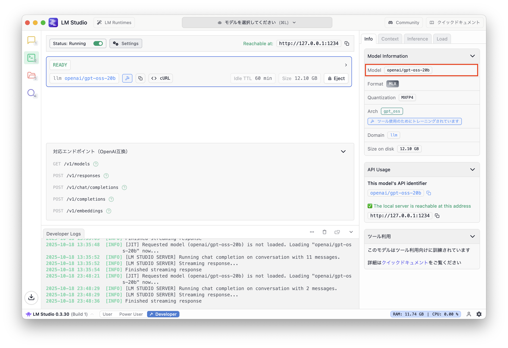

## はじめに

この記事では、[Ollama](https://ollama.com/)、[LM Studio](https://lmstudio.ai/) をインストールして [mastra](https://mastra.ai/) のサンプルを動かすまでの手順を紹介する。

<Message title="ポエム">

昨今では、[GPT-2](https://ja.wikipedia.org/wiki/GPT-2) の登場以降、[LLM (Large Language Model)](https://ja.wikipedia.org/wiki/%E5%A4%A7%E8%A6%8F%E6%A8%A1%E8%A8%80%E8%AA%9E%E3%83%A2%E3%83%87%E3%83%AB) が世間を賑わせている。
毎月のように [OpenAI](https://ja.wikipedia.org/wiki/OpenAI)、[Google](https://ja.wikipedia.org/wiki/Google)、[Anthropic](https://ja.wikipedia.org/wiki/Anthropic)、[Alibaba](https://ja.wikipedia.org/wiki/%E3%82%A2%E3%83%AA%E3%83%90%E3%83%90%E3%82%B0%E3%83%AB%E3%83%BC%E3%83%97) といった企業が LLM に関連した発表をしているように感じる。

その恩恵として、我々一般ユーザは [ChatGPT](https://openai.com/ja-JP/)、[Claude](https://claude.ai/new)、[Gemini](https://gemini.google.com/app)、[Qwen](https://chat.qwen.ai/) といったツールが使える。

それぞれの企業が提供するツールには他のツールに対して勝っている部分があるものの、この分野におけるフロントランナーは OpenAI だろう。
今日の（米国）株式市場を追っている人は実感していると思うが AI バブルとも呼べるような加熱感が正当化されるかどうかは、OpenAI を始めとする LLM 開発企業のマネタイズの成功にかかっている。
もっとも、ツルハシを売っている企業だけでなく、ツルハシを使う企業も利益を上げられなければ持続可能なビジネスにはならない[^monetize]。

[^monetize]: NVIDIA、OpenAI にとってのツルハシは GPU、AI を使ったサービスを提供する企業にとってのツルハシは LLM になる。

[Artifact](https://www.itmedia.co.jp/news/articles/2401/14/news043.html) のようなサービスも登場したが既にサービスが終了している。
また、各社が既存サービスに AI 機能を実装していっているが、toC 向けサービスについてはユーザに追加のサービス利用量を請求することを正当化できるだけの「新たな価値の創造」に至ってはいないように思う。
もちろん、UU (Unique User) や CVR (Conversion Ratio) を向上することでサービスの売上、利益改善に繋がる可能性はある。
しかし、現時点において LLM を使った機能そのものを直接マネタイズできているのは、先に上げた LLM を開発し、それそのものをサービスとして展開できている企業だけのように感じる。
結局のところ LLM を使ったサービスそのものではなく、LLM によって代替可能な業務を人から置き換えることでコスト削減による利益率改善をどう行うか、
また、それによって稼いだ時間によって LLM を使ったサービスを持続可能なマネタイズの方法を見つけられるかにかかっているのではないだろうか。
今は各社がこの流れに乗り遅れることで今ある市場を失うのではないかプレッシャーや、株主からのプレッシャーから利益度外視でサービスへ LLM 導入を進めているように思う。

本来であれば LLM を使うまでもなく既存技術でできるようなことであっても、AI という話題性と技術に対する無理解から自社のエンジニアに「我々も AI を活用したサービスをユーザに提供しなければならない」と言っているような状況ではなかろうか。
LLM を使ったサービスが利益率を圧迫し、赤字になるまではそれでいいのだろうが…。

とは言っても費用の問題については、近い将来に懸念材料ではなくなる可能性が高いように感じている。
一般ユーザやほとんどのサービスが既存サービスに LLM を組み込むような使い方をする場面において現状の性能でほぼ十分なように感じる。
そのため、今後は価格競争はもちろんのこと計算コストを削減する方向に開発もある程度進むのではないだろうか。
もちろん、これまで以上の大規模モデルの開発も平行して行なわれるが、そこに付き合う必要性も薄れていき、現在の最新モデルに相当する応答精度・速度を如何に安いコストで行えるか、がビジネス的な成功の鍵となってくるのではないだろうか。

また、いくつか企業や人物が主張しているように SLM (Small Language Model) を組み合わせるアーキテクチャが主流になっていくのは正しいと思う。
LLM に SML で十分こなせる粒度にタスク分解を行なわせ、個々のタスクは SLM が行い、その結果を LLM が受け取り、後続のタスクをコントロールする。
これは、GPT-5 や Claude Code でも似たようなことが行なわれているし、LLM を使ったサービスの裏側にあるワークフローや Agent ネットワークでも同様の工夫は既にされているだろう[^Haiku]。
しかし、これがより高度に発展し、SLM の性能・専門性が今後上がっていくことでさらにトークンあたりのコストがさらに抑えられていくのではなかろうか。

[^Haiku]: [Introducing Claude Haiku 4.5 \ Anthropic](https://www.anthropic.com/news/claude-haiku-4-5) によると既存の低コストではないバージョンのモデル (Claude Sonnet 4.0) よりも高性能なモデルとして Claude Haiku 4.5 は 1/3 のコストで 2 倍の速度だという。

また、LLM 内で使われている技術自体もまだまだ改善の余地はあるだろう。
Transformer を主流に開発が進められているが、Transformer よりよいものが見つかる可能性もあるし、アーキテクチャはそのままで計算効率を改善する工夫は今後もされていくだろう。

答えは米国株式市場が数年以内に教えてくれるだろう。

</Message>

## 想定読者

- LLM を使った開発をしたい人
- Python のようなプログラミング言語を使いたくない人
- ローカル AI エージェントを作りたい人
- 無料で LLM を使った開発をしたい人
- TypeScript を使った開発に慣れている人

## ローカル LLM

LLM はトレンドなので触ってみたいエンジニアは多いと思う。
しかし、私のような一般よわよわエンジニアは LLM を使った開発の感覚を掴むのにいくらかかるか予想が難しい料金体系である API に課金するのは憚られるのではないだろうか。
それにマネタイズできなければ、使うだけコストが発生するというのはお遊びプログラムを作るにもあまり気が進まない。

そんな人にはいくつか選択肢がある。
一つは、[OpenRouter](https://openrouter.ai/) のようなサービスを使い、無料クレジットの範囲内で利用するか、無料で提供されているモデルを使う。
もう一つは、ローカル環境で LLM を動作させる、という手だ。

速度的な面や PC への負荷を考えるとl OpneRouter を使うのがいいと思うが、ここではローカル LLM を使おうと思う。
次の記事では OpenRouter を使う手順を書く予定だ。

ローカル環境で LLM を使う場合もいくつか方法がある。
一つは [Ollma](https://ollama.com/) と呼ばれるソフトウェアを使う方法で、
もう一つは [LM Studio](https://lmstudio.ai/) と呼ばれるソフトウェアを使う方法だ。

ここでは、それぞれインストール方法を紹介する。
インストールするのはどちらでもよいが、後で触れるように Ollama だと正規の手順で mastra が動かないため LM Studio を推奨する。
また、GUI のチャット UI が使えるようになるという点でも LM Studio の方がとっつきやすいと思う。

[Open Web UI](https://openwebui.com/) もあるじゃないか、という声が聴こえてきそうだが私の環境では Open Web UI が動かせなかったので対象から除いている。

## 環境

インストール前に私の環境を載せておく。
Windows 環境で開発を行なわないため手順は基本的に macOS 前提となるが、
LLM を使った開発をしようとしている読者であれば公式サイトから手順に従って環境のセットアップに困ることはないだろう。


ローカル LLM の実行にはそれなりの環境が求められる。
一般的なノート PC やミドルスペックくらいのデスクトップ PC ではスペック不足の可能性が高い。
利用するモデルに左右されるが、今回は「ツール利用」ができる LLM を使いたいため [gpt-oss:20b](https://ollama.com/library/gpt-oss:20b) が使える前提で進めていく。
「ツール利用」については後述する。

- Ollama
  - [0.12.3](https://github.com/ollama/ollama/releases/tag/v0.12.3)
- LM Studio
  - 0.3.30
- mastra
  - [2025-10-14](https://github.com/mastra-ai/mastra/releases/tag/%40mastra%2Fcore%400.21.1)

## Ollama

### 概要

Ollama は、ローカル環境で LLM を簡単に実行できるツールの一つ。
モデルは、[Web 上で検索](https://ollama.com/search)することができ、
実行はモデルの詳細ページの右上にあるコマンドをコピーし、ターミナル上で実行するだけで使える。


UI は CLI となっており、会話を保持する機能もないのでとっつき難さがあるだろう。



### インストール手順

[Homebrew](https://brew.sh/) を使っている場合は次のコマンドでインストールする。

```shell
$ brew install ollama
```

Homebrew を使っていない場合は自身の環境に合わせたインストール方法でインストールして欲しい。
私の場合は [nix-darwin](https://github.com/nix-darwin/nix-darwin) + [Home Manager](https://github.com/nix-community/home-manager) で環境構築しているため Nix の設定ファイルを書いている。

特にパッケージ管理のためのソフトを利用していない場合は、Ollama の公式サイトからバイナリをインストールして手順に従ってインストールしてください。

### 実行方法

Ollama を使うには、最初にサーバを立てる必要がある。Ollama のサーバは、次のコマンドを実行すると立ち上がる。

```shell
$ ollama serve
```

サーバを立ち上げた後、次のコマンドを実行するとモデルのダウンロードをした後、チャットが立ち上がる。

```shell
$ ollama run gpt-oss:20b
```

<Message variant="warning" title="スペックに関する注意" defaultOpen={true}>

LLM を実行するのに十分なスペックでない PC を使っていると最悪の場合はフリーズする可能性があります。
`gpt-oss:20b` を実行するにの十分な PC スペックがあるか確認してください。
それなりの GPU とメモリが最低でも 32GB、もしくは 48GB ほどないと動かない可能性が高いです。

</Message>

## LM Studio

### 概要

LM Studio は、Ollama と同様にローカル LLM を手軽に試すことができるアプリケーションだが、こちらは Ollma とは違って GUI アプリケーションとなっている。
Developer mode に切り替えると OpenAPI Compatible な API を使うことができるため、今回のような mastra と組わ合せて LLM を使う場合にも利用できる。

### インストール手順

Ollama と同様に Homebrew を使っている場合は次のコマンドでインストールできる。

```shell
$ brew install lm-studio
```

Homebrew を使っていない場合は自身の環境に合わせたインストール方法でインストールして欲しい。

特にパッケージ管理のためのソフトを利用していない場合は、Ollama の公式サイトからバイナリをインストールして手順に従ってインストールしてください。

### LM Studio の使い方

今回は、LLM を使うための API として利用したいため、アプリケーションを起動した後に Developer モードに変更する。
LM Studio を起動すると画像のような GUI アプリケーションが起動する。



左側にあるアイコンの一番下にある虫めがねアイコンをクリックするとモデルを検索し、ダウンロードするための画面にある。



検索フォームに `gpt-oss` と入力すると OpenAI が公開している `gpt-oss 20B` モデルがヒットするため、右下の「Donwload」をクリックする。
画像では「Use in New Chat」となっているのはダウンロード済みだからだ。

モデルのダウンロードが完了したら左側のアイコンの上から 2 番目にあるターミナルアイコンを選択する。
そうすると画像のような画面になるはずだ。
この画面では、ダウンロードしたモデルを利用するためのサーバをローカルで立ち上げることができる。



画面の上の方にある「モデルを選択してください」をクリックすると、次の画像のようにダウンロード済みモデルを選択する画面になる。
ここでは、先ほど選択した「OpenAI's gpt-oss 20B」を選択する。



そうるとモデルの読み込みが開始するが、LLM はモデルを読み込んだだけの状態でも次の画像を見るとわかるようにそれなりのメモリ消費がロードタイミングでも発生する。


モデルの読み込みが終了したら正しく動作するか確認するために左側のアイコンの一番上を選択し、チャット UI で適当に問い合わせてみる。



何かしらの回答が返ってきたら LLM が正常に動作している証拠だ。

最後に LM Studio でモデルを読み込んだ後、それ以上使わないのであれば忘れずに Eject しておこう。
Development のアイコンを選択し、画像の「Eject」ボタンを押すとメモリを解放できる。


## mastra

いよいよ本題 mastra。

### 概要

[mastra](https://mastra.ai/) は、LLM を使った AI エージェントを TypeScript で構築するためのフレームワークの一つだ。
Python のフレームワークで言うところの [LangChain](https://www.langchain.com/)/[LangGraph](https://www.langchain.com/langgraph) に相当するフレームワークだと思う（LangChain/LangGraph に詳しくないので間違っている可能性あり）。

Python をこれら学ぶのは…、という Web エンジニアにはぴったりのフレームワークだろう。

今回は、mastra のセットアップを行い、LM Studio で立てた API サーバにリクエストしてサンプルアプリケーションが動作するところまでを試す。
Ollama を使うとチュートリアル通りにやっても上手く行かない。しかし、OpenAPI Compatible API として使う方法であれば上手く行くのかと思う、がそこに行く前に力尽きてしまう予感がする。

### プロジェクトの作成

さっそく mastra のプロジェクトを作成しよう。
[ドキュメント](https://mastra.ai/ja/docs/getting-started/installation)に従って、プロジェクトを作成してみよう。

```shell
$ npm create mastra@latest
```

ここで大切なのが mastra のバージョンだ。
mastra は絶賛開発中のフレームワークなのでバージョンが上がるごとに破壊的変更が当然のように入ってくるのに加えてバグも大量に存在する。
一つ前のバージョンでは動いていたのにバージョンを上げたらエラーでクラッシュする、なんてことは日常だ。

コマンドを実行すると、いくつか質問されるので回答するとディレクトリが作成される。



### ディレクトリ構造

プロジェクトの初期状態は次のようになっている。

```
.
├── .env.example
├── .gitignore
├── package-lock.json
├── package.json
├── src
│   └── mastra
│       ├── agents
│       │   └── weather-agent.ts
│       ├── index.ts
│       ├── tools
│       │   └── weather-tool.ts
│       └── workflows
│           └── weather-workflow.ts
└── tsconfig.json

6 directories, 10 files
```

各ファイルの説明は[公式ドキュメントでされている](https://mastra.ai/ja/docs/getting-started/project-structure)のでそちらを参照するのがいい。

ファイル名を見るとわかると思うが、mastra の初期プロジェクトは天気予報の情報を取得し、天気について回答するか、天気に応じてアクティビティを提案するようなエージェントとそのためのツールが定義されている。
ワークフローでは、都市名を入力として受け取り、天気を取得してからそれに基づくアクティビティの提案を行うフローが定義されている。

エージェントやワークフローが具体的にどのようなものであるかは次の記事で紹介する。

ここでは、まずはサンプルをローカル LLM を使って動かすことを目的に次に進もう。

### LM Studio を使うための変更

サンプルプロジェクトを生成した後は、LLM のプロバイダごとに設定をしないといけない。
今回の場合は LM Studio で OpenAI Compatible API サーバを立てて利用するための設定を行う。

公式ドキュメントだと [モデルプロバイダー | はじめに | Mastra ドキュメント](https://mastra.ai/ja/docs/getting-started/model-providers#openai-%E4%BA%92%E6%8F%9B%E3%83%97%E3%83%AD%E3%83%90%E3%82%A4%E3%83%80%E3%83%BC) が該当する。

それでは、パッケージのインストールとコード修正に進もう。

#### package.json

最初に LM Studio で立てた API サーバを使うために `@ai-sdk/openai-compatible` をインストールする。
インストールは次のコマンドを実行すればよい。

```shell
$ npm install @ai-sdk/openai-compatible
```

もし、インストールされた他のパッケージのバージョンが古い場合は `npx npm-check-updates -u` を実行し、パッケージを一通り最新にする。
私の環境では、`package.json` に次のような差分が出た（`license` を `MIT` に変更していますがそのままで問題ない）。

```diff package.json
diff --git a/package.json b/package.json
index f678078..44e95e6 100644
--- a/package.json
+++ b/package.json
@@ -11,22 +11,24 @@
   },
   "keywords": [],
   "author": "",
-  "license": "ISC",
+  "license": "MIT",
   "type": "module",
   "engines": {
     "node": ">=20.9.0"
   },
   "dependencies": {
-    "@ai-sdk/openai": "^2.0.50",
-    "@mastra/core": "^0.20.2",
-    "@mastra/libsql": "^0.15.1",
-    "@mastra/loggers": "^0.10.15",
-    "@mastra/memory": "^0.15.6",
-    "zod": "^3.25.76"
+    "@ai-sdk/openai": "^2.0.52",
+    "@ai-sdk/openai-compatible": "^1.0.22",
+    "@mastra/core": "^0.21.1",
+    "@mastra/libsql": "^0.15.2",
+    "@mastra/loggers": "^0.10.16",
+    "@mastra/memory": "^0.15.7",
+    "zod": "^4.1.12"
   },
   "devDependencies": {
-    "@types/node": "^24.7.2",
-    "mastra": "^0.15.1",
+    "@types/node": "^24.8.1",
+    "mastra": "^0.17.0",
     "typescript": "^5.9.3"
   }
 }
```

ここの差分は一例であって、同じ手順を踏んだとしても新しいバージョンがリリースされていれば数字は変わってくるので差があっても基本的には気にする必要はない。

#### src/mastra/agents/weather-agent.ts

次に `src/mastra/agents/weather-agent.ts` ファイルで LM Studio で立てたサーバを使うための設定を追加する。
先ほどインストールした `@ai-sdk/openai-compatible` から `createOpenAICompatible` をインポートして `name`、`baseURL`、`apiKey` を持つオブジェクトを引数に渡した結果を変数 (`lmstudio`) に束縛しておく。
`name` と `apiKey` はどんな値でも問題ないはずなのでそれらしい値を設定する。

次に `weatherAgent` の作成で指定されている `model` を `openapi` から新しく定義した `lmstudio` を使い、引数は `openai/gpt-oss-20b` を指定する。

```diff src/mastra/agents/weather-agent.ts
diff --git a/src/mastra/agents/weather-agent.ts b/src/mastra/agents/weather-agent.ts
index 7299c42..eaedfcb 100644
--- a/src/mastra/agents/weather-agent.ts
+++ b/src/mastra/agents/weather-agent.ts
@@ -1,8 +1,14 @@
-import { openai } from '@ai-sdk/openai';
 import { Agent } from '@mastra/core/agent';
 import { Memory } from '@mastra/memory';
 import { LibSQLStore } from '@mastra/libsql';
 import { weatherTool } from '../tools/weather-tool';
+import { createOpenAICompatible } from "@ai-sdk/openai-compatible";
+
+const lmstudio = createOpenAICompatible({
+  name: "lmstudio",
+  baseURL: "http://localhost:1234/v1",
+  apiKey: "lm-studio",
+});

 export const weatherAgent = new Agent({
   name: 'Weather Agent',
@@ -20,7 +26,7 @@ export const weatherAgent = new Agent({

       Use the weatherTool to fetch current weather data.
 `,
-  model: openai('gpt-4o-mini'),
+  model: lmstudio("openai/gpt-oss-20b"),
   tools: { weatherTool },
   memory: new Memory({
     storage: new LibSQLStore({
```

`openai/gpt-oss-20b` は LM Studio の GUI アプリケーション上で確認できる値だ。



#### .env

最後に LM Studio を使う場合は環境変数に `LMSTUDIO_API_KEY` が設定されていないといけないようなので `.env` ファイルをプロジェクトのルートに作成して値を設定する。

```env .env
LMSTUDIO_API_KEY=lm-studio
```

### 待たせたな

準備は整った。あとは実行するだけだ。
`npm run dev` コマンドを実行すると次のような出力がされ、`localhost` の `4111` でアプリケーションが立ち上がる。

```
$ npm run dev

> how-to-use-mastra@1.0.0 dev
> mastra dev

◐ Preparing development environment...
✓ Initial bundle complete
◇ Starting Mastra dev server...

 mastra  0.17.0 ready in 721 ms

│ Playground: http://localhost:4111/
│ API:        http://localhost:4111/api

◯ watching for file changes...
```

ウェブブラウザでアクセスすると次のような画面が表示されるはずだ。


今回は動作確認をするのが目的なので `Weather Agent` をクリックしてチャット UI を表示し、適当なプロンプトを投げてみよう。
すると回答は英語になってしまっているが、画像のように天気に関する情報が返される。


これでめでたく TypeScript で AI エージェントを開発するための初期環境が整った。

## まとめ

この記事では、Ollama、LM Studio をインストールし、LM Studio で API サーバを立てて mastra のサンプルを動かすところまでを解説した。
次の記事では Ollama の場合の設定、サンプルコードの内容を解説しようと思う。

ローカル LLM を利用した AI エージェントがどこまでやれるのか試していきたい。

AI エージェント開発では、[現場で活用するためのAIエージェント実践入門 (KS情報科学専門書)](https://amzn.to/4h2sk0R) を参考に進めていく予定だ。
