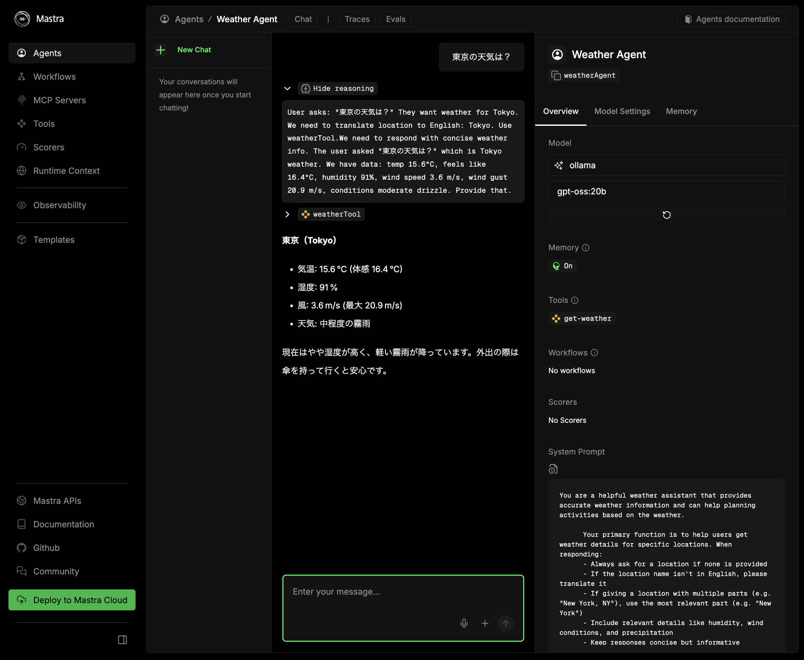

## 前回のおさらい

この記事は [ローカル AI エージェントは電気羊の夢を見るのか（環境構築）](../2025-10-20-local-ai-agent/) でカバーできなかった範囲の補足記事になる。
前回の記事では、[Ollama](https://ollama.com/) と [LM Studio](https://lmstudio.ai/) をインストールし、LM Studio を使って立てた API サーバを利用して [mastra](https://mastra.ai/) のサンプルコードを実行した。

今回は LM Studio ではなく Ollama を使ってサンプルコードを実行する方法を説明する。

## Ollama を使う場合

[公式ドキュメント](https://mastra.ai/ja/docs/getting-started/model-providers#%E3%82%B3%E3%83%9F%E3%83%A5%E3%83%8B%E3%83%86%E3%82%A3%E3%83%97%E3%83%AD%E3%83%90%E3%82%A4%E3%83%80%E3%83%BC)には Ollama を使う場合は `ollama-ai-provider-v2` を使う手順が紹介されている。

しかし、`ollama-ai-provider-v2` を使うと Agent が Tool を使用しないという不具合がある。
以下の Issue でも報告されているように、ツール呼び出し後にテキストを生成しないような挙動をする。

- [No text generated when using tools · Issue #40 · nordwestt/ollama-ai-provider-v2](https://github.com/nordwestt/ollama-ai-provider-v2/issues/40)

解決策は Issue で触れられているように `@ai-sdk/openai-compatible` を代わりに使うことでこの問題は回避できる。

### src/mastra/agents/weather-agent.ts

具体的には、前回の記事で `lmstudio` を定義して使っていたところを `ollma` という変数を定義し（変数名は任意）、
`baseURL` に `localhost` のポート番号 `11434` を指定する。
これは Ollama でサーバを立ち上げたときのデフォルトポート番号だ。
もしポート番号を変更しているのであれば、自身の環境にあった番号に変更する。

```diff src/mastra/agents/weather-agent.ts
diff --git a/src/mastra/agents/weather-agent.ts b/src/mastra/agents/weather-agent.ts
index eaedfcb..e22ecb9 100644
--- a/src/mastra/agents/weather-agent.ts
+++ b/src/mastra/agents/weather-agent.ts
@@ -10,6 +10,11 @@ const lmstudio = createOpenAICompatible({
   apiKey: "lm-studio",
 });

+const ollama = createOpenAICompatible({
+  name: "ollama",
+  baseURL: "http://localhost:11434/v1",
+});
+
 export const weatherAgent = new Agent({
   name: 'Weather Agent',
   instructions: `
@@ -26,7 +31,8 @@ export const weatherAgent = new Agent({

       Use the weatherTool to fetch current weather data.
 `,
-  model: lmstudio("openai/gpt-oss-20b"),
+  // model: lmstudio("openai/gpt-oss-20b"),
+  model: ollama("gpt-oss:20b"),
   tools: { weatherTool },
   memory: new Memory({
     storage: new LibSQLStore({
```

そして、`model` の指定で `lmstudio` の代わりに `ollama` を使い、引数にはモデル名を指定する。
今回は `gpt-oss` の `20b` モデルを使いたいので `gpt-oss:20b` としている。
モデル名は、`ollama list` コマンドで確認できる。

```shell
$ ollama list
NAME                                ID              SIZE      MODIFIED
qwen3:8b                            500a1f067a9f    5.2 GB    6 days ago
llama4:scout                        bf31604e25c2    67 GB     6 days ago
llama4:latest                       bf31604e25c2    67 GB     6 days ago
gpt-oss:20b                         aa4295ac10c3    13 GB     12 days ago
embeddinggemma:latest               85462619ee72    621 MB    13 days ago
nomic-embed-text:latest             0a109f422b47    274 MB    4 weeks ago
qwen3:30b-a3b-instruct-2507-fp16    c699578934a3    61 GB     5 weeks ago
gpt-oss:120b                        f7f8e2f8f4e0    65 GB     6 weeks ago
Gemma3:27b                          a418f5838eaf    17 GB     5 months ago
```

### 動作確認

mastra を起動して適当なプロンプトを入力してみよう。



すると応答が返ってくるはずだ。また、右側の Model を確認すると ollama になっていることが確認できる。

## まとめ

前回記事の補足として LM Studio ではなく Ollama を使って mastra のサンプルを動かすための書き方を紹介した。

前の記事では LM Studio を推奨したが、Ollama でもほとんどやることは代わらなかったので、
Ollama にアップロードされているモデルで十分な場合は Ollama でいいかもしれない。
