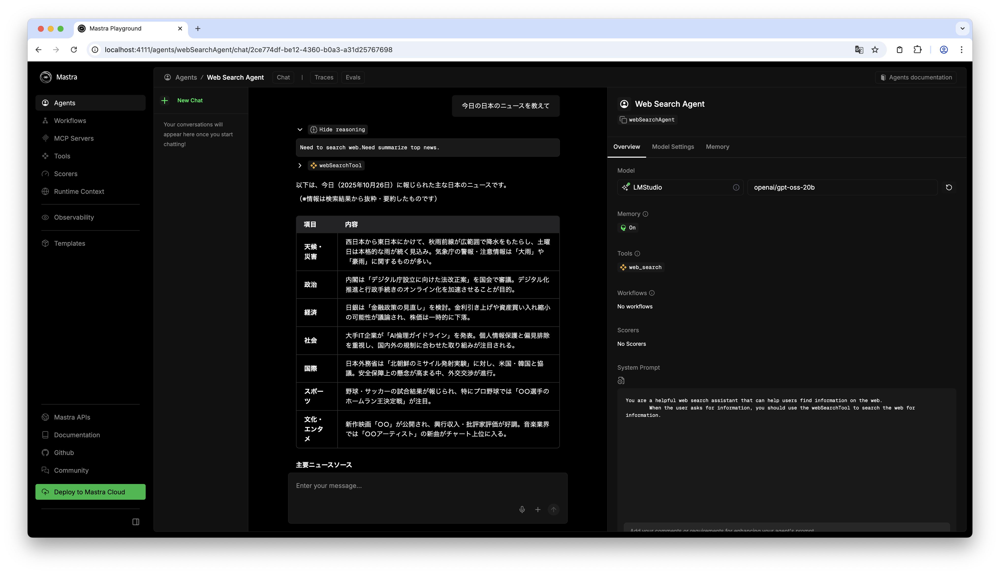

## Quick recap

In this series so far, we installed Ollama and LM Studio to build a local AI agent environment, and ran mastra's sample code.

This time, we will build an AI agent that performs web searches and displays results using mastra's Agent and Tools features.
In this article, we will implement a web search tool that the LLM can call and make sure the LLM recognizes and invokes it correctly.
The first implementation is naive, so it will not work well, but you will experience that just giving tools to an LLM does not magically solve everything.

## Environment

- mastra [2025-10-14](https://github.com/mastra-ai/mastra/releases/tag/%40mastra%2Fcore%400.21.1)

<Message title="Version" variant="warning" defaultOpen={true}>

mastra is not yet a stable framework, so behavior may change when the version updates.
If it doesn't work as described, check the version you are using.

</Message>

## What is an AI agent?

Before diving into implementation, let's confirm what an AI agent means.
Here we quote and follow the definition from [Practical Introduction to AI Agents for Real‑World Use (KS Information Science)](https://amzn.to/4h2sk0R).

> An AI agent is an intelligent system that performs tasks while interacting with an environment to achieve a goal.
> The environment is where the AI agent acts, such as digital spaces like web browsers and desktop apps, or physical spaces like a room.
> Early intelligence was expressed with logical symbols, then shifted to rule‑based and learning models, and now corresponds to LLMs.
> LLMs gain conversational ability, massive knowledge, few‑shot learning, language understanding, and logical reasoning during training.
> Modern AI agents leverage LLM capabilities to perceive the environment, recall past experiences from memory, plan toward goals, and act.

## Tools

The definition of an AI agent includes "**perform tasks while interacting with the environment**".
An LLM, the core of an AI agent, basically takes sequence data, calculates the probability of "the next token," and selects a likely one.
It then appends that to the sequence and repeats, predicting the next token again.

<YouTubeEmbed id="y7NQiNER6r4" title="How LLMs Work (simple version)" />

LLMs themselves do not have the ability to act on the environment.
So we need to provide capabilities that let the LLM affect the environment.
Such capabilities are called **tools**, and they are programs executed outside the LLM.
Tools are organized in the following paper.

- [[2403.15452] What Are Tools Anyway? A Survey from the Language Model Perspective](https://arxiv.org/abs/2403.15452)

## Implementing tools in mastra

We will follow the [official documentation](https://mastra.ai/ja/docs/tools-mcp/overview) for mastra tools.
This time we implement a web search tool.

For those who want to see the whole picture first, here is the full tool implementation.

<Message title="Web Search Tool Implementation">

```ts src/mastra/tools/web-search-tool.ts
import { createTool } from "@mastra/core";
import * as cheerio from "cheerio";
import { z } from "zod";

export const webSearchTool = createTool({
  id: "web_search",
  description: "Search the web for information",
  inputSchema: z.object({
    query: z.string().describe("The query to search the web for"),
  }),
  outputSchema: z.object({
    results: z.array(
      z.object({
        title: z.string(),
        url: z.string().optional(),
        description: z.string().optional(),
      }),
    ),
  }),
  execute: async ({ context }) => {
    const response = await fetch("https://html.duckduckgo.com/html/", {
      method: "POST",
      headers: {
        "Accept-Language": "ja;q=0.9",
        "User-Agent":
          "Mozilla/5.0 (Windows NT 10.0; Win64; x64) AppleWebKit/537.36 (KHTML, like Gecko) Chrome/141.0.0.0 Safari/537.36",
      },
      body: new URLSearchParams({
        q: context.query,
        b: "",
      }),
    });

    const html = await response.text();
    const $ = cheerio.load(html);

    const results = $(".result")
      .map((_index, result) => {
        const $title = $(result).find(".result__a");
        const titleText = $title.text().trim();
        const titleUrl = $title.attr("href");

        const $snippet = $(result).find(".result__snippet");
        const snippetText = $snippet.text().trim();

        return {
          title: titleText,
          url: titleUrl,
          description: snippetText,
        };
      })
      .get();

    return {
      results,
    };
  },
});
```

</Message>

Let's first look at how to implement a tool in mastra.

### Tool overview

In mastra, you implement tools with `createTool`, or manage an MCP (Model Context Protocol) server via `MCPClient` and pass it to an `Agent` so the LLM can use those tools.
We will explain MCP after the web search agent is complete.
Here, we'll implement a web search tool using `createTool`, entirely within mastra.

For details on `createTool`, see the [API reference](https://mastra.ai/ja/reference/tools/create-tool). Here is the quick usage.

We implement the tool in `src/mastra/tools/web-search-tool.ts`.

```typescript src/mastra/tools/web-search-tool.ts
export const webSearchTool = createTool({
  id: "web_search",
  description: "Search the web for information",
  inputSchema: /* ... */,
  outputSchema: /* ... */,
  execute: async ({ context }) => {
    // ...
  },
});
```

The object passed to `createTool` takes the tool ID, description, input schema, output schema, and tool logic.
The `id` should clearly express what the tool does.
The `description` is used by the LLM to decide when and how to use the tool, so explain its usage clearly and succinctly.

Tool input and output are JSON.
`inputSchema` and `outputSchema` define the JSON schema for inputs and outputs.
We define schemas with [Zod](https://zod.dev/).

`execute` implements the tool logic. The `context` argument is the input parsed by `inputSchema`, so you can access tool inputs through it.

Now let's look at `inputSchema`, `outputSchema`, and `execute` in more detail.

### Input schema

For the web search tool, we only need a search query as input.
Since the input schema is a JSON object, it looks like this.

```typescript src/mastra/tools/web-search-tool.ts
export const webSearchTool = createTool({
  // ...
  inputSchema: z.object({
    query: z.string().describe("The query to search the web for"),
  }),
  // ...
});
```

The `description` explains what value to set for each property.
Here we say "a query for web search." It's written in English, but a Japanese‑capable LLM could also handle Japanese.
However, with smaller local LLMs, you might see a clear accuracy gap between Japanese and English.

You might omit `description` if the property name is self‑explanatory.

### Output schema

Next, define the output schema.

```typescript src/mastra/tools/web-search-tool.ts
export const webSearchTool = createTool({
  // ...
  outputSchema: z.object({
    results: z.array(
      z.object({
        title: z.string(),
        url: z.string().optional(),
        description: z.string().optional(),
      }),
    ),
  }),
  // ...
});
```

Here we assume DuckDuckGo results will yield three items: title, URL, and site description. So we return a list of objects with those properties in `results`.

### Tool logic

Now for the web search logic.
We will scrape DuckDuckGo's search results.
Scraping Google Search is explicitly prohibited by its terms, so we do not use it.
DuckDuckGo doesn't explicitly allow scraping either, but it also doesn't explicitly forbid it (author's investigation), so we'll implement it as an LLM tool **at your own risk**.
This article does not recommend scraping DuckDuckGo.
Keep in mind that [duckduckgo.com](https://duckduckgo.com/robots.txt) and [html.duckduckgo.com](https://duckduckgo.com/robots.txt) are disallowed in their [robots.txt](https://developers.google.com/search/docs/crawling-indexing/robots/intro?hl=ja).

Also, if you just want a web search tool, [Ollama provides a Web Search API](https://ollama.com/blog/web-search), so you may prefer that.

#### DuckDuckGo

[DuckDuckGo](https://duckduckgo.com/) is a search engine that emphasizes privacy.
Unlike Google, it does not track via cookies.

If you search for how to scrape DuckDuckGo, you will find many articles using a [Python library](https://github.com/deedy5/ddgs).
But we want to implement this in TypeScript, so we won't use that approach.

I can think of three ways to scrape DuckDuckGo:

- Use a headless browser like [Playwright](https://playwright.dev/) or [Puppeteer](https://pptr.dev/)
- Parse HTML returned by https://html.duckduckgo.com/html/ or https://lite.duckduckgo.com/lite/
- Parse the response (JavaScript) from https://duckduckgo.com/d.js

Some libraries use the third approach internally, likely because parsing `d.js` avoids scraping bans on the surface.
But it requires sending a dummy request to obtain a token before searching (probably).
That is a hassle, so we'll scrape https://html.duckduckgo.com/html/.
I later learned about https://lite.duckduckgo.com/lite/, which seems lighter, so if you implement this yourself, try the Lite version.
Again, **scraping is at your own risk**.

Let's implement it.

#### Implementation

When you check the network request for https://html.duckduckgo.com/html/ search, you can see the HTML version uses a POST request.
After removing unnecessary fields, the search works with a request like this.

```shell
$ curl 'https://html.duckduckgo.com/html/' \
  -H 'accept-language: ja' \
  -H 'user-agent: Mozilla/5.0 (Macintosh; Intel Mac OS X 10_15_7) AppleWebKit/537.36 (KHTML, like Gecko) Chrome/141.0.0.0 Safari/537.36' \
  --data-raw 'q=test&b='
```

It seems to check whether the request is from a browser using `User-Agent`, so we can't remove that header.
Also, the search language is controlled by `Accept-Language`, so here we fix it to `ja`.
For practical use, it would be better to allow English too, so we should allow the LLM to set `Accept-Language`.
But to keep the explanation simple, we accept only `q` as the input (the search query) and ignore others.

The response from https://html.duckduckgo.com/html/ is HTML, so we parse it with [cheerio](https://cheerio.js.org/) and extract results.

With that in mind, the tool logic is as follows.

```typescript
export const webSearchTool = createTool({
  // ...
  execute: async ({ context }) => {
    const response = await fetch("https://html.duckduckgo.com/html/", {
      method: "POST",
      headers: {
        "Accept-Language": "ja",
        "User-Agent":
          "Mozilla/5.0 (Windows NT 10.0; Win64; x64) AppleWebKit/537.36 (KHTML, like Gecko) Chrome/141.0.0.0 Safari/537.36",
      },
      body: new URLSearchParams({
        // !callout[/context.query/] Get query from context defined in inputSchema
        q: context.query,
        b: "",
      }),
    });

    const html = await response.text();
    const $ = cheerio.load(html);

    const results = $(".result")
      .map((_index, result) => {
        const $title = $(result).find(".result__a");
        const titleText = $title.text().trim();
        const titleUrl = $title.attr("href");

        const $snippet = $(result).find(".result__snippet");
        const snippetText = $snippet.text().trim();

        return {
          title: titleText,
          url: titleUrl,
          description: snippetText,
        };
      })
      .get();

    return {
      results,
    };
  },
});
```

The details of this logic are not essential for mastra usage or agent tools, so I won't explain it.
See the docs for `fetch` and `cheerio` if needed.

Now that we have the web search tool, let's implement the agent.

## Web search agent

Now we connect the LLM and tools and define an AI agent.

### Differences from the previous article

Before implementing, here are the differences from the previous article [Do Local AI Agents Dream of Electric Sheep? (Environment Setup)](../2025-10-18-local-ai-agent/).

```ts src/config/providers.ts
import { createOpenAICompatible } from "@ai-sdk/openai-compatible";

export const lmstudio = createOpenAICompatible({
  name: "lmstudio",
  baseURL: "http://localhost:1234/v1",
  apiKey: "lm-studio",
});

export const ollama = createOpenAICompatible({
  name: "ollama",
  baseURL: "http://localhost:11434/v1",
});
```

In the last two articles we wrote `lmstudio` and `ollama` in `src/mastra/agents/weather-agent.ts`, but we moved them to `src/config/providers.ts` because they are needed elsewhere.

### Implementation

The `Agent` implementation looks like this.

```typescript src/mastra/agents/web-search-agent.ts
import { Memory } from "@mastra/memory";
import { ollama } from "../../config/providers";
import { LibSQLStore } from "@mastra/libsql";
import { Agent } from "@mastra/core/agent";
import { webSearchTool } from "../tools/web-search-tool";

export const webSearchAgent = new Agent({
  name: "Web Search Agent",
  instructions: `
        You are a helpful web search assistant that can help users find information on the web.
        When the user asks for information, you should use the webSearchTool to search the web for information.
  `,
  model: lmstudio("openai/gpt-oss-20b"),
  // !callout[/webSearchTool/] Pass in the webSearchTool
  // !mark
  tools: { webSearchTool },
  memory: new Memory({
    storage: new LibSQLStore({
      url: "file:../mastra.db", // path is relative to the .mastra/output directory
    }),
  }),
});
```

It's almost the same as the sample `Weather Agent`.
Here, `instructions` simply tells the agent to use `webSearchTool` to search and answer user queries.

We pass the tool in `tools`.
With this, the LLM can use `webSearchTool`, and `instructions` tells it when to use it,
so the LLM can decide the right timing and perform web searches.

## Register the agent

Now that the `Agent` is implemented, add `webSearchAgent` to the `Mastra` instance in `src/mastra/index.ts`.

### src/mastra/index.ts

Defining an `Agent` is not enough; it must be registered in mastra.
To use agents and workflows in mastra, register them in the `Mastra` instance exported as `mastra` in `src/mastra/index.ts`.

Specifically, make the following change.

```typescript src/mastra/index.ts
import { Mastra } from "@mastra/core/mastra";
import { PinoLogger } from "@mastra/loggers";
import { LibSQLStore } from "@mastra/libsql";
import { weatherWorkflow } from "./workflows/weather-workflow";
import { weatherAgent } from "./agents/weather-agent";
import { webSearchAgent } from "./agents/web-search-agent";

export const mastra = new Mastra({
  workflows: { weatherWorkflow },
  // !diff -
  agents: { weatherAgent },
  // !callout[/webSearchAgent/] Add webSearchAgent
  // !diff +
  agents: { weatherAgent, webSearchAgent },
  storage: new LibSQLStore({
    // stores observability, scores, ... into memory storage, if it needs to persist, change to file:../mastra.db
    url: ":memory:",
  }),
  logger: new PinoLogger({
    name: "Mastra",
    level: "info",
  }),
  telemetry: {
    // Telemetry is deprecated and will be removed in the Nov 4th release
    enabled: false,
  },
  observability: {
    // Enables DefaultExporter and CloudExporter for AI tracing
    default: { enabled: true },
  },
});
```

## Try the web search agent

Start mastra with `npm run dev`, then open http://localhost:4111/agents in your browser.


You should see `Web Search Agent` in the list.

Select `Web Search Agent` and ask about today's news in the chat UI.



You can see that `webSearchTool` is called along with a plausible answer.
However, if you inspect the tool call, you'll see it's not being used the way you expect.


When humans search the web for today's news, we don't type "today's news in Japan" as a sentence.
I hear that English speakers sometimes type full sentences into Google‑like search engines,
but Japanese speakers usually search with keywords like "Japan news".

"Today's news in Japan" might yield decent results, but even when you ask other questions, the agent tends to pass parts of your prompt directly as a query.

This shows that simply giving the LLM a tool does not always make it use it appropriately.
To improve it, you can instruct the agent about what to think before searching, or implement a separate agent that derives search keywords from the user prompt and use that reasoning for the search.

In the next article, we will try such improvements.

## Closing

In this article, we implemented a tool that performs web search (DuckDuckGo) and made the LLM use it via mastra.
As a result, we experienced that simply giving a web search tool to an LLM does not guarantee proper searches.
In the next article, we will instruct the LLM on what to consider before searching and use workflows to search more systematically.

Once the LLM can search with proper keywords, the next phase is to load the pages that hit in search
and implement tasks based on those results.
