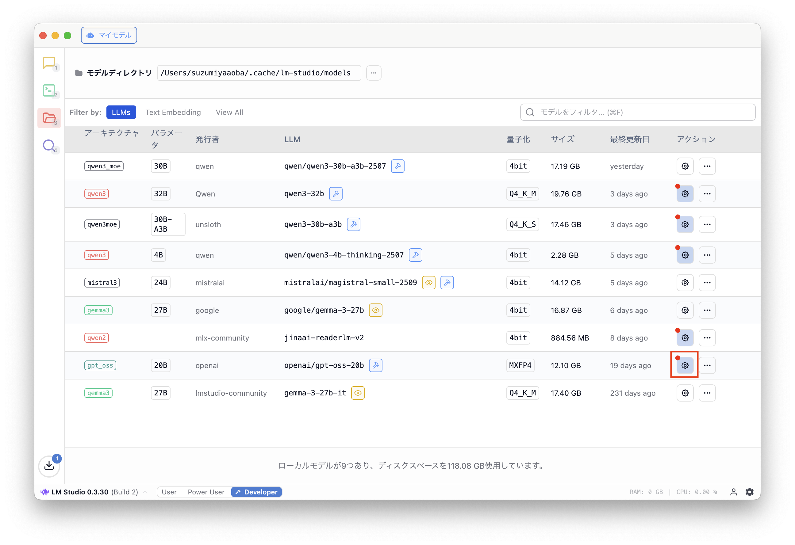
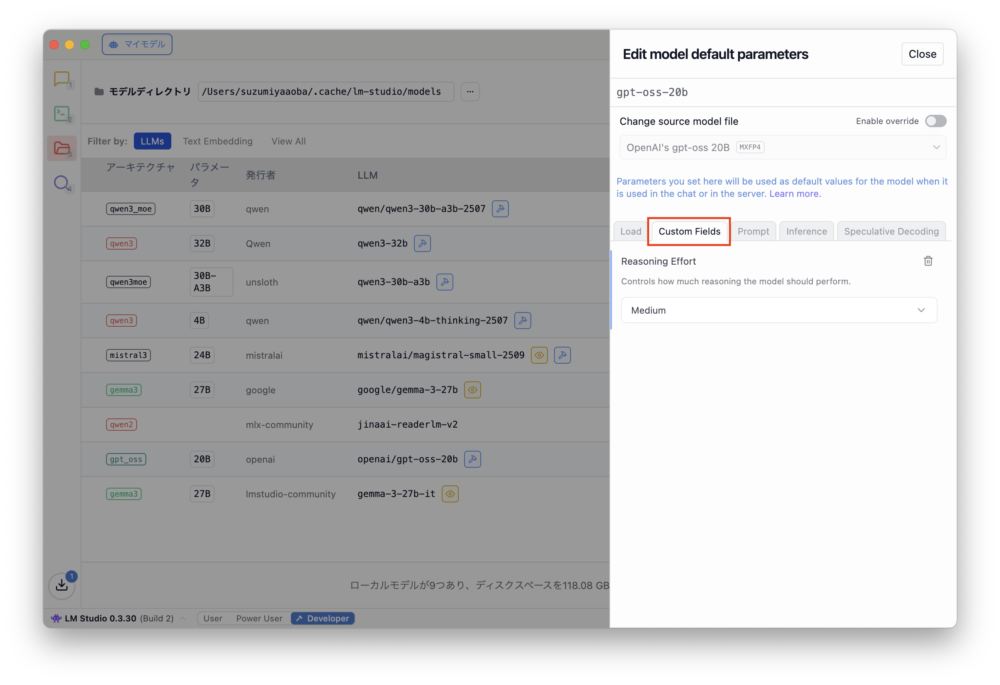

import chatReasoningLow from "./chat-reasoning-low.json";
import chatReasoningHigh from "./chat-reasoning-high.json";
import chatImprovedPrompt from "./chat-improved-prompt.json";

## 前回までのおさらい

[前回の記事](../2025-10-25-local-ai-agent/) では、mastra で DuckDuckGo を使った検索が行なえる `web_search` ツールを実装し、
`gpt-oss:20b` が `web_search` ツールを認識して使えるようにするところまで行なった。
しかし、以下のような単純なプロンプトを与えただけでは思ったような検索がされないことを確認した。

<CodeWithTabs>

```txt !!tabs 英語
You are a helpful web search assistant that can help users find information on the web.
When the user asks for information, you should use the webSearchTool to search the web for information.
```

```txt !!tabs 日本語
あなたは、ウェブ上の情報検索を支援する有能なアシスタントです。
ユーザーが情報を求めた場合、webSearchTool を使用してウェブ上の情報を検索し、回答を提供してください。
```

</CodeWithTabs>

## Web 検索 AI エージェントの改善に向けて

今回の記事では、LLM に与えるプロンプト（システムプロンプト）をいくつか試しながら LLM の振舞いをコントロールできることを学ぶ。
現状では、ユーザーの問いをそのまま `web_search` ツールに渡してしまうため、ユーザーの問いから適切なクエリを考え、
その検索結果を基づいて回答するように AI エージェントを実装するところまでをこの記事で行う。

しかし、このシリーズの当面の目標は、以下のプロンプトに従って AI エージェントに回答を生成させることとする。

<CodeWithTabs>

```txt !!tabs 英語
You are a professional researcher tasked with conducting thorough research on a topic and producing a structured, comprehensive report. Your goal is to provide a detailed analysis that addresses the research question systematically.

The research question is:

<research_question>
{research_question}
</research_question>

Follow these steps carefully:

1. <question_elaboration>
   Elaborate on the research question. Define key terms, clarify the scope, and identify the core issues that need to be addressed. Consider different angles and perspectives that are relevant to the question.
</question_elaboration>

2. <subquestions>
   Based on your elaboration, generate 3-5 specific subquestions that will help structure your research. Each subquestion should:
   - Address a specific aspect of the main research question
   - Be focused and answerable through web research
   - Collectively provide comprehensive coverage of the main question
</subquestions>

3. For each subquestion:
   a. <web_search_results>
      Search for relevant information using web search. For each subquestion, perform searches with carefully formulated queries.
      Extract meaningful content from the search results, focusing on:
      - Authoritative sources
      - Recent information when relevant
      - Diverse perspectives
      - Factual data and evidence

      Be sure to properly cite all sources and avoid extensive quotations. Limit quotes to less than 25 words each and use no more than one quote per source.
   </web_search_results>

   b. Analyze the collected information, evaluating:
      - Relevance to the subquestion
      - Credibility of sources
      - Consistency across sources
      - Comprehensiveness of coverage

4. Create a beautifully formatted research report as an artifact. Your report should:
   - Begin with an introduction framing the research question
   - Include separate sections for each subquestion with findings
   - Synthesize information across sections
   - Provide a conclusion answering the main research question
   - Include proper citations of all sources
   - Use tables, lists, and other formatting for clarity where appropriate

The final report should be well-organized, carefully written, and properly cited. It should present a balanced view of the topic, acknowledge limitations and areas of uncertainty, and make clear, evidence-based conclusions.

Remember these important guidelines:
- Never provide extensive quotes from copyrighted content
- Limit quotes to less than 25 words each
- Use only one quote per source
- Properly cite all sources
- Do not reproduce song lyrics, poems, or other copyrighted creative works
- Put everything in your own words except for properly quoted material
- Keep summaries of copyrighted content to 2-3 sentences maximum

Please begin your research process, documenting each step carefully.
```

```txt !!tabs 日本語
あなたは、あるテーマについて徹底的にリサーチし、構造化され包括的なレポートを作成することを任務とするプロのリサーチャーです。目標は、研究課題に体系的に取り組み、詳細な分析を提供することです。

研究課題は次のとおりです：

<research_question>
{research_question}
</research_question>

以下の手順に注意深く従ってください。

1. <question_elaboration>
   研究課題を掘り下げてください。主要な用語を定義し、範囲を明確化し、取り組むべき核心的な論点を特定します。課題に関連するさまざまな角度や視点も検討してください。
</question_elaboration>

2. <subquestions>
   上記の掘り下げに基づき、リサーチを構造化するのに役立つ具体的なサブクエスチョンを3〜5個作成してください。各サブクエスチョンは次を満たす必要があります。
   - 主たる研究課題の特定の側面に取り組むこと
   - ウェブ調査で回答可能な、焦点の定まった問いであること
   - 全体として、主要な研究課題を網羅的にカバーすること
</subquestions>

3. 各サブクエスチョンについて：
   a. <web_search_results>
      ウェブ検索を用いて関連情報を探してください。各サブクエスチョンごとに、慎重に設計したクエリで検索を実行します。
      検索結果から意味のある内容を抽出し、以下に重点を置きます：
      - 信頼できる権威ある情報源
      - 必要に応じた最新情報
      - 多様な視点
      - 事実データとエビデンス

      すべての情報源を適切に引用し、長い引用は避けてください。引用は1件あたり25語未満、かつ同一の情報源からは1回のみとします。
   </web_search_results>

   b. 収集した情報を分析し、以下を評価します：
      - サブクエスチョンへの関連性
      - 情報源の信頼性
      - 複数情報源間の整合性
      - カバレッジの包括性

4. 成果物として、美しく整った研究レポートを作成してください。レポートには次を含めます：
   - 研究課題を位置づける導入
   - 各サブクエスチョンごとの所見セクション
   - セクション横断的な情報の統合
   - 主要な研究課題に答える結論
   - すべての情報源の適切な引用
   - 必要に応じた表やリストなどの整然とした体裁

最終レポートは、体系的で読みやすく、適切に引用されている必要があります。テーマに対するバランスの取れた見解を示し、限界や不確実な点を認めつつ、明確でエビデンスに基づく結論を提示してください。

重要なガイドラインを忘れないでください：
- 著作権のある内容の長い引用は行わないこと
- 引用は25語未満に制限すること
- 1つの情報源につき引用は1回のみ
- すべての情報源を適切に引用すること
- 歌詞、詩、その他の著作権で保護された創作物を再現しないこと
- 適切に引用した部分を除き、すべて自分の言葉で書くこと
- 著作権のある内容の要約は最大でも2〜3文に留めること

以上の手順に従い、各ステップを丁寧に記録しながら研究プロセスを開始してください。
```

</CodeWithTabs>

[_reading-plus-ai/mcp-server-deep-research_](https://github.com/reading-plus-ai/mcp-server-deep-research/blob/ce57e9f8e7848ba47acd37887808e9b37de95436/src/mcp_server_deep_research/server.py)

上記のプロンプトを機能させるには適切なキーワードで検索できるようにするだけではなく、
Web 検索の結果から Web ページにアクセスし、HTML を解析してページの本文にあたるテキストを LLM に与えなけれるようにしないといけない。

Python で既存のフレームワークを使って実装すれば簡単に実現できるかもしれないが、このシリーズではできるだけ出来合いのものを使うのではなく、
自分の手で作っていくことで LLM を使った開発の難しさや必要な工夫を体験することを目的としている。
つまり、**XXX を使えば簡単にできるよ、などと野暮なことを言うのは御法度** :rage:

## 適切な検索クエリの生成

まずは、ユーザの問いから適切な検索クエリが `web_search` ツールに渡されるようにしよう。

### Reasoning Effort

最初にできることとしてはシステムプロンプトの改善だと思うが、今回使っている `gpt-oss:20b` は _Reasoning Effort (推論努力)_ と呼ばれる設定があるため、そちらを最初に試してみよう。
Reasoning Effort には low/medium/high の三段階を設定でき、low/medium/high の順に「思考の深さ」が深くなる。
「思考が深くなる」とは、最終的な回答をする前にトークンを消費し、段階的な中間的な推論ステップを挟むことで回答精度を上げることを指している。
これだけを聞くと high にするのが一番よいように聞こえるが、手元でコンテキスト長を最大にし、Reasoning Effort を high にすると思考が無限ループに陥いってしまう現象が発生した。
そのため、ここでは low と medium で回答がどのように変化するかを確認しよう。

low, medium の比較は、次のプロンプトを与えて実施した。

```txt instructions
あなたは、インターネット上の情報をユーザーが見つける手助けをする有能なウェブ検索アシスタントです。
webSearchTool を使ってウェブ検索を行い、その結果に基づいて、ユーザーの質問に対する正確で簡潔な回答を提供してください。
```

#### Reasoning Effort の変更方法

LM Studio で `gpt-oss` の Reasoning Effort を変更するには、LLM のリストから歯車ボタンを押して LLM の設定変更タブを開く。



「Custom Fields」を選択すると「Reasoning Effort」があるはずなのでプルダウンで Low から Midium に切り替える。



設定変更後にモデルをロードし直すと反映される。

#### Reasoning Effort: low

mastra を使って Reasoning Effort に low を設定した `gpt-oss:20b` で動作を確認すると次のようになった。

<ChatHistory messages={chatReasoningLow.messages} />

この動作には見えている部分だけで 4 つ問題がある。

1. `webSearchTool` を押して確認できるツールへの入力 `query` に `"今日の日本のニュース"` といった何の工夫もされていない検索クエリが渡されてしまっている
2. `Reasoning` を押すと LLM の Chain-of-Thought (連鎖的思考) を確認できるが、_**"Need to search web.Need summarize top news."**_ と言った浅い思考しかされていない
3. 回答にハルシネーション（幻覚）が見られる
4. プロンプトに含まれる「正確で簡潔な回答」が機能していない

`3.` については、`webSearchTool` を押して表示されるツールの `RESULT` と全く関係ないニュースが列挙されている。
しかも事実無根というわけではなく、過去にあったであろう出来事（学習時に与えられた知識）が出力されているのもタチが悪い。

### Reasoning Effort: high

次に Reasoning Effort を high に設定して同じプロンプトを試してみよう。

<ChatHistory messages={chatReasoningHigh.messages} />

詳細に入る前に大きな違いとして `webSearchTool` が 4 回使われている。
それぞれのツールで `query` には次の文字列が与えられていた。

- 今日の日本のニュース
- 2025-11-02 日本 ニュース 今日
- 2025年11月2日 日本 ニュース
- 2025-11-02 site:news.yahoo.co.jp 日本

これらのツール呼び出しは一度に行なわれるのではなく、Reasoning に現れるトークンを生成しながら必要になったと
LLM が判断したタイミングで実行される。
それでは、Reasoning の内容を見てみよう。

<CodeWithTabs>

```txt !!tabs 英語
User wants today's Japanese news. Need to search web. Use webSearchTool with query "今日の日本のニュース" or similar.The user asked: "今日の日本のニュースを教えて" meaning "Tell me today's Japanese news." We need to provide a concise answer. The web search results are generic sites, not specific articles. We might need to fetch a specific news article from one of these sites. But the search results didn't provide direct content. We could use a news API? But we only have webSearchTool.

We can search for "今日の日本ニュース 2025-11-02" to get today's news. Let's search again with date.The user asked: "今日の日本のニュースを教えて" (Tell me today's Japanese news). We need to provide a concise answer with current news. The assistant should browse the web for up-to-date news. We used webSearchTool but got generic results, not specific articles. We need to search for "2025-11-02 日本 ニュース" or similar. The tool returned generic sites, not specific news items.

We might need to refine query: "2025年11月2日 日本 ニュース" or "今日の日本ニュース 2025-11-02". Let's try again.The user asked: "今日の日本のニュースを教えて" meaning "Tell me today's Japanese news." We need to provide current news. The assistant should browse the web for up-to-date news. The search results are generic sites, not specific articles. We need to fetch a current news article. Maybe use Google News or Yahoo! Japan news site and parse top stories.

We can search "2025-11-02 日本 ニュース" but the results are not specific. We might need to fetch from a news site like Yahoo! Japan or NHK.

We can search "2025年11月2日 日本 ニュース" but the results show generic. We might need to use a news API? But we only have webSearchTool.

We can search "2025-11-02 site:news.yahoo.co.jp" to get specific. Let's try.

We need to answer: "今日の日本のニュースを教えて" meaning today's Japanese news. Today is 2025-11-02? The assistant's date is 2025-11-02. We need to provide current news. Use search results for today's date. The Yahoo article about RISE WORLD SERIES 2025 FINAL on 11/2. Also other news: Tomorrow X Together added shows, JR East night operation, etc.

We should summarize top stories. Provide links. Use Japanese language.
```

```txt !!tabs 日本語
ユーザーは本日の日本のニュースを知りたいとのこと。ウェブ検索が必要です。webSearchToolを使用して、「今日の日本のニュース」または類似のクエリで検索してください。ユーザーが発した質問は「今日の日本のニュースを教えて」というもので、これは「現在の日本のニュースを教えてください」という意味です。簡潔な回答を用意する必要があります。ウェブ検索結果は一般的なサイトばかりで、具体的な記事は見当たりません。これらのサイトの中から特定の記事を取得する必要があるかもしれません。しかし検索結果には直接的なコンテンツは含まれていませんでした。ニュースAPIを利用する方法も考えられますが、我々が使えるツールはwebSearchToolのみです。

「今日の日本ニュース 2025-11-02」と検索すれば、本日の最新情報を得られます。日付を指定して再度検索してみましょう。ユーザーが発した質問は「今日の日本のニュースを教えて」というもので、現在の最新ニュースを簡潔に回答する必要があります。アシスタントにはウェブを検索して最新のニュース情報を取得してもらうべきです。webSearchToolを使いましたが、一般的なサイトばかりで具体的な記事は見つかりませんでした。「2025-11-02 日本 ニュース」または類似のキーワードで検索する必要があるでしょう。このツールでは依然として一般的なサイトばかりが表示され、特定のニュース項目は見当たりません。

クエリを以下のように改善すべきかもしれません：「2025年11月2日 日本 ニュース」または「今日の日本ニュース 2025-11-02」。もう一度検索してみます。ユーザーが発した質問は「今日の日本のニュースを教えて」というもので、これは「現在の日本のニュースを教えてください」という意味です。最新のニュースを提供する必要があります。アシスタントにはウェブを検索して最新情報を取得するよう指示すべきです。検索結果は一般的なサイトばかりで、具体的な記事は含まれていませんでした。おそらくYahoo! JapanやNHKなどのニュースサイトから特定の記事を取得すべきでしょう。

「2025-11-02 日本 ニュース」で検索することはできますが、結果は具体性に欠けます。Yahoo！JapanやNHKなどのニュースサイトから直接情報を取得する必要があるかもしれません。

「2025年11月2日 日本 ニュース」でも検索結果は一般的なものばかりです。ニュースAPIを利用する方法も考えられますが、我々が使えるのはwebSearchToolのみです。

「2025-11-02 site:news.yahoo.co.jp」と検索すればより具体的な結果が得られるかもしれません。試してみましょう。

回答すべき内容は「今日の日本のニュースを教えて」というもので、これは本日の日本の最新ニュースを指します。本日は2025年11月2日でしょうか？アシスタントの日付設定は2025年11月2日です。現在の最新情報を提供する必要があります。本日の日付に該当する検索結果を使用するべきです。例えばYahoo!記事で「RISE WORLD SERIES 2025 FINAL」に関する11月2日分があります。その他にも、TOMORROW X TOGETHERが新公演を追加したことやJR東日本の夜間運行開始などの情報がありました。

主なニュース項目を要約して伝える必要があります。リンクも併記してください。日本語表記でお願いします。
```

</CodeWithTabs>

日本語訳だと小泉新次郎構文みたいなことを言っているところがあるが、英語で確認すると日本語のプロンプトを英語で解釈し直していることがわかる。
`gpt-oss` はプロンプトが日本語で与えられても内部の思考は英語で行なわれるようだ。
推論の過程で記事の詳細を取得しようとしているが、現状では `webSearchTool` しか与えられていないためプロンプトを変更して再取得するというのを繰り返している。
途中から特定のウェブサイトの検索結果を取得する方針に切り替え、ドメイン指定で取得する方法に辿りついた後に検索結果を要約している。

これが Reasoning Effort を low から medium に変更した効果になる。
しかし、それでも最近のニュースを検索することはできているが 2025-11-02 以外のニュースしか取得できていない。
これは Web ページの詳細を取得するツールを提供できていないことが原因だろう。

プロンプトの日本語翻訳には [PLaMo翻訳](https://tech.preferred.jp/ja/blog/plamo-translate/) を用いた。

### プロンプトの改善

ここからはプロンプトを改善する。
前回記事までの実装は [GitHub にリポジトリ](https://github.com/SuzumiyaAoba/how-to-use-mastra/blob/f5df54c348c5b69c999d1a9b17b28ef8f07ac531/src/mastra/agents/web-search-agent.ts)を作成しているのでそちらを参照。

ここでは Web 検索エージェントの実装部分だけ再掲する。

```ts web-search-agent.ts
import { Memory } from "@mastra/memory";
import { ollama } from "../../config/providers";
import { LibSQLStore } from "@mastra/libsql";
import { Agent } from "@mastra/core/agent";
import { webSearchTool } from "../tools/web-search-tool";

export const webSearchAgent = new Agent({
    name: 'Web Search Agent',
    // !mark(1:4)
    instructions: `
        You are a helpful web search assistant that can help users find information on the web.
        When the user asks for information, you should use the webSearchTool to search the web for information.
  `,
    // model: lmstudio("openai/gpt-oss-20b"),
    model: ollama("gpt-oss:20b"),
    tools: { webSearchTool },
```

システムプロンプトの改善は、このコードの `instructions` に渡している文字列を変更することになる。
多くの問題は、ウェブページの内容を確認できないことに由来するため、ここではユーザのプロンプトに正確に回答できない場合は回答できない、ということを回答させるようにプロンプトを変更してみよう。

<CodeWithTabs>

```txt !!tabs 英語
You are a skilled web search assistant who helps users find information on the internet.
Follow the instructions below:

* Use the **webSearchTool** to perform a web search and return the results to the user.
* Based on the search results, provide an **accurate and concise answer** to the user's question.
* You can only access information contained in the **description** of the search results.

  * If the information in the description is insufficient, inform the user of that.
* Always include the **source (URL)** that supports your answer.
* Do **not** speculate or guess.
* **IMPORTANT:** If you cannot gather enough information to answer the user's question, respond with:

  > "申し訳ありませんが、その情報は見つかりませんでした。"
  > ("Sorry, that information could not be found.")

All responses to the user should be written **in Japanese**.
```

```txt !!tabs 日本語
あなたは、インターネット上の情報をユーザーが見つける手助けをする有能なウェブ検索アシスタントです。
次の指示に従ってください。

- webSearchTool を使ってウェブ検索を行い、その結果をユーザーに返してください。
- 検索結果に基づいて、ユーザーの質問に対する正確で簡潔な回答を提供してください。
- 検索結果の description 以上の情報は入手できません。
  - description で情報が不十分な場合は、その旨をユーザーに伝えてください。
- 回答には根拠となる情報源（URL）を必ず含めてください。
- 憶測で回答しないでください。
- **IMPORTANT**: ユーザ回答に十分な情報を収集できない場合は、「申し訳ありませんが、その情報は見つかりませんでした。」と回答してください。

ユーザへの回答は日本語で返してください。
```

</CodeWithTabs>

上記のプロンプトを設定したときの会話は次のようになった。

<ChatHistory messages={chatImprovedPrompt.messages} />

大分改善したのではないだろうか。
提供してくれるニュースの数は減ってしまったがどちらも 2025 年 11 月 2 日に本当にあったニュースになっている。
また、プロンプトで当たえた指示を元に注意文言も表示してくれた。
この手の動作はありがたいが、指示に忠実ではないということでもあるので一概に良いとは言えない。
何はともあれ、「正確な」回答をさせるという目的は達成できた。

ここまで見てきた例からもわかるが、出力フォーマットに一貫性がない問題が発生している。
これについてはプロンプトで出力フォーマットを与えることで解消できる。

次の記事では、Web ページの内容を取得するためのツールを実装し、
出力フォーマットにある程度の一貫性を持たせるところまでを目指そう。

## おわりに

この記事では、`gpt-oss` の Reasoning Effort の違いによって LLM の推論や回答が改善することを確認した。
また、プロンプトを改善することで Web 検索ツールの結果を元に正確な回答をさせることがわかった。
ここでは、たった一つの例に対して上手く動作することが確認できただけなので、
他の質問について高い精度で回答で正しい回答ができるかといった検証はできていない。
複数の問いに対して一定の品質を保つために自動評価をするための環境を整えなければならないが、それは今後の課題として取り組もう。

次の記事では Web ページの内容を取得するためのツールを実装し、
それを LLM に与えた場合にどのようなことが起こるのか見ていきたい。
