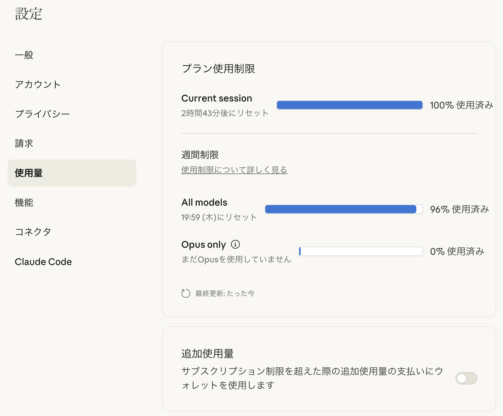

## Trigger

From October 2025, weekly limits were added to Claude Pro/Max plans.
Before that, there was already a usage limit that reset five hours after the first request of the day (minutes rounded down),
and now a weekly limit was added.
I mentioned this in my [Claude Sonnet 4.5 release article](../2025-10-01-claude/),
and you can check usage in [settings](https://claude.ai/settings/usage) or via the `/usage` command in Claude Code.



The weekly limit is quite strict.
I am on the Pro plan, so in theory I could upgrade to Max, but as of 2025/11/02 the price gap between Pro and Max is $83 (12,777 JPY),
so I'm not eager to switch.
Only freelance engineers who can fully utilize the quota might make good use of Max.
If you work during the day and can only run a couple 5-hour sessions after work, and mostly use it on weekends,
Max is likely to be underutilized.

In my case, the weekly cycle resets on Thursday, but I hit the weekly limit by Monday or Tuesday.
I would love a plan around $40 between Pro and Max...

I used to subscribe to Cursor, but its Pro plan gives about $20 worth of high-end model usage each month,
which gets used up quickly with models like Claude Sonnet 4.5, GPT-5 Codex, or Gemini 2.5 Pro.
Then for half the month it becomes just an editor with decent models and smart completion, so I canceled.
Recently Cursor upgraded to 2.0 and announced a [UI refresh and a new model called Composer](https://cursor.com/ja/blog/2-0),
so I'm thinking about subscribing again.

## ChatGPT

Because the Claude Pro plan started to block my development more often,
I subscribed to ChatGPT Pro to use GPT-5 Codex, which has a reputation for being better than Claude.
Claude has [Claude Code](https://github.com/anthropics/claude-code),
and ChatGPT has [codex](https://github.com/openai/codex) as the coding agent.

This was my first time using codex, and I was surprised that settings aren't very granular compared to Claude Code.
You cannot place a config per project; only `~/.codex/config.toml` is always active.
Profiles can simulate per-project settings, but you cannot share them via git,
and if you write project-specific settings in `~/.codex/config.toml`,
sharing that file would leak private project settings.
So in practice it is only useful as a personal profile.

Also, `sandbox_mode` and `approval_policy` are only coarse controls,
and unlike Claude Code you cannot whitelist/blacklist by command pattern.
I let Claude Code handle everything from `git commit` to PR creation, so frequent confirmations are annoying.

In the end, I use the following settings despite the risk of `rm -rf ~/`:

```toml ~/.codex/config.toml
network_access = true
sandbox_mode = "danger-full-access"
approval_policy = "never"
```

Many people feel the same, and there are multiple issues around codex for this.

Also, codex often hangs with servers left running.
It waits forever for commands that never finish, and then you realize no tasks have progressed.
This happens frequently.

So I got tired of codex and tried [OpenCode](https://opencode.ai/) with the ChatGPT Pro plan. Here are the settings.

## OpenCode

OpenCode is an open-source coding agent that works across providers, models, and editors,
unlike provider-specific terminal agents like Claude Code, Codex, or Gemini CLI.

See the [official docs](https://opencode.ai/) for details, but one feature is that LSP integration is built-in,
so LLMs can use LSP features without installing an MCP server like [serena](https://github.com/oraios/serena).

### Configuration

To use OpenCode with ChatGPT Plus, you must edit a config file.
The method is linked from Reddit:

- [Use ChatGPT subscription with OpenCode? : r/ChatGPTCoding](https://www.reddit.com/r/ChatGPTCoding/comments/1mlls20/use_chatgpt_subscription_with_opencode/)

It introduces [numman-ali/opencode-openai-codex-auth](https://github.com/numman-ali/opencode-openai-codex-auth),
and you save the following JSON from its README into `~/.config/opencode/opencode.json`.

```json ~/.config/opencode/opencode.json
{
  "$schema": "https://opencode.ai/config.json",
  "plugin": ["opencode-openai-codex-auth"],
  "provider": {
    "openai": {
      "options": {
        "reasoningEffort": "medium",
        "reasoningSummary": "auto",
        "textVerbosity": "medium",
        "include": ["reasoning.encrypted_content"],
        "store": false
      },
      "models": {
        "gpt-5-codex-low": {
          "name": "GPT 5 Codex Low (OAuth)",
          "options": {
            "reasoningEffort": "low",
            "reasoningSummary": "auto",
            "textVerbosity": "medium",
            "include": ["reasoning.encrypted_content"],
            "store": false
          }
        },
        "gpt-5-codex-medium": {
          "name": "GPT 5 Codex Medium (OAuth)",
          "options": {
            "reasoningEffort": "medium",
            "reasoningSummary": "auto",
            "textVerbosity": "medium",
            "include": ["reasoning.encrypted_content"],
            "store": false
          }
        },
        "gpt-5-codex-high": {
          "name": "GPT 5 Codex High (OAuth)",
          "options": {
            "reasoningEffort": "high",
            "reasoningSummary": "detailed",
            "textVerbosity": "medium",
            "include": ["reasoning.encrypted_content"],
            "store": false
          }
        },
        "gpt-5-minimal": {
          "name": "GPT 5 Minimal (OAuth)",
          "options": {
            "reasoningEffort": "minimal",
            "reasoningSummary": "auto",
            "textVerbosity": "low",
            "include": ["reasoning.encrypted_content"],
            "store": false
          }
        },
        "gpt-5-low": {
          "name": "GPT 5 Low (OAuth)",
          "options": {
            "reasoningEffort": "low",
            "reasoningSummary": "auto",
            "textVerbosity": "low",
            "include": ["reasoning.encrypted_content"],
            "store": false
          }
        },
        "gpt-5-medium": {
          "name": "GPT 5 Medium (OAuth)",
          "options": {
            "reasoningEffort": "medium",
            "reasoningSummary": "auto",
            "textVerbosity": "medium",
            "include": ["reasoning.encrypted_content"],
            "store": false
          }
        },
        "gpt-5-high": {
          "name": "GPT 5 High (OAuth)",
          "options": {
            "reasoningEffort": "high",
            "reasoningSummary": "detailed",
            "textVerbosity": "high",
            "include": ["reasoning.encrypted_content"],
            "store": false
          }
        },
        "gpt-5-mini": {
          "name": "GPT 5 Mini (OAuth)",
          "options": {
            "reasoningEffort": "low",
            "reasoningSummary": "auto",
            "textVerbosity": "low",
            "include": ["reasoning.encrypted_content"],
            "store": false
          }
        },
        "gpt-5-nano": {
          "name": "GPT 5 Nano (OAuth)",
          "options": {
            "reasoningEffort": "minimal",
            "reasoningSummary": "auto",
            "textVerbosity": "low",
            "include": ["reasoning.encrypted_content"],
            "store": false
          }
        }
      }
    }
  }
}
```

After that, run `opencode auth login` and select `OpenAI`.

```shell
$ opencode auth login

┌  Add credential
│
◆  Select provider

│  Search:
│  ○ OpenCode Zen
│  ○ Anthropic
│  ○ GitHub Copilot
│  ● OpenAI
│  ○ Google
│  ○ OpenRouter
│  ○ Vercel AI Gateway
│  ...
│  ↑/↓ to select • Enter: confirm • Type: to search
└
```

You will then see an option: `ChatGPT Plus/Pro (Codex Subscription)`.

```shell
$ opencode auth login

┌  Add credential
│
◇  Select provider
│  OpenAI
│
◆  Login method
│  ● ChatGPT Plus/Pro (Codex Subscription)
│  ○ Manually enter API Key
└
```

Select it and your browser will open for ChatGPT login.
If everything completes successfully, you can use GPT-5 Codex (included in ChatGPT Plus) with OpenCode.

### Issues

This would be great if it ended here, but using Codex via OpenCode consumes quota much faster than using codex directly.
A task that used only a few percent in codex consumed over 20% in OpenCode.
Codex quota is not a clear request-count unit like Claude Code, so I cannot identify the cause.
I couldn't find reports of the same issue, so it's possible the tasks I ran just happened to be expensive.

However, **because the output per quota is likely worse, I do not recommend using OpenCode with a ChatGPT Plus subscription**.

If you know the cause or a workaround, please comment.

## Conclusion

I subscribed to ChatGPT Plus and tried codex, but the development experience was not as good as people say,
so I tried GPT-5 Codex in OpenCode. But it consumed quota faster than codex.
In the end I returned to codex, but it's only day two of the subscription,
so I hope the issue is simply that I haven't yet learned how to instruct and assign tasks between Claude Code and codex.

Recently there were rumors that [GPT-5 Codex performance has degraded](https://x.com/thsottiaux/status/1984465716888944712),
so I can't rule out that I hit some irregular bug.

Even though ChatGPT and Codex have separate quotas, the ChatGPT Plus quota still feels small,
but I will keep using it for a month.
If my evaluation of Codex changes, I'll write another article.
I want to feel the Codex advantage everyone talks about.
