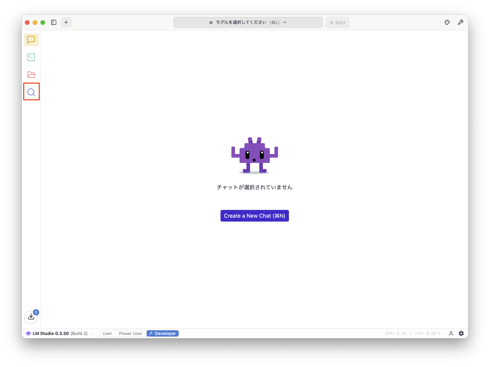
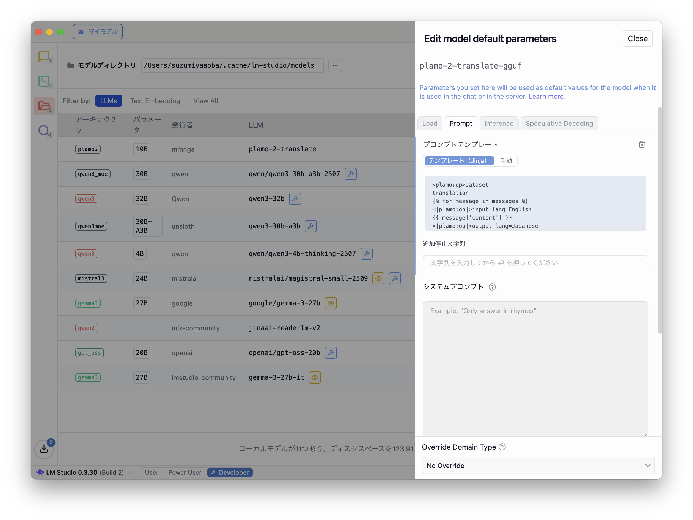
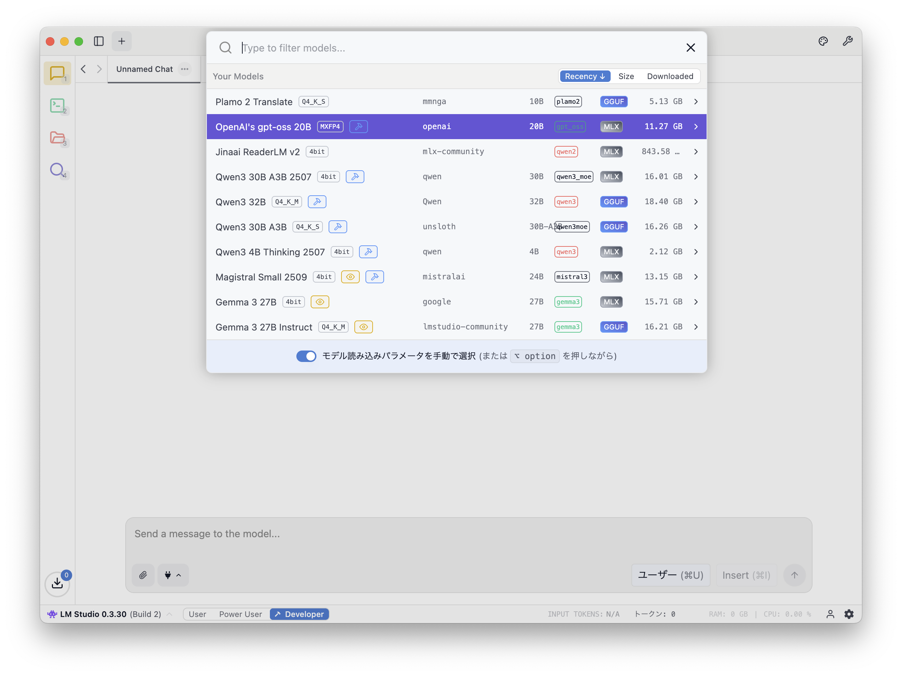
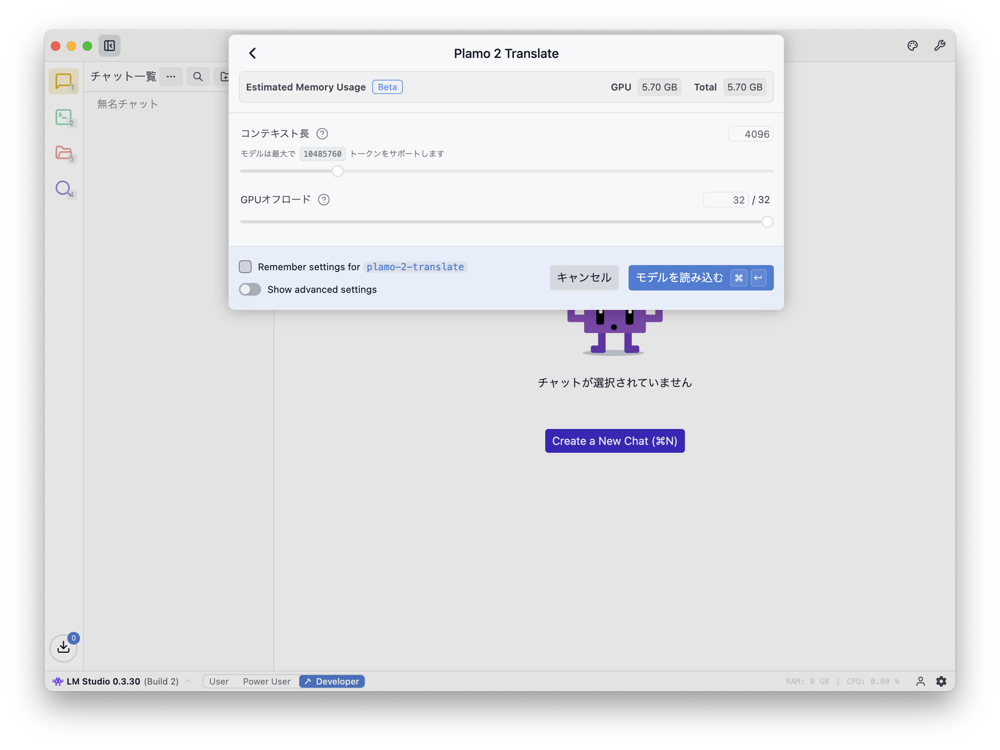
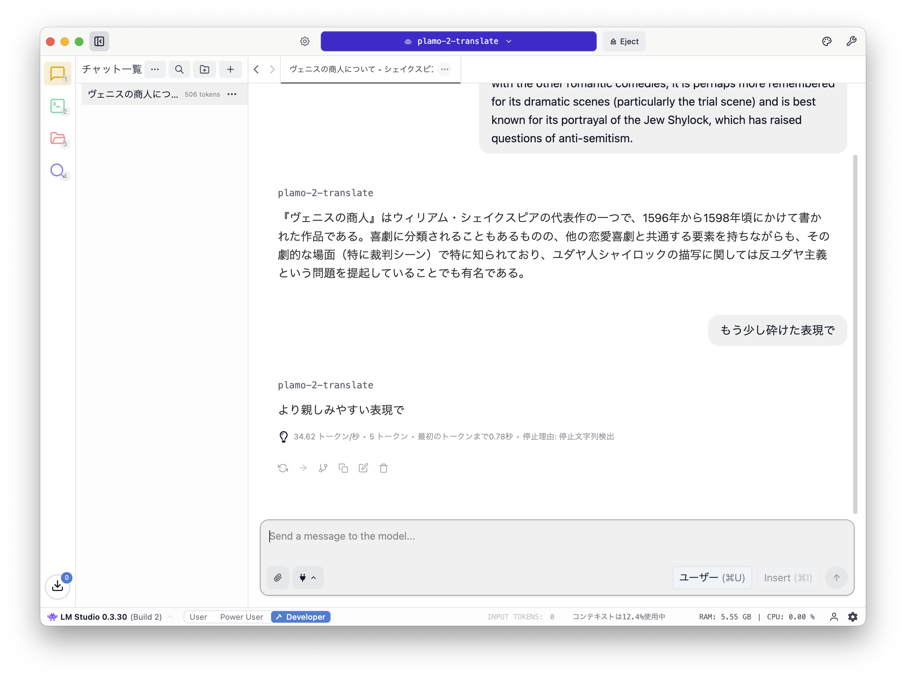

## PLaMo 翻訳

今年の 5/27 (2025/05/27) に Prefferd Networks (PFN) が [PLaMo 翻訳を公開](https://tech.preferred.jp/ja/blog/plamo-translate/) した。
PLaMo 翻訳の詳しい紹介については公式ブログを確認してもらうとして、PLaMo 翻訳を簡単に説明すると、
ChatGPT でおなじみの大規模言語モデル（LLM）ベースの翻訳をするモデルとなっている。

PLaMo 翻訳のモデルは [HuggingFace](https://huggingface.co/pfnet/plamo-2-translate) で公開されており、[デモページ](https://translate.preferredai.jp/)も提供されている。
HuggingFace でモデルが公開されているので私たちの持っているローカル PC でも動かせるということだ。
PFN から CLI でする [PLaMo 翻訳 CLI](https://tech.preferred.jp/ja/blog/plamo-translate-cli/)が周知されている

モデルを動かす方法はいくつかあるがここでは LM Studio で動かす方法を紹介する。

## LM Studio

[LM Studio](https://lmstudio.ai/) はローカル環境で LLM モデルを簡単に動かせる GUI アプリケーションだ。
導入方法は[ダウンロードページ](https://lmstudio.ai/download)からインストーラーをダウンロードし、
実行することでインストールできる。

### モデルのダウンロード

LM Studio を起動したらモデルをダウンロードする。
モデルのダウンロードは、起動した後のウィンドウの左側に並んだ虫めがねのアイコンをクリックすると検索画面に切り替えて行う。



PLaMo 翻訳のモデルは、検索フォームに「plamo translate」のようなキーワードを入れると、いくつかモデルがヒットするので mmnga という方が公開しているモデルを選択し、右下の「Download」をクリックする。画像では「Use in New Chat」となっているが、これはモデルを既にダウンロードしているため。


### モデル設定

モデルのダウンロードが完了したら、ウィンドウの左側にあるフォルダのアイコンをクリックし、ダウンロード済みのモデルが表示される画面を開く。
リストの中に `plamo-2-translate` という名前のモデルがあるはずなので、その行の「アクション」列にある歯車のアイコンをクリックする。


すると、右側にモデルのデフォルトパラメータを編集するための設定が表示される。
PLaMo 翻訳を LM Studio で使うには「**Prompt**」タブにある「**プロンプトテンプレート**」と「**停止文字列**」の設定を変更する。
この記事を書いている最中に気がついたが、「**停止文字列**」ではなく「**追加停止文字列**」の変更でも上手く動くかもしれない。



#### プロンプトテンプレート

デフォルトで「テンプレート（Jinia）」に設定されている文字列をすべて消し、次のテンプレートに変更する。

```txt
<|plamo:op|>dataset
translation

<|plamo:op|>input lang=English
{{ message['content'] }}
<|plamo:op|>output lang=Japanese

```

ここでは「英語から日本語への翻訳」をしたい場合の設定になっている。
逆に「日本語から英語へ翻訳」する場合は次のように設定する。

```txt
<|plamo:op|>dataset
translation

<|plamo:op|>input lang=Japanese
{{ message['content'] }}
<|plamo:op|>output lang=English

```

#### 停止文字列

次に「停止文字列」に次の文字列を設定する。

```txt
<|plamo:op|>
```


テキストエリアに入力してから Enter を押すと画面のようなタグ表示になる。

### 使ってみよう

設定が完了したらウィンドウの左側にある吹き出しのアイコンをクリックし、チャット UI で LLM を使うための画面を表示しよう。


次にモデルをロードするためにウィンドウ上部にある「モデルを選択してください」をクリックする。
そうするとダウンロード済みモデルの一覧が表示されるので「Plamo 2 Translate」を選択しよう。



次にいくつかの設定を求められるが、ここではデフォルトのまま「モデルを読み込む」をクリックする。



そうすると、ChatGPT のようなおなじみの UI が表示されるので、英語を入力してから Enter を押す。
すると、日本語訳を PLaMo 翻訳が返してくれる。
画像では、シェイクスピアの『ヴェニスの商人』の[説明文](https://etc.usf.edu/lit2go/41/the-merchant-of-venice/)を与えている。


Google 翻訳と比較すると意訳になっている部分が多いように感じるが、文脈を損なうような翻訳にはなっていないので
機械的に集めた英語の情報をまとめて高速に翻訳したいような場合には使えるかもしれない。
このブログの英語への機械翻訳として使ってみて精度が良ければ採用しようと思う。

### 注意点

注意点として、会話形式で動作するような学習はされていないため、翻訳に対する指示を行なっても意味がない。



設定によって「英語 → 日本語」「日本語 → 英語」のようにどの言語からどの言語に翻訳するかは変更できるが、
あくまでその設定に応じた言語が与えられた場合に正しく動作する。

### Eject

最後に LM Studio を完全に停止するか、モデルを Eject して使っていないときはメモリが確保されないように気をつけよう。


## ここまでを PLaMo 翻訳で英語に

この記事の前のセクションまでを PLaMo 翻訳に与えて英語にしてみた。
どのくらいの精度になるのか参考までに。

Markdown をそのまま読み込めない（Frontmatter が悪さしているか、本文に `<|plamo:op|>` が含まれているのが原因？）ようなので、実用を考えるとパースして日本語になっているところだけを渡すか、
文脈を維持するのであれば Plain Text に変換してから渡すような工夫が必要になりそうだ。
また、`<|plamo:op|>` が原因で動作しないのであれば PLaMo の解説をしている記事以外では問題にならないがエスケープ処理を組み込まないといけない。

````markdown
## PLaMo Translation

On May 27th of this year, Preferred Networks Inc. (PFN) [released PLaMo Translation](https://tech.preferred.jp/ja/blog/plamo-translate/).
For a detailed introduction to PLaMo Translation, please refer to the official blog, but to briefly summarize, this model is a translation system based on large-scale language models (LLMs), much like the well-known ChatGPT.

The PLaMo Translation model is available on [HuggingFace](https://huggingface.co/pfnet/plamo-2-translate) and comes with a [demo page](https://translate.preferredai.jp/).
Since the model is publicly available on HuggingFace, it means we can run it on our local PC as well.
PFN has also announced a [PLaMo Translation CLI tool](https://tech.preferred.jp/ja/blog/plamo-translate-cli/) for command-line use.

While there are multiple methods to run the model, here we'll demonstrate how to execute it using LM Studio.

## LM Studio

[LM Studio](https://lmstudio.ai/) is a graphical user interface (GUI) application that allows you to easily run LLM models in your local environment.
To install it, simply download the installer from the [downloads page](https://lmstudio.ai/download),
and execute it to complete the installation process.

### Downloading the Model

After launching LM Studio, proceed to download the model.
You can access the download screen by clicking on the magnifying glass icon on the left side of the window that appears after launch.


To download the PLaMo Translation model, enter a search term like "plamo translate" in the search field. This will display several matching models; select the one published by the user mmnga and click the "Download" button. In the screenshot above, the text "Use in New Chat" indicates that you have already downloaded this model.


### Model Configuration

After completing the model download, click the folder icon on the left side of the window to open the screen displaying your downloaded models.
You should find a model with the name `plamo-2-translate` in the list of available models; then click on the gear icon in the "Action" column of that row.


This will display configuration settings for editing the default parameters of the model.
To use PLaMo Translation with LM Studio, you need to modify the settings under both the **Prompt** tab's "**Promp Template**" and "**Stop String**" options.
While writing this article, I noticed that changing the "**Additional Stop String**" instead of "**Stop String**" might also work well.


#### Prompt Template

Delete all the default template text ("Template (Jinia)"), and replace it with the following template:

```txt
<|plamo:op|>dataset
translation

<|plamo:op|>input lang=English
{{ message['content'] }}
<|plamo:op|>output lang=Japanese

```

The current configuration is set up for "English to Japanese translation."
For "Japanese to English translation," you should configure it as follows:

```txt
<|plamo:op|>dataset
translation

<|plamo:op|>input lang=Japanese
{{ message['content'] }}
<|plamo:op|>output lang=English

```

#### Stop String

Next, configure the "Stop String" as follows:

```txt
<|plamo:op|>
```


After entering the text in the textarea and pressing Enter, you'll see tag indicators displayed on the screen as shown below.

### Let's Try It Out

After completing the settings, click the speech bubble icon on the left side of the window to display the chat UI interface for using LLM models.


Next, to load your model, click on "Select a Model" at the top of the window.
This will display the list of downloaded models; select "Plamo 2 Translate."


You'll then be prompted with some settings, but here we'll leave everything as default and click "Load Model."


This will display the familiar UI similar to ChatGPT, so simply enter some English text and press Enter.
PLaMo Translation will then provide you with the Japanese translation.
In these screenshots, I have provided a [description](https://etc.usf.edu/lit2go/41/the-merchant-of-venice/) of Shakespeare's "The Merchant of Venice."


Compared to Google Translate, I feel there are many parts that have been paraphrased rather than directly translated,
but the translation doesn't lose the original context, so it may prove useful when you need to quickly compile and translate large amounts of English information.
I'll try using it for machine translation of this blog, and if the results are satisfactory, I think I'll adopt it.

### Important Note

As a note, since the model hasn't been trained for conversational usage, providing translation instructions won't be effective.


While the settings allow you to choose whether to translate from English → Japanese or Japanese → English,
the system will only function correctly when provided with language combinations matching those specific settings.

### Eject

Finally, be sure to either fully stop LM Studio or eject the model to prevent memory allocation when the model is unused.


````

とりあえずブログを英語圏向けに公開するには十分ではないだろうか。
LM Studio の画像にも載っているが、私の環境では 30~40 token/s 出るので待たされる感覚はない。

## おわりに

LM Studio で PLaMo 翻訳を使う方法を紹介した。
結構な速度が出るので英語で書かれた文章の概要を理解するためにローカルでプログラム経由に使うには良さそうに感じた。
API として提供されている翻訳サービスではお金がかかってしまうので、その辺のコストをかけずにこの精度で英語から日本語、日本語から英語の翻訳を機械的に行えるのは嬉しい。

Zenn に PLaMo 翻訳を使って Markdown、epub の翻訳をするツールを公開している方がいたので自分も似たようなものを作成しようと思う。

- [LM Studioを使ってローカルで多言語翻訳するHTMLツールをつくった](https://zenn.dev/shivase/articles/017-lm-studio-local-translator)
