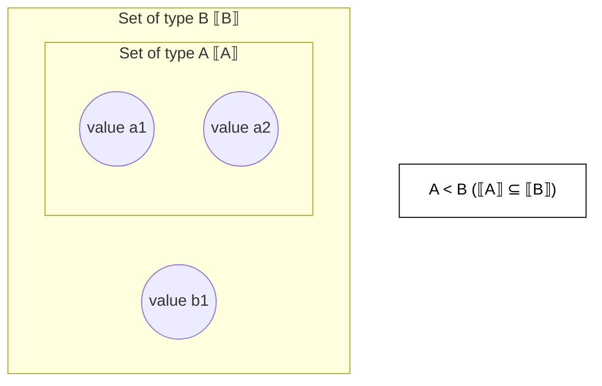
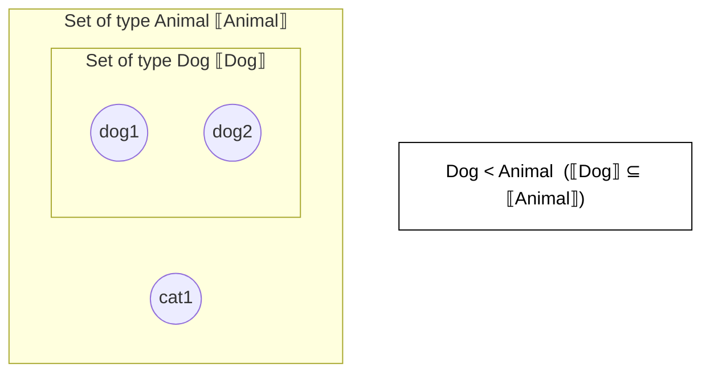

I saw a question on Twitter: "Why does Ruby use `<` for inheritance?" so I wrote down my understanding.
For people who haven't touched theory around programming languages, this is a natural question.
I hope it helps anyone with the same doubt.

<Message title="Note" variant="warning" defaultOpen>
  This article does **not** give a rigorous explanation of type theory. The goal is to connect
  intuition with minimal theory, so you can say, "Ah, so that's a possible interpretation."
</Message>

## TL;DR

- In programming languages, `A < B` (where `A`, `B` are types) corresponds to the **subset** relation when you view types as sets of values: $\llbracket A \rrbracket \subseteq \llbracket B \rrbracket$
- If you view inheritance (subclassing) as "defining `A` as a more concrete (more constrained) set within `B`," then `<` naturally looks like a symbol for "subset = smaller"
- In type theory, the subtype relation is often written as `<:` or `≤`, and Ruby's `<` can be explained consistently with that intuition (more concrete = smaller)
  (I do not claim Ruby was directly influenced by specific literature or languages.)

## Types as sets

By "type" here, think of classes (`Dog`, `Animal`), numbers, strings, etc. for intuition.
**Strictly speaking, types are not just classes, nor can they be fully identified with sets**,
but this metaphor is enough for the purpose of understanding `<`.

People's sense of "type" varies widely.
From simple types to generics/type variables, type systems, type-level computation, type classes, proof assistants, and HoTT[^HoTT]...
There are many paths. Here I adopt the accessible view: "types as sets."

For a more systematic study, [TAPL](https://amzn.to/49r8xF8) is a classic intro.
However, it requires some background (in a good way), so it is a "science-major-style intro"[^Intro] type of book.

[^HoTT]: I still do not understand HoTT.

[^Intro]: In hindsight: "It is an introduction, but it's heavy."

Anyway.

---

If you treat a type as a set of values, then `A < B` can be depicted like this:



`A` is contained in `B`.
In other words, values typed as `A` (`a1`, `a2`) can **also be treated as `B`**.
(With the common phrasing: "`A` is a subtype of `B`.")

Just `A` and `B` is boring, so let's use Ruby classes.

```ruby
class Animal
  def speak
    "..."
  end
end

class Dog < Animal
  def bark
    "Wan"
  end
end

dog = Dog.new
dog.is_a?(Animal) #=> true

Dog < Animal      #=> true  # Module#<: checks ancestor (subclass) relation

cat = Animal.new
cat.is_a?(Dog)    #=> false
```

Since `Dog` inherits from `Animal`, a `Dog` instance can also behave as an `Animal`
(at least as a type intuition).
So the set of values of `Dog` is contained in that of `Animal`, and `Dog` is a subtype of `Animal`.

Diagram:



With this metaphor, inheritance (subclassing) is "creating a subset relation."
And because a subset is "smaller than the whole," you can read `class A < B` as:

- `A` is **more concrete** (more constrained) than `B`
- The set of `A` is **smaller** than the set of `B` ($\subseteq$)

With that intuition, using `<` feels natural.

## A note on "where does `<` come from?"

The discussion so far explains why `<` fits the intuition, not where Ruby imported it from.

In type theory and type systems, subtype relations are often written as:

- `A <: B` ("A is a subtype of B")
- `A ≤ B` / `A ⊑ B`

The `<` side in `<:` aligns well with the intuition of "smaller (more concrete)," so `class Dog < Animal` can be understood in the same way.

---

If you treat `<` as `⊆` using the type-as-set analogy, the initial question ("Why `<`?") should be mostly resolved.

Note: In real OO design, "inheritance (subclassing) = always safe subtyping" is not guaranteed (Liskov substitution, etc.).
But this article is about the **symbolic intuition** of `<`, so I won't go deeper here.
