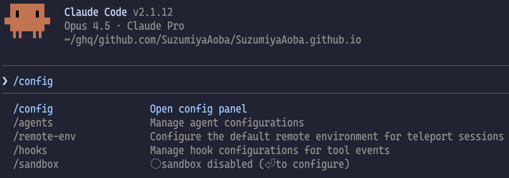
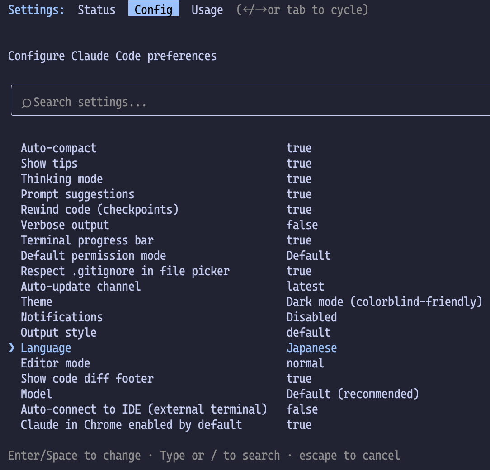

Claude Code について学んだ Tips をまとめる。随時更新する。

<Message title="注意" variant="warning" defaultOpen>
  Claude Code のレート制限に到達し、検証できていない機能も載せています。 未検証の機能には{" "}
  <MdxLabel variant="warning">未検証</MdxLabel> を表示しています。
</Message>

## 言語設定

Claude Code の言語設定を日本語にするには `/config` コマンドを実行し、`Language` で `Japanese` や `日本語` と設定する。
`Language` には、言語の他に口調を指定してもよい。

この設定で日本語になるのは、Claude が扱う言語であって設定メニュー等は英語のまま。

> Added `language` setting to configure Claude's response language (e.g., language: "japanese")

この機能は [2.1.0](https://github.com/anthropics/claude-code/blob/main/CHANGELOG.md#210) からサポートされている。

<details>
<summary>設定手順</summary>

### Claude Code 上で設定

Claude Code を起動し、`/config` と入力し、<kbd>Enter</kbd>を押す。



設定画面が表示されるので十字キーの <kbd>↓</kbd> で `Language` までカーソルを移動し、<kbd>Enter</kbd> を押す。



言語を入力するフォームが現れるので、`Japanese` や `日本語` と入力し、<kbd>Enter</kbd> を押す。


これで Claude Code のデフォルト言語が日本語になる。
設定画面は <kbd>Esc</kbd> を押して終了。

### ~/.claude/settings.json

もしくは、ホームディレクトリにある設定ファイル `~/.claude/settings.json` に次のような設定を加えます。

```json ~/.claude/settings.json
{
  "language": "日本語"
}
```

これは Claude Code 上で `/config` コマンドから設定するのと結果は変わりません。

</details>

### 起動時に表示されるアカウント情報を隠す

Claude Code を起動するとメールアドレスやセッションの履歴などの情報が表示される。
これらの情報が表示されると困る場合は、環境変数 `CLAUDE_CODE_HIDE_ACCOUNT_INFO` に `1` を設定すると表示を抑制できる。

```json ~/.claude/settings.json
{
  "env": {
    "CLAUDE_CODE_HIDE_ACCOUNT_INFO": "1"
  }
}
```

特定のリポジトリでのみ抑制すればよい場合は、`.claude/settings.json` に上記の設定をすればよい。

### タスク完了時に通知音を鳴らす

タスクが完了したことを検知するため、Hooks で通知音を鳴らす設定を入れる。
`~/.claude/settings.json` に次のような設定を追加する。
この設定は macOS の場合。

```json ~/.claude/settings.json
{
  "hooks": {
    "PermissionRequest": [
      {
        "matcher": "*",
        "hooks": [
          {
            "type": "command",
            "command": "afplay /System/Library/Sounds/Tink.aiff"
          }
        ]
      }
    ],
    "Stop": [
      {
        "hooks": [
          {
            "type": "command",
            "command": "afplay /System/Library/Sounds/Tink.aiff"
          }
        ]
      }
    ]
  }
}
```

macOS であれば、`/System/Library/Sounds/` にあるファイルから好きな音を選んで上記の設定にある `afplay` 以降のパスを変更すればよい。
Codex と Claude Code の両方を使っているようであれば、それぞれ違う音を設定するのがいいだろう。

```shell
$ ls -la /System/Library/Sounds/
.rw-r--r--@ 221k root 22 11月  2025 ♫ Basso.aiff
.rw-r--r--  404k root 22 11月  2025 ♫ Blow.aiff
.rw-r--r--  223k root 22 11月  2025 ♫ Bottle.aiff
.rw-r--r--@ 207k root 22 11月  2025 ♫ Frog.aiff
.rw-r--r--@ 623k root 22 11月  2025 ♫ Funk.aiff
.rw-r--r--@ 475k root 22 11月  2025 ♫ Glass.aiff
.rw-r--r--  304k root 22 11月  2025 ♫ Hero.aiff
.rw-r--r--@ 203k root 22 11月  2025 ♫ Morse.aiff
.rw-r--r--@ 432k root 22 11月  2025 ♫ Ping.aiff
.rw-r--r--@ 469k root 22 11月  2025 ♫ Pop.aiff
.rw-r--r--@ 218k root 22 11月  2025 ♫ Purr.aiff
.rw-r--r--@ 443k root 22 11月  2025 ♫ Sosumi.aiff
.rw-r--r--@ 430k root 22 11月  2025 ♫ Submarine.aiff
.rw-r--r--@ 163k root 22 11月  2025 ♫ Tink.aiff
```

### Plan モードの計画を保存するディレクトリを指定 <MdxLabel variant="warning">未検証</MdxLabel>

Plan モードでは、デフォルト設定だと生成した計画が `~/.claude/plans/` ディレクトリに保存される。

```shell
$ tree ~/.claude/plans/
~/.claude/plans/
├── elegant-questing-lamport.md
├── gleaming-drifting-anchor.md
├── misty-mixing-reddy.md
└── virtual-sprouting-moler.md

1 directory, 4 files
```

このファイルの保存先は、`settings.json` の `planDirectory` で変更できる。

> Added `plansDirectory` setting to customize where plan files are stored

[2.1.9 - CHANGELOG.md](https://github.com/anthropics/claude-code/blob/main/CHANGELOG.md#219)

```json ~/.claude/settings.json
{
  "plansDirectory": "./plans"
}
```

開発チーム内で Claude Code を使い、他の人がどのような実装計画で実装をさせたのか確認したいのであれば、
ディレクトリごとに置く `.claude/settings.json` で設定し、PR のレビューに含めるようにすると
Claude Code の使い方（計画の詰めが甘い状態で実装をさせてしまっている問題）についてもレビューできて便利だし、
知見を共有する機会として PR を活用できるようになる。
