I checked how to use [Agent View](https://code.claude.com/docs/ja/agent-view) since it was added to Claude Code.

If you want the primary source, read the [official documentation](https://code.claude.com/docs/ja/agent-view) rather than this article.

## What is Agent View?

On May 11, 2026, Anthropic added Agent View to Claude Code.
They published an announcement in [the official blog](https://claude.com/blog/agent-view-in-claude-code).
To convey the image of Agent View, Anthropic also published a YouTube video.

<YouTubeEmbed id="-INveHwbRz4" title="Introducing agent view in Claude Code" />

In short, Agent View is a feature to centrally manage multiple Claude Code sessions.
Before this, when running tasks in parallel or giving instructions in multiple directories,
I needed to launch Claude Code separately for each workflow or directory in the terminal.
And when I ended Claude Code or closed the terminal, work would stop at that point.

Agent View solves these issues.
In addition to listing multiple sessions, it lets you see what each one is doing (working, completed, waiting for input).
As I will explain with screenshots later, the session list can be grouped by working directory or status.

Although one might argue Claude Code Desktop could solve it, for someone who wants to work in terminal this is a useful update.

## Basic usage

### Sending instructions in Agent View

Instead of launching Claude Code with `claude`, run `calude agents`.

```shell
$ claude agents
```

Then Claude Code starts with a UI like this.

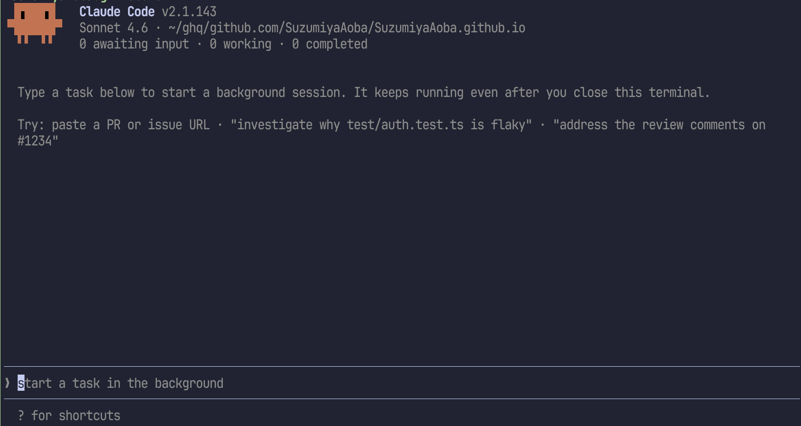

When you input a prompt in this state, a session starts at the file path shown at the top (underlined in the code block below).

```shell
 ▐▛███▜▌   Claude Code v2.1.143
# !className[/~\/ghq\/github.com\/SuzumiyaAoba\/SuzumiyaAoba.github.io/] underline decoration-wavy underline-green-600
▝▜█████▛▘  Sonnet 4.6 · ~/ghq/github.com/SuzumiyaAoba/SuzumiyaAoba.github.io
  ▘▘ ▝▝    0 awaiting input · 0 working · 0 completed
```

As an example, I asked it to investigate a case where syntax for applying a CSS class did not work.

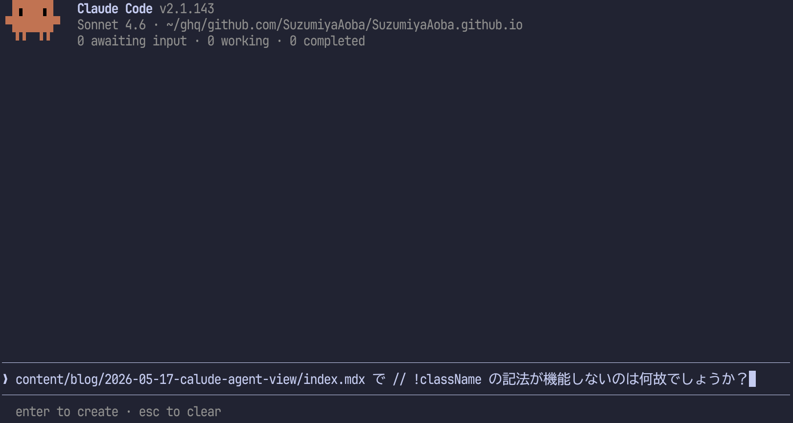

After entering the prompt and pressing <kbd>Enter</kbd>, `Working` appears and a section is added under it to execute the task from the entered prompt.

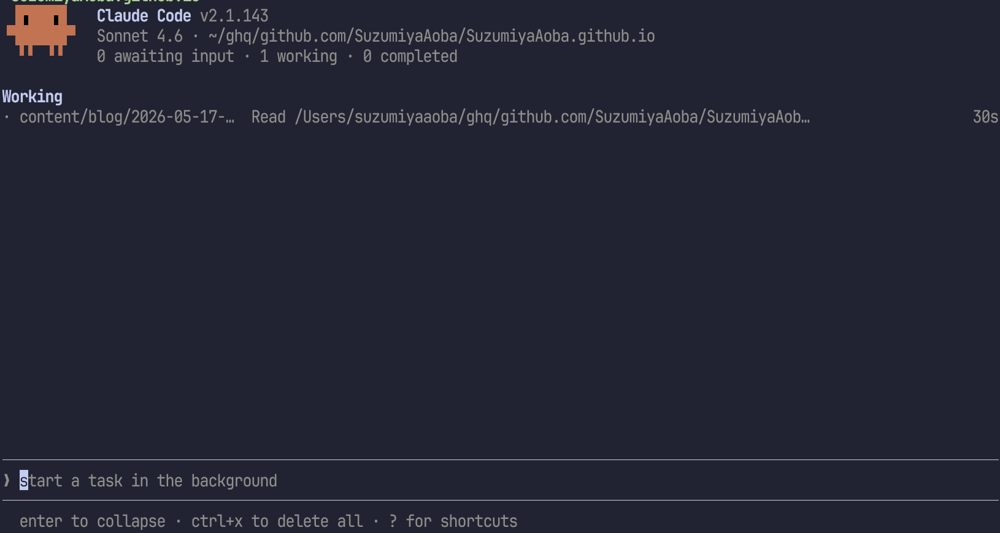

You can move the cursor with <kbd>↑</kbd>, <kbd>↓</kbd>, <kbd>Ctrl-n</kbd>, <kbd>Ctrl-p</kbd>.
If you move focus upward from the prompt area, focus moves to the section list.

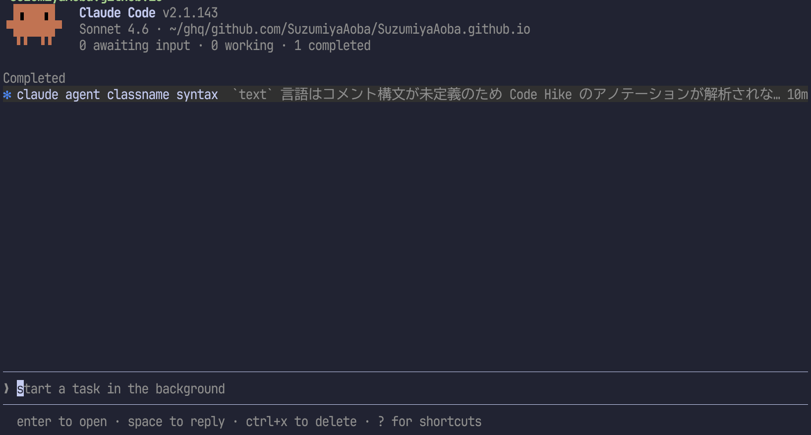

You can tell that the section is focused because the background changes.
In that state, pressing <kbd>→</kbd> or <kbd>Enter</kbd> switches to the familiar Claude Code screen.
Mouse is also supported, so you can click a session row without moving focus with the keyboard.
Also, in the screenshot above, after the task completed, `Working` changed to `Completed`.

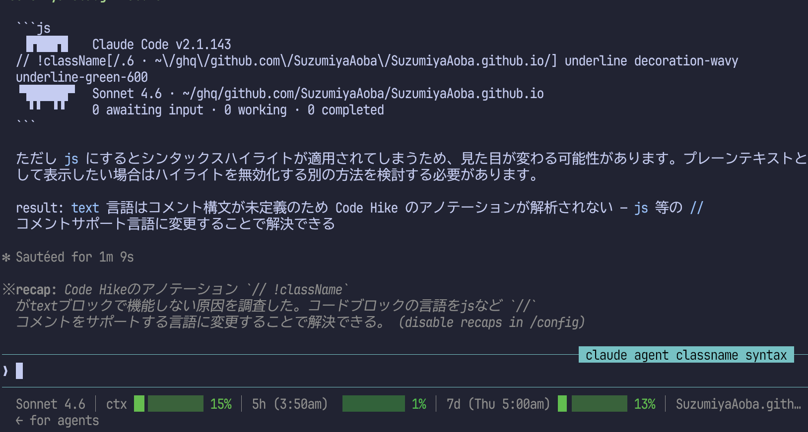

Compared with the previous Claude Code screen, this one adds `← for agents` in the lower-left.
Press <kbd>←</kbd> there to return to the screen where sessions are shown.

If you continue, return to the prompt, move focus back to input, and enter another prompt.
Here, because the ToC of this blog was not good, I asked to implement ToC using ABUI / Crux UI.

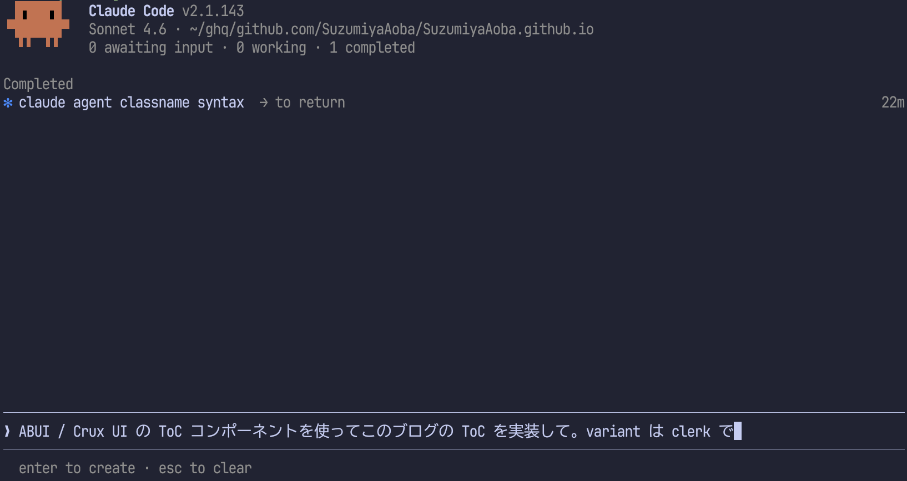

When the task starts, another `Working` appears in addition to `Completed`.

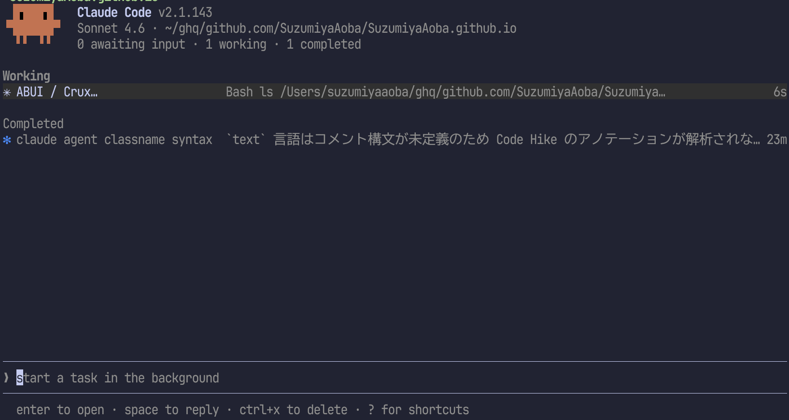

After a while, `Working` changed to `Needs input`.

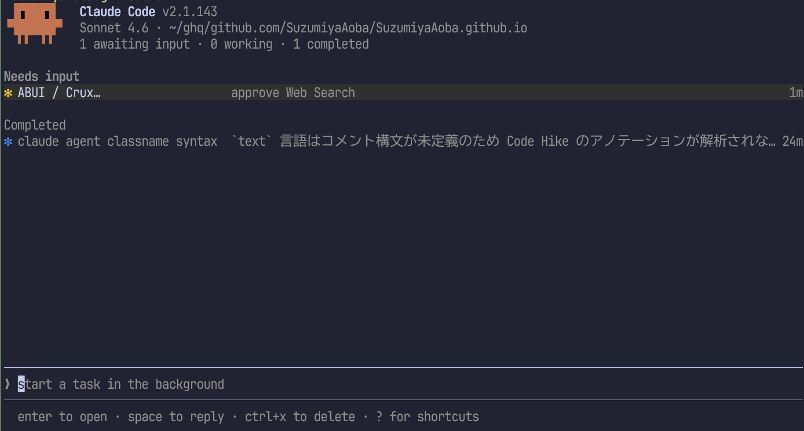

When moving to a session listed as `Needs input`, an approval request appears.
In auto mode, approvals are becoming less frequent except for planning, but because I use the Claude Pro plan, it often stops there often, so approval is still needed.

Opening that session, I found a WebSearch approval was requested.

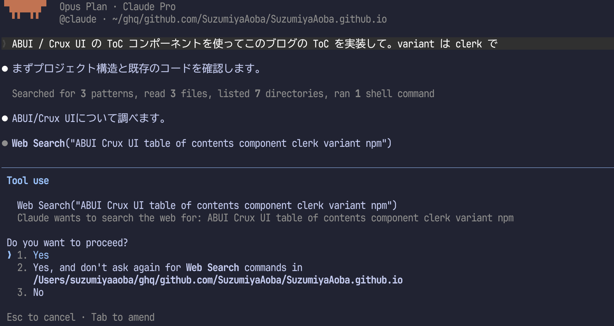

Aside from using <kbd>←</kbd>, usage is the same as before.
(After this, the requested task completed and the ToC design became nice. :+1:)

Since I sent instructions one by one, I cannot feel Agent View’s benefits strongly, but
it is useful when running multiple tasks in parallel.
If you run multiple Claude Code processes for tasks, especially in tmux or Zellij, you might lose track of which pane is running what.
Agent View solves that.

Would this issue be avoided with Claude Code Desktop?
Probably yes.

### worktree

If no files are changed, you may not notice this.
When you ask Agent View to perform tasks that change files, it uses a [worktree](https://code.claude.com/docs/ja/worktrees#clean-up-worktrees).
In other words, work from each session does not mix because each session creates an isolated directory (by default `.claude/worktree/`) through `git worktree` and applies file changes there.

So even if no changes appear in the directory you checked, the outputs may actually be in `.claude/worktree/`.

Because each session creates a worktree, the directory used with Agent View may need to be Git-managed to handle session management (not fully verified).

## Multi-folder sessions

In basic usage, we observed multiple sessions inside the same folder.
Next, I’ll check how to use Agent View across multiple directories.
There are two patterns; first, I will treat it as the extension of the previous Claude Code usage style.

### Starting Agent View by moving directories

Now let’s launch Calude Code’s Agent View by moving to another directory.

```shell
$ pwd
/Users/suzumiyaaoba/ghq/github.com/SuzumiyaAoba/nix-config
```

Running `claude agents` there gives the same style of screen.

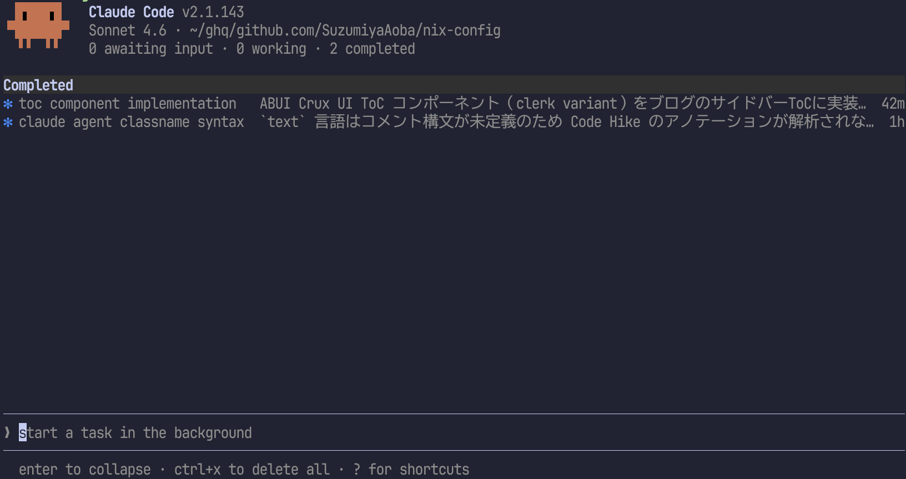

You can see the directory path differs from before.
In this state, entering a prompt starts a session rooted at the `nix-config` directory.

I had a problem with an environment setup error in Nix, so I asked for analysis.
After entering the prompt, behavior is similar.

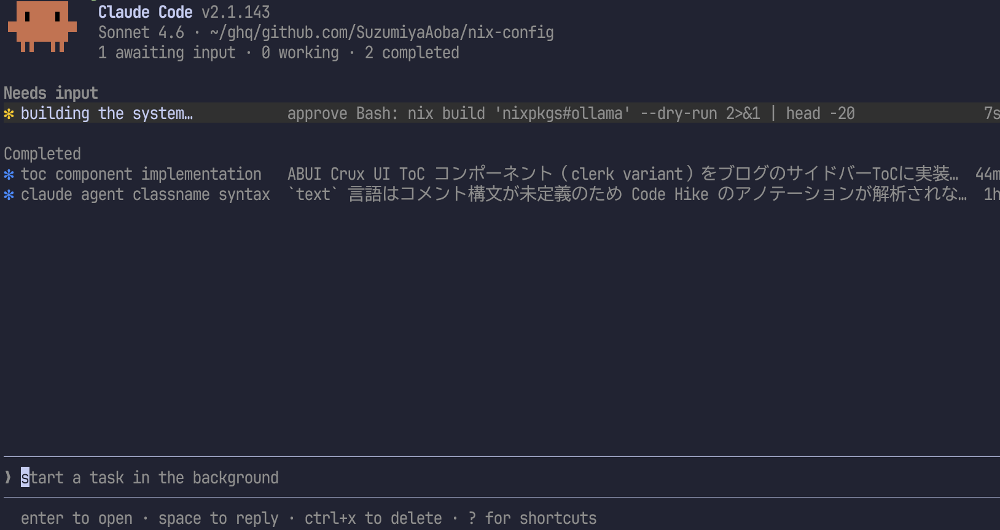

Pressing <kbd>Ctrl-s</kbd> switches the view by directory.

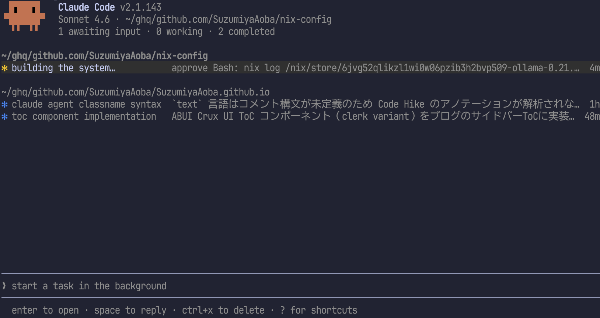

In this state, moving focus to a file path or session and entering a prompt adds a session rooted at that directory.

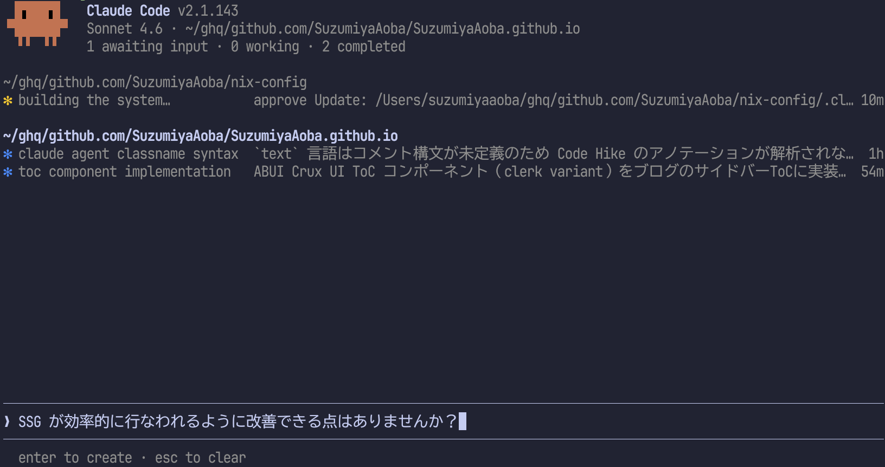

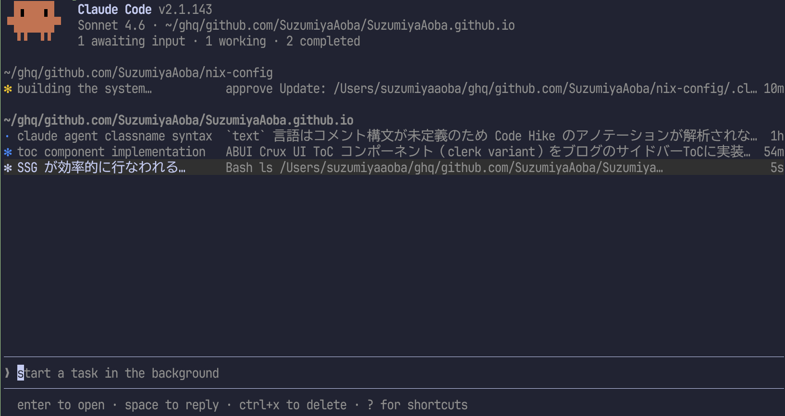

This behavior also exists before switching with <kbd>Ctrl-s</kbd>, but when sessions are only listed in one list, it can be hard to tell which directory each belongs to.
So I switch to directory grouping with <kbd>Ctrl-s</kbd> first, then issue new session instructions.

Another way to specify a root directory exists.
The more general method comes in the next section, but when multiple directories are shown in Agent View,
you can specify a target directory by typing `@directory name`.

Typing `@` at the beginning of prompt input shows candidates like this.

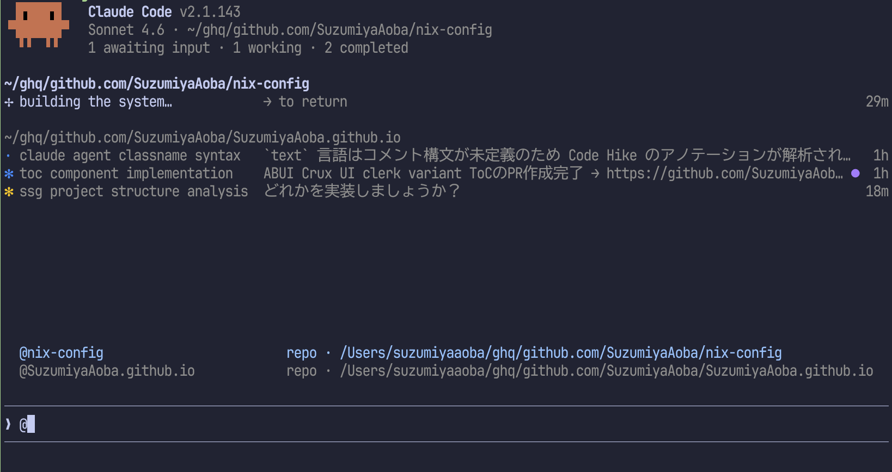

Use <kbd>↑</kbd>/<kbd>↓</kbd> or <kbd>Ctrl-p</kbd>/<kbd>Ctrl-n</kbd> to select and press <kbd>Enter</kbd> to autocomplete.
Then the screen focus moves to the selected directory path.
If you continue to instruct Claude Code, the session starts from that directory, same as when focus was moved manually before.

This makes it possible to view sessions from multiple repositories on one screen and issue new instructions quickly.

### Issuing instructions with a subdirectory

In the previous section, we changed the current directory and then started `calude agents` again to issue the first instruction. That is a little cumbersome.

As noted in the worktree section, Agent View recognizes git-managed directories as repositories.
So if you manage git repositories with a tool like [ghq](https://github.com/x-motemen/ghq),
or even if you simply manage git directories under one parent directory,
starting Agent View in that parent allows repo names to be auto-completed when typing `@`.

Move one level up from the directory we were working in:

```shell
$ pwd
/Users/suzumiyaaoba/ghq/github.com/SuzumiyaAoba
```

Launch `calude agents` and type `@`.

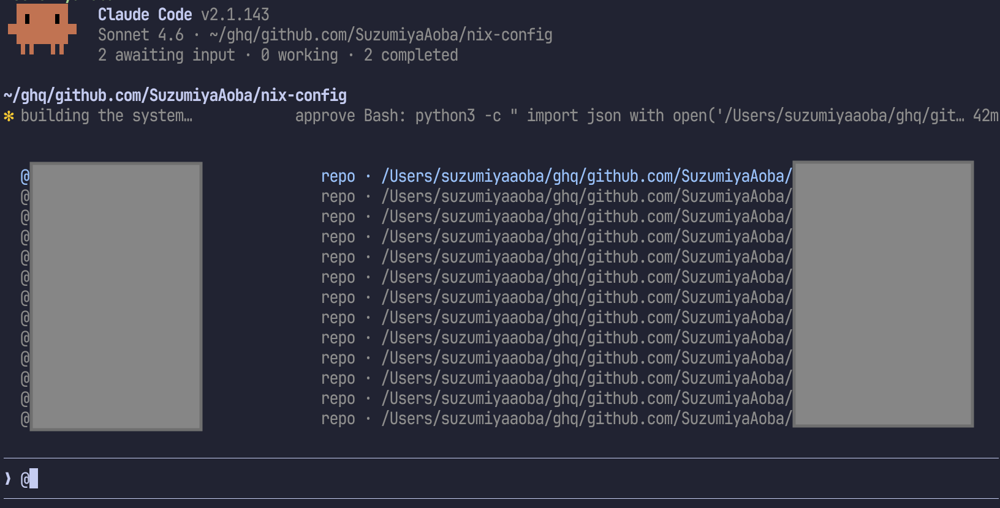

Private repositories that should be hidden were masked, but the list of repos cloned via ghq was visible.
That lets you issue instructions to repos under your organization without changing directories or restarting Claude Code.

That can be quite powerful, don’t you think?

However, a challenge remains for me: I often split a Zellij screen so that one pane runs Claude Code and another pane checks results or runs commands.
And I also need to inspect specific sessions from Agent View.

Would it be solved by VS Code git worktree management?
Then why am I running Claude Code in terminal at all? :anger:

### Integration with Zellij

If you know a good approach, please let me know.

## Summary

I looked into how to use Agent View in Claude Code.
I did not cover side panels or how to delete sessions; for those, please read the [official documentation](https://code.claude.com/docs/ja/agent-view).

I expect to update this article next Sunday or Tuesday and cover those parts.
