Claude Code に [Agent View](https://code.claude.com/docs/ja/agent-view) 機能が追加されたのでその使い方を一通り確認していく。

一次ソースを当たりたい人はこんなブログを見ていないで[公式ドキュメント](https://code.claude.com/docs/ja/agent-view)を読みましょう。

## Agent View とは？

2026年5月11日に Anthropic が Claude Code に追加した機能の一つ。
機能追加にあったって[公式ブログ](https://claude.com/blog/agent-view-in-claude-code)で記事が公開された。
Agent View のイメージを伝えるために公式が YouTube に動画を公開している。

<YouTubeEmbed id="-INveHwbRz4" title="Introducing agent view in Claude Code" />

Agent View のざっくりとした説明は、Claude Code の複数セッションを中央管理するための機能だ。
これまで、Claude Code に並列で作業をやらせたり、複数のディレクトリで指示をするとき、
ターミナルではそれぞれの作業やディレクトリの単位で Claude Code を起動してあげる必要があった。
また、ターミナルでの Claude Code の実行は Claude Code を終了したり、ターミナルを閉じるとその時点で作業が中断されてしまっていた。

それらの問題を Agent View は解決してくれる。
Agent View では複数のセッションを一覧することができるのに加えて、各セッションでどのような作業が行なわれているのか、
作業のステータス (作業中、完了、指示待ち) が見られる。
後ほど画像付きで解説するが、セッションの一覧は作業しているディレクトリの単位や作業ステータスでグループ化される。

Claude Code Desktop で解決できていたのではないかという課題もあるが、
私のようなターミナルで作業をしたいという人間にとっては嬉しいアップデートになっている。

## 基本的な使い方

### Agent View で指示を出す

Agent View を使うには、`calude` コマンドで Claude Code を立ち上げる代わりに、`calude agents` を実行する。

```shell
$ claude agents
```

そうすると次のような UI で Claude Code が立ち上がる。

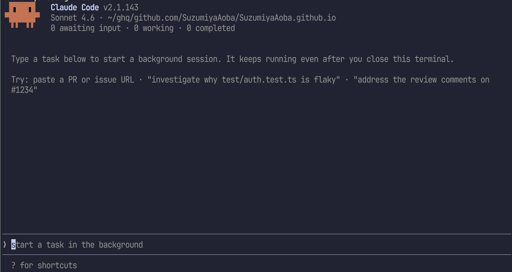

この状態でプロンプトを入力すると上部に表示されているファイルパス (以下のコードブロックで波線が引かれている部分) でセッションが開始する。

```shell
 ▐▛███▜▌   Claude Code v2.1.143
# !className[/~\/ghq\/github.com\/SuzumiyaAoba\/SuzumiyaAoba.github.io/] underline decoration-wavy underline-green-600
▝▜█████▛▘  Sonnet 4.6 · ~/ghq/github.com/SuzumiyaAoba/SuzumiyaAoba.github.io
  ▘▘ ▝▝    0 awaiting input · 0 working · 0 completed
```

例として、上記のコードブロックで CSS クラスをあてるための構文が機能しなかったので原因調査を依頼してみる。

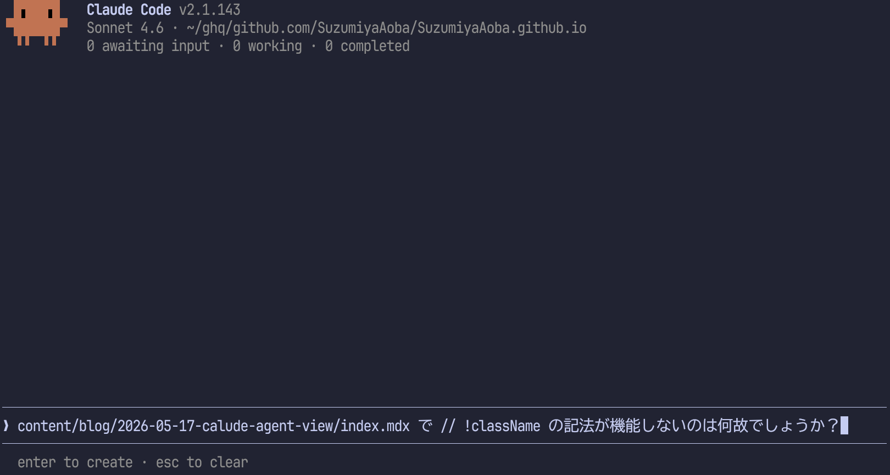

プロンプトを入力し、<kbd>Enter</kbd> を押すと `Working` と表示され、その下に入力したプロンプトからタスクを実行するセクションが追加された。

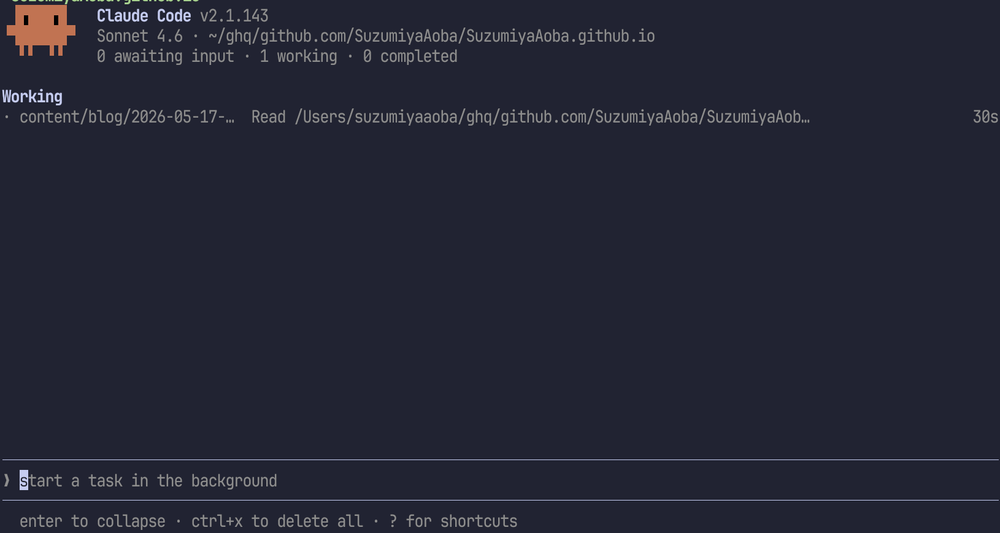

<kbd>↑</kbd>、<kbd>↓</kbd> キーか <kbd>Ctrl-n</kbd>、<kbd>Ctrl-p</kbd> でカーソルを移動することができるので、
プロンプト入力位置にあるカーソルを上に移動するとセクションのリストにフォーカスを移せる。

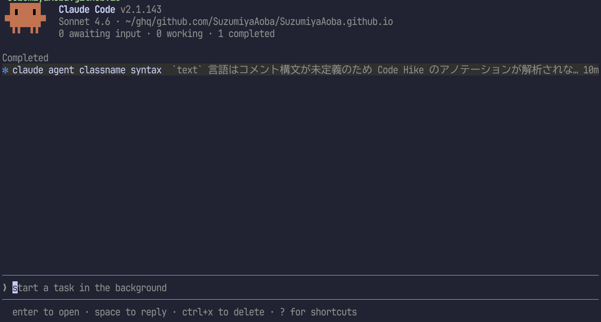

セッションにフォーカスがあたっているので一つ前の画像と見比べると背景色が変わっているのがわかると思う。
この状態で <kbd>→</kbd> キーか <kbd>Enter</kbd> キーを押すと見慣れた Claude Code の画面に切り替わる。
クリックにも対応しているため、キーボードを使ってフォーカスを移動せずにマウスでセッションの行をクリックしてもよい。
また、上記の画像ではタスクが完了した後のため `Working` が `Completed` に変わっている。

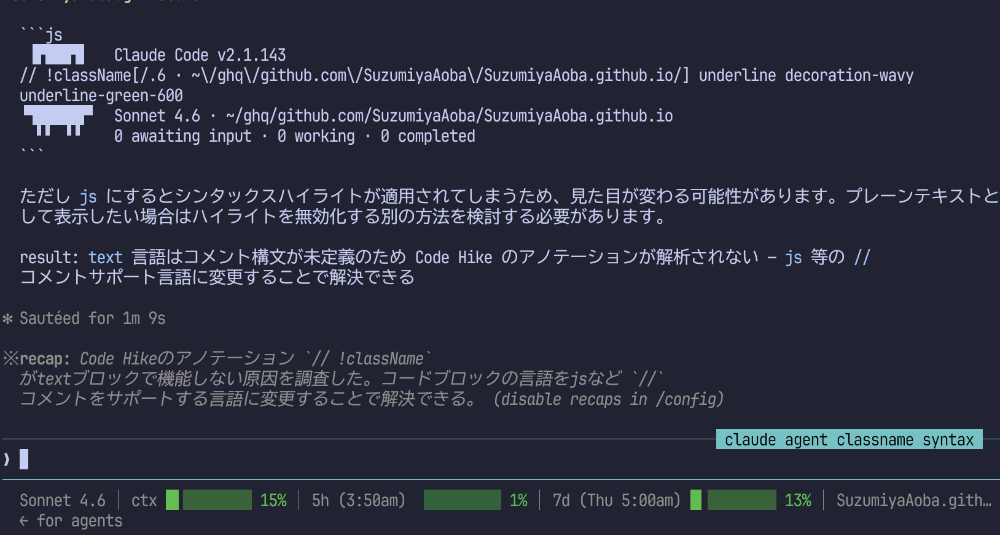

今までの Claude Code の画面との違いとして、左下に `← for agents` という表示が追加されている。
この画面で <kbd>←</kbd> を押すと先ほどまでのセッションが表示されていた画面に戻る。

ここまでの一連の操作で予想できると思うが、元の画面に戻ってフォーカスを再びプロンプト入力部分に移動し、
プロンプトを入力してみよう。
ここでは、このブログの ToC のデザインがよくないので ABUI / Crux UI の ToC を使って実装をお願いしてみる。

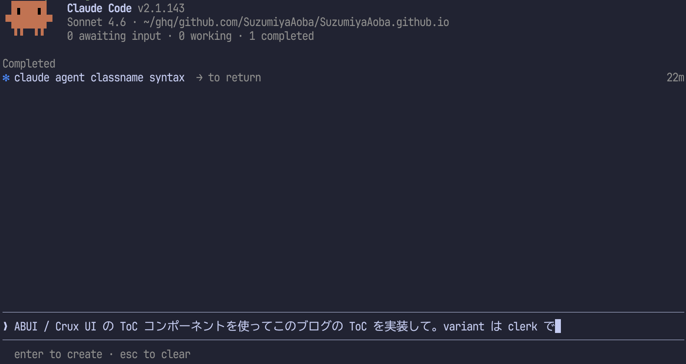

タスクが開始されると `Completed` の他に改めて `Working` が追加された。

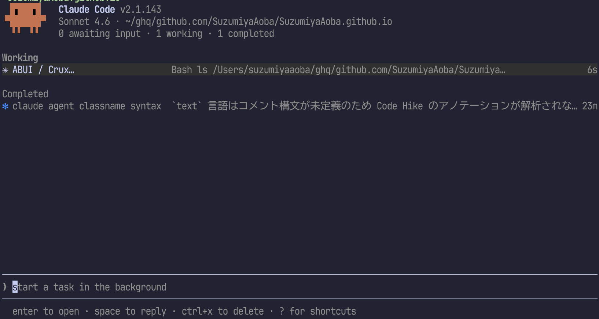

しばらくすると、`Working` が `Needs input` に切り換わった。

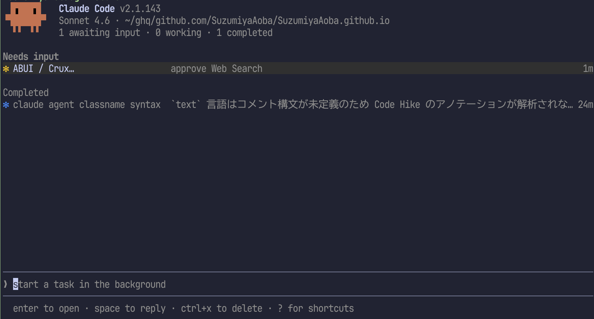

`Needs input` にリストアップされているセッションに移動すると承認を要求されていた。
auto モードが使えればプラン作成を除くほとんどの場面で承認を求められることが減ってきているが、
Claude Pro プランを使っているのでよく停止するので承認しないといけない。

セッションを開いてみると WebSearch の承認を求められていた。

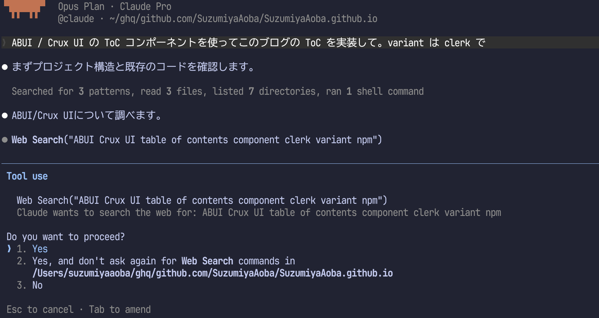

この画面の使い方は先ほど説明した <kbd>←</kbd> が使える以外に変更はないと思う。
(この後、指示したタスクは完了して ToC のデザインがかっこよくなった :+1:)

ここでは一つずつ指示を出したので Agent View の恩恵が感じられないが、
複数の作業を並列に実行させたい場合は便利だし、
Claude Code をいくつも起動してタスクをやらせていると (tmux や Zellij の) どのペインで実行していたかわからなくなる。
そういった問題も Agent View は解決する。

その問題は Claude Code Desktop なら起こらないのではなかって？
その通り。

### worktree

ファイルに変更を加えない作業のときは意識しなくてもよいが、
Agent View で依頼したタスクでファイル変更が発生するとき、
作業は [worktree](https://code.claude.com/docs/ja/worktrees#clean-up-worktrees) が使用される。
つまり、それぞれのセッションの作業が混ざるようなことはなく、
[git worktree](https://git-scm.com/docs/git-worktree) によって隔離されたディレクトリ (デフォルトであれば `.claude/worktree/`) がセッションごとに作られてファイルに変更が加えられる。

そのため、**Agent View 上で指示を出したのにディレクトリを確認したら差分がないように見えてしまうが、
実際には `.claude/worktree/` に成果物がある点に注意**すること。

セッションごとに git worktree が作成されるということは、Agent View でセッション管理するためには対象となるディレクトリは git で管理されていなければならない可能性がある (未検証)。

## 複数フォルダのセッション

基本的な使い方では、同一フォルダで複数セッションを使って作業する場合の様子を見た。
次は、複数のディレクトリで Agent View を使う方法を見ていこう。
これには 2 パターンの運用があるが、最初にこれまでの Claude Code の使い方の延長として扱ってみる。

### ディレクトリを移動して Agent View を起動

今度はディレクトリを移動して Calude Code の Agent View を立ち上げる。

```shell
$ pwd
/Users/suzumiyaaoba/ghq/github.com/SuzumiyaAoba/nix-config
```

先ほどと同じように `claude agents` を実行すると画像のような画面になる。

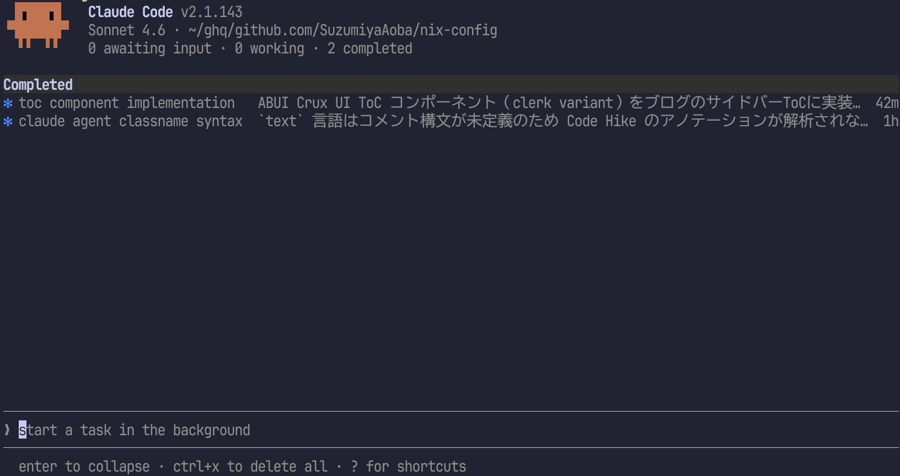

ディレクトリのパスが先ほどと異なっていることがわかるだろう。
この状態でプロンプトを入力すると、`nix-config` ディレクトリをルートディレクトリとしたセッションが立ち上がる。

Nix で環境構築するときエラーが発生するようになってしまったので原因調査を依頼する。
プロンプト入力後はこれまでと変わらない。

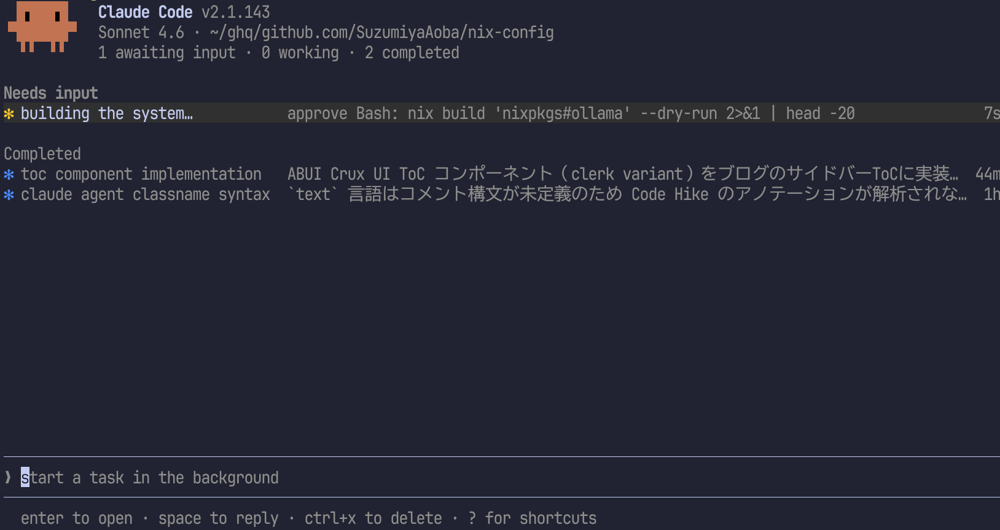

ここで <kbd>Ctrl-s</kbd> を入力すると表示がディレクトリごとに切り替わる。

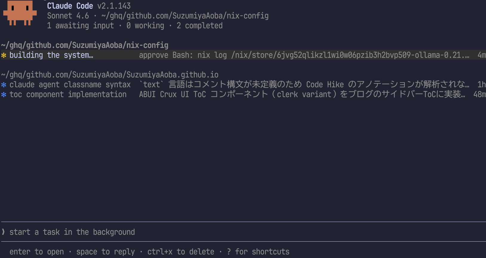

この状態でフォーカスをファイルパス、もしくはそれぞれのセッションに移動してプロンプトを入力するとそのディレクトリをルートとしたセッションが追加される。

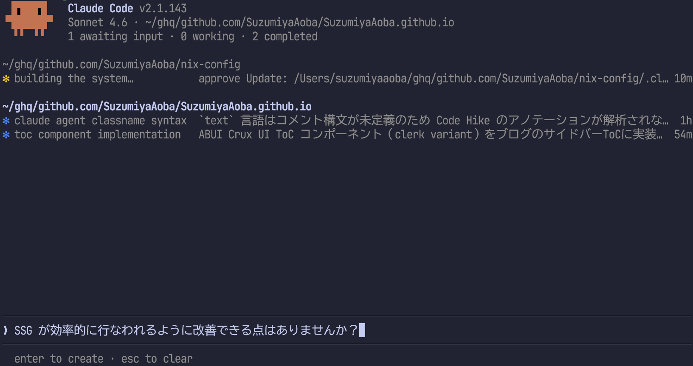

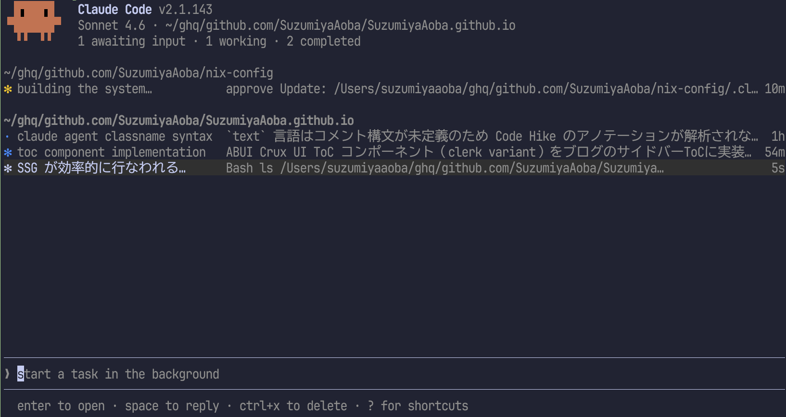

これは <kbd>Ctrl-s</kbd> に切り替える前の画面でも同様の動作をするが、どのセクションがどのディレクトリのものかセッション一覧からは判断するのが難しいことがあるため、
私は <kbd>Ctrl-s</kbd> でディレクトリごとにグループ化される表示に切り替えてから新しいセッションでの作業を指示している。

特定のディレクトリをルートディレクトリとして指示を出す方法はもう一つある。
より汎用的な方法は次のセクションで紹介するが、Agent View に複数のディレクトリが表示されている場合、
`@ディレクトリ名` で作業対象のディレクトリを指定できる。

プロンプト入力の最初に `@` を入力すると画像のように候補が表示され、

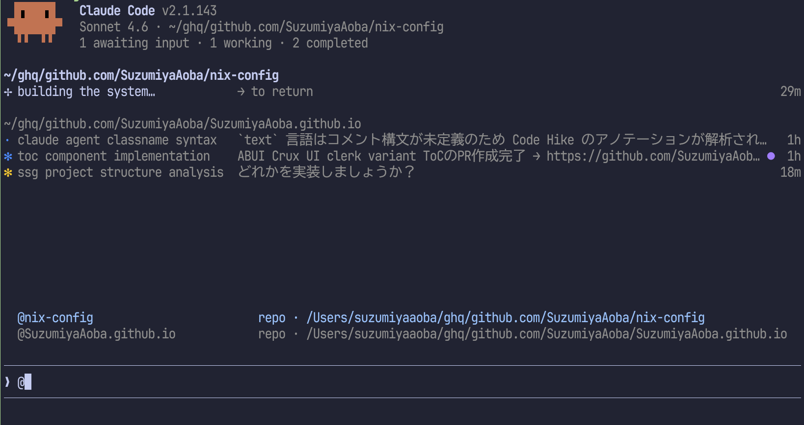

<kbd>↑</kbd>、<kbd>↓</kbd> や <kbd>Ctrl-p</kbd>、<kbd>Ctrl-n</kbd> で候補を選択し、
<kbd>Enter</kbd> キーを押すと `@ディレクトリ名` が補完される。
そうすると、画面上でもフォーカスが選択したディレクトリのパスに移動する。
続けて Claude Code にタスクを指示すれば先ほどディレクトリのパスにフォーカスを合わせたときと同じように、そのディレクトリをルートとしてセッションが開始する。

これにより、複数リポジトリのセッションを一つの画面で閲覧しつつ、素早く新たな指示を出せる。

### サブディレクトリを指定して指示を出す

一つ前のセクションでは、ターミナルでカレントディレクトリを変更し、`calude agents` を新たに立ち上げて最初の指示を出した。これは少し手間ではある。

worktree セクションで触れたように Agent View は git 管理されたディレクトリをリポジトリとして認識している。
つまり、[ghq](https://github.com/x-motemen/ghq) のようなアプリケーションで git リポジトリを管理している、
もしくはそのようなアプリケーションを使っていないにしても git ディレクトリを一つのディレクトリ配下で管理しているのであれば、
その親ディレクトリで Agent View を立ち上げると、その配下にあるリポジトリが `@` を入力したときに補完されるようになる。

これまで作業していたディレクトリの一つ上に移動し、

```shell
$ pwd
/Users/suzumiyaaoba/ghq/github.com/SuzumiyaAoba
```

`calude agents` で Agent View を起動して `@` を入力する。

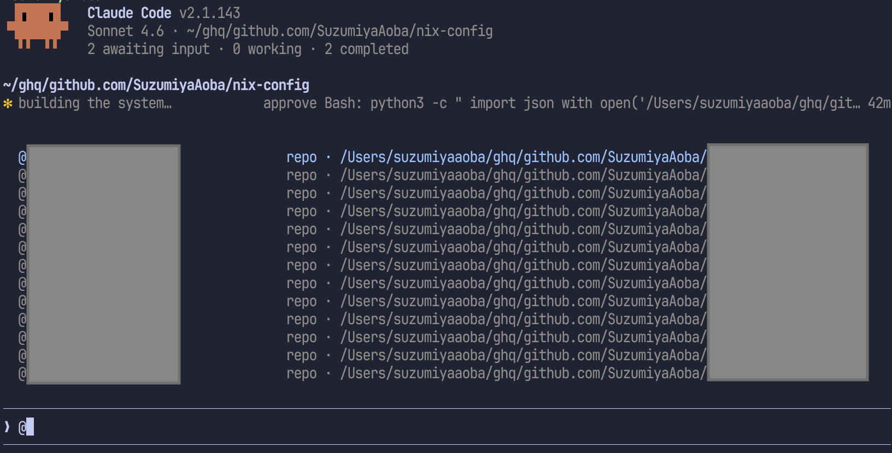

非公開にしているリポジトリが表示されてしまったので塗り潰しているが、
ghq で clone してきたリポジトリ一覧が表示されている。
これによって自身の Organization にあるリポジトリに対してディレクトリを移動したり、
Claude Code を立ち上げ直したりすることなく指示を出せる。

これはなかなか強力なのではないだろうか？

しかし、課題として私の場合は Zellij で画面を分割して Claude Code に作業させるペインと、
その結果を確認したり、何かしらコマンドを打つためのペインに分割していることが多い。
また、Agent View から特定のセッションを開いて作業状況が具体的にどうなっているのか確認したいという要求がある。

VS Code の git worktree 管理機能を使えばいいだろうって？
何のためにターミナルで Claude Code を実行しているんだよ :anger:

### Zellij との連携

いい方法があれば情報提供求ム。

## まとめ

Claude Code の Agent View の使い方について確認した。
ピークパネルの話やセッションを削除する方法について触れていないけど、そのあたりは[公式ドキュメント](https://code.claude.com/docs/ja/agent-view)を読みましょう。

明日か火曜日に記事を更新すると思うのでそこで触れます。
