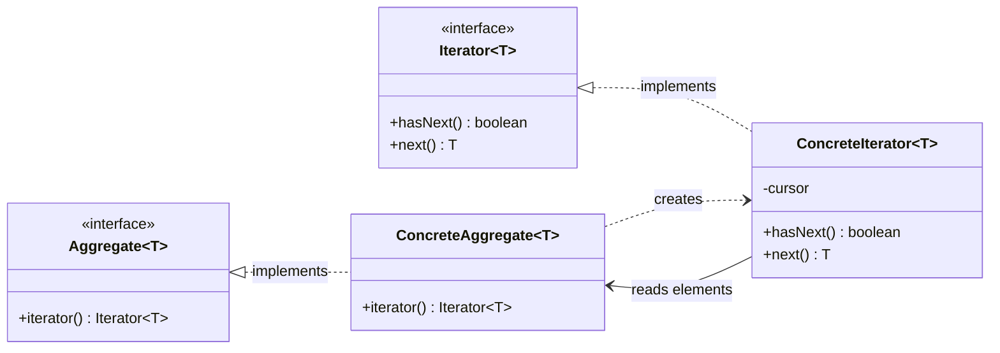

When you touch object-oriented programming languages, you are likely to encounter the **GoF Design Patterns**.
In my case, I first encountered design patterns when I read *Introduction to Design Patterns in Java* in high school.

<AmazonProductSection ids={["Introduction to Design Patterns in Java"]} />

GoF (Gang of Four) design patterns refer to 23 implementation patterns in programming.
In modern times, some design patterns are absorbed into (standard) libraries,
replaced by technologies like DI (Dependency Injection) containers, and are used without being consciously recognized as design patterns.
Others are reinterpreted by using more advanced language features.

I am writing this article to organize my own understanding.
I also think that since this kind of "classical" topic is becoming less common as people write fewer of these kinds of articles and as Generative AI becomes mainstream,
it is worthwhile to leave it as a written record.

## Prerequisites

This article explains design patterns using Java.
So it is enough to grasp the flavor of Java code.
If you have touched a modern programming language, you should be able to read it even without Java experience.

<Message variant="warning" title="Note" defaultOpen>
We use **Java 25**.

To explain the Iterator pattern, I intentionally avoid writing code that uses `java.util.Iterator` or `java.util.stream.Stream`.
</Message>

Because I included samples using features supported by Java 25,
some snippets may appear novel to people only familiar with Java 17 or Java 21.

## The 23 GoF Patterns

The GoF design patterns refer to the 23 patterns introduced in [Design Patterns: Elements of Reusable Object-Oriented Software (Addison-Wesley Professional Computing Series)](https://amzn.to/4vwturC).
The four authors are called the Gang of Four, and thus the 23 patterns are called the patterns of GoF.

### Classification

The 23 GoF patterns are broadly classified into three groups.

- Creational patterns
  - Factory Method
  - Abstract Factory
  - Builder
  - Prototype
  - Singleton
- Structural patterns
  - Adapter
  - Bridge
  - Composite
  - Decorator
  - Facade
  - Flyweight
  - Proxy
- Behavioral patterns
  - Chain of Responsibility
  - Command
  - Interpreter
  - Iterator
  - Mediator
  - Memento
  - Observer
  - State
  - Strategy
  - Template Method
  - Visitor
  
This article explains the behavioral pattern Iterator.

## Ways to access data

Before explaining the Iterator pattern, let’s quickly review representative data structures.
Since Iterator is a pattern for providing data access,
it’s important to understand data access approaches without it first.

### Array

One of the most common data structures supported by many programming languages is an [array](https://ja.wikipedia.org/wiki/%E9%85%8D%E5%88%97).
When you want to access elements from the first one onward,
a common approach is to increment an index in a `for` loop.

```java
var array = new int[]{1, 2, 3, 4, 5, 6, 7, 8, 9, 10};
for (int i = 0; i < array.length; i++) {
  IO.println(array[i]);
}
```

### List

The next familiar structure for many people is a [list](https://ja.wikipedia.org/wiki/%E3%83%AA%E3%82%B9%E3%83%88_(%E6%8A%BD%E8%B1%A1%E3%83%87%E3%83%BC%E3%82%BF%E5%9E%8B)).
There are several ways to implement a list, but in Java `ArrayList` is common.
If it implements the [`List`](https://docs.oracle.com/javase/jp/25/docs/api/java.base/java/util/List.html) interface,
you can operate through a common interface.
Element access is still done by incrementing an index, as with arrays.

```java
var list = List.of(1, 2, 3, 4, 5, 6, 7, 8, 9, 10);
for (int i = 0; i < list.size(); i++) {
  IO.println(list.get(i));
}
```

The difference from arrays is that list size is obtained by `List#size()` (arrays use `length`).

### Map

Another structure you often encounter is a [(key-value) map], also called an [associative array](https://ja.wikipedia.org/wiki/%E9%80%A3%E6%83%B3%E9%85%8D%E5%88%97), or dictionary.

```java
var map = Map.of(1, "one", 2, "two", 3, "three", 4, "four", 5, "five");
var keys = map.keySet().toArray(Integer[]::new);
for (int i = 0; i < keys.length; i++) {
  IO.println(map.get(keys[i]));
}
```

Here we iterate through key and value sets one by one.
We get the key set, convert it to an array, then fetch keys by index and retrieve each value from the map.

If you are familiar with Java, you might think of calling [`Map#values()`](<https://docs.oracle.com/javase/jp/25/docs/api/java.base/java/util/HashMap.html#values()>) directly,
but remember that this article is about Iterator.

### Set

Since set was not covered earlier due to familiarity order, let’s check [set (collection)](https://ja.wikipedia.org/wiki/%E3%82%BB%E3%83%83%E3%83%88_(%E6%8A%BD%E8%B1%A1%E3%83%87%E3%83%BC%E3%82%BF%E5%9E%8B)).

```java
var set = Set.of(1, 2, 3, 4, 5, 6, 7, 8, 9, 10);
var array = set.toArray(Integer[]::new);
for (int i = 0; i < array.length; i++) {
  IO.println(array[i]);
}
```

As this is simpler than map, no extra explanation is needed.

### Tree

You may not use trees often, but it is a representative data structure.
Here I implement a binary tree where nodes (leaf or branch) hold values, and print every node value.

A simple binary tree can be implemented as follows.

```java BinaryTree.java
public sealed interface BinaryTree<E> permits BinaryTree.Branch, BinaryTree.Leaf {

  E value();
  
  public record Branch<E>(
    E value,
    BinaryTree<E> left,
    BinaryTree<E> right) implements BinaryTree<E> {
  }
  
  public record Leaf<E>(E value) implements BinaryTree<E> {
  }
}
```

For people who have not seen newer Java, this may look unfamiliar.
Run this together with jshell to verify it works.

```java jshell
var binaryTree =
  new BinaryTree.Branch<>(
    3,
    new BinaryTree.Leaf<>(1),
    new BinaryTree.Branch<>(
      2,
      new BinaryTree.Leaf<>(4),
      new BinaryTree.Leaf<>(5)));
```

```java jshell
binaryTree ==> Branch[value=3, left=Leaf[value=1], right=Branch[ ... =4], right=Leaf[value=5]]]
```

To output each node value once:

```java
var stack = new Stack<BinaryTree<Integer>>();
stack.add(binaryTree);

while (!stack.isEmpty()) {
  var node = stack.pop();
  if (node == null) {
    continue;
  }

  switch (node) {
    case BinaryTree.Leaf<Integer>(var value): {
      IO.println(value);
      break;
    }
    case BinaryTree.Branch<Integer>(var value, BinaryTree<Integer> left, BinaryTree<Integer> right): {
      stack.push(right);
      stack.push(left);

      IO.println(value);
       break;
    }
  }
}
```

Again, if you have not touched recent Java, pattern matching in `switch` may feel new.

## Iterator Pattern

Now we move to the main topic.
In the previous section, we saw different access code for various data structures.
Because those codes are different, when you want to sum integers in each structure,
you need structure-specific logic.

For arrays, the code would be:

```java
// !mark
var sum = 0;
var array = new int[]{1, 2, 3, 4, 5, 6, 7, 8, 9, 10};
for (int i = 0; i < array.length; i++) {
  // !mark
  sum += array[i];
}
```

For a binary tree:

```java
// !mark
var sum = 0;
var stack = new Stack<BinaryTree<Integer>>();
stack.add(binaryTree);

while (!stack.isEmpty()) {
  var node = stack.pop();
  if (node == null) {
    continue;
  }

  switch (node) {
    case BinaryTree.Leaf<Integer>(var value): {
      // !mark
      sum += value;
      break;
    }
    case BinaryTree.Branch<Integer>(var value, BinaryTree<Integer> left, BinaryTree<Integer> right): {
      stack.push(right);
      stack.push(left);

      // !mark
      sum += value;
      break;
    }
  }
}
```

In both cases, the operation is simply iterating each structure’s values and summing them.
You can also see only the highlighted lines differ.

This raises the natural question:

<Message title="Question" defaultOpen>
**Can we abstract this so it doesn’t depend on the data structure?**
</Message>

One of the answers is the Iterator pattern.

Iterator pattern provides a way to access internal data one element at a time while hiding the structure.
Anything can be a data structure: array, list, set, map, tree, or even a plain class, including empty cases.
This is because the mechanism it provides is structure-independent access to data.

It is often explained with an interface like this.

```java Iterator.java
/**
 * Iterator interface.
 *
 * @param <T> the type returned by the iterator
 */
public interface Iterator<T> {

  /**
   * Returns whether more elements can be iterated.
   *
   * @return {@code true} if there are elements left to iterate; otherwise {@code false}
   */
  boolean hasNext();

  /**
   * Returns the next element.
   *
   * @return the next element
   */
  T next();
}
```

Although Java’s [Iterator](https://docs.oracle.com/javase/jp/25/docs/api/java.base/java/util/Iterator.html)
has [`Iterator#remove`](<https://docs.oracle.com/javase/jp/25/docs/api/java.base/java/util/Iterator.html#remove()>) and [`Iterator#forEachRemaining`](<https://docs.oracle.com/javase/jp/25/docs/api/java.base/java/util/Iterator.html#forEachRemaining(java.util.function.Consumer)>) defined,
in general an Iterator pattern requests only two methods:

- `hasNext`: check if a next element exists
- `next`: return the next element

That is exactly what this `Iterator` interface expresses.

The class providing Iterators is called Aggregate.
Aggregate refers to the class that returns Iterators, and is often expressed like this (no need to memorize it closely).

```java Aggregate.java
/**
 * Interface for iterating through a collection via iterator.
 *
 * @param <T> the type of iterated element
 */
public interface Aggregate<T> {

  /**
   * Returns an iterator.
   *
   * @return an iterator
   */
  Iterator<T> iterator();
}
```

In design pattern terminology, this is Aggregate; in Java's standard library, [`Iterable`](https://docs.oracle.com/javase/jp/25/docs/api/java.base/java/lang/Iterable.html) corresponds to it.
Implementing Iterable also gives the advantage of using Java’s enhanced for-loop, so initially you can treat `Iterable` as Aggregate.

The relationship between `Aggregate`, `Iterator`, and concrete implementations is as follows:



`ConcreteAggregate` creates a `ConcreteIterator` when `Aggregate#iterator()` is called.
The created iterator uses internal state (`cursor`) and the original `ConcreteAggregate` data to return elements one by one via `hasNext` and `next`.
From the caller side, we only interact through the abstractions `Aggregate`/`Iterator`,
so the way to access data is the same whether it is an array, binary tree, or paginated web API data.

## How to use Iterator

Basic usage of Iterator is as follows.

```java
// Call Aggregate#iterator() to get an Iterator instance
var iterator = aggregate.iterator();
// Call Iterator#hasNext() and loop until it is false
while(iterator.hasNext()) {
  // Call Iterator#next() to get the next element
  IO.println(iterator.next());
}
```

By using Iterator pattern,
you can check whether there is a next element (`hasNext()`)
and get it (`next()`) using a common interface,
so you don't need to care how the data is structured.
Let's experience this with Java standard `Iterator`.

Define a function `display` to print all values from an iterator.

```java
public void display(java.util.Iterator<?> iterator) {
  while(iterator.hasNext()) {
    IO.println(iterator.next());
  }
}
```

This corresponds to the "display values" part in earlier examples.
Originally, each data structure needed different access logic,
but with Iterator pattern you can do the following using just one call with a `java.util.Iterator` instance.

```java
// Array
var array = new Integer[]{1, 2, 3, 4, 5, 6, 7, 8, 9, 10};
display(Arrays.asList(array).iterator());

// List
var list = List.of(1, 2, 3, 4, 5, 6, 7, 8, 9, 10);
display(list.iterator());

// Map
var map = Map.of(1, "one", 2, "two", 3, "three", 4, "four", 5, "five");
display(map.values().iterator());

// Set
var set = Set.of(1, 2, 3, 4, 5, 6, 7, 8, 9, 10);
display(set.iterator());
```

Here it is a simple program that just prints values in order,
but you can see how it can abstract typical value-by-value logic.

Using Iterator pattern like this allows writing code to access one value at a time from any data structure without depending on how the data is held.

## Practical example of the Iterator pattern

Next, let’s apply Iterator pattern to a binary tree.
Earlier we obtained an iterator by calling `Iterable#iterator()` from the standard library,
but for our custom `BinaryTree` class we need to implement an `iterator` method.

```java
public sealed interface BinaryTree<E>
  // !mark
  extends Aggregate<E>
  permits BinaryTree.Branch, BinaryTree.Leaf {

  E value();
  
  public record Branch<E>(
    E value,
    BinaryTree<E> left,
    BinaryTree<E> right) implements BinaryTree<E> {
  }
  
  public record Leaf<E>(E value) implements BinaryTree<E> {
  }
  
  // !mark(1:46)
  @Override
  default Iterator<E> iterator() {
    return new Iterator<>() {

      private Stack<BinaryTree<E>> stack = new Stack<>();

      {
        this.stack.push(BinaryTree.this);
      }

      @Override
      public boolean hasNext() {
        return !this.stack.isEmpty();
      }

      @Override
      public E next() {
        if (!this.hasNext()) {
          throw new NoSuchElementException();
        }

        var node = this.stack.pop();

        return switch (node) {
            case BinaryTree.Leaf<E>(E value) -> {
              yield value;
          }
          case BinaryTree.Branch<E>(E value, BinaryTree<E> left, BinaryTree<E> right) -> {
            stack.push(right);
            stack.push(left);
          
            yield value;
          }
        };
      }
    };
  }
}
```

Instantiate `BinaryTree`:

```java
var binaryTree =
  new BinaryTree.Branch<>(
    3,
    new BinaryTree.Leaf<>(1),
    new BinaryTree.Branch<>(
      2,
      new BinaryTree.Leaf<>(4),
      new BinaryTree.Leaf<>(5)));
```

Call `BinaryTree#iterator()` and loop:

```java
var iterator = binaryTree.iterator();
while(iterator.hasNext()) {
  IO.println(iterator.next());
}
```

The output is depth-first pre-order, as when implementing the `BinaryTree` traversal earlier.

```java
jshell> var iterator = binaryTree.iterator();
   ...> while(iterator.hasNext()) {
   ...>   IO.println(iterator.next());
   ...> }
iterator ==> BinaryTree$1@7637f22
3
1
2
4
5
```

The important point is that the code shape is the same as enumerating values from arrays, lists, maps, and sets through `Iterator`.
In the previous section we used Java standard `Iterator`, and here we use a custom `Iterator` class.
So you can’t directly use a shared method like `display` unless `BinaryTree` implements `java.lang.Iterable`.

## A more realistic Iterator example

So far we only extracted values from a collection, which might feel somewhat artificial in real engineering.
In practice many engineers may rarely write a `BinaryTree` class like this.
For those readers, here is a slightly more realistic example.

Suppose we have a hypothetical web API returning JSON that can be mapped to the following POJO.

```java ApiResponse.java
import java.util.List;

public class ApiResponse {

  private List<String> ids;
  private int page;
  private int size;
  private int totalPages;

  public ApiResponse(List<String> ids, int page, int size, int totalPages) {
    this.ids = ids;
    this.page = page;
    this.size = size;
    this.totalPages = totalPages;
  }

  public List<String> getIds() {
    return this.ids;
  }

  public void setIds(List<String> ids) {
    this.ids = ids;
  }

  public int getPage() {
    return this.page;
  }

  public void setPage(int page) {
    this.page = page;
  }

  public int getSize() {
    return this.size;
  }

  public void setSize(int size) {
    this.size = size;
  }

  public int getTotalPages() {
    return this.totalPages;
  }

  public void setTotalPages(int totalPages) {
    this.totalPages = totalPages;
  }
}
```

This API has a limit, so it returns only up to 100 items in `ids` (※1).
Suppose you want to do something with all IDs from this API.
The exact purpose is not important here, so I will just print them to standard output like previous examples.

<Message title="Goal" defaultOpen>
Print all IDs retrieved from the web API to standard output.
</Message>

In reality, with a Java API this would likely be mapped with a library such as [Jackson](https://github.com/fasterxml/jackson),
but here we use a dummy API client to mock retrieval.

```java
import java.util.stream.IntStream;

public class ApiClient {

  private final int TOTAL_SIZE = 1024;

  public ApiResponse get(int page, int size) {
    if (page <= 0) {
      throw new IllegalArgumentException();
    }

    var ids = IntStream.rangeClosed(1, TOTAL_SIZE)
      .skip((page - 1) * size)
      .limit(size)
      .mapToObj(Integer::toString)
      .toList();

    return new ApiResponse(ids, page, size, (int) Math.ceil((double) TOTAL_SIZE / size));
  }
}
```

Assume pagination uses page size and page count.
Offset or cursor models are also possible (※2).
Also assume page numbers start at 1 (※3).
Since this API is unhelpful, we must judge previous/next pages by comparing current page and `totalPage`,
or by checking whether the response is empty (※4).

Under these conditions, we want code that achieves the goal.

<Message title="Question" defaultOpen>
Before checking the Iterator-based implementation I show below, pause and think about what implementation you would write.
</Message>

### `ApiResponse` Iterator

Before enumerating all IDs in `ids`, first implement `Aggregate` on `ApiResponse` so IDs can be iterated.

```java ApiResponse.java
import java.util.List;

// !mark
public class ApiResponse implements Aggregate<String> {
  private List<String> ids;
  private int page;
  private int size;
  private int totalPages;

  public ApiResponse(List<String> ids, int page, int size, int totalPages) {
    this.ids = ids;
    this.page = page;
    this.size = size;
    this.totalPages = totalPages;
  }

  public List<String> getIds() {
    return this.ids;
  }

  public void setIds(List<String> ids) {
    this.ids = ids;
  }

  public int getPage() {
    return this.page;
  }

  public void setPage(int page) {
    this.page = page;
  }

  public int getSize() {
    return this.size;
  }

  public void setSize(int size) {
    this.size = size;
  }

  public int getTotalPages() {
    return this.totalPages;
  }

  public void setTotalPages(int totalPages) {
    this.totalPages = totalPages;
  }

  // !mark(1:20)
  @Override
  public Iterator<String> iterator() {
    return new Iterator<>() {

      private int index = 0;

      @Override
      public boolean hasNext() {
        return this.index < ids.size();
      }

      @Override
      public String next() {
        return ids.get(index++);
      }
    };
  }
}
```

This implementation is simple: it stores an `index` in the iterator field
and returns the `index` element of `ids` while incrementing it on each `next` call.
`ApiResponse` IDs can now be accessed in order through the `Iterator` interface.
A benefit is that if later `ids` is stored in a data structure other than `List`,
callers need no change.

### Enumerating IDs

Now add a method to `ApiClient` that returns an `Iterator` for all IDs.

```java
import java.util.stream.IntStream;

public class ApiClient {

  private final int TOTAL_SIZE = 1024;

  public ApiResponse get(int page, int size) {
    if (page <= 0) {
      throw new IllegalArgumentException();
    }

    var ids = IntStream.rangeClosed(1, TOTAL_SIZE)
      .skip((page - 1) * size)
      .limit(size)
      .mapToObj(Integer::toString)
      .toList();

    return new ApiResponse(ids, page, size, (int) Math.ceil(TOTAL_SIZE / size));
  }

  // !mark(1:27)
  public Iterator<String> allIds() {
    var limit = 100;

    return new Iterator<>() {

      private int page = 1;
      private Iterator<String> iterator;

      @Override
      public boolean hasNext() {
        if (this.iterator == null) {
          this.iterator = get(page++, limit).iterator();
        }

        return this.iterator.hasNext();
      }
      
      @Override
      public String next() {
        if (!this.hasNext()) {
          throw new NoSuchElementException();
        }

        var id = this.iterator.next();

        if (!this.iterator.hasNext()) {
          this.iterator = null;
        }

        return id;
      }
    };
  }
}
```

Because `ApiResponse#iterator()` is implemented, we no longer need separate logic to access each `ids` page.
The logic is:
if `iterator` is null, fetch the next page, set an iterator from the response IDs,
and increment `page` for next time.
If `iterator` is not null, check `hasNext` on it.

`next` mainly returns `iterator.next()`.
When there is no next element in that iterator, it sets `iterator` to null,
so next `hasNext` fetches the next page.

Using the returned iterator from `allIds`, caller code looks like this:

```java
var apiClient = new ApiClient();
var idsIterator = apiClient.allIds();

while(idsIterator.hasNext()) {
  IO.println(idsIterator.next());
}
```

This accomplishes the goal and avoids extra concerns.

What should be the concern? It is only this: "enumerate all IDs."
Everything else should not be part of the core implementation logic.

What does "not part" mean?
A careful reader will notice the numbered notes (※1~※4) in the API specification.

> - This API returns at most 100 items at once in `ids` (※1)
> - The sample assumes page-size and page-count pagination, but offset and cursor forms also exist (※2)
> - Assume page numbers start from 1 (※3)
> - Because this API is not convenient, whether there are previous/next pages is judged by comparing current page and `totalPage`, or by detecting an empty response (※4)

These API-level constraints should not be explicitly present in the core logic that achieves the goal,
though they must be considered during implementation.
Such details should be separated from the core logic.
Put differently, even if API specs change, code that performs the core "enumerate all IDs" should ideally remain unchanged.

This is exactly what Iterator pattern achieves.
Even if pagination style changes, adjust `allIds` internal iterator behavior,
and you can leave the loop using `hasNext` and `next` untouched.

## Enhanced for-loop

Although this is getting into Java language features, if we explain Iterator in Java,
we must talk about the enhanced for loop.
Its syntax is:

```java
var list = List.of(1, 2, 3, 4, 5);
for (var x : list) {
  IO.println(x);
}
```

The enhanced for loop is not a special syntax for arrays or `List` alone,
but is available for subtypes of `java.lang.Iterable`.

In the `BinaryTree` example, change Aggregate to Java standard `java.lang.Iterable`.
Then `BinaryTree#iterator()` should return `java.util.Iterator`.
You only need to change `Aggregate` to `java.lang.Iterable` in code.

```java
public sealed interface BinaryTree<E>
  // !mark
  extends java.util.Iterable<E>
  permits BinaryTree.Branch, BinaryTree.Leaf {

  // ...
}
```

Use it as follows:

```java jshell
var binaryTree =
  new BinaryTree.Branch<>(
    3,
    new BinaryTree.Leaf<>(1),
    new BinaryTree.Branch<>(
      2,
      new BinaryTree.Leaf<>(4),
      new BinaryTree.Leaf<>(5)));

for (var node : binaryTree) {
  IO.println(node);
}
```

You can see it works like this:

```java jshell
jshell> var binaryTree =
   ...>   new BinaryTree.Branch<>(
   ...>     3,
   ...>     new BinaryTree.Leaf<>(1),
   ...>     new BinaryTree.Branch<>(
   ...>       2,
   ...>       new BinaryTree.Leaf<>(4),
   ...>       new BinaryTree.Leaf<>(5)));
   ...>
   ...> for (var node : binaryTree) {
   ...>   IO.println(node);
   ...> }
binaryTree ==> Branch[value=3, left=Leaf[value=1], right=Branch[ ... =4], right=Leaf[value=5]]]
3
1
2
4
5
```

Instances implementing `java.lang.Iterable` can be iterated using the enhanced for loop.
Because in recent coding styles loops are often avoided,
actual opportunities may be fewer.
Benefits include not needing to expose Iterator operation on the surface,
and avoiding mistakes around `Iterator#hasNext()` and `Iterator#next()`.

## Side effects of Iterator

Some may ask whether `Iterator#hasNext()` having side effects is a problem.

In many programming styles, side effects are avoided as much as possible.
However, Iterator pattern by design can update internal state or fetch external data on `hasNext()` and `next()`.
From `hasNext` semantics, you often need to confirm existence somehow when asking `hasNext()`,
and this can cause side effects.

If data is fully in memory, checking without side effects is often possible.
But when values are not preloaded and require external retrieval,
you cannot guarantee existence until retrieving the data.
Also `Iterator#next()` must return a different element each time,
so you must keep state about where you are.
Therefore side effects are tightly coupled with Iterator in practice.

## Summary

This article introduced the Iterator pattern, one of GoF’s 23 patterns.
Among online articles, this one tries to give enough detail.
Many existing articles either explain standard-library `Iterator#iterator()` usage
or simple BookShelf-like examples from *Introduction to Design Patterns in Java*.

But as this article shows, the key advantage is an abstraction with two methods:

- check whether next element exists (`hasNext`)
- return next element (`next`)

This allows structure-agnostic data access and implementation.
To understand it, it is best to implement an interface like [`Iterable`](https://docs.oracle.com/javase/jp/25/docs/api/java.base/java/lang/Iterable.html).

As a closing exercise, implement an Iterator that recursively traverses all files in a directory,
which is a representative tree structure in programming.
In modern Java, this is possible with [`Files#walk`](<https://docs.oracle.com/javase/jp/25/docs/api/java.base/java/nio/file/Files.html#walk(java.nio.file.Path,java.nio.file.FileVisitOption...)>),
but try implementing it without relying on Stream for learning.
