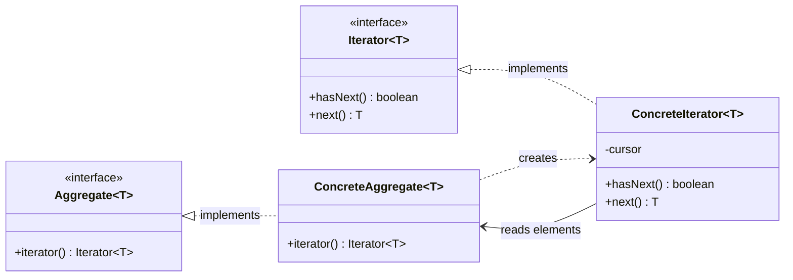

オブジェクト指向型プログラミング言語に触れると **GoF のデザインパターン**を知る機会があると思う。
私の場合、高校生の頃に『[Java言語で学ぶデザインパターン入門](https://amzn.to/4tREpdX)』という本でデザインパターンというものに出会った。

<AmazonProductSection ids={["Java言語で学ぶデザインパターン入門"]} />

GoF (Gang of Four) のデザインパターンは、プログラミングにおける 23 種類の実装パターンのことを指している。
現代において一部のデザインパターンは、プログラミング言語の（標準）ライブラリに取り込まれていたり、
DI (Dependency Injection) コンテナのような技術で置き換えられ、デザインパターンとして意識されることなく使われるものがある。
また、より高度なプログラミング言語の機能を使って再解釈されているパターンが存在する。

今回、記事を書くことで私自身の整理と、これから書こうとしている内容は今となっては昔にされた話で最近は書く人もいないし、
生成 AI の登場によりプログラミングを学んでこの手をの記事 (古典) を書く人も減っていってしまうと思うので記事にしておこうと思った。

## 前提

この記事では、Java を使ってデザインパターンについて解説する。
そのため、Java で書かれたコードの雰囲気だけでも掴める必要がある。
現代的なプログラミング言語に触れたことがあれば、Java を書いたことがなくても読むのは問題ないと思われる。

<Message variant="warning" title="注意点" defaultOpen>
**Java のバージョンは 25 を使用する。**

Iterator パターンについて解説するため、意図的に `java.util.Iterator` や `java.util.stream.Stream` を使用したコードを書かないようにしている。
</Message>

Java 25 でサポートされている機能を使ったコードをサンプルコードとして掲載したため、一部のコードは Java 17 や Java21 に慣れ親しんでいる人にとっても目新しいコードになっている。

## GoF の 23 パターン

GoF デザインパターンとは、[Design Patterns: Elements of Reusable Object-Oriented Software (Addison-Wesley Professional Computing Series)](https://amzn.to/4vwturC) で紹介された 23 パターンのデザインパターンのことを言う。
この本の著者である 4 人 が Gang of Four と呼ばれることから書籍に書かれた 23 パターンは『GoF の デザインパターン』と言われている。

### 分類

GoF の 23 パターンは大きく 3 つに分類される。

- 生成に関するパターン
  - Factory Method
  - Abstract Factory
  - Builder
  - Prototype
  - Singleton
- 構造に関するパターン
  - Adapter
  - Bridge
  - Composite
  - Decorator
  - Facade
  - Flyweight
  - Proxy
- 振る舞いに関するパターン
  - Chain of Responsibility
  - Command
  - Interpreter
  - Iterator
  - Mediator
  - Memento
  - Observer
  - State
  - Strategy
  - Template Method
  - Visitor
  
この記事では、振る舞いに関するパターンの Iterator パターンについて解説する。

## データにアクセスする方法

Iterator パターンについて解説する前に代表的なデータ構造について確認しておこう。
後ほど解説するが、Iterator パターンはデータアクセスを提供するデザインパターンであるため、Iterator パターンを使わない場合のデータアクセスの方法について理解しておくことは重要だ。

### 配列

最も代表的で多くのプログラミング言語でサポートされているデータ構造として[『配列』](https://ja.wikipedia.org/wiki/%E9%85%8D%E5%88%97)がある。
配列の先頭の要素から順番にアクセスしたいとき、for 文を使って `0` から配列の長さ分だけ添字（インデックス）をインクリメントしてアクセスするのが一般的だ。

```java
var array = new int[]{1, 2, 3, 4, 5, 6, 7, 8, 9, 10};
for (int i = 0; i < array.length; i++) {
  IO.println(array[i]);
}
```

### リスト

配列の次に多くの人にとって親しみのあるデータ構造は[『リスト』](https://ja.wikipedia.org/wiki/%E3%83%AA%E3%82%B9%E3%83%88_(%E6%8A%BD%E8%B1%A1%E3%83%87%E3%83%BC%E3%82%BF%E5%9E%8B))だろう。
リストを実装する方法はいくつかあるが、Java でよく使われるのは [`ArrayList`](https://docs.oracle.com/javase/jp/25/docs/api/java.base/java/util/ArrayList.html) だが、[`List`](https://docs.oracle.com/javase/jp/25/docs/api/java.base/java/util/List.html) インターフェースを実装していれば共通のインターフェースを通して操作できる。
要素へのアクセスは配列の場合と同じように、添字をインクリメントしてアクセスすることになる。

```java
var list = List.of(1, 2, 3, 4, 5, 6, 7, 8, 9, 10);
for (int i = 0; i < list.size(); i++) {
  IO.println(list.get(i));
}
```

配列との違いとして、リストのサイズは `List#size()` メソッドで取得する（配列の場合は `length`）。

### マップ

次に使う機会が多いのは『（キーバリュー）マップ』や[『連想配列』](https://ja.wikipedia.org/wiki/%E9%80%A3%E6%83%B3%E9%85%8D%E5%88%97)、『辞書』と呼ばれているデータ構造だろう。

```java
var map = Map.of(1, "one", 2, "two", 3, "three", 4, "four", 5, "five");
var keys = map.keySet().toArray(Integer[]::new);
for (int i = 0; i < keys.length; i++) {
  IO.println(map.get(keys[i]));
}
```

ここではマップのキー、バリューのバリューの集まりを一つずつ列挙している。
マップからキーの集合を取得し、それを配列にしてからキー配列に対して添字で順番にアクセスしてキーを取得し、マップに渡すことでバリューを取ってきている。

Java に触ったことがある方であれば、バリューをアクセスするのにこんな面倒なコードを書く必要はなく、[`Map#values()`](<https://docs.oracle.com/javase/jp/25/docs/api/java.base/java/util/HashMap.html#values()>) を呼べばいいと思うかもしれないが、この記事が Iterator についての解説であることを思い出して欲しい。

### セット

ここまでくると消化試合ではあるが[『セット（集合）』](https://ja.wikipedia.org/wiki/%E3%82%BB%E3%83%83%E3%83%88_(%E6%8A%BD%E8%B1%A1%E3%83%87%E3%83%BC%E3%82%BF%E5%9E%8B))について見ておこう。

```java
var set = Set.of(1, 2, 3, 4, 5, 6, 7, 8, 9, 10);
var array = set.toArray(Integer[]::new);
for (int i = 0; i < array.length; i++) {
  IO.println(array[i]);
}
```

よく使うデータ構造順に紹介している関係でマップよりもシンプルになっているので説明は不要だろう。

### 木構造

直接使う機会は少ないかもしれないが代表的なデータ構造として木構造がある。
ここでは、葉（リーフ）と枝（ブランチ）に値を持つ二分木を実装し、ノード（葉または枝）が持つ値を列挙するようなコードを見てみよう。

単純な二分木（binary tree）は次のように実装できる。

```java BinaryTree.java
public sealed interface BinaryTree<E> permits BinaryTree.Branch, BinaryTree.Leaf {

  E value();
  
  public record Branch<E>(
    E value,
    BinaryTree<E> left,
    BinaryTree<E> right) implements BinaryTree<E> {
  }
  
  public record Leaf<E>(E value) implements BinaryTree<E> {
  }
}
```

最近（？）の Java に触れたことのない人にとっては見慣れないコードかもしれない。
上記のコードと合わせて jshell に与えて動くことを確認してみよう。

```java jshell
var binaryTree =
  new BinaryTree.Branch<>(
    3,
    new BinaryTree.Leaf<>(1),
    new BinaryTree.Branch<>(
      2,
      new BinaryTree.Leaf<>(4),
      new BinaryTree.Leaf<>(5)));
```

```java jshell
binaryTree ==> Branch[value=3, left=Leaf[value=1], right=Branch[ ... =4], right=Leaf[value=5]]]
```

この二分木に対して、各ノードの `value` を一つずつ出力する処理は次のように書ける。

```java
var stack = new Stack<BinaryTree<Integer>>();
stack.add(binaryTree);

while (!stack.isEmpty()) {
  var node = stack.pop();
  if (node == null) {
    continue;
  }

  switch (node) {
    case BinaryTree.Leaf<Integer>(var value): {
      IO.println(value);
      break;
    }
    case BinaryTree.Branch<Integer>(var value, BinaryTree<Integer> left, BinaryTree<Integer> right): {
      stack.push(right);
      stack.push(left);

      IO.println(value);
       break;
    }
  }
}
```

再帰関数として実装した方が見通しもよくわかりやすいが、ここではスタックと while ループを使って深さ優先の行きがけ順で走査するような実装となっている。

こちらも最近の Java を触ったことがない人にとっては `switch` でパターンマッチしている点は目新しいのではないだろうか。

## Iterator パターン

さて、ここからが本題だ。
前のセクションでは様々なデータ構造が持つ値に対してアクセスするためのコードを見た。
それらのコードはどれも異なる方法で値にアクセスしていた。
そのため、紹介ようなデータ構造で整数が保持されているような場面において、それらの合計値を求めたいという場合、そのような計算をするためのコードはデータ構造に合わせて書かなければならない。

配列であれば次のようなコードになり、

```java
// !mark
var sum = 0;
var array = new int[]{1, 2, 3, 4, 5, 6, 7, 8, 9, 10};
for (int i = 0; i < array.length; i++) {
  // !mark
  sum += array[i];
}
```

二分木であれば次のようなコードになるだろう。

```java
// !mark
var sum = 0;
var stack = new Stack<BinaryTree<Integer>>();
stack.add(binaryTree);

while (!stack.isEmpty()) {
  var node = stack.pop();
  if (node == null) {
    continue;
  }

  switch (node) {
    case BinaryTree.Leaf<Integer>(var value): {
      // !mark
      sum += value;
      break;
    }
    case BinaryTree.Branch<Integer>(var value, BinaryTree<Integer> left, BinaryTree<Integer> right): {
      stack.push(right);
      stack.push(left);

      // !mark
      sum += value;
      break;
    }
  }
}
```

どちらやっていることはそれぞれのデータ構造が持つ値に一つずつアクセスし、それらの値の和を計算しているだけだ。
また、最初に示したコードに対してハイライトしている行しか違いがないことにも気がつくだろう。

このコードから次のような疑問が浮ぶと思う。

<Message title="疑問" defaultOpen>
**これらのコードを抽象化し、データ構造に依存しないような実装をすることはできないだろうか？**
</Message>

その疑問に対する**答えの一つ**が Iterator パターンになる。

Iterator パターンは、データ構造を隠蔽しつつ内部のデータに対して一つずつアクセスする手段を提供するデザインパターンである。
ここで、データ構造は何でもいい。何かしらのデータは空の場合を含めればその内部に何らかの要素を持つ。
データ構造は、配列、リスト、集合、マップ、ツリーのような名前のついているデータ構造でもいいし、ただのクラスでもいい。
Iterator パターンが提供する仕組みは「構造」に依らない「データへのアクセス」だからだ。

一般的に Iterator パターンが紹介されるとき、次のようなインターフェースであることが多いと思う。

```java Iterator.java
/**
 * イテレータのインターフェース。
 *
 * @param <T> イテレータが返す要素の型
 */
public interface Iterator<T> {

  /**
   * コレクションにさらに反復処理できる要素があるかどうかを返す。
   *
   * @return 追加の要素を反復処理できる場合は {@code true}、そうでない場合は {@code false}
   */
  boolean hasNext();

  /**
   * 次の要素を返す。
   *
   * @return 次の要素
   */
  T next();
}
```

Java の [Iterator](https://docs.oracle.com/javase/jp/25/docs/api/java.base/java/util/Iterator.html) には [`Iterator#remove`](<https://docs.oracle.com/javase/jp/25/docs/api/java.base/java/util/Iterator.html#remove()>) と [`Iterator#forEachRemaining`](<https://docs.oracle.com/javase/jp/25/docs/api/java.base/java/util/Iterator.html#forEachRemaining(java.util.function.Consumer)>) が定義されているが、
一般に Iterator パターンの要請としては、

- 次の要素が存在するか判定する `hasNext`
- 次の要素を返す `next`

の二つを提供することだ。
それを表現したのが `Iterator` インターフェースとなっている。

そして Iterator パターンを提供するクラスは Aggregate と呼ばれる。
Aggregate は Iterator を返すクラスのことを指し、次のようなインターフェースで表現されることが多いがこれは忘れてしまって問題ない。

```java Aggregate.java
/**
 * イテレータを使用してコレクションを反復処理するためのインターフェース。
 *
 * @param <T> 反復処理する要素の型
 */
public interface Aggregate<T> {

  /**
   * イテレータを返す。
   *
   * @return イテレータ
   */
  Iterator<T> iterator();
}
```

デザインパターンの紹介としては Aggregate として紹介されるが、
Java の標準ライブラリでは [`Iterable`](https://docs.oracle.com/javase/jp/25/docs/api/java.base/java/lang/Iterable.html) が Aggregate に対応する。
Iterable を使うと Java の拡張 for 文が利用できるといったメリットも存在するが、最初は Iterator パターンにおける Aggregate 相当という理解で問題ないだろう。

`Aggregate` と `Iterator` の二つのインターフェースと、それらを実装する具象クラス（インスタンス）の関係を整理すると次のようになる。



`ConcreteAggregate` が `Aggregate#iterator()` の呼び出しを受けて `ConcreteIterator` のインスタンスを生成し、
生成された `ConcreteIterator` のインスタンスが内部状態（`cursor`）と元の `ConcreteAggregate` のデータを参照しながら `hasNext` / `next` で要素を一つずつ返していく、という関係になっている。

利用側からはあくまで `Aggregate` / `Iterator` という抽象に対してのみ呼び出すため、`ConcreteAggregate` が配列だろうが二分木だろうが Web API のページネーションだろうが、データへのアクセス方法は変わらない。

## Iterator の使い方

Iterator の基本的な使い方は次のようになる。

```java
// Aggregate#iterator() を呼び出して Iterator のインスタンスを取得
var iterator = aggregate.iterator();
// Iterator#hasNext() を呼び出して次の要素があるまで繰り返し
while(iterator.hasNext()) {
  // Iterator#next() を呼び出して要素を取得
  IO.println(iterator.next());
}
```

Iterator パターンを使うことで、

- 次の要素が存在するかのチェック（`hasNext()`）
- 次の要素の取得（`next()`）

を共通のインターフェース（`Iterator`）で行うことできるため、データをどのような構造で持っているか意識しなくてよくなった。
そのことを Java 標準の Iterator を使って体験してみよう。

`Iterator` から取得できる値をすべて列挙する関数 `display` を次のように定義する。

```java
public void display(java.util.Iterator<?> iterator) {
  while(iterator.hasNext()) {
    IO.println(iterator.next());
  }
}
```

これは、データ構造とそれが持つ値へのアクセスで示した例の画面に値を表示する部分の処理に対応する。
本来であれば、データ構造ごとに値へアクセスする手段は異なっていたが Iterator パターンを使うと次のように `display` 関数に `Itarator` (`java.util.Iterator`) のインスタンスを渡すだけで実現できる。

```java
// 配列
var array = new Integer[]{1, 2, 3, 4, 5, 6, 7, 8, 9, 10};
display(Arrays.asList(array).iterator());

// リスト
var list = List.of(1, 2, 3, 4, 5, 6, 7, 8, 9, 10);
display(list.iterator());

// マップ
var map = Map.of(1, "one", 2, "two", 3, "three", 4, "four", 5, "five");
display(map.values().iterator());

// セット
var set = Set.of(1, 2, 3, 4, 5, 6, 7, 8, 9, 10);
display(set.iterator());
```

ここでは `display` のような順番に値を表示するだけの簡単なプログラムとなっているが、
値に順番にアクセスするような典型的な処理を抽象化できるのがわかるだろう。

このように Iterator パターンを使うと任意のデータ構造が持つ値に一つずつアクセスするようなコードをデータ構造に依存しないように書ける。

## Iterator パターンの実例

次は二分木に対して Iterator パターンを適用してみよう。
前のセクションでは標準ライブラリで実装済みの `Iterable#iterator()` メソッドを呼び出すことで Iterator のインスタンスを取得していたが、
自作した `BinaryTree` クラスでは `iterator` メソッドを実装するところだ。

```java
public sealed interface BinaryTree<E>
  // !mark
  extends Aggregate<E>
  permits BinaryTree.Branch, BinaryTree.Leaf {

  E value();
  
  public record Branch<E>(
    E value,
    BinaryTree<E> left,
    BinaryTree<E> right) implements BinaryTree<E> {
  }
  
  public record Leaf<E>(E value) implements BinaryTree<E> {
  }
  
  // !mark(1:46)
  @Override
  default Iterator<E> iterator() {
    return new Iterator<>() {

      private Stack<BinaryTree<E>> stack = new Stack<>();

      {
        this.stack.push(BinaryTree.this);
      }

      @Override
      public boolean hasNext() {
        return !this.stack.isEmpty();
      }

      @Override
      public E next() {
        if (!this.hasNext()) {
          throw new NoSuchElementException();
        }

        var node = this.stack.pop();

        return switch (node) {
            case BinaryTree.Leaf<E>(E value) -> {
              yield value;
          }
          case BinaryTree.Branch<E>(E value, BinaryTree<E> left, BinaryTree<E> right) -> {
            stack.push(right);
            stack.push(left);
          
            yield value;
          }
        };
      }
    };
  }
}
```

`BinaryTree` をインスタンス化し、

```java
var binaryTree =
  new BinaryTree.Branch<>(
    3,
    new BinaryTree.Leaf<>(1),
    new BinaryTree.Branch<>(
      2,
      new BinaryTree.Leaf<>(4),
      new BinaryTree.Leaf<>(5)));
```

`BinaryTree#iterator()` を呼び出して `Iterator` のインスタンスを取得してループを回してみよう。

```java
var iterator = binaryTree.iterator();
while(iterator.hasNext()) {
  IO.println(iterator.next());
}
```

実行結果は、`BinaryTree` の実装を紹介したときに書いたように深さ優先の行きがけ順になっている。

```java
jshell> var iterator = binaryTree.iterator();
   ...> while(iterator.hasNext()) {
   ...>   IO.println(iterator.next());
   ...> }
iterator ==> BinaryTree$1@7637f22
3
1
2
4
5
```

注目するべきなのはコードの形が `Iterator` を使って配列やリスト、マップ、セットの値を順番に列挙するときと同じことだ。
前のセクションでは Java 標準の `Iterator` を使って実装し、ここでは自作した `Iterator` クラスを使っているため、共通のメソッド (e.g. `display`) を使うことはできないが、
`BinaryTree` クラスで `Aggregate` インターフェースではなく `Iterable` インターフェースを実装することで共通のメソッドを使えるようになる。

## より現実的な Iterator パターンの例

ここまでの例では、コレクションから値を取り出すだけだったので、そのようなコードを書くことは現実的にはあまりないと感じるのではないだろうか？
実際のところ、多くのエンジニアにとって `BinaryTree` のようなクラスを書く機会は少ないかもしれない。
そう思った人向けにもう少しだけ現実的な例を用意した。

ここでは、架空の Web API サーバーから値を取得するような場面を考えよう。
そのサーバーは、次のような POJO にマッピングできるような JSON を返す。

```java ApiResponse.java
import java.util.List;

public class ApiResponse {

  private List<String> ids;
  private int page;
  private int size;
  private int totalPages;

  public ApiResponse(List<String> ids, int page, int size, int totalPages) {
    this.ids = ids;
    this.page = page;
    this.size = size;
    this.totalPages = totalPages;
  }

  public List<String> getIds() {
    return this.ids;
  }

  public void setIds(List<String> ids) {
    this.ids = ids;
  }

  public int getPage() {
    return this.page;
  }

  public void setPage(int page) {
    this.page = page;
  }

  public int getSize() {
    return this.size;
  }

  public void setSize(int size) {
    this.size = size;
  }

  public int getTotalPages() {
    return this.totalPages;
  }

  public void setTotalPages(int totalPages) {
    this.totalPages = totalPages;
  }
}
```

この API は一度に返すデータ数に上限が設定されており、`ids` は 100 件ずつしか返却されない（※1）。
あなたはこの API を利用し、取得できる ID すべてを利用してあることをしたい。
何をするのかはここでは興味がないことなのでこれまでの例を踏襲し、標準出力に列挙することにしよう。

<Message title="目標" defaultOpen>
Web API サーバーから取得したすべての ID を標準出力に列挙する。
</Message>

現実的には [Jackson](https://github.com/fasterxml/jackson) のようなライブラリを用いて `ApiResponse` にマッピングされるだろうが、ここではダミーの API クライアントを実装してデータ取得をモックする。

```java
import java.util.stream.IntStream;

public class ApiClient {

  private final int TOTAL_SIZE = 1024;

  public ApiResponse get(int page, int size) {
    if (page <= 0) {
      throw new IllegalArgumentException();
    }

    var ids = IntStream.rangeClosed(1, TOTAL_SIZE)
      .skip((page - 1) * size)
      .limit(size)
      .mapToObj(Integer::toString)
      .toList();

    return new ApiResponse(ids, page, size, (int) Math.ceil((double) TOTAL_SIZE / size));
  }
}
```

今考えている Web API はページサイズとページ数を使った方式を採用されているとするが、オフセット方式やカーソル方式も考えられる（※2）。
また、この API はページ番号が 1 から振られることにしよう（※3）。
さらに不親切な API なので `nextPage`、`prevPage` のような前後のページがあるかどうかは現在のページと `totalPage` を比較して判定しするか、レスポンスが空で利用して判定しなければならない（※4）。

このようなシチュエーションのもと、『目的』を達成するコードを実装したい。

<Message title="問題" defaultOpen>
これから Iterator パターンを用いた実装例を示すが、コードを確認する前に読者ならばどのような実装をするか立ち止まって考えてみよう。
</Message>

### `ApiResponse` の Iterator

`ApiResponse` の `ids` をすべて列挙する部分のコードに先立ち、`ApiResponse` で `Aggregate` インターフェースを実装し、`ids` を `Iterator` を使って列挙できるようにしよう。

```java ApiResponse.java
import java.util.List;

// !mark
public class ApiResponse implements Aggregate<String> {
  private List<String> ids;
  private int page;
  private int size;
  private int totalPages;

  public ApiResponse(List<String> ids, int page, int size, int totalPages) {
    this.ids = ids;
    this.page = page;
    this.size = size;
    this.totalPages = totalPages;
  }

  public List<String> getIds() {
    return this.ids;
  }

  public void setIds(List<String> ids) {
    this.ids = ids;
  }

  public int getPage() {
    return this.page;
  }

  public void setPage(int page) {
    this.page = page;
  }

  public int getSize() {
    return this.size;
  }

  public void setSize(int size) {
    this.size = size;
  }

  public int getTotalPages() {
    return this.totalPages;
  }

  public void setTotalPages(int totalPages) {
    this.totalPages = totalPages;
  }

  // !mark(1:20)
  @Override
  public Iterator<String> iterator() {
    return new Iterator<>() {

      private int index = 0;

      @Override
      public boolean hasNext() {
        return this.index < ids.size();
      }

      @Override
      public String next() {
        return ids.get(index++);
      }
    };
  }
}
```

この実装は簡単で、`Iterator` のインスタンスのフィールドで添字（`index`）を持つようにし、
`next` を呼ぶ度に添字をインクリメントしつつ `ids` の `index` 番目の値を返すだけだ。
`ApiResponse` の `ids` が持つ値を `Iterator` というインターフェースを通して順番に取得できるようになった。
`ApiResponse` で `Aggregate` インターフェースを実装するメリットは、将来的に `ids` が `List` 以外のデータ構造（配列など）で保持されるようになってもアクセスする側の実装に変更を加える必要がなくなる点だ。

### ID を列挙する

さて、`ApiClient` にメソッドを追加し、すべての ID を取得するための処理を書いてみよう。
ここでは `allIds` という名前の `Iterator` のインスタンスを返すメソッドを追加する。

```java
import java.util.stream.IntStream;

public class ApiClient {

  private final int TOTAL_SIZE = 1024;

  public ApiResponse get(int page, int size) {
    if (page <= 0) {
      throw new IllegalArgumentException();
    }

    var ids = IntStream.rangeClosed(1, TOTAL_SIZE)
      .skip((page - 1) * size)
      .limit(size)
      .mapToObj(Integer::toString)
      .toList();

    return new ApiResponse(ids, page, size, (int) Math.ceil(TOTAL_SIZE / size));
  }

  // !mark(1:27)
  public Iterator<String> allIds() {
    var limit = 100;

    return new Iterator<>() {

      private int page = 1;
      private Iterator<String> iterator;

      @Override
      public boolean hasNext() {
        if (this.iterator == null) {
          this.iterator = get(page++, limit).iterator();
        }

        return this.iterator.hasNext();
      }
      
      @Override
      public String next() {
        if (!this.hasNext()) {
          throw new NoSuchElementException();
        }

        var id = this.iterator.next();

        if (!this.iterator.hasNext()) {
          this.iterator = null;
        }

        return id;
      }
    };
  }
}
```

`ApiResponse#iterator()` メソッドを実装していたことにより `ids` から ID を一つずつ取得するための方法について考える必要がなくなっている。
やっていることは、フィールドの `iterator` が `null` の場合は次のページを取得し、
レスポンスから ID を順番に取り出すための Iterator を `iterator` に代入する。
このとき、次回の取得のために `page` はインクリメントしておく。
`null` でない場合は、取得済みの `iterator` の `hasNext` メソッドを呼ぶことで次の ID が存在するか判定している。

`next` メソッドも基本的には取得した `iterator` の `next` メソッドで取得できる値を返し、
次の要素が無かったときは `iterator` に `null` を代入し、
次回の `hasNext` 呼び出し時に次のページが取得されるようにしておく。

これにより、`allIds` が返す `Iterator` のインスタンスを使うと、利用側は次のようなコードを書くことですべての ID に対して一つずつ扱うようなコードが書ける。

```java
var apiClient = new ApiClient();
var idsIterator = apiClient.allIds();

while(idsIterator.hasNext()) {
  IO.println(idsIterator.next());
}
```

これは当初の『目的』を達成している。
そして、ただ達成しているわけではなく、『関心事』に対して余計なものをできるだけ排除されたコードになっている。

ここで『関心事』とは何か？それは「すべての ID を列挙すること」だ。
それ以外のことは実装すべきコードにおいて『気にするべきではない』ことになる。

『気にするべきではない』こととは？
勘のいい読者は私が API の仕様について説明するとき、※ 印で番号を振っていたことに気がついたのではないだろうか。

> - この API は一度に返すデータ数に上限が設定されており、`ids` は 100 件ずつしか返却されない（※1）
> - 今考えている Web API はページサイズとページ数を使った方式を採用されているとするが、オフセット方式やカーソル方式も考えられる（※2）
> - この API はページ番号が 1 から振られることにしよう（※3）
> - 不親切な API なので `nextPage`、`prevPage` のような前後のページがあるかどうかは現在のページと `totalPage` を比較して判定しするか、レスポンスが空で利用して判定しなければならない（※4）

これらの API 仕様は、『目的』を実現するコード上で直接的に現れるべきではないが、実装時には考慮しなければならないものとなっている。
そのような実装の詳細は、コアとなる（全ての ID を列挙する）コードのロジックから分離されていることが好ましい。
言い換えると、API 側のこれらの仕様が変わったとしても『すべての ID を列挙するためのコード』に修正が及ぶべきではないということだ。

そして、Iterator パターンを採用することでそのような抽象化が実現できていることに気がつく。
もし、ページングの方式が変わったとしても `allIds` が返す `Iterator` のインスタンス内で実装を調整すれば `hasNext`、`next` でループを回して何かを行なっている処理部分に手を加えなくても元のコードはそのまま動作する。

## 拡張 for 文

Java の言語機能についての話になってしまうが、Java を使った Iterator パターンの解説をするのであれば拡張 for 文について触れなければならないだろう。
拡張 for 文とは次のような構文のことだ。

```java
var list = List.of(1, 2, 3, 4, 5);
for (var x : list) {
  IO.println(x);
}
```

Java の拡張 for 文は、配列や標準ライブラリの `List` 専用の構文ではなく、
配列または `java.lang.Iterable` のサブタイプ対して使える構文だ。

`BinaryTree` の例で `Aggregate` ではなく、Java 標準の `java.lang.Iterable` を実装するように修正し、
`BinaryTree#iterator()` で `java.util.Iterator` を返すようにしよう。
コード上では `Aggregate` を `java.lang.Iterable` に変更するだけでよい。

```java
public sealed interface BinaryTree<E>
  // !mark
  extends java.util.Iterable<E>
  permits BinaryTree.Branch, BinaryTree.Leaf {

  // ...
}
```

この `BinaryTree` を使って次のコードを実行してみよう。

```java jshell
var binaryTree =
  new BinaryTree.Branch<>(
    3,
    new BinaryTree.Leaf<>(1),
    new BinaryTree.Branch<>(
      2,
      new BinaryTree.Leaf<>(4),
      new BinaryTree.Leaf<>(5)));

for (var node : binaryTree) {
  IO.println(node);
}
```

すると、次のように動作することがわかるだろう。

```java jshell
jshell> var binaryTree =
   ...>   new BinaryTree.Branch<>(
   ...>     3,
   ...>     new BinaryTree.Leaf<>(1),
   ...>     new BinaryTree.Branch<>(
   ...>       2,
   ...>       new BinaryTree.Leaf<>(4),
   ...>       new BinaryTree.Leaf<>(5)));
   ...>
   ...> for (var node : binaryTree) {
   ...>   IO.println(node);
   ...> }
binaryTree ==> Branch[value=3, left=Leaf[value=1], right=Branch[ ... =4], right=Leaf[value=5]]]
3
1
2
4
5
```

Java では `java.lang.Iterable` を実装しているクラスのインスタンスは、拡張 for 文を使ってループを回せる。
昨今においては for 文自体を書かないことが多いので使う機会は少ないかもしれない。
拡張 for 文を使うメリットは Iterator を使っているということを表面上では意識しないでよくなる点と、`Iterator#hasNext()` と `Iterator#next()` の使い間違いが無くなるという点が挙げられる。

## `Iterator` の副作用

`Iterator#hasNext()` 内で副作用がある点が気になる人がいるのではないだろうか？

プログラミング言語にもよるが、近年のプログラミングスタイルではこのような副作用は可能な限り避けるのが好まれる。
しかし、Iterator パターンは実装からわかるように `Iterator#hasNext()` や `Iterator#next()` を呼び出すと内部状態を更新したり、外部からデータを取得するといった副作用がある。
`Itearator#hasNext()` の結果で次の要素が取得できるか判定し、`Iterator#next()` で要素を取得するという仕組みから `Iterator#hasNext()` が呼ばれた時点で次の要素が実際に存在するか何かしらの方法で判定しなければならない。

リストのようなデータを持つだけの構造であれば副作用なしに次の要素を判定することができるが、メモリ上に展開されたデータではなく、外部から取得するような場合、次のデータが本当に存在するかどうかは実際に取得するまで確定しない。
また、`Iterator#next()` は再度呼び出されたときは次の要素を返さないといけないため、何かしらの方法でどこまでデータを読み取ったか状態を保持しなければならない。
そのため、Iterator パターンと副作用は切っても切り話せない関係になる。

## まとめ

この記事では GoF の 23 パターンのうちの一つである Iterator パターンについて紹介した。
ネット上にある記事の中では、それなりに詳しく解説したつもりではある。
多くの記事は、標準ライブラリが提供している `Iterator#iterator()` メソッドの使い方の説明であったり、[Java言語で学ぶデザインパターン入門](https://amzn.to/4tREpdX)で紹介されているような BookShelf (本棚) のような例を使ったシンプルなコードで説明している。

しかし、この記事を通して説明しているようにデータにアクセスするために、

- 次の要素が存在するか判定する `hasNext`
- 次の要素を返す `next`

の 2 つのメソッドだけを要求するような抽象化によって、データの持ち方に依らないデータアクセスとそれに依存した実装を実現できることが Iterator パターンのメリットであり、やりたいことだ。
それを理解するには、実際に [Iterable](https://docs.oracle.com/javase/jp/25/docs/api/java.base/java/lang/Iterable.html) のようなインターフェースを実装するクラスを書いてみるのが早い。

最後に読者への宿題として、プログラミグにおける代表的な木構造データであるディレクトリを再帰的に辿ってすべてのファイルを列挙するような Iterator を書いてみよう。
現代においては [`Files#walk`](<https://docs.oracle.com/javase/jp/25/docs/api/java.base/java/nio/file/Files.html#walk(java.nio.file.Path,java.nio.file.FileVisitOption...)>) を呼び出すだけで実現できてしまうが、学習のために `Stream` に頼らない実装をしてみよう。
