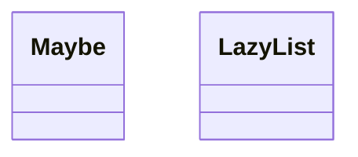
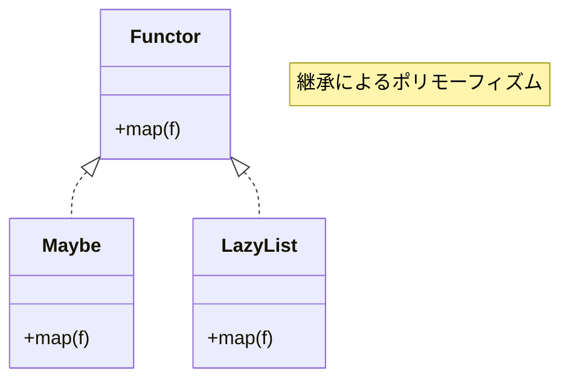
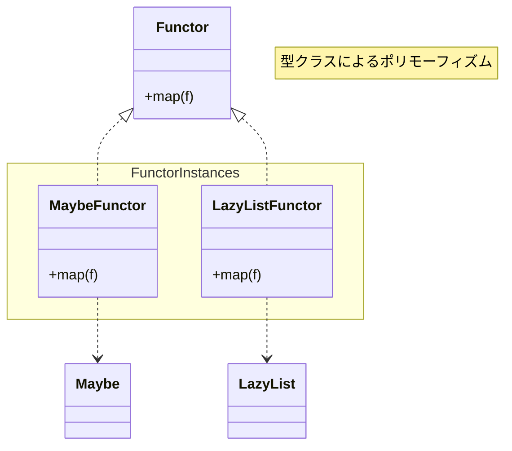

## はじめに

Java の `Optional` や `Stream` を使ってコードは書いているものの `map` や `flatMap` って何者だろう、
`for` 文でも同じことできるよね？と思っている人向けに `Optional`、`Stream` と同じ機能を提供するコードを実装しながら Functor へと誘う記事を書いてみる。

この手の記事は世の中にたくさん出回っている。
何故たくさん出回ってしまうのかと言えば最初の一歩が難しく、挫折してしまう人が多いからだと思う。
また、自身の理解度を高める上でアウトプットとして技術記事を書くのは有効な手段なので、それを実践しているというのもあるだろう。

それでも本記事を書くのは、巷に溢れる関数型プログラミング由来の概念の解説記事を読んでもなんのこっちゃとなってしまった人向けにより優しい入門が必要だと思ったからだ。
そのため、用語や数学的な概念部分において厳密さを求めていない。
また、単に Functor を解説するのではなく、Functor に辿りつくまでに寄り道をしつつ目的地まで進むので諸々のことを知っている人には回りくどく感じてかもしれない。

## 想定読者

- Java 21 の基本的な構文が理解できる人 (17 を知っていれば雰囲気で読む分には困らないはず)[^Java21]
- `Optional` を使ったコードを書いているけどその背景を知らない人
- 触ったことがない言語 (Scala) のコード例が出てきても問題ない人 (構文の解説あり)

解説のため具体的なプログラミング言語として Java、Scala を用いるが、何かしらのプログラミング言語を一つでも使えるレベルまで習得している人であれば理解できるように努めたい (願望)。

[^Java21]: 当初は Java 17 の範囲で解説しようとしたが `switch` 式のパターンマッチが貧弱で断念

## `map` を理解するまでの道のり

本記事は次の流れで進行する。

- Java で `Optional` に似た `Maybe` クラスを実装
- `Maybe` に `map` メソッドを追加
- Java で `Stream` に似た `LazyList` クラスを実装
- `LazyList` に `map` メソッドを追加
- `map` に望むこと
- `Functor` の導入
- `Scala` で `Maybe`、`LazyList` を実装
- 型クラスの導入
- ふりかえり
- そして `Monad` へ続く (次の記事<sup>[予定]</sup>)

## Java で Maybe クラスを実装

はじめに `Maybe` という名前でよく知られているデータ構造を Java で実装する。
このデータ構造は `Maybe` という名前の他、`Option` や `Optional` と呼ばれることが多い [^Option型]。
`Maybe` :thinking: 初めて聞いたな、という人は Java の `Optional` のようなものだと思ってもらって大丈夫だ。
ただし `Optional` とは異なり、値が `null` になっても `Optional#empty()` のような値が存在しないことを表現する値へ変換はされない。

`Maybe` は、`Optional` と同様に値が存在する、もしくは値が存在しないの二つのパターンを表現する。
`Optional` では存在する場合と存在しない場合を表現するインスタンスが内部クラスに隠れてしまっているため意識することはなかったかもしれないが、
値が存在する場合はフィールドに `value` という変数で値を持つ `Optional` のインスタンスと、`value` に `null` が代入された `Optional` のシングルトンインスタンスの二つでそれぞれ表現している[^Optionalの実装]。

[^Option型]: [Option型 - Wikipedia](https://ja.wikipedia.org/wiki/Option%E5%9E%8B)
[^Optionalの実装]: https://github.com/openjdk/jdk21/blob/master/src/java.base/share/classes/java/util/Optional.java

`Maybe` では `Just` で値が存在する場合を表現し、`Nothing` で値が存在する。
最初の実装は次のようなコードとなる。

```java Maybe.java
public sealed interface Maybe<T> {

  public class Just<T>(T value) implements Maybe<T> {
  }

  public record Nothing<T>() implements Maybe<T> {
  }
}
```

Java 17 に慣れていない人は `sealed` (シール) というキーワードを初めて見るかもしれない。
簡単に説明すると sealed interfaces は同一クラス内でのみ拡張または実装されることを強制することができる。
今回の場合は、`Maybe` を実装するのは同一ファイルに定義された `Just`、`Nothing` レコードのみでそれ以外のインターフェースを継承、クラスやレコードで実装することはできない。
また、sealed interfaces では合わせて `pertmis` というキーワードも新たに導入されているが使っていないため説明は省略する。
気になる人は Oracle の[解説](https://docs.oracle.com/javase/jp/15/language/sealed-classes-and-interfaces.html)を参照のこと。

話を戻そう。`Maybe`、`Just`、`Nothing` の定義は簡単だ。これだけでも一応使える。
`jshell` を起動して `Maybe` クラスを読み込んだ後、次のコードを実行してみて欲しい。

```java jshell
Maybe<String> hello = new Maybe.Just<>("Hello");

switch (hello) {
  case Maybe.Just(var value) -> System.out.println(value);
  case Maybe.Nothing nothing -> System.out.println("Goodbye");
}

Maybe<String> silent = new Maybe.Nothing<>();

switch (silent) {
  case Maybe.Just(var value) -> System.out.println(value);
  case Maybe.Nothing nothing -> System.out.println("Goodbye");
}
```

<details>
<summary>実行結果</summary>

```java jshell
$ jshell --enable-preview
|  JShellへようこそ -- バージョン21.0.5
|  概要については、次を入力してください: /help intro

jshell> public sealed interface Maybe<T> {
   ...>
   ...>     public record Just<T>(T value) implements Maybe<T> {
   ...>     }
   ...>
   ...>     public record Nothing<T>() implements Maybe<T> {
   ...>     }
   ...> }
|  次を作成しました: インタフェース Maybe

jshell> Maybe<String> greeting = new Maybe.Just<>("Hello");
   ...>
   ...> switch (greeting) {
   ...>   case Maybe.Just(var value) -> System.out.println(value);
   ...>   case Maybe.Nothing nothing -> System.out.println("Goodbye");
   ...> }
   ...>
   ...> Maybe<String> silent = new Maybe.Nothing<>();
   ...>
   ...> switch (silent) {
   ...>   case Maybe.Just(var value) -> System.out.println(value);
   ...>   case Maybe.Nothing nothing -> System.out.println("Goodbye");
   ...> }
hello ==> Just[value=Hello]
Hello
silent ==> Nothing[]
Goodbye
```

</details>

`Maybe` には何のメソッドも用意されていないが、値が存在すること、値が存在しないことを表現できているのがわかるだろう。
しかし、それは何も特別なことではなく、値が存在すればレコード (`Just`) のコンストラクタに渡してフィールドに値を持たせ、値が存在しないければフィールドを持たないクラス (`Nothing`) のインスタンスが生成しているだけに過ぎない。
それ以上でも、それ以下でもない。これにて閉廷！

とはならない。次の話に進む前に今の実装は少しばかり不便なので `Maybe` インターフェースにメソッドを追加する。

```java Maybe.java
public sealed interface Maybe<T> {

  public static <T> Maybe<T> just(T value) {
    return new Just<>(value);
  }

  public static <T> Maybe<T> nothing() {
    return new Nothing<>();
  }

  // !collapse(1:6) collapsed
  // ...
  public record Just<T>(T value) implements Maybe<T> {
  }

  public record Nothing<T>() implements Maybe<T> {
  }
}
```

気を取り直して次のような場面を考えてみよう。ここに 2/3 の確率で鳴く猫がいる :thinking:。

```java jshell
Maybe<String> meow() {
  var rand = new Random();
  var num = rand.nextInt(3);

  if (num == 0) {
    return Maybe.nothing();
  } else if (num == 1) {
    return Maybe.just("Meow");
  } else if (num == 2) {
    return Maybe.just("Mew");
  }

  return Maybe.nothing();
}
```

この猫が鳴いたときだけ鳴き声によって `Meow World` もしくは `Mew World` という文字列を作りたい。
さて、どのようなコードを書けばどうすればよいだろうか。
愚直に書くなら次のようなコードになるだろう。

```java jshell
var maybeMeow = meow();

Maybe<String> meowHello = switch (maybeMeow) {
  case Maybe.Just just -> Maybe.just(just.value() + " World");
  case Maybe.Nothing nothing -> Maybe.nothing();
};
```

猫が鳴いていたときだけ末尾に ` World` を付けたいだけなのに…なんだが凄いことになっちゃったぞ。

毎回これをやらねばならぬのか？

### `Maybe` に `map` メソッドを実装

その日人類は思い出した。
`Maybe` に支配されていた恐怖を…
`Maybe` の中に囚われていた屈辱を……

`Maybe` の中身に触ろうとする度に `swtich` 式を書くのは現実的ではない。
我々は既に解決方法を知っていたはずだ。`Optional` でいうところの `map` メソッドがあればいいということを。
早速 `Maybe` に `map` メソッドを追加してみよう。

やるんだな！？今！ここで！

```java Maybe.java
public sealed interface Maybe<T> {

  // !mark(1:1)
  <U> Maybe<U> map(Function<? super T, ? extends U> mapper);

  // !collapse(1:8) collapsed
  // ...
  public static <T> Maybe<T> just(T value) {
    return new Just<>(value);
  }

  public static <T> Maybe<T> nothing() {
    return new Nothing<>();
  }

  public record Just<T>(T value) implements Maybe<T> {

    // !mark(1:4)
    @Override
    public <U> Maybe<U> map(Function<? super T, ? extends U> mapper) {
      return new Just<>(mapper.apply(value));
    }
  }

  public record Nothing<T>() implements Maybe<T> {

    // !mark(1:4)
    @Override
    public <U> Maybe<U> map(Function<? super T, ? extends U> mapper) {
      return new Nothing<>();
    }
  }
}
```

`Maybe` はインターフェースなので `map` メソッドのシグネチャだけを宣言し、`Just`、`Nothing` にそれぞれ実装を任せることにした。
実装の中身に難しいところはない。`Just` ではにフィールドの `value` に引数で受け取った `mapper` を適用し、計算結果を持つ `Just` のインスタンスを改めて生成している。
`Nothing` の場合は、返り値の型パラメータを `U` にする必要がある関係で `Nothing` をインスタンスを作り直している。
ここでは、インターフェースでメソッドを宣言し、`Just`、`Nothing` で実装する方式を採用したが、次のような実装をしても問題ない。

```java Maybe.java
public sealed interface Maybe<T> {

  // !mark(1:6)
  default <U> Maybe<U> map(Function<? super T, ? extends U> mapper) {
    return switch (this) {
      case Maybe.Just(var value) -> Maybe.just(mapper.apply(value));
      case Maybe.Nothing nothing -> nothing();
    };
  }

  // !collapse(1:14) collapsed
  // ...
  public static <T> Maybe<T> just(T value) {
    return new Just<>(value);
  }

  public static <T> Maybe<T> nothing() {
    return new Nothing<>();
  }

  public record Just<T>(T value) implements Maybe<T> {
  }

  public record Nothing<T>() implements Maybe<T> {
  }
}
```

しかし、オブジェクト指向の考えに従うのであれば前者の方が自然な実装だろう<sup>[要出典]</sup>。

さっそく 2/3 の確率で鳴く猫のコードを `map` で書き直してみよう。

```java jshell
var maybeMeow = meow();

var meowHello = maybeMeow.map(v -> v + " Hello");
```

先ほどのコードを比べると一目瞭然。書きたい処理が明確に表現できている。
また、ご存知の通り `map` メソッドは汎用的に用いることができるため、
`Maybe` が持つ値の型に依らず値が存在するときだけ存在する値に処理を適用することにフォーカスしてコードを記述できる。

最初の目標である `Maybe` の `map` メソッドの実装まで行ったので次に `LazyList` に話を移そう。

## Java で `LazyList` を実装

ここで実装する `LazyList` は Java でいうところの `Stream` に似たデータ構造だ。
ただし、`Stream` とは違い今から実装する `LazyList` は更に計算を遅延する。

`map` を説明するための例として `LazyList` を採用したが二分木くらいにしておくべきだったかと少し後悔している。
`Optional` と比べると複雑になってしまい、本質的でない部分が多くなってしまった。
この手のコードに見慣れていない人にとってはスラスラ読めないかもしれないが難しいことをしているわけではないので一つずつ理解していって欲しい。

さっそく `LazyList` の実装に入ろう。`LazyList` の基本的な構造は連結リストと同じだ。
連結リストとの違いはコンスセルで値とリンクを直接持つのではなく、必要になって初めて計算される仕組みを提供する `CallByNeed` として持つ。
`CallByNeed` については `LazyList` の実装の後に見る。
まずは `LazyList` の実装を確認しよう。

```java LazyList.java
public sealed interface LazyList<T> {

  public record Cons<T>(CallByNeed<T> t, CallByNeed<LazyList<T>> tail) implements LazyList<T> {
  }

  public record Nil<T>() implements LazyList<T> {
  }

  public static <T> LazyList<T> cons(CallByNeed<T> t, CallByNeed<LazyList<T>> tail) {
    return new Cons<>(t, tail);
  }

  public static <T> LazyList<T> nil() {
    return new Nil<>();
  }
}
```

`Mabye` で行ったようにインスタンス生成を補助するために二つの静的メソッド `cons`、`nil` も一緒に実装している。
`CallByNeed` が気になるものの、連結リストを実装したことがある人にとっては馴染みのあるデータ構造となっているだろう。

### `CallByNeed` (必要呼び)

次に `CallByNeed` の実装を見てみよう。
こちらも `LazyList` と同様にインスタンスの生成を補助する静的メソッド `of`、`lazy` なので気にしなくて問題ない。

```java CallByNeed.java
public class CallByNeed<T> {

  private final Supplier<T> t;

  private boolean evaluated;

  private T get;

  public CallByNeed(Supplier<T> t) {
    this.t = t;
  }

  public synchronized T get() {
    if (evaluated) {
      return this.get;
    }

    this.get = t.get();
    this.evaluated = true;

    return this.get;
  }

  public static <T> CallByNeed<T> of(T value) {
    return new CallByNeed<>(() -> value);
  }

  public static <T> CallByNeed<T> lazy(Supplier<T> t) {
    return new CallByNeed<>(t);
  }
}
```

`ClassByNeed` クラスはコンストラクタで `Supplier` を受け取ってフィールドで値を持つ。
`Supplier` は呼ぶと値が返ってくる  `get` メソッドを定義する関数型インターフェースだ。
これにより、コンストラクタで受け取った段階では値を求める計算は発生せず、`CallByNeed` の `get` メソッド内で初めて `Supplier` の `get` メソッドを呼んで値を取り出している。
`Supplier` と `CallByNeed` の違いとして、`Supplier` は呼び出される度に `get` メソッド内の処理がすべて実行されるが、
`CallByNeed` ではコンストラクタで受け取った `Supplier` の `get` メソッドが一度でも呼ばれると二回目以降は一回目の値をキャッシュして返す。

この違いは次のようなコードを書くと一目でわかる。

```java
Supplier<String> supplier = () -> {
  System.out.println("supplier called");
  return "supplier";
};

supplier.get();
supplier.get();

CallByNeed<String> callByNeed = new CallByNeed<>(() -> {
  System.out.println("callByNeed called");
  return "callByNeed";
});

callByNeed.get();
callByNeed.get();
```

`Supplier`、`CallByNeed` で文字列を標準出力に出力するような処理を渡してそれぞれの `get` メソッドを二回呼び出す。
この実行結果は次のようになる。

```java jshell
jshell> Supplier<String> supplier = () -> {
   ...>   System.out.println("supplier called");
   ...>   return "supplier";
   ...> };
   ...>
   ...> supplier.get();
   ...> supplier.get();
   ...>
   ...> CallByNeed<String> callByNeed = new CallByNeed<>(() -> {
   ...>   System.out.println("callByNeed called");
   ...>   return "callByNeed";
   ...> });
   ...>
   ...> callByNeed.get();
   ...> callByNeed.get();
supplier ==> $Lambda$21/0x000000030100a000@312b1dae
supplier called
$2 ==> "supplier"
supplier called
$3 ==> "supplier"
callByNeed ==> CallByNeed@cc34f4d
callByNeed called
$4 ==> "callByNeed"
$5 ==> "callByNeed"
```

`supplier` は `supplier called` を 2 回出力しているのに対して `callByNeed` は 1 回だけ `callByNeed called` を出力している。
このように `callByNeed` は 1 回だけコンストラクタに渡された `Supplier` の `get` メソッドを呼び、2 回目以降はキャッシュした値を返す。
少しだけ賢い (?) `Supplier` だと思えばよさそうだ。

`CallByNeed` について理解したところで `LazyList` のインスタンスを生成してみよう。

```java jshell
jshell> LazyList.cons(CallByNeed.of(2), CallByNeed.of(LazyList.cons(CallByNeed.of(1), CallByNeed.of(LazyList.nil()))))
$3 ==> Cons[t=CallByNeed@31cefde0, tail=CallByNeed@439f5b3d]
```

よし、生成できた。でも中身がわからない :stuck_out_tongue_closed_eyes:

中身を視覚的に確認できないのは困るので `LazyList` から Java 標準の `List` へ変換するメソッド `toList` を追加しよう。

```java LazyList.java
public sealed interface LazyList<T> {

  default List<T> toList() {
    var xs = new ArrayList<T>();

    var h = this;
    while (h instanceof Cons<T> cons) {
      xs.add(cons.t().get());
      h = cons.tail().get();
    }

    return Collections.unmodifiableList(xs);
  }

  // !collapse(1:15) collapsed
  // ...

  public record Cons<T>(CallByNeed<T> t, CallByNeed<LazyList<T>> tail) implements LazyList<T> {
  }

  public record Nil<T>() implements LazyList<T> {
  }

  public static <T> LazyList<T> cons(CallByNeed<T> t, CallByNeed<LazyList<T>> tail) {
    return new Cons<>(t, tail);
  }

  public static <T> LazyList<T> nil() {
    return new Nil<>();
  }
}
```

ここでは `LazyList` の要素を先頭から辿りながら `ArrayList` に追加していき、最後に変更不可のリストにして返すように実装した。
さっそく先ほどの `toList` を使って `LazyList` を目に見える形に変換しよう。

```java jshell
jshell> LazyList.cons(CallByNeed.of(2), CallByNeed.of(LazyList.cons(CallByNeed.of(1), CallByNeed.of(LazyList.nil())))).toList()
$5 ==> [2, 1]
```

ちゃんとリストに変換できているようだ。

### `LazyList` に `map` を実装

準備もできたことだし `LazyList` に `map` メソッドを実装してみよう。

```java
public sealed interface LazyList<T> {

  // !mark(1:1)
  <U> LazyList<U> map(Function<? super T, ? extends U> mapper);

  // !collapse(1:12) collapsed
  // ...
  default List<T> toList() {
    var xs = new ArrayList<T>();

    var h = this;
    while (h instanceof Cons<T> cons) {
      xs.add(cons.t().get());
      h = cons.tail().get();
    }

    return Collections.unmodifiableList(xs);
  }

  public record Cons<T>(CallByNeed<T> t, CallByNeed<LazyList<T>> tail) implements LazyList<T> {

    // !mark(1:6)
    @Override
    public <U> LazyList<U> map(Function<? super T, ? extends U> mapper) {
      return LazyList.cons(
        CallByNeed.lazy(() -> mapper.apply(t.get())),
        CallByNeed.lazy(() -> tail.get().map(mapper)));
    }
  }

  public record Nil<T>() implements LazyList<T> {

    // !mark(1:4)
    @Override
    public <U> LazyList<U> map(Function<? super T, ? extends U> mapper) {
      return new Nil<>();
    }
  }

  // !collapse(1:8) collapsed
  // ...
  public static <T> LazyList<T> cons(CallByNeed<T> t, CallByNeed<LazyList<T>> tail) {
    return new Cons<>(t, tail);
  }

  public static <T> LazyList<T> nil() {
    return new Nil<>();
  }
}
```

`CallByNeed` を使っているためセルの値やリンクを取り出すときは `get` メソッドを呼ばないといけないが、
コンスセルの値に対して引数で受け取った関数 (`mapper`) を適用し、後続のリストに対しては `map` を再帰的に呼び出している。
その後、それらの値を持つ `Cons` を新たに生成している。
新しいコンスセルの値、リンクのいずれも計算を `CallByNeed` によって遅延しているため `map` を呼び出した時点では一切計算されない。
そして、終端である `Nil` の `map` メソッドの実装では何もせずに `Nil` のインスタンスを生成して返すだけだ。

さっそく `LazyList` の `map` を使ってそれぞれの要素を 2 倍してみよう。

```java jshell
jshell> LazyList.cons(CallByNeed.of(2), CallByNeed.of(LazyList.cons(CallByNeed.of(1), CallByNeed.of(LazyList.nil())))).map(v -> v * 2).toList();
$6 ==> [4, 2]
```

`LazyList` のままだと中身を確認できないため最後に `toList` を呼んで `List` に変換している。

これだけでは計算が遅延されていることが確認できないため、次のようなコードを考えてみよう。

```java
LazyList.cons(CallByNeed.of(2), CallByNeed.of(LazyList.cons(CallByNeed.of(1), CallByNeed.of(LazyList.nil()))))
  .map(v -> {
    System.out.println(v + " * 2");
    return v * 2;
  })
  .map(v -> {
    System.out.println(v + " + 1");

    return v + 1;
  });
```

それぞれの要素を 2 倍した後に 1 を足している。また、その過程で計算内容を標準出力に出力している。
このコードを jshell に渡してみよう。

```java jshell
jshell> LazyList.cons(CallByNeed.of(2), CallByNeed.of(LazyList.cons(CallByNeed.of(1), CallByNeed.of(LazyList.nil()))))
   ...>   .map(v -> {
   ...>     System.out.println(v + " * 2");
   ...>     return v * 2;
   ...>   })
   ...>   .map(v -> {
   ...>     System.out.println(v + " + 1");
   ...>
   ...>     return v + 1;
   ...>   });
$7 ==> Cons[t=CallByNeed@446cdf90, tail=CallByNeed@799f7e29]
```

`Stream` と同じようにこの段階では `map` に渡した関数内に書かれた標準出力への出力処理は行なわれない。
`$7` に対して `toList` を呼び出し、`LazyList` を `List` に変換したタイミングで初めて実行される。

```java jshell
jshell> $7.toList()
2 * 2
4 + 1
1 * 2
2 + 1
$8 ==> [5, 3]
```

また、出力を見るとわかるが `* 2`、`+ 1` の順番で先頭から計算されていることがわかる。
つまり、`Stream` と同じようにリストの走査は 1 度だけ行なわれる。

さて、ここからが `Stream` と異なる部分になるが `Stream` は一度 `toList` を呼ぶと 2 回目の呼び出しで例外がスローされる。
これはメモリ効率的にはよくなっているが、既に呼び出されているかを気にせずに扱いたい場合には少しばかり不便だ。
一方、`LazyList` は `toList` を複数回呼び出しても問題ない。
`toList` の実装から明らかではあるが、呼び出す度に新しいリストを生成するため効率はよくない。

```java jshell
jshell> $7.toList()
$9 ==> [5, 3]
```

実行結果を見るとわかるが、各セルの値は最初の `toList` を呼んだタイミングで一度計算されているため、 2 回目以降に `map` で渡した処理が実行されることはない :muscle:

話が `map` から離れてしまったので `LazyList` と戯れるのはこのくらいにして前に進もう。

## `map` に望むこと

さて、`Maybe` と `LazyList` の `map` という名前のメソッドを実装したが `map` メソッドとは何だったのだろうか。
もう一度 `map` メソッドのシグネチャを思い出してみよう。

```java
<U> Maybe<U> map(Function<? super T, ? extends U> mapper);
```

```java
<U> LazyList<U> map(Function<? super T, ? extends U> mapper);
```

さて、どちらも似たようなシグネチャをしており、`Maybe` も `LazyList` も型変数を一つだけ受け取るような型で `map` メソッドは `Maybe`、`LazyList` の持つ要素を引数で受け取った `mapper` に渡して `T` 型の値から `U` 型の値に変換している。
もし、この二つをより一般的に定義できるのであれば、オブジェクト指向的に考えると `Maybe`、`LazyList` はいずれも `map` というメソッド操作を行えるという性質を持つということだろう。
こういう場合、オブジェクト指向プログラミング言語ではインターフェース (抽象型) を用いて実現しようとする。
それでは、`map` メソッドを持つインターフェースを `Mappable` と名付けて Java で表現できるか考えてみよう。

Java で無理矢理 `Mappable` を定義して `Maybe` で実装すると次のようになるだろうか。

```java
public interface F<T> {
}

public interface Mappable<F, T> {

  <U> F map(Function<? super T, ? extends U> mapper);
}

public sealed interface Maybe<T> extends Mappable<Maybe, T> {

  public record Just<T>(T value) implements Maybe<T> {

    @Override
    public <U> Maybe<U> map(Function<? super T, ? extends U> mapper) {
      return new Just<>(mapper.apply(value));
    }
  }

  public record Nothing<T>() implements Maybe<T> {

    @Override
    public <U> Maybe<U> map(Function<? super T, ? extends U> mapper) {
      return new Nothing<>();
    }
  }
}
```

Java では高階型が使えないため `F` という型を一つ受け取る型を定義してそれを使って `Mappable` を定義している。
よりよい定義の方法があるように思うが、今はこれで満足しよう。
この辺の話が気になる人は [Java で higher kinded polymorphism を実現する #Java - Qiita](https://qiita.com/lyrical_logical/items/2d68d378a97ea0da88c0) を読もう。
これで `map` メソッドを持っている、という性質を `Mappable` というインターフェースで表現できた。

インターフェースに落とし込めたところで改めて `map` の定義について考えてみる。
インターフェースが定めるのはあくまでメソッドのシグネチャだけでその定義まで制限することはできない。
そのため、`Maybe` の `map` の実装は次のようになっていてもコンパイルできるか、という点では何も問題ない。

```java
public sealed interface Maybe<T> extends Mappable<Maybe, T> {

  public record Just<T>(T value) implements Maybe<T> {

    @Override
    public <U> Maybe<U> map(Function<? super T, ? extends U> mapper) {
      return new Nothing<>();
    }
  }

  public record Nothing<T>() implements Maybe<T> {

    @Override
    public <U> Maybe<U> map(Function<? super T, ? extends U> mapper) {
      return new Nothing<>();
    }
  }
}
```

ここで `map` メソッドは `Just` であっても `Nothing` であっても常に `Nothing` を返す。
このようなコードであってもコンパイルは通る。しかし、実際のプログラミングで何か役に立つようなことはないだろう。
つまり、`map` メソッドは単にシグネチャを満たす以上の何かがなければならないようだ。
これは `map` に限った話ではなく、インターフェースが定義するメソッドの実装をするとき、その実装はインターフェースを定義したときに想定される**何かしらの機能**が実現されることを実装に対して望む。
それでは `map` が望む**何かしらの機能**とは何だろうか。

`Maybe`、`LazyList` の二つの例から得られる直観は、コンテナのようなもののすべての要素に対して引数で受け取った関数を適用するメソッドだろうか。
もしそれが正しいと仮定したとき、その性質を厳密に定めることはできないだろうか。

## Functor の導入

そこで導入されるのが **Functor (関手)** だ。Functor は[圏論](https://ja.wikipedia.org/wiki/%E5%9C%8F%E8%AB%96)に由来する概念だが、プログラマにとっての Functor は前述の `Mappable` の実装に制限を加えたものになる。
その制限は Functor 則と呼ばれており、次の 2 つのことを指す。
ここではかなり緩い説明になっているため厳密な定義を知りたい場合は他のサイトや書籍をあたって欲しい。
また、説明の都合から Java によるコードを用いているため、数学的には厳密な説明ではない。

1. 恒等律の保存

    ```java
    fa.map(Function.identity()) === Function.identity().apply(fa)
    ```

    この式は「`fa` の `map` に恒等関数を渡した結果 (左辺)」 と「`fa` に恒等関数を適用した結果 (右辺)」は任意の `fa` について等しいように `map` は定義されなければならない、と言っている。
    つまり、恒等射を `map` に渡しても `fa` の持つ値は変わらないように `map` を実装せよ、ということだ。

2. 合成の保存

    ```java
    fa.map(f.compose(g)) === fa.map(f).map(g)
    ```

    この式は「`fa` の `map` に関数 `f`、`g` の合成を渡した結果 (左辺)」と「`fa` の `map` に `f` を渡した結果に対して `map` を呼び出して `g` を渡した結果 (右辺)」は任意の `fa`、`f`、`g` について等しいように `map` は定義されなければならない、と言っている。
    つまり、`map` の中身に合成された関数を適用した結果と、合成されている関数を別々に `map` に渡しても結果は常に同じくなるように実装せよ、ということだ。

ここで `fa` は `Maybe` や `LazyList` のような `map` を実装するクラスの任意のインスタンスを表している。
これら二つの規則を満たすような `map` を実装している `Maybe` や `LazyList` は Functor と呼ばれているものになる [^Functor]。

[^Functor]: 圏論における関手は圏の対象と射をここで説明した性質を満たしつつ別の圏に移す対応付けのことを指す。プログラミングにおいて関手を考えるとき、対象は型のことを指し、射は関数のことを指す。詳しくは Hask 圏で検索検索ゥ！

さて、この二つを `map` が満たすか、という視点で `Maybe` の役に立たない `map` の実装を思い出してみよう。
`Just`、`Nothing` のいずれも `Nothing` を返す実装では恒等律を満たさないことに気がつくだろう。
具体的に `Maybe.just(1)` を考えると、左辺は次のようになるが、

```java
Maybe.just(1).map(Function.identity())
// ==> Nothing[]
```

右辺は、次のような結果となる。

```java
Function.identity().apply(Maybe.just(1))
// ==> Just[value=1]
```

当然これらは等しくないため恒等律は満たされない。

```java
Maybe.just(1).map(Function.identity()) != Function.identity().apply(Maybe.just(1))
```

つまり、常に `Nothing` を返すような実装では Functor としての実装にはふさわしくなかったということだ。

それでは最初に実装した `Maybe` の `map` や `LazyList` の `map` はこれらの規則を満たしているのだろうか。
それは読者であるみなさん自身で確認してもらいたい。

Functor とは何か、ということを Java を使って説明した。
本記事では `Maybe` や `LazyList` を使って説明したが Functor 則を満たしつつ、`map` のようなメソッドを実装できるデータ構造はいくらでもある。
普段のプログラミングで使っている型を思い出して、あれも実は `Functor` なのではないかと考えを巡らしてみよう。
そうするといたるところに Functor が潜んでいることに気がつくだろう。

Java 標準の `ArrayList` に対しても Functor 則を満たすような `map` メソッドが定義できることは `LazyList` の例からも明らかだろう。
しかし、ここで一つ問題がある。`Mappble` のようなインターフェースを実装させる方法では既存のクラスに `map` メソッドを追加することができない。
そのため、次のような `static` メソッドとして実装するか、

```java
public class ArrayListOps {

  public <T, U> ArrayList<U> map(ArrayList<T> xs, Function<? super T, ? extends U> mapper) {
    // ...
  }
}
```

`map` を持つようなクラスに変換 (Java 標準の `Stream` のように) しなければならない。
それを既存のクラスに入れて回るのは大変なので Java 標準では `map` のような操作をしたければ `Stream` を経由して行うことになる。
値を `ArrayList` で持っていたとしても `map` を使いたければ**計算を遅延することが目的でなくとも** `stream` メソッドを呼んで `Stream` に変換した後、`toList` メソッドや `collect` メソッドを使って `List` に戻す、ということをしなければならない。
これは標準ライブラリのクラスに対してだけでなく、誰かが作ったクラスに Functor 則を満たす `map` が定義できる！、自分が過去に書いたクラスに Functor 則を満たす `map` を定義できる！と思ったときに同じような悩みが発生する。

これまで見てきたように `map` は `Maybe` や `LazyList` のようなデータ構造に対して中身を取り出すことなく関数を適用するような操作を提供してくれる便利な操作だ。
しかし、Java で同じようなことをしたいと思ったら障害が多い。
それでは Haskell や Scala をはじめとする Functor を活用している言語では `map` のような操作をオブジェクト指向で言うところの抽象データ型とは異なるアプローチで実現している。

ここからは Java の世界から Scala の世界に足を踏み入れてみよう。

### One more thing...

Functor について知ったところで Java の `Optional` を思い出してみよう。そこで問題。

> Q. `Optional` は Functor だろうか？

<details>
<summary>答え</summary>

> A. **Functor ではありません :-1:**

理由は考えてみてください。ヒントとして `null` が絡んだ場合の合成を考えると、合成の保存が成り立たない例を見つけられるでしょう。
</details>

## Scala で `Maybe`、`LazyList` を実装

ここから先は Scala 3 のコードを使って説明する。
Java では[型クラス](https://ja.wikipedia.org/wiki/%E5%9E%8B%E3%82%AF%E3%83%A9%E3%82%B9)と呼ばれる言語機能を提供していないからだ。
型クラスの基本的な仕組みについては [香川大学の講義資料 (?)](https://guppy.eng.kagawa-u.ac.jp/2006/Declarative/Text/Chapter2.pdf) が参考になるだろう。
こちらの資料で説明しているのは Haskell の型クラスとなっている (Scala も同じように型クラスを処理しているかはわからない)。
この記事を読む上では知る必要のないことなので、気になった人は後で調べてみて欲しい。

Java では jshell を使ってシェル上でコードを試していたが、ここからは Scala CLI 上でコードを実行する。
手元に Scala の実行環境を用意するのが面倒な人は [Scastie](https://scastie.scala-lang.org/) にコードを貼って動作を確認して欲しい。
Scala CLI の使い方については、日本語の記事だと [初心者向け: Scala CLIでScalaをはじめよう - Lambdaカクテル](https://blog.3qe.us/entry/2023/12/20/011354) が参考になる。

さっそく Java で定義した `Maybe` と `LazyList` を Scala で実装してみよう。

### `Maybe`

`Maybe` の Scala による実装は次のようになる [^enum]。

[^enum]: あとから気がついたが `enum` を使った実装の方が Scala 3 としてはいいのかもしれない。Scala 2 から頭の中をアップデートできていない弊害か…。

```scala Maybe.scala
sealed trait Maybe[T]

case class Just[T](val value: T) extends Maybe[T]

case class Nothing[T]() extends Maybe[T]
```

Java にも `sealed` キーワードや `record` が導入されたため、このあたりの Scala と Java のコードは以前よりも大分似てきている。
`Maybe` の `map` については後で実装するので先に `LazyList` の Scala による実装も見てみよう。

### `LazyList`

Scala での `LazyList` の実装は次のようになる。
Scala では標準ライブラリに `LazyList` が存在しているため、ここでは `MyLazyList` という名前で定義している。

```scala MyLazyList.scala
sealed trait MyLazyList[T] {

  def toList(): List[T] =
    this match {
      case cons @ Cons(_, _) => cons.value :: cons.tail.toList()
      case Nil() => List()
    }
}

case class Cons[T](val t: () => T, val xs: () => MyLazyList[T]) extends MyLazyList[T] {
  lazy val value = t()

  lazy val tail = xs();
}

case class Nil[T]() extends MyLazyList[T]
```

Java との違いとして `toList` でのパターンマッチと `lazy val` というキーワードだろうか。
Scala では Java の switch 相当の機能は `... match { case ... => ...}` という形で書く。
基本的な構造は Java の swtich と同じなのでキーワードが違うことがわかれば読めるでしょう。
ここで Java と違うのは `cons @ Cons(_, _)` という書き方だ。
`@` の左側にマッチしたパターン全体を束縛する変数を書き、マッチさせるパターンを `@` の右側に書く。
`_` は束縛しない変数を表す。
つまり `this` が `Cons(_, _)` というパターンだったら `Cons(_, _)` が `cons` に束縛されて `=>` の右側のコードが実行される。

`toList` は Java では `ArrayList` に詰めていくような実装をしていたが、ここではリストを連結していくような実装にしている。
ここでは楽をするためこのような実装としているが、リストが長くなるとスタックオーバーフローが発生するため遊びのコード以外では書かないように。

## 型クラスの導入

さぁ、ここからが本題。Scala で実装した `Maybe`、`MyLazyList` に `map` を実装するわけだが、Java とは違い型クラスを使い実装していく。
型クラスって何ぞ？と思うかもしれないが今は Java にはない言語機能の一つだと思ってもらえればいい。

### `Functor` 型クラス

Scala で Functor をコードに落として込むと次のようになる。

```scala
trait Functor[F[_]]:
  extension [A](fa: F[A]) {
    def map[B](f: A => B): F[B]
  }
```

これは解説が必要だろう。`trait` は `Maybe` や `MyLazyList` の定義でも出てきたが Java で言うところの `interface` と同じような意味のキーワードだ。
`trait Functor[F[_]]` は Javaで表現するなら `interface Function<F<?>>` のようになる。
Java では型を受け取る型を定義できなったが Scala ではそのような型を扱うことができる。
このような型を受け取る型を**高カインド型**という。
高カインド型についてより知りたい人は [関数型言語で登場する高カインド型(Higher-Kinded Types; HKT) と(* -> *) -> *みたいなやつの早わかりメモ - Lambdaカクテル](https://blog.3qe.us/entry/2023/10/09/211915) が参考になるだろう。

ここで `F[_]` は `Maybe[T]` や `MyLazyList[T]` のような任意の型 `T` を受け取る型である `Maybe`、`MyLazyList` を変数 `F` として扱うことを宣言している。
つまり、`Functor` は任意の型を受け取る型について定義されるということを表現している。

次のキーワード `extension` は既存の型を拡張するために使われる。
ここでは `F[A]` 型の値について `map` メッドを追加することを宣言している。
`A` は任意の型で `map` はこれまで見てきたシグネチャと同じだ。
ここだけ見ると `fa` が使われていないためどのように使われるかわからないが、ここではシグネチャを宣言しているだけに過ぎないので実際の使われ方は後からこの後に解説する。
TypeScript の関数の型も引数の名前がシグネチャに含まれて宣言されるが、それと同じようなものだと思ってもらえればよい [^TypeScript]。
`extension` についてより詳しい解説が欲しい人は[公式ドキュメント](https://docs.scala-lang.org/scala3/reference/contextual/extension-methods.html)を参照して欲しい。

[^TypeScript]: [関数の型の宣言 (function type declaration) | TypeScript入門『サバイバルTypeScript』](https://typescriptbook.jp/reference/functions/function-type-declaration)

これだけ見ると Java の `interface` と変わないと思うかもしれないが `Functor` を使って `Maybe` や `MyLazyList` に `map` メソッドを追加する方法が異なる。
Java では `interface` を `implements` を使って実装するしかなかったが Scala では違う方法で `Maybe` や `MyLazyList` に `map` メソッドを追加する。
それでは `Maybe` の例から見てみよう。

### `Maybe` Functor

`Maybe` Functor の実装は次のようになる。

```scala
given Functor[Maybe] with
  extension [A](fa: Maybe[A]) {
    override def map[B](f: A => B): Maybe[B] =
      fa match {
        case Just(v) => Just(f(v))
        case Nothing() => Nothing()
      }
  }
```

ここでは型クラスのインスタンス [^インスタンス] を定義している。
Java で `Maybe` の `map` を実装する方法を二つ紹介したが `Maybe` インターフェースのデフォルト実装と似ているため説明は不要だろう。
コードの構造に着目してみると `Functor` で宣言したシグネチャの `F` の部分を `Maybe` で具象化し、`map` の中身を埋めている、という関係がわかるだろう。
`trait` が `given` になり `:` が `with` になっている。
インターフェースに対するクラスの実装と似たような関係だ。

[^インスタンス]: この文脈におけるインスタンスはオブジェクト指向プログラミングでいうクラスのインスタンスとは異なる。型クラス (ここでは `Functor` 型クラス) に所属するデータ型 (`Maybe` や `MyLazyList`) のことを指している。

さて、問題になるのはこれを定義すると何ができるか、だろう。
REPL でここまでのコードを読み込んでみよう。

```scala REPL
scala
Welcome to Scala 3.5.2 (17.0.13, Java OpenJDK 64-Bit Server VM).
Type in expressions for evaluation. Or try :help.

scala> sealed trait Maybe[T]
     |
     | case class Just[T](val value: T) extends Maybe[T]
     |
     | case class Nothing[T]() extends Maybe[T]
// defined trait Maybe
// defined case class Just
// defined case class Nothing

scala> trait Functor[F[_]]:
     |   extension [A](fa: F[A]) {
     |     def map[B](f: A => B): F[B]
     |   }
     |
// defined trait Functor

scala> given Functor[Maybe] with
     |   extension [A](fa: Maybe[A]) {
     |     override def map[B](f: A => B): Maybe[B] =
     |       fa match {
     |         case Just(v) => Just(f(v))
     |         case Nothing() => Nothing()
     |       }
     |   }
     |
// defined object given_Functor_Maybe
```

そして次のコードを実行する。

``` scala REPL
scala> Just(1).map(_ * 2)
val res0: Maybe[Int] = Just(2)
```

なんと、`Just` (`Maybe`) には `map` メソッドが定義されていないにもかかわらず `map` メソッドを呼ぶことができた。
これが型クラスによる[ポリモーフィズム](https://ja.wikipedia.org/wiki/%E3%83%9D%E3%83%AA%E3%83%A2%E3%83%BC%E3%83%95%E3%82%A3%E3%82%BA%E3%83%A0)。
オブジェクト指向プログラミング言語では、継承によってポリモーフィズムを実現するが、Scala では継承の他に `extension` と `given` の組み合わせによる型クラス相当の機能もサポートしているためこのようなことができる。

このように Scala では異なる型を持つクラスに共通の操作を持たせたい場合、**既存のクラスに手を加えることなく**後から追加できる。
これは継承によるポリモーフィズムにはない利点だ。継承ではクラスを定義する段階で想像できていた方法でのみ型を分類 (階層化) できるが後から定義済みのクラスに対してメソッドを追加することができない。
そのため、あるクラスに Functor 則を満たす `map` が定義できることに気がついたとしても、クラスの定義段階で提供できなければ、そのクラスを継承したクラスを作るか、記事内で触れたように `static` メソッドとしてクラスに紐付かない方法で実装しなければならない。

同じことの繰り返しになるが無理矢理クラス図を使って説明しよう。
ぼくらの手元には次のよう二つのクラスがあった。



そして、これら二つのクラスにはシグネチャの似た `map` というメソッドが定義できることに気がついた。
これをオブジェクト指向プログラミング的に表現するには、継承によって Functor 則を満たすような `map` メソッドを持つ、ということを継承関係で表現した。



Java でこの関係を表現するためには、クラス図でも表現されているように `Maybe` や `LazyList` は `Functor` インターフェースを実装するように書かないといけなかった。
一方、型クラスがサポートされている言語であれば、`Maybe` や `LazyList` とは関係ないところで型を分類し、それらが `Functor` 則を満たす `map` という操作を持つことを表現できる。



`Functor` という型の分類があるのであれば、それに従ったインスタンス (図中の FunctorInstances) を定義していくことで既存の型に新しい操作を追加できる。

書きたいことを書き尽してしまったが、次に進む前に一応 `MyLazyList` の `Functor` インスタンスも見ておこう。

### `MyLazyList` Functor

`MyLazyList` の `Functor` インスタンスは次のようになる。

```scala
given Functor[MyLazyList] with
  extension [A](fa: MyLazyList[A]) {
    override def map[B](f: A => B): MyLazyList[B] =
      fa match {
        case cons @ Cons(_, _) => Cons(() => f(cons.value), () => cons.tail.map(f))
        case Nil() => Nil()
      }
  }
```

ここまでの説明が理解できていればコードが読めるはずだ。
REPL での実行結果も見ておこうか。

```scala REPL
scala> val xs: MyLazyList[Int] = Cons(() => 1, () => Cons(() => 2, () => Nil[Int]()))
val xs: MyLazyList[Int] = Cons(rs$line$6$$$Lambda$2039/0x0000008801608640@6f926d01,rs$line$6$$$Lambda$2040/0x0000008801608908@c67a89)

scala> xs.map(_ * 2)
val res0: MyLazyList[Int] = Cons(rs$line$5$given_Functor_MyLazyList$$$Lambda$2085/0x0000008801668c48@7f09ff10,rs$line$5$given_Functor_MyLazyList$$$Lambda$2086/0x0000008801668f10@531b1778)

scala> res0.toList()
val res1: List[Int] = List(2, 4)
```

`Maybe` と同じように `map` が `MyLazyList` に生えていることが確認できた。

## ふりかえり

長い旅もここで終わり。これまで見たものをふりかえってみよう。
最初に Java で `Maybe`、`LazyList` を実装し、それぞれのクラスに `map` という名前のメソッドを追加した。
その後、`map` メソッドのシグネチャが似ていることに気づいて `Mappable` というインターフェースで `map` という操作を持つ、という性質をコード上で表現した。
そこで一度立ち止まり、`map` メソッドが満たしていると好ましい性質について考え、Functor 則を学んだ。
Functor は便利な概念ではあるものの Java で表現するには限界があるため Scala による再実装を通して型クラスによるポリモーフィズムについて見た。

さて、ここで記事の冒頭に戻ろう。

> Java の `Optional` や `Stream` を使ってコードは書いているものの `map` や `flatMap` って何者だろう、
> `for` 文でも同じことできるよね？と思っている人向けに `Optional`、`Stream` と同じ機能を提供するコードを実装しながら Functor へと誘う記事を書いてみる。

ここまでの説明を受けて `map` は `for` の代わりだろうか。
Java の `Stream` やこの記事で扱った `LazyList` に対する `map` の実装は `for` と似かよっているように思えるが Functor 則を思えば `Stream` や `LazyList` にとっては `for` の代わりのような操作であったに過ぎないことがわかるだろう。
一般的には **文脈 (context)** と呼ばれるもので説明されるがそれについては別の記事で扱う。

## そして `Monad` へ続く

Functor について理解できたら次は `Monad` に進んでみよう。
Functor では `Maybe` や `LazyList` の中身に対して関数を適用できた。
しかし、これだけではまだ不都合なことが起きてしまう。
例えば、`Maybe[Int]` に対して `f: Int => Maybe[Int]` のようなシグネチャを持つ関数を適用するとどうなるだろうか。
その結果は `Maybe[Maybe[Int]]` という型を持つ値になる。
そうするとその結果に対して `map` したいとなったとき `g: Maybe[Int] => ...` というシグネチャの関数でなければ適用できなくなってしまう。
`Maybe` がどんどん積み上がっていってしまうし、コードも無駄に長くなるため本質的な部分が埋もれていく。

そこで `Monad` という考え方の出番だ。`Monad` がこの問題を解決してくれる。
`Monad` については記事を分けて書こうと思っている。

## おわりに

記事が長くなってしまい途中で飽きて説明が雑になってしまった。
知っている人向けの説明になってしまっているところもあるのでその部分については今後改善していこうと思う。

Functor を説明するという目的に対して遠まわりだし、やたら仰々しくなってしまったが、抽象的な解説ではなく具体的なコードで一から (?) 説明できたのではないだろうか。
関数型プログラミングに慣れ親しんだ人ではなく、これまでオブジェクト指向プログラミングにしか触れてこなかった人に異なるプログラミングパラダイムの雰囲気でも感じられたら目的は達成できたということで、今日はここで終わる。

厳密な説明はしないとは言うけどそれはどうなのよ？ってところがあればコメントで指摘してもらえるとありがたいです。
