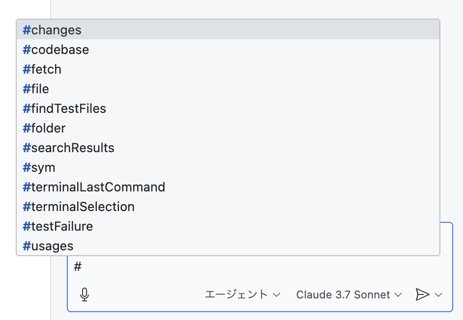
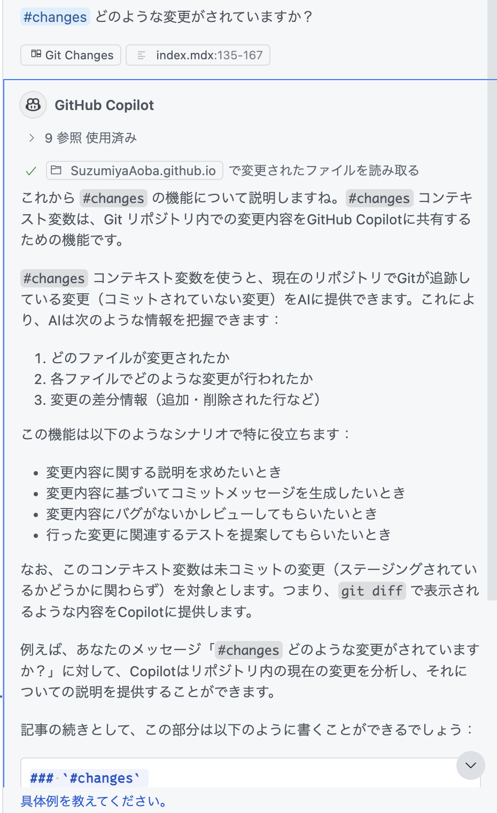
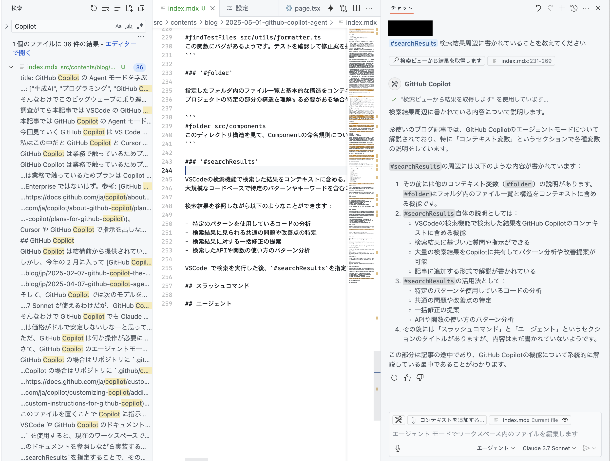

## 前置き

<details>
<summary>読みたい人は見てね</summary>

### Vibe Coding

巷では最近 Vibe Coding というものが流行っているらしい。

- [MIT Tech Review: バイブコーディングとは何か？ AIに「委ねる」プログラミング新手法](https://www.technologyreview.jp/s/359884/what-is-vibe-coding-exactly/)
- [個人的 Vibe Coding のやりかた](https://zenn.dev/yoshiko/articles/my-vibe-coding)
- [Vibe Codingの限界｜shi3z](https://note.com/shi3zblog/n/ne74dbf706d40)
- [Vibe Coding で遊ぼう](https://zenn.dev/schroneko/articles/lets-play-with-vibe-coding)

<Message title="Notebook LM">
Notebook LM に読み込ませて音声概要を生成してみたので、Notebook LM を使ったことがない人は聴いてみて欲しい。

https://notebooklm.google.com/notebook/5fa8cc12-6b29-4a0c-8f67-c74b0cfa4bea/audio

流暢な日本語で記事の概要を説明してくれている。
概要なので内容としては薄いものになってしまっているが音声として情報を得るには結構いいのではないだろうか？
元になっている記事が英語であっても日本語で説明してくれる。
海外のニュースを複数読み込ませて適用に要約させるような使い方もできる。
</Message>

Vibe Coding は上記の記事にあるように LLM が生成したコードをレビューをせずに信じてソフトウェアを構築していくとを指す。

> 「私が『バイブコーディング（Vibe coding）』と呼んでいる新しいタイプのコーディングがあります。ここでは、バイブス（感覚）に完全に身を委ね、指数関数的な進化を受け入れ、コードの存在そのものを忘れてしまいます」とカルパシーは述べた。

我々人間がやることは仕様を伝えるだけでいい。もし本当に実現できるのであれば夢のような世界だ。
と思うのは職業エンジニア以外の人だけだろう…。
プログラミングを生業としている人間としては職を失う可能性があるかという不安は一切なく、単に要求されるスキルが変わるからまた新しいこと覚えないとだな、くらいの気持ちだ。
文字通りのコーダーは減っていくのかもしれないが、そもそも世の中にコーディングしかしていない人なんて本当にいるのかな？
普段の業務においてコードを書いている時間は本当にわずかで、もっとコード書きたいけどコード書く前にやらないといけないことにかける時間の割合の方が多い。

ソフトウェアの種類にもよるが課題になってくるのはコーディングというよりは設計であったり、要求・仕様の曖昧さに起因することが多い。
もちろん設計、仕様定義においても LLM を活用することで大幅に効率化や考慮不足による不具合の削減はできるだろう。
しかし、作りたいものを思い描くのは結局のところ人間だ。
アイディア出しを LLM にさせることはできるし、仕様を LLM に決めさせることもできる。実装だって LLM ができる。
そんな世界になり始めているかもしれないが出来上がったものの検収には人が介入する。
そこでは**望んだ通りのもの**ができあがっていることを期待するが、そもそも**望んでいるもの**を人が正しく文書化できないという根本的な問題を LLM は解決してくれない。

[顧客が本当に必要だったもの](https://dic.nicovideo.jp/a/%E9%A1%A7%E5%AE%A2%E3%81%8C%E6%9C%AC%E5%BD%93%E3%81%AB%E5%BF%85%E8%A6%81%E3%81%A0%E3%81%A3%E3%81%9F%E3%82%82%E3%81%AE)を顧客自身が正しく要件に落とし込めないのだから…。

顧客が本当に必要だったものにおける最初の図から最後の図までがいわゆる _**AI**_ によって代替される未来がくるのであれば、これからの時代に要求されるのは要求・仕様を正確に文書化する能力ということだろう。
そう考えると、今度こそ形式検証の時代がくるのではないだろうか (錯乱)。
プログラマの仕事は手続きの記述から形式仕様の記述に変わり、それを満たす**実装**は _**AI**_ がよしなに見繕ってくれる。
そうなると結局のところプログラマが姿を変えるだけで、昔のような物理的な配線の繋ぎ換えをやっていた人たとが、動的に回路を書き換えられるコードの記述者となったが、次は回路そのものではなく回路が満たすべき条件の記述者になるだけなのか…?
普通にコード書くより形式仕様を記述する方が難しいイメージがあるので、今以上に高度化していってしまうかもしれない (駄洒落じゃないよ)。

しかし、LLM でプログラミングの敷居が下がるのは確かだろう。
大抵の質問は人にするよりドキュメントを LLM に読み込ませて回答させる方が早いし、知りたいことを追加で質問すれば回答してくれる。
コード生成においてプロトタイプレベルのコード生成という点では圧倒的な速さでそれっぽいコードを生成してくれる。
特に Claude 3.7 Sonnet の性能が良い。

そんなわけでこのビッグウェーブに乗り遅れないように GitHub Copilot に Agent モードが搭載されたのでここ数日触ってる。
調査がてら本記事では VSCode の GitHub Copilot で使える機能を紹介する。

ポエミーな御託はこの辺にして本題に入ろう。

### ツール

本記事では GitHub Copilot の Agent モードについて学ぶが、他に Vibe Coding で使えるツールは次のようなものがあるらしい。

- [Cursor](https://www.cursor.com/ja)
- [Windsurf](https://windsurf.com/editor)
- [Claude Code](https://docs.anthropic.com/ja/docs/agents-and-tools/claude-code/overview)
- [Codex CLI](https://github.com/openai/codex)
- [Cline](https://github.com/cline/cline)
- [Roo Code](https://github.com/RooVetGit/Roo-Code)
- [Devin](https://devin.ai/)
- [OpenHands](https://github.com/All-Hands-AI/OpenHands)

これらのツールを大まかに分類すると次の表のようになるだろうか。

| タイプ | ツール |
|:-------|:--------|
| エディタ | [Cursor](https://www.cursor.com/ja)、[Windsurf](https://windsurf.com/editor) |
| VS Code 拡張 | [Cline](https://github.com/cline/cline)、[Roo Code](https://github.com/RooVetGit/Roo-Code) |
| CLI | [Claude Code](https://docs.anthropic.com/ja/docs/agents-and-tools/claude-code/overview)、[Codex CLI](https://github.com/openai/codex) |
| 自律型 | [Devin](https://devin.ai/)、[OpenHands](https://github.com/All-Hands-AI/OpenHands) |

今回見ていく GitHub Copilot は VS Code の拡張機能の一つになる。
私はこの中だと GitHub Copilot と Cursor の二つを使っている。
GitHub Copilot は業務で触っているためプランは Copilot Pro ではなく Copilot Business になる (Chat で o3 が選択肢に表示されないので Enterprise ではないはず。参考: [GitHub Copilot のプラン - GitHub Docs](https://docs.github.com/ja/copilot/about-github-copilot/plans-for-github-copilot))。
OpenHands は無料で $50 分のクレジットを配っているためお試して使ってみているがお金が溶けていく様子を眺める以外のことはできていない。
Cursor や GitHub Copilot で指示を出しながらだとベースとなるコードが壊れてしまうような機能追加を指示してみたが、後ろにあるモデルは同じようなものなのでお金が溶けてしまうだけだった。

</details>
 
## GitHub Copilot

GitHub Copilot は結構前から提供されていたが、できることと言えばそれなりに賢い補完とコードに対する質問 (Ask) と修正の提案 (Edits) のみに留まっており、コード自体を直接編集してコマンドを実行し、テスト結果を確認してバグを修正するといった自律的なコードディングは行えていなかった。
しかし、今年の 2 月に入って [GitHub Copilot のエージェントモードのプレビュー版が提供](https://github.blog/jp/2025-02-07-github-copilot-the-agent-awakens/)され、先月には[エージェントモードと MCP サポート](https://github.blog/jp/2025-04-07-github-copilot-agent-mode-activated/)が正式にリリースされた。

これで Cursor や Cline のようにチャットするだけで実装してくれるし、エラーが出ても勝手に直してくれるようになった。
もちろん全てが上手くいくわけでないけれどもプロトタイプレベルの実装はチャットだけで進められる。

そして、GitHub Copilot では次のモデルを選べる。

- GPT4o
- Claude 3.5 Sonnet
- **Claude 3.7 Sonnet**

Cursor に比べるとモデルは少ないが Claude 3.7 Sonnet をかなりの回数利用できる。
あまり使いすぎると制限が入るがそれでも時間をあければ枠が回復するようで何回かは高速で応答してくれる。
その後に再び低速にはなってしまうが高性能なモデルをほぼ無制限で使える (?) ように見えるのは喜ばしい。
このあたりのコスパについては以下の記事が参考になる。

- [【Cursor】Proプランをコスパ良く使おうぜまとめ #GPT-4 - Qiita](https://qiita.com/setowatson/items/6d7f96c0e64c9cb8a8f4)

Cursor では上記のようになっているため月 500 回ほど Claude 3.7 Sonnet が使えるわけだが、GitHub Copilot Business でもそれなりの回数使える。

そんなわけで GitHub Copilot でも Claude 3.7 Sonnet 使えるので Cursor は価格がドルで安定しないしなーと思っていた人は GitHub Copilot でどんなものなのか体験してみて欲しい。
ただ、GitHub Copilot は何か操作が必要になる度に確認を求めてくるが、Cursor ではその辺を自動で承認する設定があるのでより自律的にタスクを進めていってくれる。
迷子になって高速リクエストをひたすら消費していってしまうループに入る可能性も高いのが残念だが…。

さて、GitHub Copilot のエージェントモードで使える機能について確認していく。
ここで紹介する機能はエージェントに限らず Chat や Edits でも使えるものがあるはずだ。

## カスタムインストラクション

GitHub Copilot の場合はリポジトリに `.github/copilot-instructions.md` に指示を書くことでコンテキストを自動的に追加することができる。
[公式ドキュメント](https://docs.github.com/ja/copilot/customizing-copilot/adding-repository-custom-instructions-for-github-copilot)ではフレームワークや使用言語やコーディングルール、コーディングに関するドキュメントのパスを書いている。

このファイルを置くことで Copilot に指示を出すときに前提となる知識をプロンプトに含めなくてよくなる。
これがないとプロジェクト内で使っていない、使うつもりのないライブラリを勝手にインストールしようとしたり、コードを自由に弄り始めるので使用言語、ライブラリ、フレームワーク、アーキテクチャ、コーディング規則についての記述は入れた方がよい。

## コンテキスト変数

コンテキスト変数は `#` から始まる。
プロンプトを入力するエリアで `#` を入力すると画像のように候補が表示され、変数に応じて追加で GUI 上でファイルやフォルダーを選択することで指示の文脈を伝えることができる。



2025/05/01 時点では以下のコンテキスト引数が補完された。

- `#changes`
- `#codebase`
- `#fetch`
- `#file`
- `#findTestFiles`
- `#folder`
- `#searchResults`
- `#sym`
- `#terminalLastCommand`
- `#terminalSelection`
- `#testFailure`
- `#usages`
- `#vscodeAPI`

VSCode や GitHub Copilot のドキュメントで全てのコンテキスト引数について解説がありそうなものだが見つけられなかった。

### `#changes`

git で差分が発生している変更内容をコンテキストに含める。
ステージング済みかどうかによらず差分があるファイルが全て対象になるようだ。



解説記事を開いている状態でプロンプトを入力したので自身による `#changes` の解説が出力された。
これは Ask で尋ねたのでファイルの変更はされなかったが Agent で入力したら以下の内容に書き換えられていたかもしれない。

```
### `#changes`

Git リポジトリ内での変更内容をコンテキストとして提供します。`#changes` を使用すると、現在のワークスペースでGitが追跡している未コミットの変更をCopilotに共有します。

これは次のような場合に便利です：
- 変更内容に関する説明やサマリーを生成したい
- コミットメッセージを作成したい
- コードレビューを自動化したい
- 変更に基づいたテスト作成の提案が欲しい

なお、`#changes` は `git diff` と同様に、まだコミットされていない変更（ステージング済みかどうかに関わらず）を参照します。
```

### `#codebase`

コードベース全体から質問に関連するコードや情報を探してコンテキストに取り込む機能。
セマンティック検索を利用して、プロジェクト内の関連ファイルやコード片を自動的に見つけてくれる。

大規模なプロジェクトで「このプロジェクトでは〇〇の処理はどうなっているか？」といった質問をする場合に便利。
プロジェクト全体からそのトピックに関連するコードを探し出し、回答の作成に役立てることができる。

例えば次のようなときに有効：

- プロジェクト固有の実装パターンを理解したい
- 特定の機能がどのように実装されているか知りたい
- コード内の関連部分を見つけたい
- プロジェクトのアーキテクチャを理解したい

### `#fetch`

指定されたURLのウェブページの内容をコンテキストに含める。
ドキュメントやリファレンスなどの外部情報を参照する必要がある場合に便利。

例えば、API のドキュメントを参照しながら実装する際に、そのドキュメントページをコンテキストに含めることで、Copilot が適切なレスポンス構造やパラメータを理解した上で回答できるようになる。

```
#fetch https://example.com/api-docs
この API を使って天気情報を取得するコードを書いてください。
```

### `#file`

指定したファイルの内容をコンテキストに含める。
特定のファイルについて質問したり、そのファイルを参照しながら別のファイルを編集したりする場合に役立つ。

```
#file src/components/UserProfile.tsx
このコンポーネントに「ユーザーの所属組織」も表示するように修正してください。
```

プロンプト入力時に VSCode の GUI でファイルを選択することも可能。

### `#findTestFiles`

指定したソースファイルに関連するテストファイルを見つけ、それらをコンテキストに含める。コードの修正をする際にテストケースも確認・修正したい場合に便利。

```
#findTestFiles src/utils/formatter.ts
この関数にバグがあるようです。テストを確認して修正案を提示してください。
```

### `#folder`

指定したフォルダ内のファイル一覧と基本的な構造をコンテキストに含める。
プロジェクトの特定の部分の構造を理解する必要がある場合や、フォルダ内の複数ファイルに対する変更を検討する場合に便利。

```
#folder src/components
このディレクトリ構造を見て、Componentの命名規則についてまとめてください。
```

### `#searchResults`

VSCode の検索機能で検索した結果をコンテキストに含める。
大規模なコードベースで特定のパターンやキーワードを含むコードについて分析したり、一括して変更する提案を求めたりする場合に役立つ。

検索結果を参照しながら以下のようなことができます：

- 特定のパターンを使用しているコードの分析
- 検索結果に見られる共通の問題や改善点の特定
- 検索結果に対する一括修正の提案
- 検索したAPIや関数の使い方のパターン分析

VSCode で検索を実行した後、`#searchResults`を指定することで、その検索結果をCopilotのコンテキストに含めることができる。



Copilot 自身にコードベース内のキーワードを検索する能力があるはずなのでこの変数の出番はあまりないかもしれない。

### `#sym`

シンボル名をコンテキストに含める。
このコマンドは `#file` や `#folder` と同じように入力した後に GUI でシンボルを選択する。
一般名詞ではなく特定のシンボルを指していることをプロンプト内で明確にするために使えそうだ。

### `#terminalLastCommand`

ターミナルで最後に実行されたコマンドとその出力結果をコンテキストに含める。
これにより、ターミナルでの作業結果をもとに Copilot に質問や指示をすることができる。

使用例：
- 実行したコマンドのエラー原因の分析を依頼する
- コマンド出力の内容に基づいた次のステップを相談する
- テスト結果やビルド結果を基にデバッグのサポートを得る

例えば、`npm run build`を実行した後に以下のように質問できる：

```
#terminalLastCommand
このビルドエラーを解決するには何をすればいいですか？
```

この変数は特にプロジェクトのセットアップやデバッグの場面で非常に便利だろう。
ターミナルの出力が自動的にコンテキストに含まれるため、その内容を手動でコピーペーストする必要がなくなる。

### `#terminalSelection`

ターミナルで選択したテキストをコンテキストに含める。
ターミナルの出力結果の特定の部分だけをCopilotに共有したい場合に便利。

例えば、大量のログ出力の中から特定のエラーメッセージだけを選択して解析を依頼したり、ターミナル出力の特定の部分についての説明や対応策を求めたりする場合に役立つ。

使用例：
- 長いログ出力から特定の部分だけを選んで分析を依頼する
- エラーメッセージの特定部分について詳細な説明を求める
- コマンド実行結果の一部についてのみアドバイスが欲しい場合

使用方法は次のとおりです：
1. ターミナルで関連するテキスト部分を選択（ドラッグ）する
2. Copilotのプロンプト入力欄に `#terminalSelection` と入力
3. 質問や指示を続けて入力する

```
#terminalSelection
この選択した部分のエラーはどういう意味ですか？解決策を教えてください。
```

`#terminalLastCommand` がコマンド全体の出力を扱うのに対し、`#terminalSelection` は必要な部分だけを絞り込んで共有できるため、より焦点を絞った質問が可能になる。

### `#testFailure`

テスト実行時に発生した失敗の情報をコンテキストに含める。
テストが失敗した場合に、その失敗情報を元にCopilotに修正案を求めたい場合に便利。

例えば、テストを実行して失敗したあと、次のように質問できる：

```
#testFailure
このテスト失敗を修正するにはどうすればいいですか？
```

これによりテスト失敗の詳細情報（失敗したテスト名、期待値と実際の値の差異、スタックトレースなど）が自動的にコンテキストに含まれ、Copilotがより正確な修正案を提示できるようになる。

失敗したテストの情報をわざわざコピーペーストすることなく、Copilotにその情報を共有できる。

### `#usages`

指定したシンボル（関数、クラス、変数など）の使用箇所をコンテキストに含める。
コードベース内で特定のシンボルがどのように使われているかを理解したい場合や、シンボルの変更がコードベース全体にどのような影響を与えるかを確認したい場合に便利。

例えば：

```
#usages formatUserData
この関数の使用箇所をすべて見て、どのように改善できるか提案してください。
```

これにより、`formatUserData`という名前の関数がプロジェクト内でどのように使用されているかの情報がコンテキストに含まれる。リファクタリングやAPI変更の際に、影響範囲を把握するのに役立つ。

また、特定のインターフェースや抽象クラスの実装例を見たい場合にも便利：

```
#usages UserRepository
このインターフェースの実装例を教えてください。
```

### `#vscodeAPI`

VSCode の API に関する情報をコンテキストに含める。
VSCode 拡張機能の開発に関する質問や、VSCode API の使い方について知りたい場合に便利。

VSCode の拡張機能開発時に特定の機能をどう実装すればよいか迷った時などに活用できる。
公式ドキュメントから関連する API 情報を自動的に取得し、それを基に回答を生成してくれる。

使用例：
- 特定の VSCode API の使い方を知りたい
- 拡張機能で特定の機能を実装する方法を知りたい
- VSCode の内部機能やワークフロー、イベントについて詳しく知りたい

```
#vscodeAPI
VSCode で新しいエディタビューを作成するための API を教えてください。
```

この変数は特に VSCode 拡張機能の開発者にとって非常に便利で、API ドキュメントを調べる手間を省くことができる。

## スラッシュコマンド

### `/clear`

会話をクリアする。

## MCP

MCP サーバは VSCode のマーケットプレースで `@tag:language-model-tools` と検索すると出てくる。
しかし、**MCP サーバについてセキュリティの問題があるので信頼できる開発元の以外はインストールしない**方がいいだろう。

## おわりに

GitHub Copilot のコンテキスト変数について一通り確認した。
これまで、GitHub Copilot を使っていたもののコンテキスト変数を使いこなせていなかったのでこれからは積極的に使っていきたい。
一方で使っている感覚としてはそのまでインストラトしなくてもよしなにやってくれているようにも感じているので、しばらくの間使って感想を書いてみようと思う。