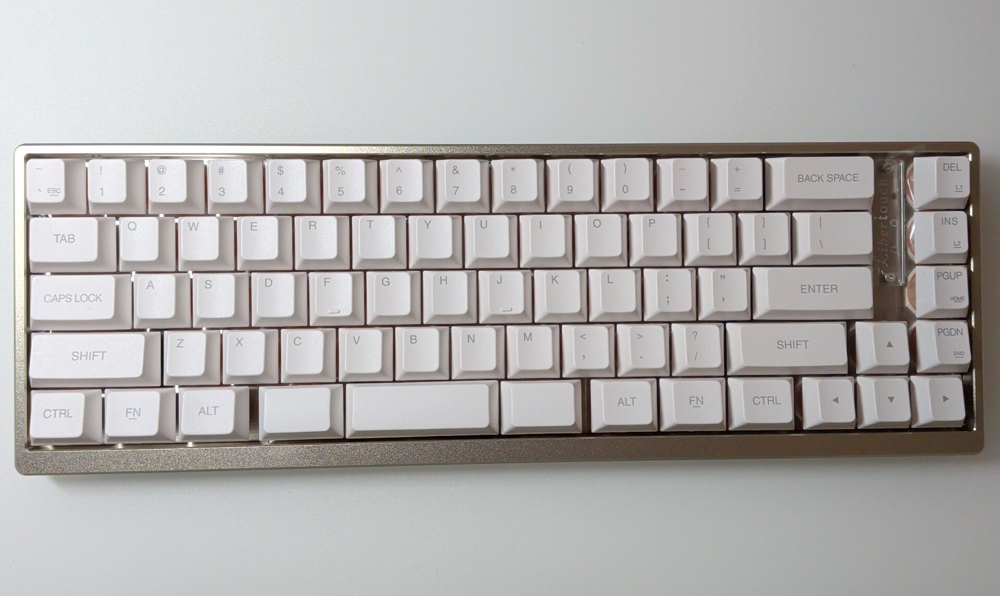

遊舎工房で抽選販売していた [[GB] Libertouch Engineering Sample(ES品)](https://shop.yushakobo.jp/products/gb-libertouch-engineering-sample) が届いた。
購入したのはもちろん US 配列。
25 台限定なので当たらないだろうと思っていたが当選したのでここ数ヶ月届くのを待っていた。

Libertouch の特徴はメンブレンキーボードという点だ。
メンブレンキーボードを使うのは大学の授業で PC ルームに置かれていたキーボード以来だろうか。
大学の研修室で HHKB を触って以来、キーボードは静電容量無接点方式かメカニカルしか触ってこなかった。
と思ったが研究室に HHKB Lite があってそのときに少しだけ触れていた。
しかし、HHKB Professional と HHKB Lite の選択肢があって選べるなら Professional を選ぶのは必然と言えただろう。

メンブレンキーボードを長いこと使っていなかったわけだが、そもそも高級メンブレンキーボードというジャンルが
Libertouch の販売が終了してからほぼ存在していなかったのではないだろうか。
普通の人は数万もするキーボードをそもそも使わないわけだが…。

Libertouch の詳しい解説は、以下の記事でされているのでここでは使って気がついた点について書いていく。

- [最高価格の高級国産メンブレンキーボード リベルタッチ☆抽選受付中｜noda](https://note.com/hami3/n/n5a3159b97f14)

この記事は届いてすぐに書いており、後から全体の構成を考えてまとめる予定はないので、上から順番に思ったこと、わかったことを書いている。
そのため、文章中で話が前後するところがありますが、ご容赦ください。

## キー入力が認識されないことがある

初期不良なのか、打鍵の仕方が悪いのか判断に困るような感じにキー入力が認識されない現象が発生している。
届いてから 1 週間以内であれば遊舎工房のサポートに連絡してサポートしてもらえるようなので、もう少しだけ様子を見ようと思っているが、
一部のキー（そこにエンターキーが含まれてしまっているのが致命的…）でどうも反応が悪い。

原因が現時点ではわかっていないが、後述するが動作確認環境に Windows しか含まれていなかったのではないか、という懸念がある。
動作を確認した環境に macOS が含まれていないように感じる。
この記事も Libertouch Engineering Sample (ES品) を使って書いているが上手く入力できないタイミングがある。
「う」を入力するとき <kbd>Ctrl</kbd> を押している判定をされてしまい <kbd>C-u</kbd> が入力されてしまう。
普通であれば困らないが、Emacs 使っているので <kbd>C-u</kbd> が入力されると文字入力が中断されてしまい少し困る。

また、<kbd>Alt</kbd> を認識するまでに時間がかかる問題もある。
Emacs を使っているので <kbd>Alt</kbd> を頻繁に押すが、ワンテンポ待ってから <kbd>x</kbd> や <kbd>f</kbd>、<kbd>b</kbd> を押さなければならない。

## ソフトウェアの問題の可能性が高い

一つ前のキー入力が認識されない問題が物理的な問題ではないように感じるので、macOS でこの文章を書いているが一度 Windows に繋いでキー入力が認識されるか確認してみた。

macOS 上で発生している問題としては、先ほども書いたが <kbd>Enter</kbd> が認識されない可能性が高く、文章の改行がうまくいかないことがある。
また、<kbd>Tab</kbd> も偶に認識されないことがある。
しかし、文章入力をしているときに <kbd>Tab</kbd> を押すことは少ないため、macOS ではあまり気になっていない。

さて、Windows に話を戻すと Windows では <kbd>Enter</kbd> が認識されない問題は発生していないように見えた。
つまり、現状発生しているキー入力に関する問題はハードウェアというよりはソフトウェアの問題だと考えられる。

## キーマップ編集ソフト

ソフトウェアの問題の可能性が高いことがわかったのでファームウェアの焼き直しをとりあえずしてみようと思ったのだが、キーマップ編集ソフトが Windows しか対応していなくて泣いてしまった。

https://www.fcl-components.com/support/keyboards/keycodeedit-202509.html

ES 品なので最初から複数 OS をサポートする必要はないと思うが、macOS を常用しているので少しばかり残念。
諸々にキーの認識が怪しい問題は Windows を起動してファームウェアを焼き直してみたが直らなかった。

## 打鍵感

キー入力がスムーズに行えないため愚痴から入ってしまったが、キーボードのハードウェア的な面、つまり、全体的なビルドクオリティや打鍵感、打鍵音、キーキャップについて話していく。

キーキャップは、よくある PBT の質感だと思うが、若干表面がざらざらしているタイプになっている。
普段使っている Rainy 75 はツルツルしたキーキャップだと思うが、それとは明かに異なっている。

肝心の打鍵感、打鍵音だが、事前に説明されなければメンブレンだとわからないかもしれない。
メカニカルではないことは触ればわかるが、静電容量無接点方式とも異なっており、よくあるメンブレンの打鍵感、打鍵音とも違う。
ちなみに私は Libertouch の過去のモデルを触ったことがないので、歴代 Libertouch と比べての感想は書けません。

そのため、これが Libertouch 自体の特徴なのか、今回の ES 品の特徴なのか判断できないが、
メンブレンでもこのくらい打ち心地のいい打鍵感になるのかと驚いた。
メンブレンと言えばペチペチとしていて、あまりいい打鍵感とは言えない印象があったが、それを変えさせてくれるには十分な体験をさせてくれている。

全体のビルドクオリティもいいと思います。
ロゴの主張を兼ねて <kbd>DEL</kbd> や <kbd>INS</kbd> がある列を <kbd>BACK&nbsp;SPACE</kbd> と離してくれているのは、
誤って押すことがなくなるのでその意図があるかはわからないですが良い判断だと思う。
思うだけでこの間にスペースがないキーボードを見るとミスタイプしそうだなってなるけど、実際に使っていて <kbd>BACK&nbsp;SPACE</kbd> や <kbd>\\</kbd> と押し間違えることはないという…。

## おわりに

全体としては満足しているが、一部のキーが正常に動作していないのが物理的な問題なのか、ソフトウェア的な問題なのかわからず困った。
遊舎工房のサポートに連絡するべきか迷っている。

致命的というわけではないので、別にこのままでもいいかとも思いつつ、ES 品なのだからちゃんとフィードバックの意味合いも込めて返品・交換の交渉をした方がいいのだろうか。
