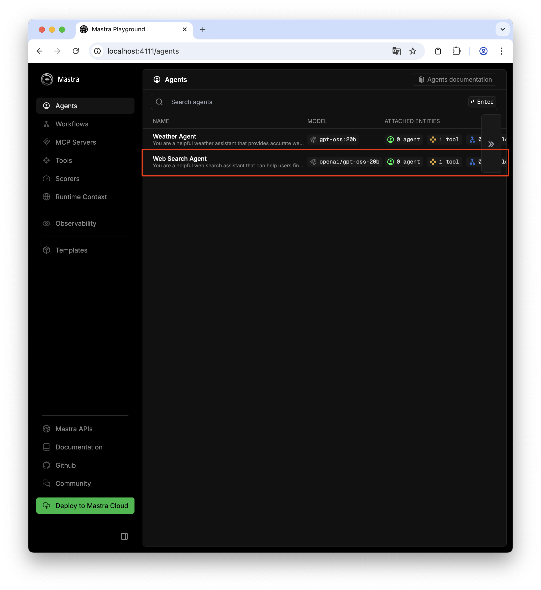
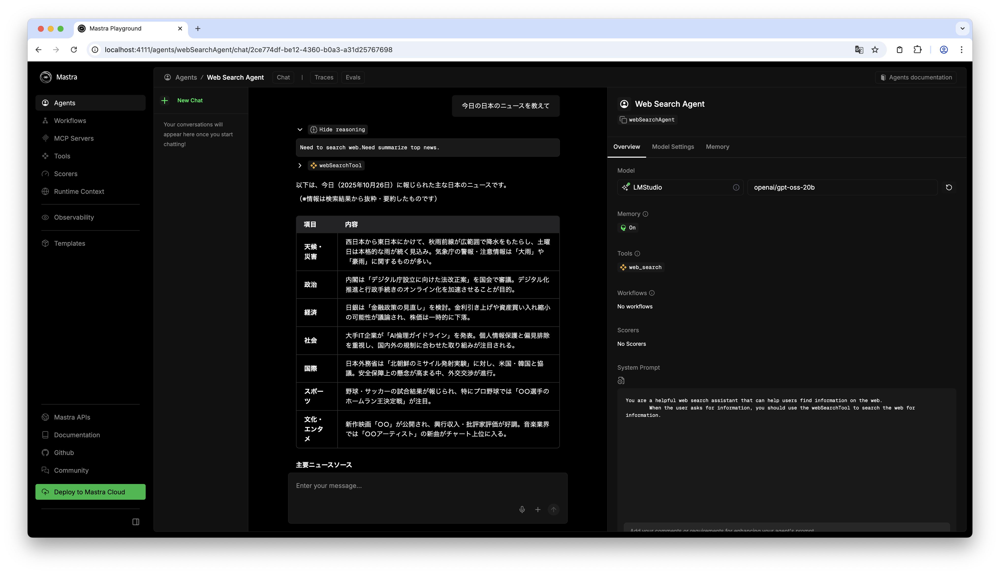
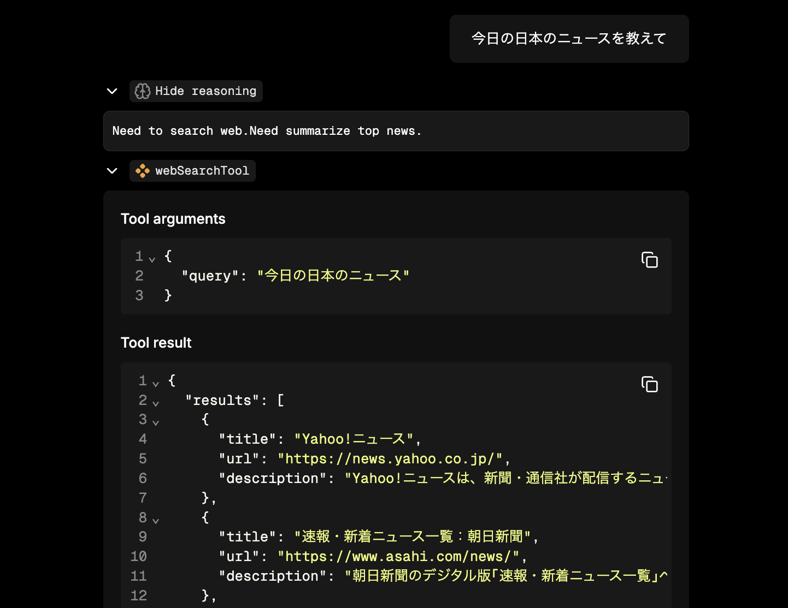

## 前回までのおさらい

このシリーズでは、ここまででローカル環境で AI エージェントを構築するために Ollama, LM Studio をインストールし、
mastra のサンプルコードを実行するところまでを解説した。

今回は mastra の Agent, Tools と呼ばれる機能を使って Web 検索し、検索結果を表示する AI エージェントを作成する。
この記事では、LLM が使える Web 検索機能を実装し、LLM がそれを正しく認識して呼び出せるようにするところまでを実装する。
工夫をしない初期実装となるため上手く動作しないが、ただ道具を LLM に与えれば上手くいくわけではないということを体感できるだろう。

## 環境

- mastra [2025-10-14](https://github.com/mastra-ai/mastra/releases/tag/%40mastra%2Fcore%400.21.1)

<Message title="バージョン" variant="warning" defaultOpen={true}>

mastra はまだ安定的なフレームワークではないため、バージョンが上がると挙動が変わる可能性があります。
記事の通りに実装しても動作しない場合は使っているバージョンを確認してください。

</Message>

## AI エージェントとは？

AI エージェントの実装に向けて取り組む前に AI エージェントが何を指しているのか確認しよう。
ここでは[現場で活用するためのAIエージェント実践入門 (KS情報科学専門書)](https://amzn.to/4h2sk0R)から引用し、その定義に従うことにする。

> AIエージェントとは、目標に向けて環境と相互作用しながらタスクをこなす知能（インテリジェント）システムです。
> 環境とはAIエージェントが行動を働きかける場所で、Webブラウザやデスクトップアプリのようなデジタル空間や部屋の中などの物理空間を指します。
> 初期の知能は論理記号で表現されていましたが、次第にルールベースや学習モデルに移り変わり、今はLLMに相当します。
> LLMはその学習過程で対話能力、膨大な知識、少数例による学習、言語理解力、論理的推論能力を獲得しています。
> 現代のAIエージェントは、LLMの能力を活かし、環境を知覚し、過去の経験をメモリから呼び出しながら、目標に向けて計画を立て、行動します。

## ツール

AI エージェントの定義に「**環境と相互作用しながらタスクをこなす**」とある。
AI エージェントの中核である LLM は基本的には系列データを受け取って統計的に「次にくるデータ」の確率を計算し、その中で出現率が高いものの一つを選択する。
その後、そのデータを系列データの最後に加えたものを改めて入力として受け取り、また「次にくるデータ」を推測する、といった動作を繰り返す。

<YouTubeEmbed id="y7NQiNER6r4" title="LLMの仕組み（簡単バージョン）" />

LLM 自体には AI エージェントを構成要素の一つである環境に作用する機能は備わっていない。
そのため、LLM が環境に作用できるような機能を提供しないといけない。
そのような機能は**ツール**と呼ばれ、LLM の外部で実行されるプログラムのことを指す。
ツールについては次の論文で整理されている。

- [[2403.15452] What Are Tools Anyway? A Survey from the Language Model Perspective](https://arxiv.org/abs/2403.15452)

## mastra でツール実装

mastra のツールについて、[公式ドキュメント](https://mastra.ai/ja/docs/tools-mcp/overview)を参照しつつ進めていく。
今回は Web 検索をするツールを実装する。

全体を俯瞰してから実装の詳細について確認したい人のため、まずはツール実装の全体を示しておく。

<Message title="Web 検索ツール実装">

```ts src/mastra/tools/web-search-tool.ts
import { createTool } from "@mastra/core";
import * as cheerio from "cheerio";
import { z } from "zod";

export const webSearchTool = createTool({
  id: "web_search",
  description: "Search the web for information",
  inputSchema: z.object({
    query: z.string().describe("The query to search the web for"),
  }),
  outputSchema: z.object({
    results: z.array(
      z.object({
        title: z.string(),
        url: z.string().optional(),
        description: z.string().optional(),
      }),
    ),
  }),
  execute: async ({ context }) => {
    const response = await fetch("https://html.duckduckgo.com/html/", {
      method: "POST",
      headers: {
        "Accept-Language": "ja;q=0.9",
        "User-Agent":
          "Mozilla/5.0 (Windows NT 10.0; Win64; x64) AppleWebKit/537.36 (KHTML, like Gecko) Chrome/141.0.0.0 Safari/537.36",
      },
      body: new URLSearchParams({
        q: context.query,
        b: "",
      }),
    });

    const html = await response.text();
    const $ = cheerio.load(html);

    const results = $(".result")
      .map((_index, result) => {
        const $title = $(result).find(".result__a");
        const titleText = $title.text().trim();
        const titleUrl = $title.attr("href");

        const $snippet = $(result).find(".result__snippet");
        const snippetText = $snippet.text().trim();

        return {
          title: titleText,
          url: titleUrl,
          description: snippetText,
        };
      })
      .get();

    return {
      results,
    };
  },
});
```

</Message>

最初に mastra でツールを実装する方法から確認していこう。

### ツールの概要

mastra では `createTool` 関数を使ってツールを実装するか、`MCPClient` クラスを使って MCP (Model Context Protocol) サーバを管理し、
それを `Agent` に渡すことで LLM がツールを使えるようになる。
MCP (Model Context Protocol) については、Web 検索エージェントの開発が一段落したら解説する。
ここでは、mastra 内で完結する `createTool` 関数によるツール定義で Web 検索ツールを実装しよう。

`createTool` 関数の詳細について [API リファレンス](https://mastra.ai/ja/reference/tools/create-tool) を参照してもらうとして、ここでは簡単に使い方を説明する。

ツールの実装は `src/mastra/tools/web-search-tool.ts` ファイルに行う。

```typescript src/mastra/tools/web-search-tool.ts
export const webSearchTool = createTool({
  id: "web_search",
  description: "Search the web for information",
  inputSchema: /* ... */,
  outputSchema: /* ... */,
  execute: async ({ context }) => {
    // ...
  },
});
```

`createTool` 関数が引数で受け取るオブジェクトでは、ツール ID、ツールの説明、入力スキーマ、出力スキーマ、ツールのロジックを受け取る。
`id` はツールが何をするためのものなのか明らかな名称となるようにする。
`description` は LLM がツールの用途や利用タイミングを判断するために使われるため、ツールをいつ、どのように使うのか簡潔に説明するようにする。

ツールの入力、出力は JSON 形式で行なわれる。
`inputSchema`, `outputSchema` はそれぞれツールへの入力、出力の JSON がどのようなスキーマであるか定義する。
スキーマは [Zod](https://zod.dev/) を使って定義する。

`execute` にはツールのロジックを実装するが、引数で受け取るオブジェクトに含まれる `context` は `inputSchema` で定義したスキーマによってパースされた結果で、ツールに対する入力にアクセスできるようになっている。

それでは、`inputSchema`, `outputSchema`, `execute` について詳しく見ていこう。

### 入力スキーマ

ここでは Web 検索ツールの入力は検索クエリだけを想定する。
入力スキーマは JSON オブジェクトとして定義するため次のようになる。

```typescript src/mastra/tools/web-search-tool.ts
export const webSearchTool = createTool({
  // ...
  inputSchema: z.object({
    query: z.string().describe("The query to search the web for"),
  }),
  // ...
});
```

`description` では、それぞれのプロパティに何を値として設定すればよいかを記述する。
ここでは「Web 検索のためのクエリ」としている。
英語で書いているが日本語を扱える LLM であれば日本語でも問題ないが、ローカルで動くような小さい LLM では日本語と英語で精度の差が明確に現れるかもしれない。

`description` はプロパティ名から用途が明らかであれば省略しても問題ないかもしれない。

### 出力スキーマ

次に出力スキーマを定義しよう。

```typescript src/mastra/tools/web-search-tool.ts
export const webSearchTool = createTool({
  // ...
  outputSchema: z.object({
    results: z.array(
      z.object({
        title: z.string(),
        url: z.string().optional(),
        description: z.string().optional(),
      }),
    ),
  }),
  // ...
});
```

ここでは DuckDuckGo の検索結果から「タイトル、URL、サイトの説明」の 3 つを抽出することを前提に `title`, `url`, `description` をプロパティに持つオブジェクトのリストを `results` プロパティに入れて返すように定義している。

### ツールのロジック

いよいよ Web 検索のロジックの実装だ。

今回は DuckDuckGo の検索結果をスクレイピングすることにする。
Google 検索のスクレイピングは規約により明確に禁止されているので利用しない。
DuckDuckGo もスクレイピングが許可されているわけではないが、禁止もされていない（著者調べ）ため LLM のツールとして使えるように実装するが、**利用する場合は自己責任**で行うこと。
本記事も DuckDuckGo のスクレイピングを推奨しない。
[duckduckgo.com](https://duckduckgo.com/robots.txt) や [html.duckduckgo.com](https://duckduckgo.com/robots.txt) の [robots.txt](https://developers.google.com/search/docs/crawling-indexing/robots/intro?hl=ja) を確認するとクロール拒否をしていることを念頭に置いて欲しい。

また、単に Web Search をツールとして使うだけであれば [Ollama が Web Search API を提供している](https://ollama.com/blog/web-search)のでそちらを使うのが良いだろう。

#### DuckDuckGo

[DuckDuckGo](https://duckduckgo.com/) はプライバシー保護を目玉にしている検索エンジンの一つだ。
Google のように Cookie を利用した追跡はされない。

DuckDuckGo をスクレイピングする方法は検索するといくつか紹介されているが [Python のライブラリ](https://github.com/deedy5/ddgs)を使う方法を説明しているサイトが多い。
しかし、今回は TypeScript で実装したいのでその方法は使えない。

DuckDuckGo をスクレイピングする方法は 3 つ思いつく。

* [Playwright](https://playwright.dev/) や [Puppeteer](https://pptr.dev/) のようなヘッドレスブラウザの使用
* https://html.duckduckgo.com/html/ もしくは https://lite.duckduckgo.com/lite/ が返す HTML を解析
* https://duckduckgo.com/d.js のレスポンス（JavaScript）を解析

ライブラリとして提供されているものの内部実装を見ると 3 つ目の `d.js` を使っているものがあった。
`d.js` のレスポンスを解析することで体面上はスクレイピングの禁止を回避できるからだろうか？
しかし、この方法は一度ダミーのリクエストを送ってトークンを取得してから検索をしないといけない（はず）。

それは面倒なので https://html.duckduckgo.com/html/ をスクレイピングすることにする。
あとから https://lite.duckduckgo.com/lite/ の存在を知ったが、こちらの方が軽量に見えたので読者の皆さんが実装するときは Lite 版で試してみて欲しい。
繰り返しになるが**スクレイピングは自己責任**で行うこと。

さて、早速実装をしてみよう。

#### 実装

https://html.duckduckgo.com/html/ で検索するときの通信内容を確認すると DuckDuckGo の HTML 版は検索するは POST リクエストでされていることがわかる。
その通信内容から不要な内容を削ると、次ようなリクエストで検索結果が返ってくることがわかった。

```shell
$ curl 'https://html.duckduckgo.com/html/' \
  -H 'accept-language: ja' \
  -H 'user-agent: Mozilla/5.0 (Macintosh; Intel Mac OS X 10_15_7) AppleWebKit/537.36 (KHTML, like Gecko) Chrome/141.0.0.0 Safari/537.36' \
  --data-raw 'q=test&b='
```

`User-Agent` でブラウザからのリクエストか判定しているようなのでこのヘッダーは削れなかった。
また、`Accept-Language` で検索時の言語を指定する仕様のようなので今回は `ja` で固定して実装を進める。
実用を考えると英語も検索対象とした方がいいため `Accept-Language` も LLM が指定できるようなツールとするべきだが、
ここでは説明を簡単にするため検索クエリを指定する `q` のみをツールの入力として受け取ることに<s>する</s>している。

https://html.duckduckgo.com/html/ のレスポンスは HTML となっているため、[cheerio](https://cheerio.js.org/) を使ってパースし、検索結果を抽出する。

ここまでを踏まえてツールのロジックを実装すると次のようになる。

```typescript
export const webSearchTool = createTool({
  // ...
  execute: async ({ context }) => {
    const response = await fetch("https://html.duckduckgo.com/html/", {
      method: "POST",
      headers: {
        "Accept-Language": "ja",
        "User-Agent":
          "Mozilla/5.0 (Windows NT 10.0; Win64; x64) AppleWebKit/537.36 (KHTML, like Gecko) Chrome/141.0.0.0 Safari/537.36",
      },
      body: new URLSearchParams({
        // !callout[/context.query/] inputSchema で定義した query を context から取り出す
        q: context.query,
        b: "",
      }),
    });

    const html = await response.text();
    const $ = cheerio.load(html);

    const results = $(".result")
      .map((_index, result) => {
        const $title = $(result).find(".result__a");
        const titleText = $title.text().trim();
        const titleUrl = $title.attr("href");

        const $snippet = $(result).find(".result__snippet");
        const snippetText = $snippet.text().trim();

        return {
          title: titleText,
          url: titleUrl,
          description: snippetText,
        };
      })
      .get();

    return {
      results,
    };
  },
});
```

ロジックの内容は、mastra の使い方や AI エージェント、ツール実装に関係してくるところではないため解説しない。
`fetch` 関数や `cherrio` の使い方についてはそれぞれドキュメントを参照して欲しい。

これで Web 検索ツールの実装ができたので `Agent` 実装に進もう。

## Web 検索エージェント

Web 検索ツールの実装ができたので次は LLM とツールを繋げて AI エージェントを定義しよう。

### 前回からの差分

Web 検索エージェント実装の前に、前回記事 [ローカル AI エージェントは電気羊の夢を見るのか（環境構築の補足）](../2025-10-18-local-ai-agent/) からの差分があるので載せておく。

```ts src/config/providers.ts
import { createOpenAICompatible } from "@ai-sdk/openai-compatible";

export const lmstudio = createOpenAICompatible({
  name: "lmstudio",
  baseURL: "http://localhost:1234/v1",
  apiKey: "lm-studio",
});

export const ollama = createOpenAICompatible({
  name: "ollama",
  baseURL: "http://localhost:11434/v1",
});
```

前回、前前回の記事で `llmstudio`, `ollama` を `src/mastra/agents/weather-agent.ts` に書いていたが、
他のファイルでも必要になるため `src/config/providers.ts` に移動しておく。

### 実装

`Agent` の実装は次のようになる。

```typescript src/mastra/agents/web-search-agent.ts
import { Memory } from "@mastra/memory";
import { ollama } from "../../config/providers";
import { LibSQLStore } from "@mastra/libsql";
import { Agent } from "@mastra/core/agent";
import { webSearchTool } from "../tools/web-search-tool";

export const webSearchAgent = new Agent({
  name: "Web Search Agent",
  instructions: `
        You are a helpful web search assistant that can help users find information on the web.
        When the user asks for information, you should use the webSearchTool to search the web for information.
  `,
  model: lmstudio("openai/gpt-oss-20b"),
  // !callout[/webSearchTool/] 実装した webSearchTool を渡す
  // !mark
  tools: { webSearchTool },
  memory: new Memory({
    storage: new LibSQLStore({
      url: "file:../mastra.db", // path is relative to the .mastra/output directory
    }),
  }),
});
```

ほとんどサンプルの `Weather Agent` と同じになっている。
ここでは `instructions` はシンプルにユーザからの問い合わせに `webSearchTool` を使って Web 検索を行って回答するように指示している。

`tools` に先ほど実装した `webSeachTool` を渡す。
これで LLM が `webSearchTool` が使えるようになり、`instructions` でどのような場面で使えばよいか指示しているため、
LLM が使うべきタイミングを判断し、Web 検索できるようになる。

## エージェント登録

`Agent` を実装したので最後に `src/mastra/index.ts` にある `Mastra` クラスの引数に実装した `webSearchAgent` を追加しよう。

### src/mastra/index.ts

`Agent` は定義しただけでは mastra で使えるようにならない。
mastra で定義したエージェントやワークフローを使うには `src/mastra/index.ts` で `export` している `mastra` 変数が持つ `Mastra` クラスのインスタンスに登録しないといけない。

具体的には、次のような変更を加える。

```typescript src/mastra/index.ts
import { Mastra } from "@mastra/core/mastra";
import { PinoLogger } from "@mastra/loggers";
import { LibSQLStore } from "@mastra/libsql";
import { weatherWorkflow } from "./workflows/weather-workflow";
import { weatherAgent } from "./agents/weather-agent";
import { webSearchAgent } from "./agents/web-search-agent";

export const mastra = new Mastra({
  workflows: { weatherWorkflow },
  // !diff -
  agents: { weatherAgent },
  // !callout[/webSearchAgent/] 今回実装した webSearchAgent を追加する
  // !diff +
  agents: { weatherAgent, webSearchAgent },
  storage: new LibSQLStore({
    // stores observability, scores, ... into memory storage, if it needs to persist, change to file:../mastra.db
    url: ":memory:",
  }),
  logger: new PinoLogger({
    name: "Mastra",
    level: "info",
  }),
  telemetry: {
    // Telemetry is deprecated and will be removed in the Nov 4th release
    enabled: false,
  },
  observability: {
    // Enables DefaultExporter and CloudExporter for AI tracing
    default: { enabled: true },
  },
});
```

## Web 検索エージェントを使ってみよう

`npm run dev` で mastra を起動し、ブラウザで http://localhost:4111/agents にアクセスする。



Agent の一覧に `Web Search Agent` が増えていることが確認できる。

`Web Search Agent` を選択し、チャット UI で今日のニュースについて聞いてみる。



それらしい回答とともに `webSearchTool` が呼ばれていることが確認できる。
しかし、`webSearchTool` の内容を確認すると想像するような使い方がされていないことがわかる。



我々人間が今日のニュースを Web 検索をするとき、我々人間は「今日の日本のニュース」とは検索しない。
英語圏では Google のような検索エンジンを使うときに文章のように入力することもある、という噂を聴くこともあるが、
日本語話者であれば「日本 ニュース」のように単語を並べて検索するだろう。

「今日の日本のニュース」であればそらしい検索結果を得られるかもしれないが、
他のことを聞いてもこちらが与えたプロンプトの一部をそのままクエリに渡して Web 検索するような動作を見せる。

このことから LLM に単にツールを与えただけでは、それを適切に扱えないことがあるのがわかるだろう。
これを改善するには `instructions` で「検索をする前にどのようなことを考えなければいけないか」を指示したり、
ユーザプロンプトから検索キーワードを考える `Agent` を実装し、その `Agent` による推論結果を検索に活かすようなことも考えられる。

次の記事では、そのような改善を試してみよう。

## おわり

この記事では Web 検索（DuckDuckGo）をするためのツールを実装し、それを LLM に使わせる実装を mastra で行なった。
その結果、単に LLM に Web 検索ツールを与えるだけでは適切な検索が行えないことを実際の動作から体感することができた。
次の記事では、LLM に Web 検索をする前に考えるべきことを指示したり、ワークフローを活用してより体系的に検索を行えるようにする。

LLM が適切な検索キーワードによる検索が行えるようになったら、次のフェーズとして検索でヒットしたページを読み込み、
検索した結果を利用したタスク実行が行えるようになるところまでの実装を目指す。
