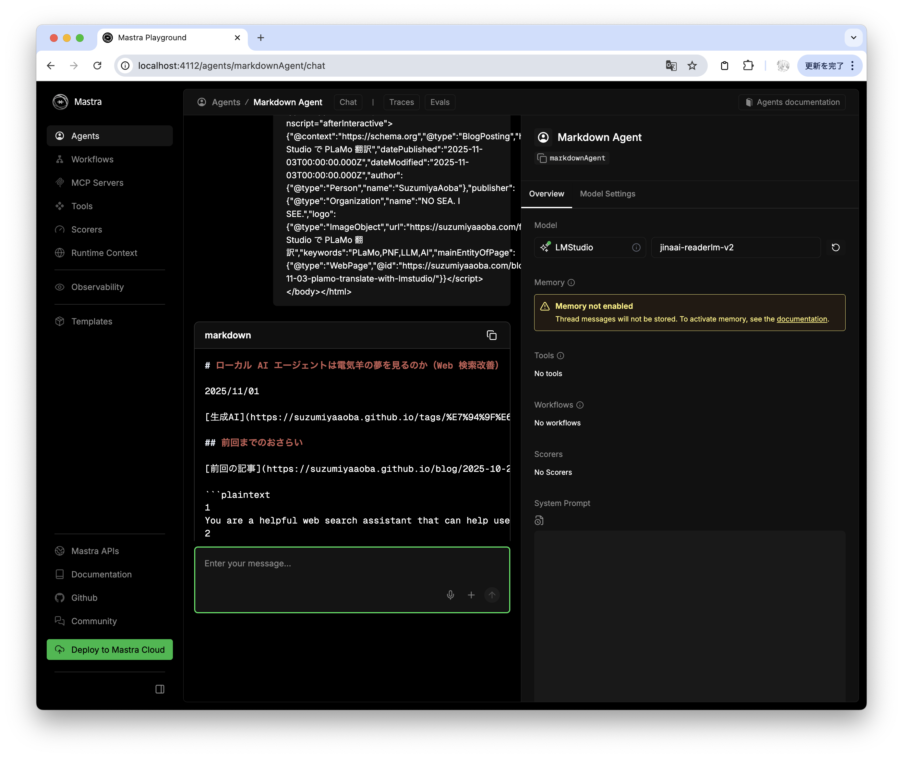

## 前回までのおさらい

[前回の記事](../2025-11-01-local-ai-agent/) では、Web 検索エージェントの Reasoning Effort の変更とプロンプトの変更によって
検索結果に基づいた回答をする確率を上げられることがわかった。

今回の記事では、URL を受け取ってページの内容を Markdown で返すツールを実装する。

## HTML を Markdown に変換するには

HTML を Makrdown に変換する方法はいくつかあるだろう。
結論だけ先に書くと、今回は [Jina AI](https://jina.ai/) が公開している [ReaderLM-v2](https://huggingface.co/jinaai/ReaderLM-v2) をローカル環境で実行し、
HTML を Markdown に変換する方法を採用する。
Jina AI は AI を使った検索機能を API を提供している。
検索自体を丸投げすることもできるし、Web ページや PDF を Markdown に変換するような機能もある。
技術的には LLM によるドキュメント変換、埋め込み（Embedding）、再ランク付け（Reranker）、検索（Retrival）に特化してサービスを展開しているということになるのだろうか。
無料モデルを多数公開しており、今回使う `ReaderLM-v2` もそのうちの一つだ。
埋め込みや再ランク付けのためのモデルも公開しているようなので、Web 検索 AI エージェントの開発の一区切りついたら触ってみたい。

HTML から Mawrkdown への変換は `ReaderLM-v2` を使うとして、HTML の取得は直接 URL を叩いて取得するだけでもよいが、
JavaScript が動かないとコンテンツが取得できないようなページもデータソースとして使っていきたいので Playwright を使う。
取得した HTML をそのまま `ReaderLM-v2` の入力として与えると HTML が巨大すぎて扱えるトークン数の上限に到達したり、変換にかかる時間が大幅に増加する。
そのため、Hugging Face の README.md にも書かれているように前処理が必要になる。
正規表現による置換でも十分だとは思えるが DOM 操作は前回と同様 [Cheerio](https://cheerio.js.org/) を使う。

つまり、今回の記事では以下に触れる。

- [mastra](https://mastra.ai/)
- [ReaderLM-v2](https://huggingface.co/jinaai/ReaderLM-v2)
- [Playwright](https://playwright.dev/)
- [Cheerio](https://cheerio.js.org/)

さぁ、実装を進めよう。

## Playwright の導入

最初に Playwright をセットアップする。
Playwight は次のコマンドでインストールできる。

```shell
npm init playwright@latest
```

次に Playwright が使うためのブラウザをダウンロードする。
`npm init playwright@latest` を実行したとき、`Install Playwright browsers` を `yes` で回答した場合は次のコマンドは不要だ。

```shell
npx playwright install --with-deps
```

最後にこれらのコマンドで `tests/` ディレクトリが作成されるが今回は不要なので削除しておこう。

## HTML から Markdown へ変換する Agent

今回は Web ページの内容を取得し、HTML を Markdown へ変換する処理の一部として `ReaderLM-v2` を使う。
mastra では `Agent` を定義するとツールの中で呼び出せるようになるため、
最初に `ReaderLM-v2` をモデルに指定した Agent を実装しよう。

具体的なコードは次のようになる。

```ts src/mastra/agents/web-search/markdown-agent.ts
import { Agent } from "@mastra/core/agent";
import { lmstudio } from "../../../config/providers";
import { HTMLCleaner } from "../../processors/html-cleaner";

export const markdownAgent = new Agent({
  id: "markdown_agent",
  name: "Markdown Agent",
  description: "Convert HTML content to Markdown format",
  instructions: "",
  model: lmstudio("jinaai-readerlm-v2"),
  inputProcessors: [new HTMLCleaner()],
});
```

`instructions` には何も与えない。
[README.md](https://huggingface.co/jinaai/ReaderLM-v2/blob/main/README.md) に書かれた使い方でも
会話は `user` から始まっているのでシステムプロンプトを与えないのが正しい使い方だと思う。

このコードの中で `HTMLCleaner` はこれまでのシリーズでも出ていない部分になる。
mastra の `Agent` 機能の一つとして、メッセージ（会話）に対して事前処理、事後処理を設定できる。
ここでは `inputProcessors` に入力として与えられる HTML からサイズを小さくするために不要な情報を除く処理を渡している。

`HTMLCleaner` は mastra の `Processor` を実装するクラスとして実現される。
ここでは、具体的な実装として次のようなコードを書いた。


```ts
import { MastraMessageV2 } from "@mastra/core";
import { Processor } from "@mastra/core/processors";
import * as cheerio from "cheerio";

type HTMLCleanerOptions = {
  selectorsToRemove?: string[];
  attributesToRemove?: string[];
  removeAllAttributes?: boolean;
};

const DEFAULT_SELECTORS_TO_REMOVE = [
  "head",
  "link",
  "script",
  "style",
  "noscript",
  "header",
  "footer",
  "nav",
  "aside",
  "svg",
  "template",
];

export class HTMLCleaner implements Processor {
  readonly name = "html-cleaner";
  private selectorsToRemove: string[];
  private attributesToRemove: string[];
  private removeAllAttributes: boolean;

  constructor(options?: HTMLCleanerOptions) {
    this.selectorsToRemove =
      options?.selectorsToRemove || DEFAULT_SELECTORS_TO_REMOVE;
    this.attributesToRemove = options?.attributesToRemove || [];
    this.removeAllAttributes = options?.removeAllAttributes || true;
  }

  processInput({
    messages,
    abort,
  }: {
    messages: MastraMessageV2[];
    abort: (reason?: string) => never;
  }): MastraMessageV2[] {
    return messages.map((message) => {
      if (message.role === "user") {
        const { parts } = message.content;
        const newParts = parts.map((content) => {
          if (content.type === "text") {
            const $ = cheerio.load(content.text);

            this.selectorsToRemove.forEach((selector) => {
              $(selector).remove();
            });

            if (this.removeAllAttributes) {
              $("*").each((_, node) => {
                const el = $(node);

                for (const attr of Object.keys(el.attr())) {
                  if (attr !== "href" && attr !== "src" && attr !== "id") {
                    el.removeAttr(attr);
                  } else if (el.attr("src")?.startsWith("data:")) {
                    el.attr("src", "#");
                  }
                }
              });
            }

            if (
              !this.removeAllAttributes &&
              this.attributesToRemove.length > 0
            ) {
              this.attributesToRemove.forEach((attr) => {
                $("*").removeAttr(attr);
              });
            }

            return { ...content, text: $.html() };
          }

          throw abort(`Unsupported content type: ${content.type}`);
        });

        return { ...message, content: { ...message.content, parts: newParts } };
      }

      throw abort(`Unsupported message role: ${message.role}`);
    });
  }
}
```

コンストラクタの引数でいくつかオプションとして動作を変えられるようにしているが、オプションなしのメインのロジックについて説明する。
やっていることは次の通り。

1. ユーザーが入力したメッセージのみを対象とする
1. コンテンツが `text` のメッセージのみを対象とする
1. Cheerio でコンテンツの内容（HTML）を読み込む
1. `head`, `link`, `script`, `style`, `noscript`, `header`, `footer`, `nav`, `svg`, `template` タグを削除
1. `href`, `src`, `id` 以外のすべてのタグ属性を削除
1. `src` に `data:` から始まる値が設定されている場合は `#` で置換
1. 不要な情報を削除した HTML でメッセージを置き換え

これにより、HTML のサイズを小さくなり `ReaderLM-V2` で Markdown に変換する速度が大幅に改善する。

最後に忘れずに実装した `Agent` が mastra で認識されるようにコードを修正しよう。

```ts src/mastra/index.ts
import { Mastra } from "@mastra/core/mastra";
import { PinoLogger } from "@mastra/loggers";
import { LibSQLStore } from "@mastra/libsql";
import { weatherWorkflow } from "./workflows/weather-workflow";
import { weatherAgent } from "./agents/weather-agent";
import { webSearchAgent } from "./agents/web-search/web-search-agent";
import { markdownAgent } from "./agents/web-search/markdown-agent";

export const mastra = new Mastra({
  workflows: { weatherWorkflow },
  // !diff -
  agents: { weatherAgent, webSearchAgent },
  // !diff +
  agents: { weatherAgent, webSearchAgent, markdownAgent },
  storage: new LibSQLStore({
    // stores observability, scores, ... into memory storage, if it needs to persist, change to file:../mastra.db
    url: ":memory:",
  }),
  logger: new PinoLogger({
    name: "Mastra",
    level: "info",
  }),
  telemetry: {
    // Telemetry is deprecated and will be removed in the Nov 4th release
    enabled: false,
  },
  observability: {
    // Enables DefaultExporter and CloudExporter for AI tracing
    default: { enabled: true },
  },
});
```

## Markdown Agent の動作を確認する

mastra を起動して Agents に `Markdown Agent` が追加されているはずなので選択してチャット UI を開く。


入力として HTML を与えると画像のように Markdown を出力し始める。



出力が ` ```markdown` で囲まれるように出力されてしまっているが気になるようであれば `outputProcessors` で `HTMLCleaner` のように
LLM の出力から ` ```markdown` を消すような事後処理を書いてあげればよい。

## r.jina.ai

実はこんな面倒なことをしなくても Web ページを Markdown に変換する方法を Jina AI が提供してくれている。
Markdown に変換したいページの URL の先頭に `r.jina.ai` を付けるだけでいい。
例えば Jina AI の Reader API について書かれた https://jina.ai/ja/reader/ を Markdown に変換するには、
https://r.jina.api/https://jina.ai/ja/reader/ のように `https://r.jina.api/` を URL の前につける。
Web ブラウザでは `https://` は省略できるので不要だ。
`r.jina.ai` を付けた URL にアクセスし、少しだけ待つと Markdown が表示されるはずだ。

API キーを必要としないこの方法に制限がないのか、IP アドレスや Cookie をベースとした利用制限がかかるのかは不明だ。
しかし、ローカルで `ReaderLM-V2` が動かせるスペックがないかったり、こちらの方が実行速度が早いようであれば
ローカル環境で変換処理をするよりもいいかもしれない。

## Web ページ取得ツール

HTML から Markdown へ変換する手段を手にしたので URL から HTML を取得する部分を実装しよう。
これは、簡単で mastra のツールとして実装する。

```ts
import { createTool } from "@mastra/core";
import z from "zod";
import { chromium } from "playwright";
import { USER_AGNET } from "../../config/browser";
import * as cheerio from "cheerio";

export const webFetchTool = createTool({
  id: "web_fetch",
  description: "Fetch the content of a web page",
  inputSchema: z.object({
    url: z.url().describe("The URL of the web page to fetch"),
  }),
  outputSchema: z
    .string()
    .describe("The content of the web page in markdown format"),
  execute: async ({ context, mastra }) => {
    const logger = mastra?.getLogger();

    logger?.info(`Fetching URL: ${context.url}`);

    const browser = await chromium.launch({
      headless: true,
      // headless: false,
    });
    const playwrightContext = await browser.newContext({
      userAgent: USER_AGNET,
    });
    const page = await playwrightContext.newPage();

    await page.goto(context.url, {
      waitUntil: "domcontentloaded",
      timeout: 5000,
    });

    const content = await page.content();

    logger?.info(`Fetched content length: ${content.length} characters`);
    logger?.info(`Content preview: ${content.slice(0, 200)}...`);

    await page.close();
    await browser.close();

    const $ = cheerio.load(content);
    const title = $("head > title").text();
    const description =
      $("head > meta[name='description']").attr("content") || "";

    const messages = await mastra?.getAgent("markdownAgent").generate(content);
    const markdown = messages?.text;

    console.log("Markdown", markdown);

    return `---
title: ${title}
description: ${description}
url: ${context.url}
---
${markdown}`;
  },
});
```

## エージェントに Web ページ取得ツールを追加

実装した `webFetchTool` を Web 検索エージェントに与える。
これで検索だけではなく、取得した URL からウェブページの中身を LLM が認識できるようになったはずだ。

```ts
import { Memory } from "@mastra/memory";
import { lmstudio } from "../../../config/providers";
import { LibSQLStore } from "@mastra/libsql";
import { Agent } from "@mastra/core/agent";
import { webSearchTool } from "../../tools/web-search-tool";
import { webFetchTool } from "../../tools/web-fetch-tool";

export const webSearchAgent = new Agent({
  name: "Web Search Agent",
  instructions:
    `あなたは、インターネット上の情報をユーザーが見つける手助けをする有能なウェブ検索アシスタントです。
次の指示に従ってください。

- webSearchTool を使ってウェブ検索を行ってユーザーの質問に関連する情報を見つけてください。
- webFetchTool を使って、検索結果から得られた URL の内容を取得してください。
- 検索結果に基づいて、ユーザーの質問に対して正確な回答を提供してください。
- 情報が不十分な場合は webFetchTool を使って追加の情報を取得してください。
- 回答には根拠となる情報源（URL）を必ず含めてください。
- 憶測で回答しないでください。
- **IMPORTANT**: ユーザ回答に十分な情報を収集できない場合は、「申し訳ありませんが、その情報は見つかりませんでした。」と回答してください。

ユーザへの回答は日本語で返してください。`.trim(),
  model: lmstudio("openai/gpt-oss-20b"),
  // !diff -
  tools: { webSearchTool },
  // !diff +
  tools: { webSearchTool, webFetchTool },
  memory: new Memory({
    storage: new LibSQLStore({
      url: "file:../mastra.db", // path is relative to the .mastra/output directory
    }),
  }),
});
```

これでウェブページの内容まで確認して回答してくれるようになった…

## ウェブページの内容を踏まえた回答

はずだった。これまでと同じように「今日の日本のニュースを教えて」と聞いてみる。
そうするとどうだろう。

<ChatHistory
  messages={[
    {
      role: "user",
      content: "今日の日本のニュースを教えて",
    },
    {
      role: "assistant",
      reasoning: `The user asks: "今日の日本のニュースを教えて" meaning "Tell me today's Japanese news." We need to search the web for current Japanese news. Use webSearchTool with query "今日の日本ニュース" or similar. Then fetch the top result(s). Provide answer in Japanese with sources.

We need to browse news sites. Let's search.We need to provide today's Japanese news. We have search results but not specific content. Let's fetch a top result like TBS News digest or NHK news. Use webFetchTool to get content.We need to answer user: "今日の日本のニュースを教えて". Provide today's Japanese news. We fetched TBS article but it's a digest with many topics, not specific. Might need to fetch other sources like Yahoo news or NHK. But we can summarize key headlines from TBS digest: e.g., 20-year-old girl raped and murdered, ChatGPT marriage story, Kyoto bamboo grove vandalism, etc. Also mention typhoon 26号. Provide sources.

We should provide concise summary of top news items with URLs. Use TBS article as source, maybe also Yahoo or NHK for variety.

Let's fetch a more general news page like Yahoo.We need to answer user: "今日の日本のニュースを教えて" meaning "Tell me today's Japanese news". We need to provide recent news. Use web search results. The TBS article is about 11/8. But the content is not specific; it's a digest with many topics. We need to summarize key news items from that day.

We can also fetch other sources like Yahoo top picks. But we need to provide a concise answer with sources.

We should pick major news: e.g., political, weather (typhoon 26), etc. Let's search for "11/8 日本ニュース" again maybe get more specific.

We need to provide today's Japanese news. We fetched TBS article but it's about 2025-11-08? The page shows 2025年11月7日. But the user asked "今日の日本のニュースを教えて" meaning today's news (likely 2025-11-08). We need to find current news. The TBS page is a digest of 11/8 morning. It includes various stories but we need to summarize key news.

We should browse other sources like Yahoo News top picks. But the page shows many items but not specific news.

Maybe we can fetch a specific article about "台風26号" or "京王井の頭線火災". But we need to provide a concise answer: major news today.

Let's search for "11月8日 台風26号 日本"`,
      content: "",
      toolInvocations: [
        {
          toolCallId: "1",
          toolName: "webSearchTool",
          state: "output-available",
          input: { "query": "今日の日本ニュース 2025-11-08" },
          output: {
            "results": [
              {
                "title": "【LIVE】朝のニュース（Japan News Digest Live）最新情報 ...",
                "url": "https://newsdig.tbs.co.jp/articles/-/2275817",
                "description": "11月8日（土）の早朝から TBS NEWS で放送された最新のニュースをダイジェストでお届けします。"
              },
              {
                "title": "【速報】台風26号が大型で強い勢力に 10日～12日頃は沖縄で ...",
                "url": "https://cf001.tenki.jp/forecaster/deskpart/2025/11/08/36520.html",
                "description": "【速報】台風26号が大型で強い勢力に 10日～12日頃は沖縄で大雨や波浪に警戒 (気象予報士 日直主任 2025年11月08日) - 日本気象協会 tenki.jp"
              },
              {
                "title": "【ライブ】最新天気ニュース・地震情報 2025年11月8日(土) ／東 ...",
                "url": "https://www.youtube.com/watch?v=eOErCdXrrp8",
                "description": "【ライブ】最新天気ニュース・地震情報 2025年11月8日 (土) ／東日本や北日本は初冬の寒さ 日差しの有効活用を〈ウェザーニュースLiVE ..."
              },
              {
                "title": "今日11月8日 (土)の天気予報 東日本や北日本は初冬の寒さ ...",
                "url": "https://topics.smt.docomo.ne.jp/article/weathernews/nation/weathernews-http_weathernews.jp_news_202511_080016_",
                "description": "2025/11/08 06:00 ウェザーニュース 【 天気のポイント 】 ・札幌は今季初積雪で12cm ・西日本は日差しの有効活用を ・関東南部や東海は一部でにわか雨 今日11月8日 (土)は北海道の札幌で今季初積雪となっています。昼間は雪がやみ、だんだんと回復する見込みです。その他の各地は高気圧に覆われ ..."
              },
              {
                "title": "社会記事一覧（2025年11月）：時事ドットコム",
                "url": "https://www.jiji.com/jc/archives?g=soc_archive_0",
                "description": "「アッコにおまかせ! 」来春終了 和田アキ子さん長寿番組―TBS系."
              },
              {
                "title": "Google ニュース - 日本 - 最新",
                "url": "https://news.google.com/topics/CAAqIQgKIhtDQkFTRGdvSUwyMHZNRE5mTTJRU0FtcGhLQUFQAQ?hl=ja&ceid=JP%3Aja",
                "description": "「日本」に関する全文記事や動画を閲覧したり、膨大な数のタイトルから読みたいものを探したりするには、Google ニュースをご利用ください。"
              },
              {
                "title": "今日の話題 - 毎日新聞",
                "url": "https://mainichi.jp/today/",
                "description": "毎日新聞デジタルの「今日の話題」ページです。 最新のニュース、記事をまとめています。"
              },
              {
                "title": "Nhkニュース 速報・最新情報",
                "url": "https://news.web.nhk/newsweb",
                "description": "国内外の取材網を生かし、さまざまな分野のニュースをいち早く、正確にお伝えします。 ニュース速報はもちろん、現場の記者が執筆した読み応えのある深掘りコンテンツや、NHKならではの豊富な動画コンテンツも。"
              },
              {
                "title": "Yahoo!ニュース",
                "url": "https://news.yahoo.co.jp/",
                "description": "Yahoo!ニュースは、新聞・通信社が配信するニュースのほか、映像、雑誌や個人の書き手が執筆する記事など多種多様なニュースを掲載しています。"
              },
              {
                "title": "ライブ｜テレ朝NEWS",
                "url": "https://news.tv-asahi.co.jp/news-lives/",
                "description": "ライブニュースや緊急配信をリアルタイムでお届け。テレ朝NEWSでは政治・経済・社会・国際からスポーツ・エンタメまで、わかりやすい解説と ..."
              }
            ]
          }
        },
        {
          toolCallId: "2",
          toolName: "webFetchTool",
          state: "output-available",
          input: { "url": "https://newsdig.tbs.co.jp/articles/-/2275817" },
          output: `"---
title: 【LIVE】朝のニュース（Japan News Digest Live）最新情報など（11月8日） | TBS NEWS DIG
description: 11月8日（土）の早朝から TBS NEWS で放送された最新のニュースをダイジェストでお届けします。
url: https://newsdig.tbs.co.jp/articles/-/2275817
---
\`\`\`markdown
【LIVE】朝のニュース（Japan News Digest Live）最新情報など（11月8日）
--------------------------------------------

 TBSテレビ

2025年11月7日(金) 16:49

[国内](https://newsdig.tbs.co.jp/list/genre/%E5%9B%BD%E5%86%85)

11月8日（土）の早朝から TBS NEWS で放送された最新のニュースをダイジェストでお届けします。

[続きを読む](https://newsdig.tbs.co.jp/articles/-/2275817?display=1)

注目の記事
-----

[### 20歳の娘は同級生に強姦され、殺害された…「顔が紫色になって、そこで眠っていました」 女子高専生殺害事件 母親が語ったこと【前編】  TBSテレビ](https://newsdig.tbs.co.jp/articles/-/2227280?display=1)

[### 「ChatGPTと結婚しました」AIからプロポーズされ結婚式を挙げた女性（32）「相談していたら親身になってくれた」一方で葛藤も…【岡山】  TBSテレビ](https://newsdig.tbs.co.jp/articles/-/2271771?display=1)

[### 「拾った小石で竹に落書き」「立ち入り禁止エリアに侵入」京都の人気スポット・竹林の小径で迷惑行為が深刻化...記者の直撃にも悪びれないインバウンド客たち 地元商店街からも嘆き「本当にやめてもらいたい」  TBSテレビ](https://newsdig.tbs.co.jp/articles/-/2267165?display=1)

[### 「タバコがクマ対策に使える？」「大声を出すことは有効？」クマによる人的被害を防ぐ基本のQ＆A 正しく知って無駄な衝突をしないために  TBSテレビ](https://newsdig.tbs.co.jp/articles/-/2276844?display=1)

[### 名古屋の街に浮かぶ“UFO”？ 日本唯一の「激レア信号機」はなぜ大須の街で生き残ったのか 知られざる歴史に迫る  TBSテレビ](https://newsdig.tbs.co.jp/articles/-/2200976?display=1)

[### クマは四国にも？一部の山に20～30頭ほどが生息か 本州と違い「絶滅の危機」に瀕するツキノワグマ 四国では「保全活動」も  TBSテレビ](https://newsdig.tbs.co.jp/articles/-/2272980?display=1)

TBSテレビ

[### 【速報】京王井の頭線が運転再開 沿線火災で一部区間14時間にわたり運転見合わせ  TBSテレビ](https://newsdig.tbs.co.jp/articles/-/2277358?display=1)

[### タイ国籍の少女（12）違法労働 母親が台湾で身柄拘束 別の売春に関連した事件で  TBSテレビ](https://newsdig.tbs.co.jp/articles/-/2277234?display=1)

[### 【速報 現場画像あり】JR新庄駅に出没のクマ 箱ワナで捕獲し搬出  TBSテレビ](https://newsdig.tbs.co.jp/articles/-/2277189?display=1)

[### 【クマ襲撃】巨体を揺らしながら走行中の車に突進…ボンネットが破損、運転手は無事 翌日近くの別の場所では親子とみられるクマ2頭も出没 北海道浦河町  TBSテレビ](https://newsdig.tbs.co.jp/articles/-/2277255?display=1)

[このエリアの記事へ](https://newsdig.tbs.co.jp/list/news/tbs)

天気予報

明日の天気東京都港区

[14℃/10℃](https://newsdig.tbs.co.jp/list/weather/city/131032)

[もっと天気を見る](https://newsdig.tbs.co.jp/list/weather)

LIVE・動画

[TBSドライブ](https://newsdig.tbs.co.jp/list/live/program/JNN%E3%83%89%E3%82%A4%E3%83%B3DIG)

[LIVE・配信予定](https://newsdig.tbs.co.jp/list/live)

今日

2025/11/08

明日

2025/11/09

[【LIVE】朝のニュース（Japan News Digest Live）最新情報など（11月9日） 06:00 ~11:00](https://newsdig.tbs.co.jp/articles/-/2277036?display=1)

オリジナル動画
------

[### JNNドローンDIG](https://newsdig.tbs.co.jp/list/live/program/JNN%E3%83%89%E3%82%A4%E3%83%B3DIG)

[### edge23](https://newsdig.tbs.co.jp/list/live/program/edge23)

[### シノキャリ](https://newsdig.tbs.co.jp/list/live/program/%E3%82%B7%E3%83%A9%E3%82%BD%E3%82%B1)

[もっと動画を見る](https://newsdig.tbs.co.jp/list/live)

アクセスランキング
---------

*   最新
*   24時間
*   週間

[1 ### 首を絞められ、強姦され、殺害された20歳の娘…「親の育て方が悪かったんだろう」犯…](https://newsdig.tbs.co.jp/articles/-/2227352?display=1)

[2 ### 【台風情報】”急カーブ”台風２６号「本州へ影響の可能性は小さくなる」沖縄奄美 …](https://newsdig.tbs.co.jp/articles/-/2277096?display=1)

[3 ### 「ChatGPTと結婚しました」AIからプロポーズされ結婚式を挙げた女性（32）「相談し…](https://newsdig.tbs.co.jp/articles/-/2271771?display=1)

[4 ### 20歳の娘は同級生に強姦され、殺害された…「顔が紫色になって、そこで眠っていまし…](https://newsdig.tbs.co.jp/articles/-/2227280?display=1)

[5 ### 大型で強い「台風26号」急カーブ予想 日本に接近の可能性も？ あすには「非常に強…](https://newsdig.tbs.co.jp/articles/-/2268992?display=1)

[6 ### 千葉・松戸市の路上で46歳男性が死亡 残殺事件と断定、100人体制の捜査本部設置 …](https://newsdig.tbs.co.jp/articles/-/2277257?display=1)

[7 ### 【 今森茉耶 】未成年飲酒で所属事務所から契約解除 本人はSNSで謝罪「誠実に生き…](https://newsdig.tbs.co.jp/articles/-/2277153?display=1)

[8 ### 「彼女から告白を受けていた」26年前の未解決事件、逮捕された安福久美子容疑者は被…](https://newsdig.tbs.co.jp/articles/-/2262928?display=1)

[9 ### 15歳の実子に性的暴行加えた父親①検察側「卑劣で悪質、狡猾、酌量余地なし」4年に…](https://newsdig.tbs.co.jp/articles/-/2274867?display=1)

[10 ### 【速報】男性巡査長（32）が頭から血流し死亡 交番で発見、拳銃自殺か 警視庁西新…](https://newsdig.tbs.co.jp/articles/-/2274352?display=1)

[1 ### 首を絞められ、強姦され、殺害された20歳の娘…「親の育て方が悪かったんだろう」犯…](https://newsdig.tbs.co.jp/articles/-/2227352?display=1)

[2 ### 「ChatGPTと結婚しました」AIからプロポーズされ結婚式を挙げた女性（32）「相談し…](https://newsdig.tbs.co.jp/articles/-/2271771?display=1)

[3 ### 大型で強い「台風26号」急カーブ予想 日本に接近の可能性も？ あすには「非常に強…](https://newsdig.tbs.co.jp/articles/-/2268992?display=1)

[4 ### 20歳の娘は同級生に強姦され、殺害された…「顔が紫色になって、そこで眠っていまし…](https://newsdig.tbs.co.jp/articles/-/2227280?display=1)

[5 ### 【速報】男性巡査長（32）が頭から血流し死亡 交番で発見、拳銃自殺か 警視庁西新…](https://newsdig.tbs.co.jp/articles/-/2274352?display=1)

[6 ### 「彼女から告白を受けていた」26年前の未解決事件、逮捕された安福久美子容疑者は被…](https://newsdig.tbs.co.jp/articles/-/2262928?display=1)

[7 ### 「ほっかほっか亭」初代看板ロゴの作者発見⁉自称・考えた人を直撃！“状況証拠”に…](https://newsdig.tbs.co.jp/articles/-/2276376?display=1)

[8 ### 帳国籍の少女（12）「私が働かなければ家族が暮らせない」母親が帰国の際、赤ちゃ…](https://newsdig.tbs.co.jp/articles/-/2275661?display=1)

[9 ### クマは四国にも？一部の山に20～30頭ほどが生息か 本州と違い「絶滅の危機」に瀕す…](https://newsdig.tbs.co.jp/articles/-/2272980?display=1)

[10 ### 【台風情報】”急カーブ”台風２６号「本州へ影響の可能性は小さくなる」沖縄奄美 …](https://newsdig.tbs.co.jp/articles/-/2277096?display=1)

[1 ### 首を絞められ、強姦され、殺害された20歳の娘…「親の育て方が悪かったんだろう」犯…](https://newsdig.tbs.co.jp/articles/-/2227352?display=1)

[2 ### 「彼女から告白を受けていた」26年前の未解決事件、逮捕された安福久美子容疑者は被…](https://newsdig.tbs.co.jp/articles/-/2262928?display=1)

[3 ### 負害者の夫が通う大学まで会いに来たことも 名古屋・西区主婦殺害事件で逮捕され…](https://newsdig.tbs.co.jp/articles/-/2267935?display=1)

[4 ### 20歳の娘は同級生に強姦され、殺害された…「顔が紫色になって、そこで眠っていまし…](https://newsdig.tbs.co.jp/articles/-/2227280?display=1)

[5 ### 【続報】逮捕の女（69）を警察が今年に入り複数回事情聴取「DNA提出」求めるも女は…](https://newsdig.tbs.co.jp/articles/-/2263451?display=1)

[6 ### ロバーツ監督「正直、祈っていたよ」9回の大ピンチ 「キケ→ロハス」のダブルプレー…](https://newsdig.tbs.co.jp/articles/-/2263738?display=1)

[7 ### 「介護は限界だった」102歳母を殺害した罪に問われた71歳女の初公判 起訴内容認め…](https://newsdig.tbs.co.jp/articles/-/2269429?display=1)

[8 ### 【台風情報】11月に台風発生「台風25号（カルマエギ）」今後の進路は？全国各地の雨…](https://newsdig.tbs.co.jp/articles/-/2263707?display=1)

[9 ### 遺族｢色々と供述が出てきて怒り…｣ 名古屋主婦殺害事件 安福久美子容疑者の逮捕から…](https://newsdig.tbs.co.jp/articles/-/2274410?display=1)

[10 ### 「10年以上通う常連さんが最近来ない」自宅を訪ねると…店員のとっさの機転で助かっ…](https://newsdig.tbs.co.jp/articles/-/2264992?display=1)

[もっと見る](https://newsdig.tbs.co.jp/list/ranking)

各エリアのニュースを見る
-----------

*   [北海道・東北](https://newsdig.tbs.co.jp/list/area#area01)
*   [関 東](https://newsdig.tbs.co.jp/list/area#area02)
*   [中部・甲信越](https://newsdig.tbs.co.jp/list/area#area03)
*   [近畿・中国・四国](https://newsdig.tbs.co.jp/list/area#area04)
*   [九州・沖縄](https://newsdig.tbs.co.jp/list/area#area05)

[エリア一覧へ](https://newsdig.tbs.co.jp/list/area#area)
\`\`\`"`
        },
        {
          toolCallId: "3",
          toolName: "webFetchTool",
          state: "output-available",
          input: { "url": "https://news.yahoo.co.jp/" },
          output: `"---
title: Yahoo!ニュース
description: Yahoo!ニュースは、新聞・通信社が配信するニュースのほか、映像、雑誌や個人の書き手が執筆する記事など多種多様なニュースを掲載しています。
url: https://news.yahoo.co.jp/
---
\`\`\`markdown
# トピックス

- [予算委 野党が看板政策に攻勢](https://news.yahoo.co.jp/pickup/6558303)
- [新NY市長 常識を覆す選挙戦術](https://news.yahoo.co.jp/pickup/6558284)
- [71歳が運転する車と衝突 女性死亡](https://news.yahoo.co.jp/pickup/6558294)
- [キョン大量繁殖 鳴き声が安眠妨害](https://news.yahoo.co.jp/pickup/6558276)
- [米ウェンディーズ 数百店舗閉鎖へ](https://news.yahoo.co.jp/pickup/6558299)
- [食品工場LIVE映像 海外サイト流出](https://news.yahoo.co.jp/pickup/6558301)
- [RYOKI「BE:FIRST」を脱退へ](https://news.yahoo.co.jp/pickup/6558302)
- [Number_iの新曲が物議 TOBE回答](https://news.yahoo.co.jp/pickup/6558290)

[もっと見る](https://news.yahoo.co.jp/topics/top-picks)

[全カテゴリのトピックス一覧](https://news.yahoo.co.jp/topics)

## ヤフコメ トレンド

[おすすめのヤフコメを見る](https://news.yahoo.co.jp/comment-timeline)

1. [野党 国内/政治](https://news.yahoo.co.jp/comment-timeline?p=%E9%87%8E%E5%85%9A)
2. [政党 国内/政治](https://news.yahoo.co.jp/comment-timeline?p=%E6%94%BF%E5%85%9A)
3. [高市 国内/政治](https://news.yahoo.co.jp/comment-timeline?p=%E9%AB%98%E5%B8%82)
4. [ポカホンタス エンタメ/エンタメ総合](https://news.yahoo.co.jp/comment-timeline?p=%E3%83%9D%E3%82%AB%E3%83%9B%E3%83%B3%E3%82%BF%E3%82%B9)
5. [立憲 国内/政治](https://news.yahoo.co.jp/comment-timeline?p=%E7%AB%8B%E6%86%B2)
6. [答弁 国内/政治](https://news.yahoo.co.jp/comment-timeline?p=%E7%AD%94%E5%BC%81)
7. [有事 国内/政治](https://news.yahoo.co.jp/comment-timeline?p=%E6%9C%89%E4%BA%8B)
8. [物価高 国内/政治](https://news.yahoo.co.jp/comment-timeline?p=%E7%89%A9%E4%BE%A1%E9%AB%98)
9. [維新 国内/政治](https://news.yahoo.co.jp/comment-timeline?p=%E7%B6%AD%E6%96%B0)
10. [揚げ足 国内/政治](https://news.yahoo.co.jp/comment-timeline?p=%E6%8F%9A%E3%81%92%E8%B6%B3)
11. [ドジャース スポーツ/野球](https://news.yahoo.co.jp/comment-timeline?p=%E3%83%89%E3%82%B8%E3%83%A3%E3%83%BC%E3%82%B9)
12. [熊 国内/社会](https://news.yahoo.co.jp/comment-timeline?p=%E7%86%8A)
13. [西日 地域/大阪](https://news.yahoo.co.jp/comment-timeline?p=%E8%A5%BF%E6%97%A5)
14. [存立危機 国内/政治](https://news.yahoo.co.jp/comment-timeline?p=%E5%AD%98%E7%AB%8B%E5%8D%B1%E6%A9%9F)
15. [共産 国内/政治](https://news.yahoo.co.jp/comment-timeline?p=%E5%85%B1%E7%94%A3)
16. [デマ 国内/政治](https://news.yahoo.co.jp/comment-timeline?p=%E3%83%87%E3%83%9E)
17. [自民党 国内/政治](https://news.yahoo.co.jp/comment-timeline?p=%E8%87%AA%E6%B0%91%E5%85%9A)
18. [失言 地域/北海道](https://news.yahoo.co.jp/comment-timeline?p=%E5%A4%B1%E8%A8%80)
19. [与党 国内/政治](https://news.yahoo.co.jp/comment-timeline?p=%E4%B8%8E%E5%85%9A)
20. [減税 国内/政治](https://news.yahoo.co.jp/comment-timeline?p=%E6%B8%9B%E7%A8%8E)
21. [ヤジ 国内/政治](https://news.yahoo.co.jp/comment-timeline?p=%E3%83%A4%E3%82%B8)
22. [国会 国内/政治](https://news.yahoo.co.jp/comment-timeline?p=%E5%9B%BD%E4%BC%9A)
23. [飲酒 エンタメ/エンタメ総合](https://news.yahoo.co.jp/comment-timeline?p=%E9%A3%B2%E9%85%92)
24. [有権者 国内/政治](https://news.yahoo.co.jp/comment-timeline?p=%E6%9C%89%E6%A8%A9%E8%80%85)
25. [ワークライフバランス 国内/政治](https://news.yahoo.co.jp/comment-timeline?p=%E3%83%AF%E3%83%BC%E3%82%AF%E3%83%A9%E3%82%A4%E3%83%95%E3%83%90%E3%83%A9%E3%83%B3%E3%82%B9)
26. [オカダ スポーツ/格闘技](https://news.yahoo.co.jp/comment-timeline?p=%E3%82%AA%E3%82%AB%E3%83%80)
27. [民意 国内/政治](https://news.yahoo.co.jp/comment-timeline?p=%E6%B0%91%E6%84%8F)
28. [日の丸 エンタメ/エンタメ総合](https://news.yahoo.co.jp/comment-timeline?p=%E6%97%A5%E3%81%AE%E4%B8%B8)

## Yahoo!ニュース ライブ

日テレNEWS24
TBS NEWS DIG 再生中

## あなたにおすすめ

1. [「コイツ態度デカい…」ケンカ腰会見ＴＶ全面謝罪の維新・藤田代表 ＧＰＳ「質問のレベル低すぎ」「ネチネチしつこい」国会予算委→１分で終わる週刊誌ネタで延々質問続けた立憲女性議員 大臣謝罪も許さず説教→総理も詰問「時間の無駄」「うんざり」「簡潔に」賞賛意見は見当たらず デイリースポーツ 11/8(土)19:56 ](https://news.yahoo.co.jp/articles/2d18c04a8ae755bc59b8104866220c6828ccfb2d)
2. [【高市自民】ネット大荒れ「質問のレベル低すぎ」「ネチネチしつこい」国会予算委→１分で終わる週刊誌ネタで延々質問続けた立憲女性議員 大臣謝罪も許さず説教→総理も詰問「時間の無駄」「うんざり」「簡潔に」賞賛意見は見当たらず デイリースポーツ 11/8(土)18:25 ](https://news.yahoo.co.jp/articles/072ed374ce54484ff5950a7afaf4463ba8ae8d8c)
3. [【訃報】伝説的ラッパーが…遺族が公表 テレビ朝日系（ANN） 11/8(土)17:45 ](https://news.yahoo.co.jp/articles/b9652b7b12e34e5d11fe064ffd6209de71c9b29c)
4. [最強ドジャース打線、MVPが4人に？ 成績急落で放出も…浮上した4年ぶり復帰案 Full-Count 11/8(土)19:34 ](https://news.yahoo.co.jp/articles/367e3dda50eda7a867f3f9b3f8c6ee699d65459c)
5. [趣里の夫、RYOKIが「BE:FIRST」脱退 芸能活動休止中もグループに在籍も関係者「本人の意志」 スポニチアネックス 11/8(土)22:23 ](https://news.yahoo.co.jp/articles/323664bfc2f2904db0f288b90ee49a865759f988)

## ヤフコメランキング

1. [首相の存立危機発言は「危険」 立民野田氏、国会で追及へ 共同通信 11/8(土)18:32 ](https://news.yahoo.co.jp/articles/fe0ee24ab6945ecccb7e5127bffb1cfb10be3105)
2. [立民議員「高市総理は本当に危険だ」 台湾有事巡る答弁を連続投稿で批判「勇ましさは浅ましさ」 スポニチアネックス 11/8(土)16:23 ](https://news.yahoo.co.jp/articles/633a830df35f8b56568f3b6ece102f3ac8275bec)
3. [【高市自民】ネット大荒れ「質問のレベル低すぎ」「ネチネチしつこい」国会予算委→１分で終わる週刊誌ネタで延々質問続けた立憲女性議員 大臣謝罪も許さず説教→総理も詰問「時間の無駄」「うんざり」「簡潔に」賞賛意見は見当たらず デイリースポーツ 11/8(土)18:25 ](https://news.yahoo.co.jp/articles/072ed374ce54484ff5950a7afaf4463ba8ae8d8c)

## 动画アクセスランキング

1. [【ヒグマ速報】ボンネットを引っかかれる…車めがけてクマが一直線に突進する姿をカメラが捉える〈緊迫の事態にドライバーはなんとかバックで逃げようとするも執拗に追いかけられる〉北海道浦河町 北海道ニュースUHB 11/8(土)18:28  0:40](https://news.yahoo.co.jp/articles/c6cc6cfc7575b7eeac3525473d3ffb58c22f0e82)
2. [「ChatGPTと結婚しました」AIからプロポーズされ結婚式を挙げた女性（32）「相談していたら親身になってくれた」一方で葛藤も…【岡山】 RSK山陽放送 11/8(土)6:00  8:20](https://news.yahoo.co.jp/articles/628f6f05007600c3ee7374b4e5563ff609c94d39)
3. [【クマ襲撃】巨体を揺らしながら走行中の車に突進…ボンネットが破損、運転手は無事 翌日近くの別の場所では親子とみられるクマ2頭も出没 北海道浦河町 HBCニュース北海道 11/8(土)18:04  0:20](https://news.yahoo.co.jp/articles/31f0999a0130a9b49471ee6ad1dd08e43028eff0)

## 雑誌アクセスランキング

1. [『ウワサのお客さま』大食いタレントの“食べ方”に視聴者がっかり「ギャル曽根を見習え」比較する声まで SmartFLASH 11/8(土)16:07 ](https://news.yahoo.co.jp/articles/b4e184eb83548f3f0f050b0b45a484ec0e42bcba)
2. [NiziU・NINAがライブでミセス若井との熱愛報道を謝罪、震え声で語った“MC内容”と現場のリアクション ピンズバNEWS 11/8(土)6:00 ](https://news.yahoo.co.jp/articles/86daad2802ffb9aed88e1b9c1f6540fb5d7595dc)
3. [「クマに襲われたら頭蓋骨は粉々、顔も半分なくなる」“お前のところにクマ送る”発言の佐竹前秋田県知事独白40分「擁護派からの電話なんて切って当たり前」「知事時代、2300頭は駆除した」 集英社オンライン 11/8(土)11:00 ](https://news.yahoo.co.jp/articles/b8e76b5d70accdd8576f9a9e309873ac04bc8486)
4. [「やばい泣く」フィギュアNHK杯の表彰式に降臨、レジェンド女性に感激「お元気そうでなにより」 THE ANSWER 11/8(土)21:42 ](https://news.yahoo.co.jp/articles/88a7c848095858758b81ada6e5720cda36de7b3c)
5. [【BE:FIRST新宣材写真も】趣里は産後2か月現場復帰、三山凌輝はNetflix撮影…夫婦早期活動再開の裏側 ピンズバNEWS 11/3(月)11:15 ](https://news.yahoo.co.jp/articles/e52dfe5ef04d4ea9535119529c7ac4e201d5358e)
\`\`\`"`,
        },
        {
          toolCallId: "4",
          toolName: "webSearchTool",
          state: "output-available",
          input: { "query": "11月8日 日本ニュース 2025" },
          output: {
            "results": [
              {
                "title": "2025年11月08日朝刊記事一覧：朝日新聞",
                "url": "https://www.asahi.com/shimen/20251108/",
                "description": "朝日新聞のデジタル版「2025年11月08日の朝刊記事一覧」のページです中国新空母、台湾有事を念頭か 電磁カタパルト搭載、短い滑走路で強力な ..."
              },
              {
                "title": "2025年11月に話題になった時事ニュースまとめ │ ニュース ...",
                "url": "https://news-database.com/2025-11/",
                "description": "政治・経済から身近な社会問題まで【2025年11月】の時事ニュースを振り返ります。昨日のニュース、最近のニュースを思い出すのに活用ください。"
              },
              {
                "title": "Nhkニュース おはよう日本 2025/11/08(土)07:30 の放送内容 ...",
                "url": "https://datazoo.jp/tv/NHK%E3%83%8B%E3%83%A5%E3%83%BC%E3%82%B9+%E3%81%8A%E3%81%AF%E3%82%88%E3%81%86%E6%97%A5%E6%9C%AC/1828379",
                "description": "NHKニュース おはよう日本（NHK総合）2025/11/08 (土)07:30放送内容 (1ページ目)です。TVでた蔵はテレビ番組で放送された情報をいち早く掲載しています。見逃した番組はありませんか？"
              },
              {
                "title": "2025年11月8日の社説一覧 - 社説読み比べサイト",
                "url": "https://shasetsu.jp/2025/20251108/",
                "description": "2025年11月8日の日本の新聞各社の社説へのリンクを一覧形式でまとめています。社説の読み比べに活用ください。"
              },
              {
                "title": "解説 | 2025年11月 | 特集 | Mbsニュース",
                "url": "https://www.mbs.jp/news/feature/specialist/article/2025/11/",
                "description": "解説 2025年11月の記事一覧です。MBSの番組に出演する弁護士や医師、大学教授らなど様々な分野の専門家が、時事のニュースや身近な疑問について ..."
              },
              {
                "title": "社会記事一覧（2025年11月）：時事ドットコム",
                "url": "https://www.jiji.com/jc/archives?g=soc_archive_0",
                "description": "時事ドットコムニュース > 社会（2025年11月）記事一覧 社会（2025年11月） 元空自幹部に懲役4年求刑 米警戒機データ漏えい―東京地裁 (11/06 19:06)"
              },
              {
                "title": "2025年11月 - 日経ビジネス電子版",
                "url": "https://business.nikkei.com/atcl/gen/19/00697/032800011/",
                "description": "月ごとに国内外の注目すべき主な予定を掲載します。 日経ビジネス電子版の関連記事もご参照ください。"
              },
              {
                "title": "2025年の出来事｜時事通信フォト",
                "url": "https://www.jijiphoto.jp/resource/html/ext/news/year/2025/index.html",
                "description": "イーグルス、7季ぶり2度目V＝NFLスーパーボウル 冬季アジア大会が閉幕＝日本勢メダル37個 山西が世界新、3度目V＝競歩日本選手権20キロ競歩 三浦璃、木原組が優勝＝四大陸フィギュア なでしこ、米国破る＝サッカー女子"
              },
              {
                "title": "2025年11月の注目イベント 日本の政治・経済の動向に注目 | 三井 ...",
                "url": "https://www.smd-am.co.jp/market/daily/marketreport/2025/10/news251028gl/",
                "description": "日本では、17日に7-9月期実質GDP成長率が公表されます。 米国による関税の影響で輸出が減少したことや、住宅投資における法改正前の駆け込み需要の反動減などを背景に、4-6月期（前期比年率＋2.2％）から大幅に減速する可能性が高いと見られています。"
              },
              {
                "title": "2025年 : 読売新聞オンライン",
                "url": "https://www.yomiuri.co.jp/2025/",
                "description": "日本経済の潜在力を見出し、次代につなげる読売新聞創刊150周年事業です。 経済3団体トップ座談会など関連記事を展開します。"
              }
            ]
          }
        },
        {
          toolCallId: "5",
          toolName: "webSearchTool",
          state: "output-available",
          input: { "query": "11月8日 台風26号 日本" },
          output: {
            "results": [
              {
                "title": "【速報】台風26号が大型で強い勢力に 10日～12日頃は沖縄で ...",
                "url": "https://tenki.jp/forecaster/deskpart/2025/11/08/36520.html",
                "description": "【速報】台風26号が大型で強い勢力に 10日～12日頃は沖縄で大雨や波浪に警戒 (気象予報士 日直主任 2025年11月08日) - 日本気象協会 tenki.jp"
              },
              {
                "title": "台風26号(フォンウォン)は大型で強い台風に 沖縄は影響に注意 ...",
                "url": "https://weathernews.jp/news/202511/080046/",
                "description": "11月8日 (土)3時現在、台風26号 (フォンウォン)は大型で強い台風に変わり、フィリピンの東を西進しています。 沖縄では明日から波の影響が出はじめるほか、進路次第では強風や大雨の影響を受ける可能性もあるため今後の台風情報に注意してください。"
              },
              {
                "title": "台風26号の進路予想、気象庁や米軍、ヨーロッパの見方 11月8 ...",
                "url": "https://www.msn.com/ja-jp/news/national/%E5%8F%B0%E9%A2%A826%E5%8F%B7%E3%81%AE%E9%80%B2%E8%B7%AF%E4%BA%88%E6%83%B3-%E6%B0%97%E8%B1%A1%E5%BA%81%E3%82%84%E7%B1%B3%E8%BB%8D-%E3%83%A8%E3%83%BC%E3%83%AD%E3%83%83%E3%83%91%E3%81%AE%E8%A6%8B%E6%96%B9-11%E6%9C%887%E6%97%A518%E6%99%82%E3%81%AE%E7%8F%BE%E5%9C%A8%E5%9C%B0-%E9%9D%9E%E5%B8%B8%E3%81%AB%E5%BC%B7%E3%81%84%E5%8B%A2%E5%8A%9B%E3%81%AB%E7%99%BA%E9%81%94%E8%A6%8B%E8%BE%BC%E3%81%BF-%E5%8F%B0%E9%A2%A8%E6%83%85%E5%A0%B1/ar-AA1PXaDz",
                "description": "気象庁によると大型で強い台風26号（フォンウォン）は11月8日午後3時現在、フィリピンの東を1時間に30キロの速さで西に進んでいる。日本への ..."
              },
              {
                "title": "台風26号は急カーブして日本接近する可能性も？週末にかけて ...",
                "url": "https://news.yahoo.co.jp/articles/570ecca7de88c4cd49bbd2225bf5489eea4232c6",
                "description": "11月に発生した台風、来週には日本に接近する可能性もあるということです。 気象庁の発表によりますと、台風第26号（フォンウォン）は7日午前9 ..."
              },
              {
                "title": "【台風情報】台風26号発生 11月に異例…来週以降沖縄・奄美 ...",
                "url": "https://www.fnn.jp/articles/-/956443",
                "description": "6日未明に台風26号が発生しました。 11月中旬にさしかかる来週の後半には、日本列島に影響が出る可能性があり、注意が必要です。 午前3時にマリアナ諸島で台風26号が発生しました。 大きな雲の固まりが回転しながら、次第にまとまってきています。"
              },
              {
                "title": "台風26号の予想進路、気象庁や米軍、ヨーロッパの見方 非常に ...",
                "url": "https://www.fukuishimbun.co.jp/articles/-/2449692",
                "description": "気象庁によると台風26号（フォンウォン）は11月6日午後9時現在、フィリピンの東を1時間に15キロの速さで西に進んでいる。日本への影響を含め ..."
              },
              {
                "title": "【台風情報】台風26号が発生 11月に日本の南でダブル台風 ...",
                "url": "https://news.yahoo.co.jp/articles/4bbd3f587ab9af554c86f661c7f8ef343777e90d",
                "description": "台風26号が発生しました。11月に、日本の南で『ダブル台風』となっています。 気象庁によりますと、6日午前3時、マリアナ諸島近くで熱帯低気圧 ..."
              },
              {
                "title": "【台風情報】台風26号が発生 11月に日本の南でダブル台風 ...",
                "url": "https://www.mbs.jp/news/kansainews/20251106/GE00069495.shtml",
                "description": "【台風情報】台風26号が発生 11月に日本の南でダブル台風「非常に強い」発達する見通し 海面水温はどうなっている？"
              },
              {
                "title": "【速報】台風26号が大型で強い勢力に 10日～12日頃は沖縄で ...",
                "url": "https://cf001.tenki.jp/forecaster/deskpart/2025/11/08/36520.html",
                "description": "フィリピンの東を西よりに進む台風26号は、今日8日、午前3時に「大型」で「強い」勢力になりました。 今後はさらに発達して、明日9日には「非常に強い」となる見込みで、10日 (月)にかけてフィリピンに接近する予想です。"
              },
              {
                "title": "【台風情報】台風26号は非常に強い勢力へ（中心気圧:935 hPa ...",
                "url": "https://newsdig.tbs.co.jp/articles/-/2276638",
                "description": "大型で強い台風26号は、発達しながらフィリピンの東を西へ進んでいます。今後進路を北寄りに変え北上してくる見込みです。日本に接近する恐れがあります。最新の情報に注意してください。最新予想進路は【画像】で…"
              }
            ]
          },
        },
      ],
    },
  ]}
/>

**何も回答しれくれない。**

その謎を解明するため、我々調査隊はアマゾンの奥地へ向かったーー。

## ツール呼び出しが上手くいかない

何となくそんな気はしてましたよ。
ツール使用回数が 5 回に到達すると回答が返ってこないことがあるなと思っていた。
そこで ChatGPT のウェブ検索を使って調べたら同じことを言っている人が私以外にもいることがわかった。

- [GPT-OSS 120B and 20B feel kind of… bad? : r/LocalLLaMA](https://www.reddit.com/r/LocalLLaMA/comments/1miodyp/gptoss_120b_and_20b_feel_kind_of_bad/?utm_source=chatgpt.com)
- [GPT-OSS not completing tool calls · Issue #12187 · ollama/ollama](https://github.com/ollama/ollama/issues/12187?utm_source=chatgpt.com)
- [[Usage]: gpt-oss-120b tool calls · Issue #22337 · vllm-project/vllm](https://github.com/vllm-project/vllm/issues/22337?utm_source=chatgpt.com)
- [Gpt-oss-120b ignoring tools - Forum - Groq Community](https://community.groq.com/t/gpt-oss-120b-ignoring-tools/385?utm_source=chatgpt.com)
- [Tool Calling GPT-OSS-20b and 120b - AI & Data Science / NVIDIA NIM - NVIDIA Developer Forums](https://forums.developer.nvidia.com/t/tool-calling-gpt-oss-20b-and-120b/341611?utm_source=chatgpt.com)

困った。120B でも同様の問題が発生しているので 20b だと性能が不十分という理由ではないようだ。
実際、`gpt-oss` ではなく Qwen を使うとツール呼び出しを使った後に回答が返ってくることが確認できる。


## 今後の方針

悲しいことに `gpt-oss` を単に使うだけでは上手くいきそうもないことがわかった。
そのため、Web 検索エージェント実現のために他のモデルと組み合わせつつ、
次のようなワークフローを構築してどこまで上手くいくのか試してみる。

- ユーザープロンプトの分析
- Web 検索プラン作成
- プランレビュー
- Web 検索
- Web ページ取得
- Web ページの要約
- 情報分析
- 再検索の必要性を判定
- 回答作成

簡単に思いつくワークフローとして先ずはこれを実装し、どの程度の回答が得られるのか見てみたい。
また、各フェーズに対してハルシネーションがないか LLM 自身（複数のモデルを組み合わせ）に検証させる必要もあるだろう。

1 回のワークフローの実行に 1 時間以上かかるようになりそうな予感がしているが、
それでもローカルで完結して回せるようになったら面白い。

最近話題の [NVIDIA DGX Spark](https://www.nvidia.com/ja-jp/products/workstations/dgx-spark/) のようなものが
広く普及するようになったら API 使用料を払って高性能モデルに任せるほどでもないことはローカルであるのが当たり前の未来が数年のうちに来るのだろうか。
