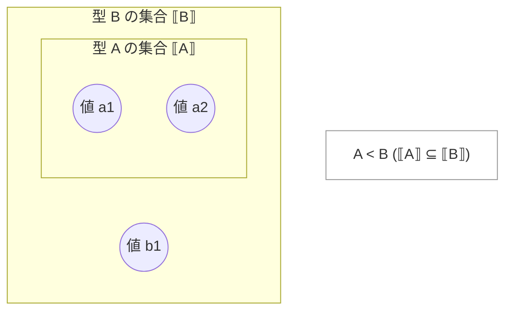
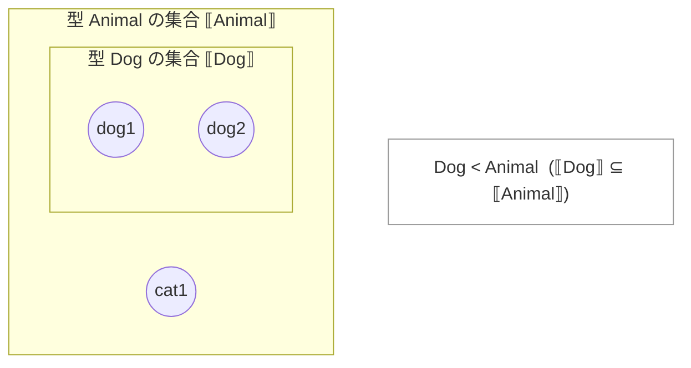

Twitter で「Ruby の継承で `<` が使われているのはなぜ？」という疑問を見かけたので、私の理解をまとめておく。
プログラミング言語周辺の理論に触れたことがない人にとっては、むしろ自然な疑問だと思う。
同じ疑問を持った人の助けになれば幸いだ。

<Message title="注意" variant="warning" defaultOpen>
この記事では型理論の**厳密な説明**は行いません。
直観と（最低限の）理論を対応づけて、「なるほど、そういう読み替えができるのか」を得るための内容です。
</Message>

## TL;DR

- プログラミング言語でいう `A < B`（`A`, `B` は型）は、型を「値の集合」とみなすと **包含関係** $\llbracket A \rrbracket \subseteq \llbracket B \rrbracket$ に対応付けられる
- 継承（サブクラス化）を「`B` の中で、より具体的な（制約の強い）集合として `A` を定義する行為」とみなすと、`<` が “部分集合＝より小さい” を表す記号として自然に見えてくる
- 型理論ではサブタイプ関係を `<:` や `≤` などで表す慣習があり、Ruby の `<` はその直観（より具体的／より小さい）と整合的に説明できる  
  （Ruby がどの文献・言語から直接影響を受けたかは断定しない）

## 集合としての型

ここでいう「型」は、直観のために「クラス（`Dog` や `Animal`）」「数値」「文字列」などを思い浮かべてもらうと入りやすい。
**厳密には型は単なるクラスではないし、集合と完全に同一視もできない**のだが、この記事の目的（`<` の直観）にはこの比喩が役に立つ。

型に対する感覚は人によって大きく異なる。
単純型から始まり、ジェネリクス／型変数、型システム、型レベル計算、型クラス、定理証明支援系、そして HoTT[^HoTT] へ……と、経路は様々だろう。
ここでは「型を集合として見る」という、多くの人が受け取りやすい見方を採用する。

より体系的に学びたい人には [TAPL](https://amzn.to/49r8xF8) が定番の入門書としてよく挙げられる。
ただし（良い意味で）それなりに前提知識は要求されるので、『理系でいうところの入門書[^入門書]』という但し書きが付くタイプだ。

[^HoTT]: 私は HoTT はまだ理解できていません。
[^入門書]: 後から振り返ると「確かに入門ではあるが、重い」やつ。

閑話休題。

---

型を「値の集合」として捉えると、`A < B` と書いたとき、その関係は次の図のように表せる。



`A` は `B` に包含される。
言い換えると、`A` として型付けされた値（`a1`, `a2`）は **`B` としても扱える**、という直観になる。
（よく知られた言い回しに寄せるなら「`A` は `B` のサブタイプ」だ。）

`A` と `B` だけでは味気ないので Ruby のクラスを例にしてみよう。

```ruby
class Animal
  def speak
    "..."
  end
end

class Dog < Animal
  def bark
    "ワン"
  end
end

dog = Dog.new
dog.is_a?(Animal) #=> true

Dog < Animal      #=> true  # Module#<: 祖先関係（サブクラス関係）を判定している

cat = Animal.new
cat.is_a?(Dog)    #=> false
```

`Dog` は `Animal` を継承しているので、`Dog` のインスタンスは `Animal` としても振る舞える（少なくとも型の直観としてはそう説明できる）。
つまり、`Dog` の「値の集合」は `Animal` の「値の集合」に包含され、`Dog` は `Animal` のサブタイプである。

これを図にすると次のようになる。



この比喩のもとでは、継承（サブクラス化）は「包含関係（部分集合関係）を作る行為」として捉えられる。
そして部分集合は“全体より小さい”ので、`class A < B` を

- `A` は `B` より **具体的**（制約が強い）
- `A` の集合は `B` の集合より **小さい**（$\subseteq$）

という直観で読むと、`<` を使うことが自然に見えてくる。

## 「`<` はどこから来たのか？」についての補足

ここまでの議論は「なぜ `<` が直観に合うか」の説明であって、「Ruby がどこから `<` を輸入したか」の断定ではない。

ただ、型理論・型システムの文脈では、サブタイプ関係を

- `A <: B`（“A is a subtype of B”）
- `A ≤ B` / `A ⊑ B`

のように表す流儀がよくある。
この `<:` の “`<` 側” は「より小さい（より具体的）」という直観と相性がよいので、Ruby の `class Dog < Animal` も同じ方向の読み替えで理解できる。

---

型と集合のアナロジーを踏まえて `<` を `⊆` と見なすと、最初の疑問（「なぜ `<`？」）はかなりの程度解消されるはずだ。

※ なお、現実の OO 設計では「継承（サブクラス化）＝常に安全なサブタイピング」とは限らない、という論点もある（リスコフの置換原則など）。
ただしこの記事の目的は「記号としての `<` の直観」なので、ここでは深入りしない。
