> [エディタ戦争](https://ja.wikipedia.org/wiki/%E3%82%A8%E3%83%87%E3%82%A3%E3%82%BF%E6%88%A6%E4%BA%89)には気をつけよう

始めにプログラミングを学ぶにあたって環境構築をしましょう。
プログラミング入門において最も難しいといっても過言ではない部分です。
近年は大幅に簡略化されているものの、依然としてプログラミング言語によっては一筋縄ではいかないことが多いです。
プログラミングを学ぶという点において本質的ではないものの、問題が発生した場合の対処にはプログラミングをこれから始めようとしている人が持ち得ない知識が要求されます。

## テキストエディター/IDE

プログラミングをするために用意するツールとしてテキストエディタや IDE
([Integrated Development Environment](https://en.wikipedia.org/wiki/Integrated_development_environment)、[統合開発環境](https://ja.wikipedia.org/wiki/%E7%B5%B1%E5%90%88%E9%96%8B%E7%99%BA%E7%92%B0%E5%A2%83))
が必要になります。
必須というわけではないが基本的には何かしらインストールした方がよいでしょう。

Java でプログラミングをするときの定番 IDE は次の 3 つでしょう。

- [IntelliJ IDEA](https://www.jetbrains.com/ja-jp/idea/)[^IntelliJ_IDEA]
- [Eclipse](https://willbrains.jp/) [^Eclipse]
- [NetBeans](https://netbeans.apache.org/front/main/index.html) [^NetBeans]

[^IntelliJ_IDEA]: いんてりじぇい あいでぃあ
[^Eclipse]: えくりぷす
[^NetBeans]: ねっとびーんず

現代においてこの中から選ぶのであれば **IntelliJ IDEA が無難**です。
私も過去 14 年間は Java でプログラムを書くときには IntelliJ IDEA か [Android Studio](https://developer.android.com/studio?hl=ja) (Android アプリを作るために使われる IDE) を使っていました。
IntelliJ IDEA は有料版 (Ultimate)・無料版が存在しますがプログラミングの学習においては無料版で困ることはありません。
しかし、本サイトでは [Visual Studio Code](https://azure.microsoft.com/ja-jp/products/visual-studio-code) (VS Code、ぶいえすこーど) と呼ばれるソースコードエディタを使うことにします。
あなたの勤めている会社が IntelliJ IDEA を標準の開発環境として定めている、もしくは最も一般的に使われているツールを使ってコーディングを行いたいという意思があるのであれば
IntelliJ IDEA を最初から使うことを推奨しますが**本サイトでは VS Code を使っている前提で解説**します。

VS Code は、Microsoft が開発・提供している無料のソースコードエディタです。
多くのプログラミング言語に対応しており、拡張機能を追加することで機能を柔軟に拡張できます。
軽量で動作が速く、直感的なユーザーインターフェースを持つため、初心者から上級者まで幅広い開発者に支持されています。
Java 開発用の拡張機能も充実しており、デバッグやコード補完、Lint などの機能を簡単に利用できます。クロスプラットフォーム対応（Windows, macOS, Linux）で、どの環境でも同じように使えるのも大きな特徴です。

**Java 以外のプログラミング言語を使う場合であっても VS Code は第一候補となるエディタのため使い方を覚えておいて損はない**でしょう。
そのため、本サイトでは Java 向け IDE として最も使われているであろう IntelliJ IDEA ではなく VS Code を使う前提で進めていきます。

## VS Code をインストールしよう

VS Code をインストールしましょう。
まずは[公式サイト](https://code.visualstudio.com/)にアクセスします。
「Download for Windows/macOS」というボタンがあるのでクリックしてダウンロードしましょう。
「Windows/macOS」の部分は使っている OS によって変わってきます。

ファイルをダウンロードすると一般的にはダウンロードフォルダに保存されます。
ダウンロードしたファイルをダブルクリックすると Windows であれば次のようなセットアップ画面が現れます。
必要に応じてチェックボックスにチェックを入れてインストールが完了するまで進めてください。

<Message title="セットアップ画面">

ここでは、家庭用コンピュータで最も一般的に使われている Windows の場合のインストール手順を例に説明します。
先の説明の通り、セットアップ画面が表示されたところから画像と一緒に手順を記します。

始めに使用許諾契約書に同意します。下のチェックボックスの「同意する(A)」をチェックし、「次へ(N)」をクリックします。

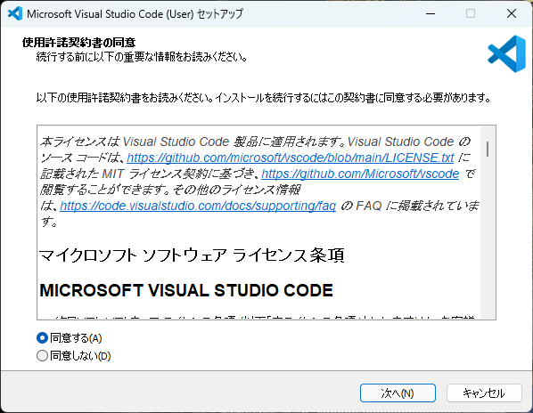

次にインストール先のフォルダを指定します。容量の問題で外付け SSD/HDD を使いたいということがなければ、変更はせず「次へ(N)」をクリックします。

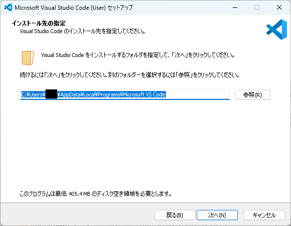

スタートメニューフォルダーの指定ですが、スタートアップメニューを使わないといったこだわりがなければそのまま「次へ(N)」をクリックします。

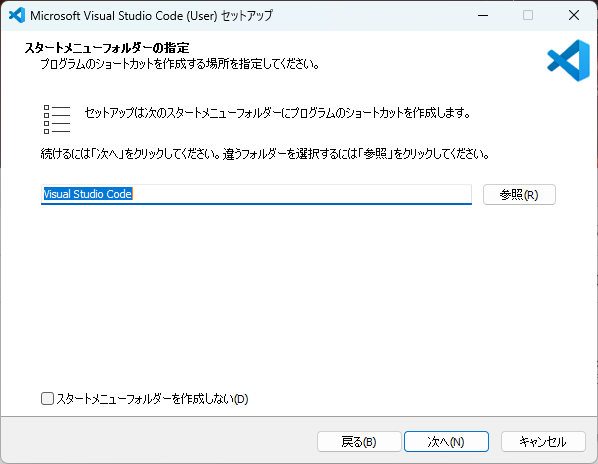

追加タスクの選択ですが基本的にはこのままで問題ありません。デスクトップ画面にショートカットを追加したい場合は「デスクトップ上にアイコンを作成する(D)」にチェックを入れて「次へ(N)」をクリックします。

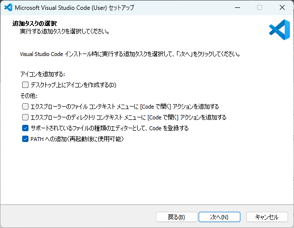

最後にインストール内容の確認です。特に問題なければ「インストール(I)」をクリックしてインストールを開始します。

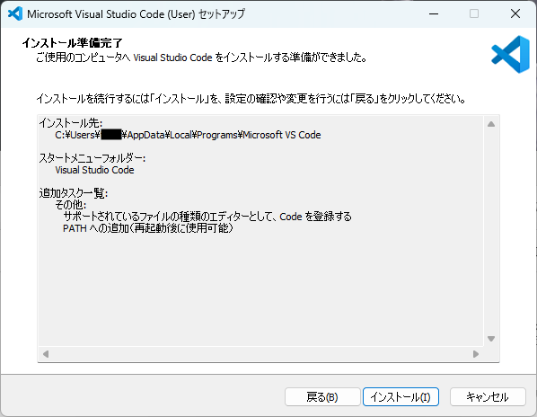

インストールバーが一番右に進むまで待ちます。

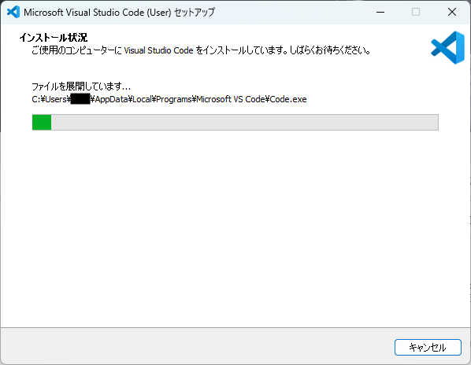

インストールが正常に完了すると次の画面が表示されるので「完了(F)」をクリックします。

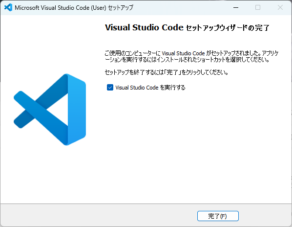

</Message>

インストールが完了すると VS Code が起動します (最後の画面で「Visual Studio Code を実行する」にチェックを入れている場合)。

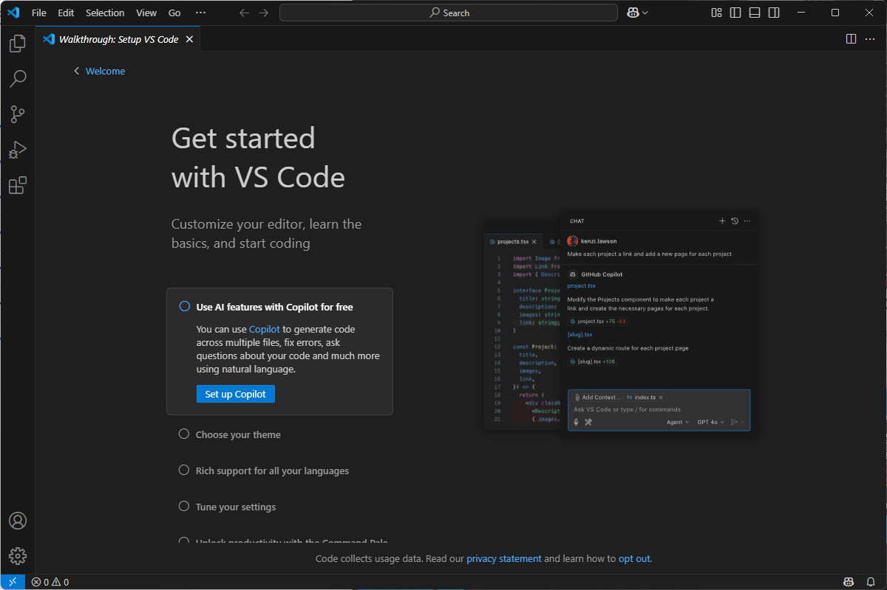

本サイトでは VS Code の詳しい使い方については解説しません。
VS Code の便利な機能や基本的な操作については「[VS Code 使い方](https://www.google.com/search?q=VS+Code+%E4%BD%BF%E3%81%84%E6%96%B9)」で検索するか、
[ChatGPT](https://chatgpt.com/)、[Gemini](https://gemini.google.com/)、[Perplexity](https://www.perplexity.ai/) を始めとするインターネット上の情報にアクセスできる生成 AI サービスを利用してみてください。

<Message title="ChatGPT を使った検索方法">

ChatGPT を使う場合は、アカウント作成してから https://chatgpt.com にアクセスすると次のようなフォームが表示されます。

未ログイン状態では「ツール」が表示されないため、「ウェブを検索する」機能を使う場合はアカウント作成しないといけません。
「ツール」から「ウェブを検索する」を選択すると次の画像のように「検索」タグが表示されます。

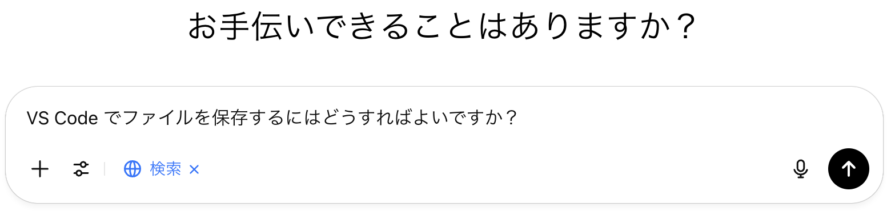

この状態で検索したい内容をフォームに入力し、「↑」ボタン、もしくはエンターを入力すると検索が開始されます。
ここでは例として VS Code でファイルを保存するための方法を調べてみます。

検索が始まると画面が切り替わって次のようなチャット形式の UI が表示されて検索内容に対する回答が得られます。

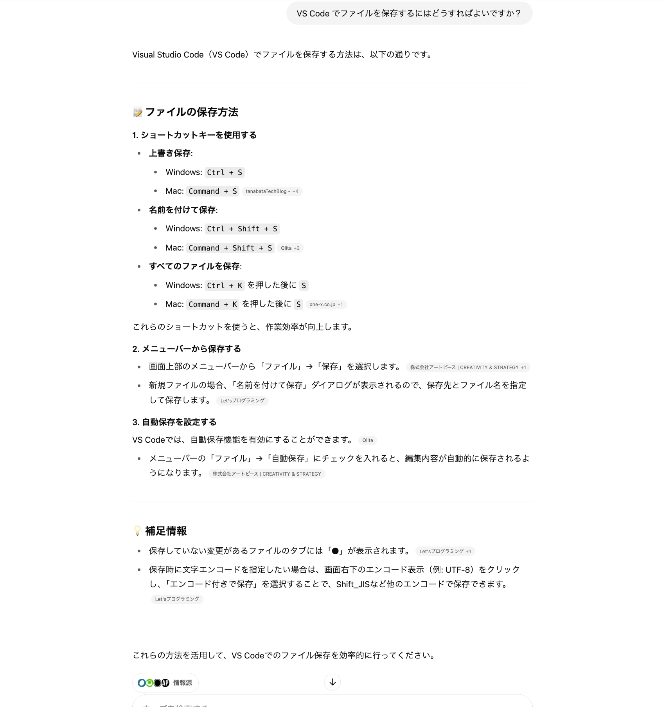

OS ごとにファイルを保存する方法と、自動保存の設定方法について教えてくれました。
また、情報元となったサイトのリンクも表示されるため、自動生成されたテキストではなく、その元になったサイトを確認することも可能です。

このように現代では自然言語による検索が大幅に改善されているため、新しいことを学ぶためのハードルが下がっています。
特にプログラミングに関する情報の多くはウェブ上に存在しているためその影響が顕著だと思います。
本サイト内で書かれていることでわからないことがあれば l ChatGPT を始めとする生成 AI を使った検索サービスを利用してみてください。

</Message>

## VS Code で Java の開発環境を構築

VS Code は初期の状態では Java によるプログラミングをサポートしないていないので**拡張機能**をインストールします。

VS Code の左側に縦に並んでいるアイコンのうち、画像の赤枠で囲まれている形のアイコンをクリックしてください。

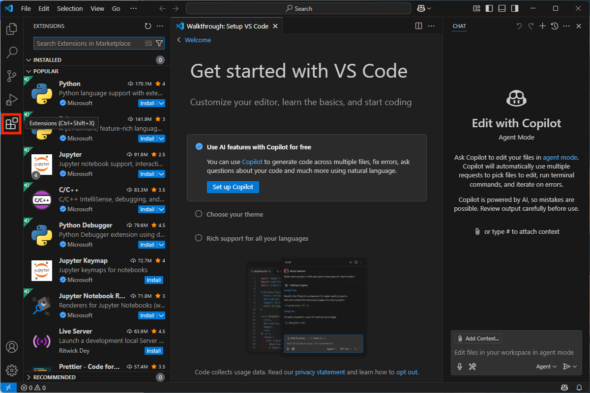

クリックすると「EXTENSIONS」と書かれたサイドバーが表示されます。

表示されたサイドバーに入力フォームがあるので「java」を入力します。
そうすると「java」というキーワードで VS Code 拡張を検索した結果が表示されるので、赤枠で囲まれたものと同じ項目を選択してください。

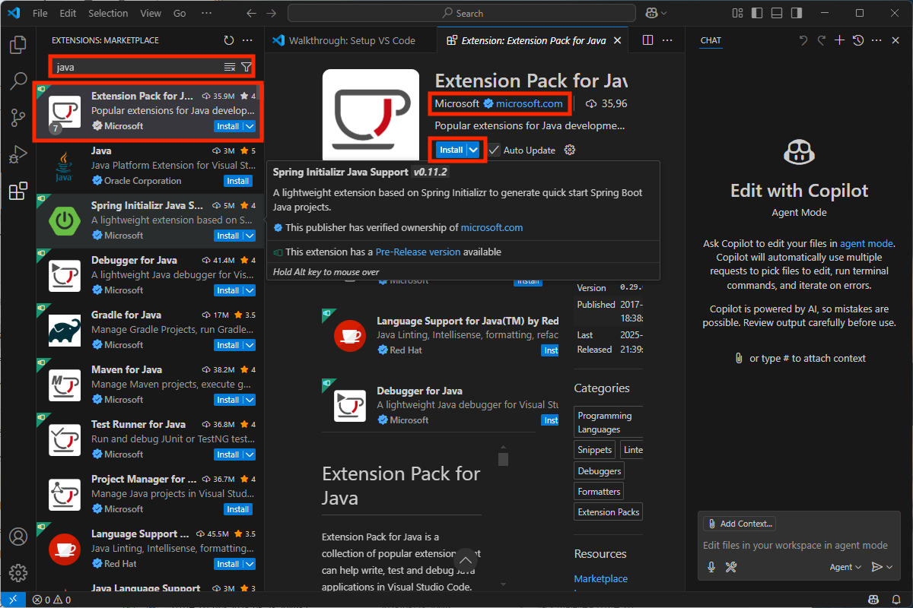

気をつけなければいけない点として、提供元が「Microsoft」となっており、青いバッチと「microsoft.com」が表示されていることを確認してください。
インストールする拡張子の名前は「**Extension Pack for Java**」です。
それぞれ確認できたら「Install」をクリックして Extension Pack for Java をインストールしましょう。

<Message title="VS Code 拡張" variant="warning" open>
  悪意のある VS Code
  拡張がマーケットで公開されている可能性があるので無闇に拡張をインストールしてはいけません。
  必ず提供元が信頼できる企業であるか、正しい提供元が公開している拡張であるかをインストール時に確認してください。
</Message>

インストールが完了すると次のような画面になります。

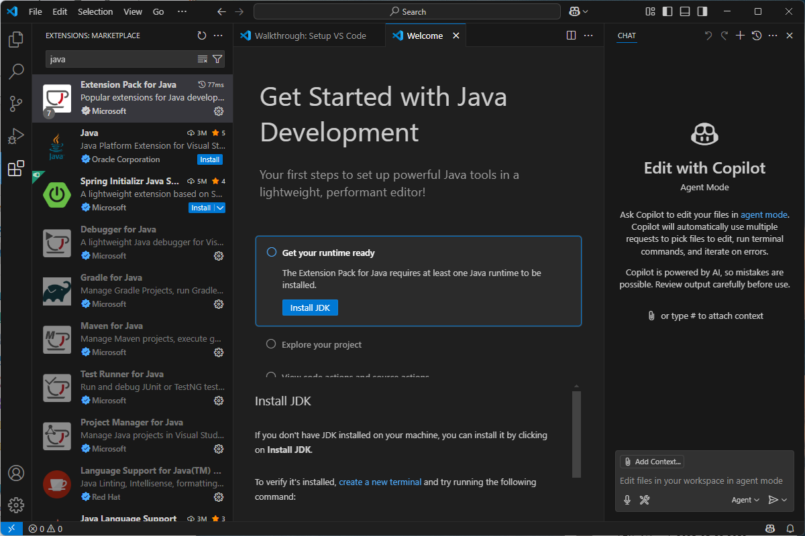

## JDK のインストール

VS Code で Java を開発するための拡張のインストールまで完了しました。
次に
