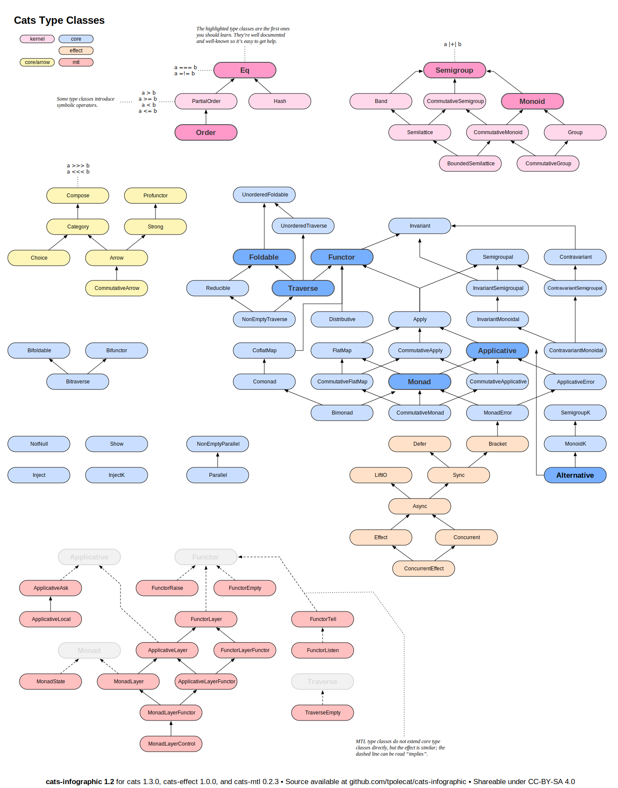

## 型クラス

[Cats で実装されている型クラス](https://typelevel.org/cats/typeclasses.html#type-classes-in-cats)をメモしつつ学んでいく。
昔、scalaz を触ったことがあるが scalaz から Cats に分裂した時期くらいから Scala を書かなくなってしまったので Cats をちゃんと触るのは初めてだ。

それぞれの型クラスの関係は以下のような図になっているらしい。
当面の目標はそれぞれの型クラスの定義とできることを一通り理解する。
この図は [CC-BY-SA 4.0](https://creativecommons.org/licenses/by-sa/4.0/deed.ja) なので引用させてもらった。



図に書かれているようにハイライトされている型クラスから学習することが推奨されているのでそれに従って学んでいこう。

## 環境

- Scala [3.3.4](https://www.scala-lang.org/download/3.3.4.html)
  - 執筆時点の LTS 最新バージョン
- cats [2.12.0](https://github.com/typelevel/cats/tree/v2.12.0)

## `Eq`

`Eq` は等値性が定義されている型の集まりを表す型クラス。

- [Eq](https://typelevel.org/cats/typeclasses/eq.html)
- [Eq - cats-docs_2.13 2.12.0 javadoc](https://typelevel.org/cats/typeclasses/eq.html)
- [cats/kernel/src/main/scala/cats/kernel/Eq.scala at v2.12.0 · typelevel/cats](https://github.com/typelevel/cats/blob/v2.12.0/kernel/src/main/scala/cats/kernel/Eq.scala)

cats の `Eq` は `eqv` メソッドが宣言された `trait` として定義されている。

```scala
trait Eq[@sp A] extends Any with Serializable { self =>

  def eqv(x: A, y: A): Boolean

  def neqv(x: A, y: A): Boolean = !eqv(x, y)
}
```

`neqv` は `eqv` が返す真偽値とは逆の真偽値を返すメソッドとして定義されている。
そのため、型の `Eq` インスタンスを定義したい場合は `eqv` メソッドだけ定義すればよい。
しかし、`Eq` はほとんどのデータ型 (ラムダ式のような比較不可能な値を持たないデータ型) について定義できるため、
定義した型ごとに `Eq` 型クラスのインスタンスを実装しないといけない。
それはかなり面倒な作業となるため、公式ドキュメントによると二つの方法が紹介されている。

一つは、公式ドキュメントに実装が載っている `Eq.fromUniversalEquals` を使う方法。

<CodeWithTabs>

```scala !!tabs Eq.fromUniversalEquals
import cats.kernel.Eq

case class Coordinate(x: Int, y: Int)

implicit val eqCoordinate: Eq[Coordinate] = Eq.fromUniversalEquals
```

```scala !!tabs kittens
import cats.derived.*
import cats.kernel.Eq

case class Coordinate(x: Int, y: Int) derives Eq
```

</CodeWithTabs>

`kittens` を使うと `derives Eq` だけで済むことがわかる。
Scala 3 から Haskell の `deriving` 相当のことができるようになっているため、
[その機能](https://docs.scala-lang.org/scala3/reference/contextual/derivation.html)を使って `Eq` インスタンスが自動的に導出できる。

`Eq` 型クラスのインスタンスを定義すると `eqv`、`eqnv` のエイリアスとして `===` と `=!=` が使えるようになる。
これらの演算子[^Scalaの演算子]は `equals` メソッドと異なり、比較対象がどちらも同じ型でなければならない。
Java 由来の `equals` では、メソッドの引数が `Any` となってしまっているため、異なる型の値を比較するようなコードを書いてしまった場合にコンパイラは警告を出力するがコンパイル自体は成功してしまう。
異なる型を比較したい場面というのはほとんどないため、多くの場合そのようなコードはバグでしかない。
そのため、`Eq` 型クラスによって提供される `===`、`=!=` を使ってコンパイルエラーになるように書いておくことでより安全なコードとなる。

[^Scalaの演算子]: Scala における演算子はメソッドの糖衣構文 (ref: [演算子 | Scala Documentation](https://docs.scala-lang.org/ja/tour/operators.html))。
